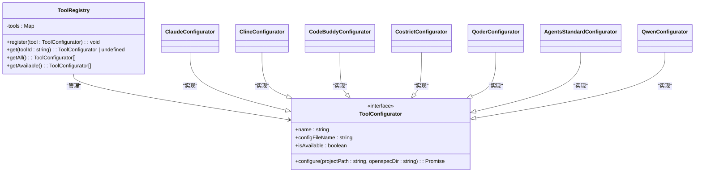

# AI工具集成

<cite>
**本文档中引用的文件**
- [registry.ts](file://src/core/configurators/registry.ts)
- [slash/registry.ts](file://src/core/configurators/slash/registry.ts)
- [base.ts](file://src/core/configurators/base.ts)
- [slash/base.ts](file://src/core/configurators/slash/base.ts)
- [slash/claude.ts](file://src/core/configurators/slash/claude.ts)
- [slash/github-copilot.ts](file://src/core/configurators/slash/github-copilot.ts)
- [slash/cursor.ts](file://src/core/configurators/slash/cursor.ts)
- [templates/slash-command-templates.ts](file://src/core/templates/slash-command-templates.ts)
- [templates/index.ts](file://src/core/templates/index.ts)
- [agents.ts](file://src/core/configurators/agents.ts)
- [claude.ts](file://src/core/configurators/claude.ts)
- [cline.ts](file://src/core/configurators/cline.ts)
- [project-template.ts](file://src/core/templates/project-template.ts)
- [slash/factory.ts](file://src/core/configurators/slash/factory.ts)
- [slash/windsurf.ts](file://src/core/configurators/slash/windsurf.ts)
- [agents-template.ts](file://src/core/templates/agents-template.ts)
- [claude-template.ts](file://src/core/templates/claude-template.ts)
- [cline-template.ts](file://src/core/templates/cline-template.ts)
- [costrict-template.ts](file://src/core/templates/costrict-template.ts)
- [agents-root-stub.ts](file://src/core/templates/agents-root-stub.ts)
</cite>

## 目录
1. [简介](#简介)
2. [核心架构](#核心架构)
3. [ToolRegistry设计模式](#toolregistry设计模式)
4. [SlashCommandRegistry设计模式](#slashcommandregistry设计模式)
5. [配置器工作机制](#配置器工作机制)
6. [斜杠命令支持原理](#斜杠命令支持原理)
7. [AGENTS.md生成机制](#agentsmd生成机制)
8. [支持的AI工具列表](#支持的ai工具列表)
9. [贡献新工具配置器指南](#贡献新工具配置器指南)
10. [结论](#结论)

## 简介
OpenSpec是一个现代化的项目规范管理工具，它通过可扩展的配置器系统与多种AI编码助手（如Claude、GitHub Copilot、Cursor等）无缝集成。本文档深入分析OpenSpec的AI工具集成架构，重点解析`ToolRegistry`和`SlashCommandRegistry`的设计模式，详细说明配置器的工作机制、斜杠命令的支持原理以及AGENTS.md文件的生成过程。

**Section sources**
- [registry.ts](file://src/core/configurators/registry.ts)
- [slash/registry.ts](file://src/core/configurators/slash/registry.ts)

## 核心架构
OpenSpec的AI工具集成基于两个核心注册表：`ToolRegistry`用于管理主要AI工具的配置，`SlashCommandRegistry`用于管理支持斜杠命令的AI工具。这两个注册表采用单例模式和静态初始化块来注册所有支持的工具配置器，确保在应用启动时就完成所有工具的注册。


**Diagram sources**
- [registry.ts](file://src/core/configurators/registry.ts)
- [slash/registry.ts](file://src/core/configurators/slash/registry.ts)

**Section sources**
- [registry.ts](file://src/core/configurators/registry.ts)
- [slash/registry.ts](file://src/core/configurators/slash/registry.ts)

## ToolRegistry设计模式
`ToolRegistry`是OpenSpec中管理AI工具配置的核心组件，采用注册表模式（Registry Pattern）实现对多种AI工具的可扩展支持。该类使用静态Map存储所有工具配置器实例，并通过静态初始化块预注册所有支持的工具。

`ToolRegistry`的核心设计特点包括：
- **单例模式**：通过静态属性和方法实现全局唯一的注册表实例
- **依赖倒置**：依赖于`ToolConfigurator`接口而非具体实现
- **可扩展性**：通过`register`方法支持运行时注册新工具
- **可用性检查**：提供`getAvailable`方法过滤不可用工具



**Diagram sources**
- [registry.ts](file://src/core/configurators/registry.ts)
- [base.ts](file://src/core/configurators/base.ts)

**Section sources**
- [registry.ts](file://src/core/configurators/registry.ts)
- [base.ts](file://src/core/configurators/base.ts)

## SlashCommandRegistry设计模式
`SlashCommandRegistry`专门用于管理支持斜杠命令的AI工具，其设计模式与`ToolRegistry`类似但针对斜杠命令场景进行了优化。该注册表管理所有斜杠命令配置器，支持生成和更新特定于工具的斜杠命令文件。

`SlashCommandRegistry`的关键设计特性：
- **统一接口**：所有配置器实现`SlashCommandConfigurator`抽象类
- **命令标准化**：定义了`proposal`、`apply`、`archive`三种标准命令
- **路径抽象**：通过`getRelativePath`方法抽象不同工具的文件路径
- **前端物料支持**：通过`getFrontmatter`方法支持不同工具的元数据格式
- **内容更新机制**：使用OpenSpec标记（markers）安全地更新现有文件内容


**Diagram sources**
- [slash/registry.ts](file://src/core/configurators/slash/registry.ts)
- [slash/base.ts](file://src/core/configurators/slash/base.ts)

**Section sources**
- [slash/registry.ts](file://src/core/configurators/slash/registry.ts)
- [slash/base.ts](file://src/core/configurators/slash/base.ts)

## 配置器工作机制
OpenSpec的配置器系统通过模板化方式为不同AI工具生成特定的配置文件。每个配置器负责生成符合特定工具要求的文件结构和内容。

### 基础配置器工作流程
1. **模板获取**：从`TemplateManager`获取相应的模板内容
2. **文件路径确定**：根据工具要求确定配置文件的路径
3. **内容写入**：使用文件系统工具将模板内容写入目标文件
4. **标记保护**：使用OpenSpec标记保护生成的内容区域，便于后续更新

### Claude配置器示例
`ClaudeConfigurator`生成`.claude/commands/`目录下的命令文件，包含详细的使用指南和操作步骤。


**Diagram sources**
- [claude.ts](file://src/core/configurators/claude.ts)
- [templates/index.ts](file://src/core/templates/index.ts)

**Section sources**
- [claude.ts](file://src/core/configurators/claude.ts)
- [cline.ts](file://src/core/configurators/cline.ts)
- [agents.ts](file://src/core/configurators/agents.ts)

## 斜杠命令支持原理
OpenSpec通过`SlashCommandRegistry`和相关配置器实现对各种AI工具斜杠命令的全面支持。系统为每个支持的工具生成特定格式的命令文件，包含统一的操作指南但适配不同工具的文件结构要求。

### 斜杠命令配置器实现
每个斜杠命令配置器实现以下核心方法：
- `getRelativePath`：返回特定命令的文件路径
- `getFrontmatter`：返回文件的前端物料（YAML元数据）
- `getBody`：返回命令的主体内容

### 不同工具的配置差异
| 工具 | 配置路径 | 前端物料格式 | 特殊特性 |
|------|---------|-------------|---------|
| Claude | `.claude/commands/openspec/` | 完整的YAML元数据，包含name、description、category、tags | 详细的命令分类和标签 |
| GitHub Copilot | `.github/prompts/` | 简化的YAML元数据，仅包含description | 支持$ARGUMENTS变量 |
| Cursor | `.cursor/commands/` | 包含name和id的完整元数据 | 命令ID与文件名对应 |
| Factory | `.factory/commands/` | 包含argument-hint的元数据 | 提供参数提示 |
| Windsurf | `.windsurf/workflows/` | 包含auto_execution_mode的元数据 | 支持自动执行模式 |


**Diagram sources**
- [slash/claude.ts](file://src/core/configurators/slash/claude.ts)
- [slash/github-copilot.ts](file://src/core/configurators/slash/github-copilot.ts)
- [slash/cursor.ts](file://src/core/configurators/slash/cursor.ts)
- [slash/factory.ts](file://src/core/configurators/slash/factory.ts)
- [slash/windsurf.ts](file://src/core/configurators/slash/windsurf.ts)

**Section sources**
- [slash/claude.ts](file://src/core/configurators/slash/claude.ts)
- [slash/github-copilot.ts](file://src/core/configurators/slash/github-copilot.ts)
- [slash/cursor.ts](file://src/core/configurators/slash/cursor.ts)
- [slash/base.ts](file://src/core/configurators/slash/base.ts)

## AGENTS.md生成机制
`agents-template.ts`文件定义了AGENTS.md的模板内容，该文件通过`AgentsStandardConfigurator`配置器在项目初始化或更新时生成。AGENTS.md文件为AI助手提供项目上下文和操作指南。

### 模板管理机制
`TemplateManager`类集中管理所有模板，包括：
- `agentsTemplate`：AGENTS.md的主模板
- `projectTemplate`：project.md的模板
- 各种工具特定的模板（Claude、Cline等）

### 内容生成流程
1. **模板获取**：`TemplateManager`提供`getAgentsStandardTemplate`方法返回AGENTS.md模板
2. **文件配置**：`AgentsStandardConfigurator`调用模板方法获取内容
3. **安全写入**：使用`updateFileWithMarkers`方法确保内容可被安全更新

```mermaid
flowchart TD
A[init/update命令] --> B[调用AgentsStandardConfigurator.configure]
B --> C[TemplateManager.getAgentsStandardTemplate()]
C --> D[获取agents-root-stub模板]
D --> E[确定AGENTS.md文件路径]
E --> F[检查文件是否存在]
F --> |存在| G[使用标记更新内容]
F --> |不存在| H[创建新文件并写入内容]
G --> I[完成]
H --> I
```

**Diagram sources**
- [agents-template.ts](file://src/core/templates/agents-template.ts)
- [agents-root-stub.ts](file://src/core/templates/agents-root-stub.ts)
- [agents.ts](file://src/core/configurators/agents.ts)

**Section sources**
- [agents-template.ts](file://src/core/templates/agents-template.ts)
- [agents-root-stub.ts](file://src/core/templates/agents-root-stub.ts)
- [agents.ts](file://src/core/configurators/agents.ts)
- [templates/index.ts](file://src/core/templates/index.ts)

## 支持的AI工具列表
OpenSpec目前支持以下AI工具及其功能状态：

### 主要AI工具配置器
| 工具名称 | 配置器类 | 配置文件 | 可用状态 | 功能描述 |
|--------|--------|--------|--------|--------|
| Claude Code | ClaudeConfigurator | CLAUDE.md | 可用 | 为Claude AI助手生成项目上下文文件 |
| Cline | ClineConfigurator | CLINE.md | 可用 | 为Cline工具生成配置文件 |
| CodeBuddy | CodeBuddyConfigurator | CODEBUDDY.md | 可用 | 为CodeBuddy工具生成配置文件 |
| Costrict | CostrictConfigurator | CO STRICT.md | 可用 | 为Costrict工具生成配置文件 |
| Qoder | QoderConfigurator | QODER.md | 可用 | 为Qoder工具生成配置文件 |
| Qwen | QwenConfigurator | QWEN.md | 可用 | 为通义千问生成配置文件 |
| AGENTS标准 | AgentsStandardConfigurator | AGENTS.md | 可用 | 生成标准化的AI助手指南文件 |

### 斜杠命令支持工具
| 工具名称 | 配置器类 | 命令路径 | 可用状态 | 命令类型 |
|--------|--------|--------|--------|--------|
| Claude | ClaudeSlashCommandConfigurator | .claude/commands/openspec/ | 可用 | proposal, apply, archive |
| Cursor | CursorSlashCommandConfigurator | .cursor/commands/ | 可用 | proposal, apply, archive |
| GitHub Copilot | GitHubCopilotSlashCommandConfigurator | .github/prompts/ | 可用 | proposal, apply, archive |
| Windsurf | WindsurfSlashCommandConfigurator | .windsurf/workflows/ | 可用 | proposal, apply, archive |
| Factory | FactorySlashCommandConfigurator | .factory/commands/ | 可用 | proposal, apply, archive |
| KiloCode | KiloCodeSlashCommandConfigurator | .kilocode/workflows/ | 可用 | proposal, apply, archive |
| OpenCode | OpenCodeSlashCommandConfigurator | .opencode/workflows/ | 可用 | proposal, apply, archive |
| Codex | CodexSlashCommandConfigurator | .codex/workflows/ | 可用 | proposal, apply, archive |
| Amazon Q | AmazonQSlashCommandConfigurator | .amazon-q/workflows/ | 可用 | proposal, apply, archive |
| Auggie | AuggieSlashCommandConfigurator | .auggie/workflows/ | 可用 | proposal, apply, archive |
| Cline | ClineSlashCommandConfigurator | .cline/workflows/ | 可用 | proposal, apply, archive |
| Crush | CrushSlashCommandConfigurator | .crush/workflows/ | 可用 | proposal, apply, archive |
| Costrict | CostrictSlashCommandConfigurator | .costrict/workflows/ | 可用 | proposal, apply, archive |

**Section sources**
- [registry.ts](file://src/core/configurators/registry.ts)
- [slash/registry.ts](file://src/core/configurators/slash/registry.ts)
- [slash/claude.ts](file://src/core/configurators/slash/claude.ts)
- [slash/cursor.ts](file://src/core/configurators/slash/cursor.ts)
- [slash/github-copilot.ts](file://src/core/configurators/slash/github-copilot.ts)

## 贡献新工具配置器指南
为OpenSpec贡献新的AI工具配置器需要遵循以下步骤：

### 添加主要工具配置器
1. 在`src/core/configurators/`目录下创建新的配置器文件
2. 实现`ToolConfigurator`接口
3. 在`registry.ts`的静态块中注册新配置器

### 添加斜杠命令配置器
1. 在`src/core/configurators/slash/`目录下创建新的配置器文件
2. 继承`SlashCommandConfigurator`抽象类
3. 实现`getRelativePath`和`getFrontmatter`方法
4. 在`slash/registry.ts`的静态块中注册新配置器

### 配置器开发最佳实践
- **命名规范**：使用`{ToolName}Configurator`命名类
- **路径处理**：使用`FileSystemUtils.joinPath`处理文件路径
- **内容更新**：使用标记保护机制安全更新文件内容
- **错误处理**：在文件操作中添加适当的错误处理
- **测试覆盖**：为新配置器添加相应的测试用例

```mermaid
flowchart TD
A[确定新工具类型] --> B{是主要工具还是斜杠命令?}
B --> |主要工具| C[创建ToolConfigurator实现]
B --> |斜杠命令| D[创建SlashCommandConfigurator实现]
C --> E[实现configure方法]
D --> F[实现getRelativePath和getFrontmatter]
E --> G[在registry.ts中注册]
F --> G
G --> H[添加模板文件(如需要)]
H --> I[编写测试用例]
I --> J[提交Pull Request]
```

**Section sources**
- [base.ts](file://src/core/configurators/base.ts)
- [slash/base.ts](file://src/core/configurators/slash/base.ts)
- [registry.ts](file://src/core/configurators/registry.ts)
- [slash/registry.ts](file://src/core/configurators/slash/registry.ts)

## 结论
OpenSpec通过精心设计的`ToolRegistry`和`SlashCommandRegistry`系统，实现了对多种AI编码助手的灵活支持。这种模块化的架构使得添加新工具支持变得简单而直观，同时保持了代码的可维护性和可扩展性。配置器系统采用模板化方法，确保为不同AI工具生成一致且高质量的配置文件，而斜杠命令支持则通过统一的接口适配各种工具的特定要求。这种设计模式不仅满足了当前的需求，也为未来支持更多AI工具奠定了坚实的基础。