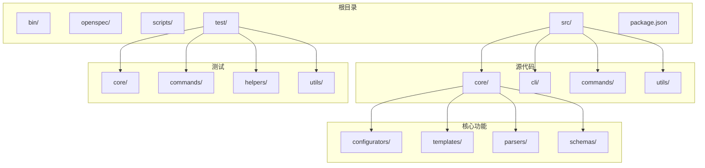
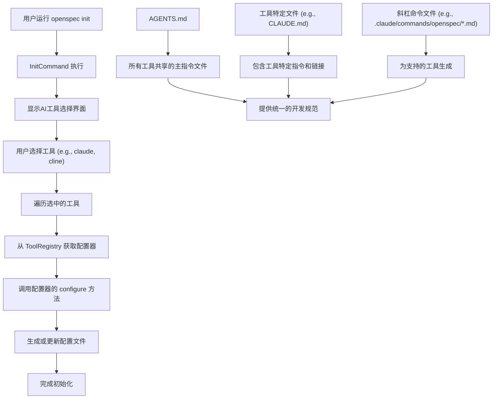
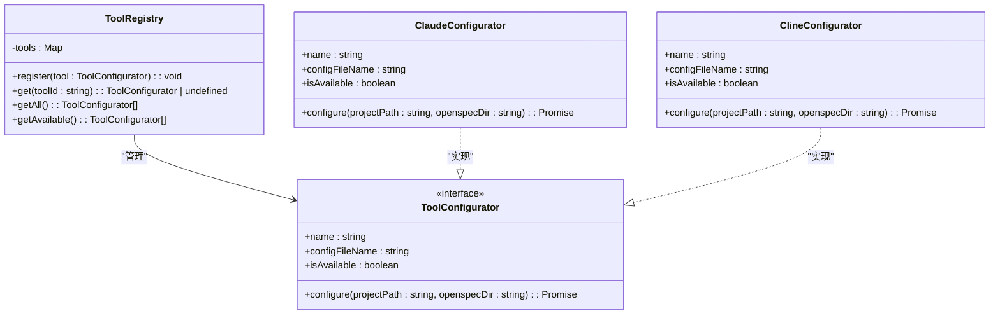
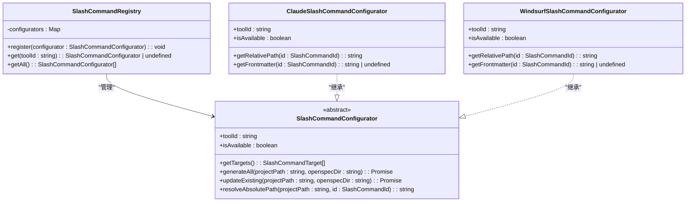
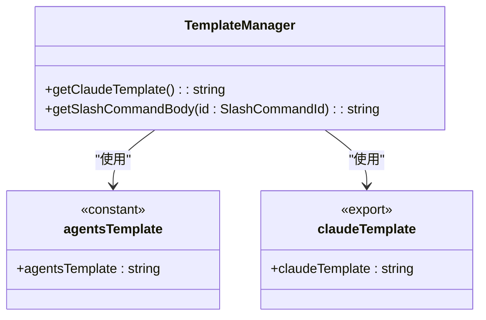
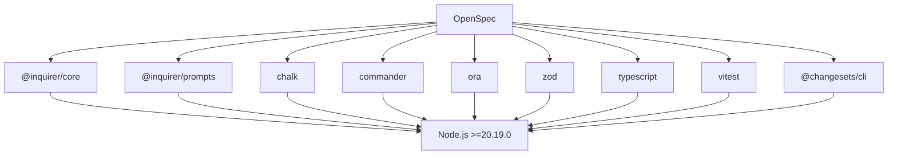

# 扩展新工具支持

<cite>
**本文档中引用的文件**  
- [registry.ts](file://src/core/configurators/registry.ts)
- [base.ts](file://src/core/configurators/base.ts)
- [slash/registry.ts](file://src/core/configurators/slash/registry.ts)
- [slash/base.ts](file://src/core/configurators/slash/base.ts)
- [agents-template.ts](file://src/core/templates/agents-template.ts)
- [claude-template.ts](file://src/core/templates/claude-template.ts)
- [slash-command-templates.ts](file://src/core/templates/slash-command-templates.ts)
- [claude.ts](file://src/core/configurators/claude.ts)
- [slash/claude.ts](file://src/core/configurators/slash/claude.ts)
- [init.test.ts](file://test/core/init.test.ts)
- [vitest.config.ts](file://vitest.config.ts)
- [run-cli.ts](file://test/helpers/run-cli.ts)
</cite>

## 目录
1. [简介](#简介)
2. [项目结构概览](#项目结构概览)
3. [核心组件分析](#核心组件分析)
4. [架构概述](#架构概述)
5. [详细组件分析](#详细组件分析)
6. [依赖分析](#依赖分析)
7. [性能考虑](#性能考虑)
8. [故障排除指南](#故障排除指南)
9. [结论](#结论)

## 简介
本文档旨在为OpenSpec项目贡献者提供一份详尽的开发者指南，指导如何为系统添加对新AI工具的支持。文档将详细说明实现一个新工具配置器的完整流程，包括在`ToolRegistry`中注册新工具、继承`base.ts`创建具体配置器类、实现`configure`方法以生成正确的项目文件结构。同时，文档将解释如何为支持斜杠命令的工具在`SlashCommandRegistry`中添加条目并继承`slash/base.ts`。此外，还将介绍如何利用`agents-template.ts`和现有工具模板（如claude-template.ts）来生成AGENTS.md和工具特定配置。最后，文档将提供一个完整的代码示例，展示添加一个假设的AI工具（如'new-ai-tool'）的全过程，并强调测试新配置器的最佳实践，包括单元测试和端到端测试的编写方法。

## 项目结构概览
OpenSpec项目的目录结构清晰地组织了核心功能、测试和配置文件。主要目录包括`src`（源代码）、`test`（测试代码）、`openspec`（规范和变更文件）和`bin`（可执行文件）。`src`目录下包含了`core`（核心逻辑）、`cli`（命令行接口）、`commands`（具体命令实现）和`utils`（工具函数）。`core`目录进一步细分为`configurators`（配置器）、`templates`（模板）、`parsers`（解析器）和`schemas`（数据模式）。`test`目录包含了针对核心功能和命令的单元测试和端到端测试。

**Diagram sources**
- [package.json](file://package.json#L1-L74)

## 核心组件分析
OpenSpec的核心组件围绕工具配置和初始化展开。`ToolRegistry`负责管理所有支持的AI工具配置器，而`SlashCommandRegistry`则专门处理支持斜杠命令的工具。每个配置器都遵循一个统一的接口，通过继承基类并实现特定方法来生成工具所需的配置文件。

**Section sources**
- [registry.ts](file://src/core/configurators/registry.ts#L1-L47)
- [slash/registry.ts](file://src/core/configurators/slash/registry.ts#L1-L70)

## 架构概述
OpenSpec的架构设计旨在通过规范驱动开发（Spec-Driven Development）来提升AI辅助编程的效率和一致性。系统的核心是`init`命令，它通过一系列配置器（Configurator）为不同的AI工具生成和更新配置文件。这些配置器被注册到`ToolRegistry`和`SlashCommandRegistry`中，允许系统动态地发现和使用它们。当用户运行`openspec init`时，系统会提示用户选择要配置的AI工具，然后调用相应的配置器来生成或更新项目中的配置文件。

**Diagram sources**
- [registry.ts](file://src/core/configurators/registry.ts#L10-L29)
- [slash/registry.ts](file://src/core/configurators/slash/registry.ts#L19-L56)
- [init.test.ts](file://test/core/init.test.ts#L64-L70)

## 详细组件分析

### 工具注册与配置器实现
要为OpenSpec添加对新AI工具的支持，开发者需要遵循一系列步骤来实现和注册新的配置器。首先，需要在`ToolRegistry`中注册新工具，这通常通过在`registry.ts`文件中导入新的配置器类并将其添加到静态映射中来完成。其次，需要创建一个新的配置器类，该类继承自`ToolConfigurator`接口定义的基类`base.ts`。最后，需要实现`configure`方法，该方法负责生成正确的项目文件结构。

#### 工具注册器分析
`ToolRegistry`是一个单例类，使用静态块来初始化所有已知的工具配置器。它提供了一个`register`方法，允许在运行时动态注册新的配置器。每个配置器通过其名称的小写和连字符形式作为键存储在`Map`中。

**Diagram sources**
- [registry.ts](file://src/core/configurators/registry.ts#L10-L46)
- [base.ts](file://src/core/configurators/base.ts#L1-L6)

#### 斜杠命令配置器分析
对于支持斜杠命令的工具，需要在`SlashCommandRegistry`中进行注册。该注册器的结构与`ToolRegistry`类似，但专门用于管理`SlashCommandConfigurator`类型的配置器。`SlashCommandConfigurator`是一个抽象基类，定义了生成斜杠命令文件所需的方法。

**Diagram sources**
- [slash/registry.ts](file://src/core/configurators/slash/registry.ts#L19-L69)
- [slash/base.ts](file://src/core/configurators/slash/base.ts#L13-L95)

### 模板系统分析
OpenSpec使用模板系统来生成一致的配置文件。`agents-template.ts`定义了所有AI工具共享的主指令文件`AGENTS.md`的内容。而`claude-template.ts`等特定模板文件则通过导出`agentsRootStubTemplate`来为特定工具生成配置。

**Diagram sources**
- [agents-template.ts](file://src/core/templates/agents-template.ts#L1-L458)
- [claude-template.ts](file://src/core/templates/claude-template.ts#L1-L2)
- [slash-command-templates.ts](file://src/core/templates/slash-command-templates.ts#L1-L59)

## 依赖分析
OpenSpec项目的依赖关系清晰，主要依赖于Node.js生态系统中的流行库。`package.json`文件列出了项目的核心依赖，包括`@inquirer/core`和`@inquirer/prompts`用于交互式命令行界面，`chalk`用于终端颜色输出，`commander`用于命令行参数解析，`ora`用于加载指示器，以及`zod`用于数据验证。开发依赖包括`typescript`、`vitest`用于测试，以及`@changesets/cli`用于版本管理和发布。

**Diagram sources**
- [package.json](file://package.json#L58-L72)

## 性能考虑
OpenSpec的设计考虑了性能和效率。通过使用静态注册器和预编译的模板，系统在初始化时能够快速生成配置文件。`init`命令的执行时间主要取决于用户选择的工具数量和文件系统的I/O性能。为了优化性能，建议在实现新的配置器时，尽量减少不必要的文件读写操作，并利用缓存机制来避免重复计算。

## 故障排除指南
在为OpenSpec贡献新工具支持时，可能会遇到一些常见问题。以下是一些故障排除的建议：

- **配置文件未生成**：检查配置器的`configure`方法是否被正确调用，确保工具ID在`ToolRegistry`中正确注册。
- **标记丢失**：确保在更新现有文件时，使用`updateFileWithMarkers`等工具函数来保留OpenSpec的标记。
- **测试失败**：参考`init.test.ts`中的测试用例，确保新的配置器行为与现有配置器一致。
- **路径错误**：仔细检查文件路径的拼写和大小写，特别是在处理不同操作系统的兼容性时。

**Section sources**
- [init.test.ts](file://test/core/init.test.ts#L64-L800)
- [run-cli.ts](file://test/helpers/run-cli.ts#L1-L140)

## 结论
为OpenSpec贡献新AI工具支持是一个结构化且可扩展的过程。通过遵循本文档中概述的步骤，开发者可以轻松地为新的AI工具创建配置器，并将其集成到系统中。关键在于理解`ToolRegistry`和`SlashCommandRegistry`的工作原理，正确实现配置器接口，并利用现有的模板系统来生成一致的配置文件。通过编写全面的测试，可以确保新功能的稳定性和可靠性。OpenSpec的模块化设计使得添加新工具支持变得简单而高效，从而不断扩展其对各种AI辅助开发工具的支持范围。