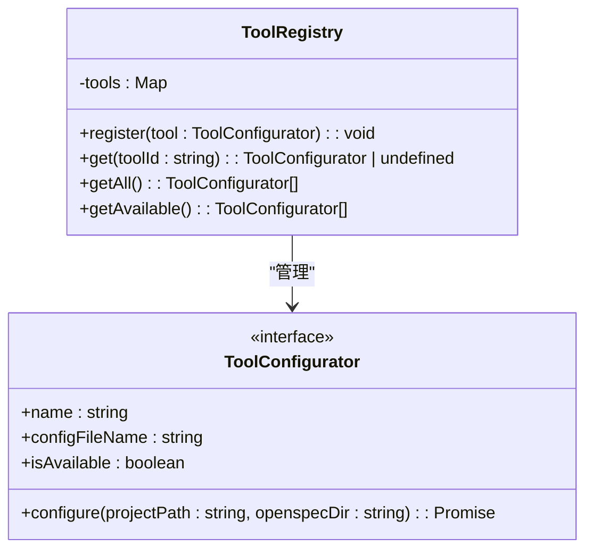
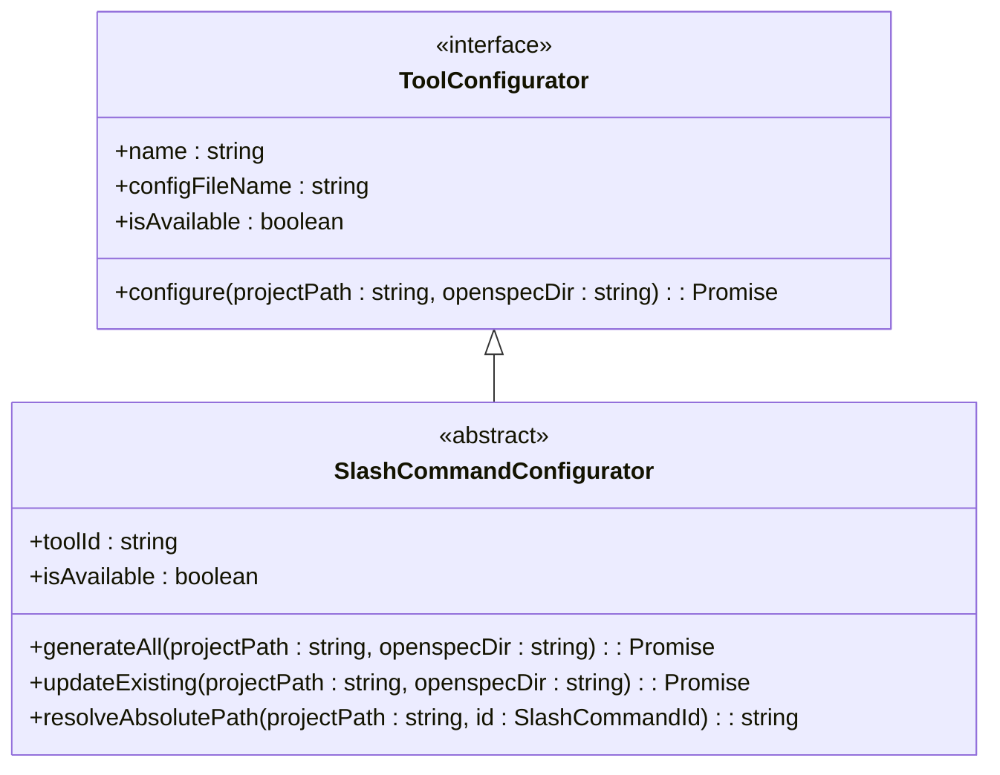
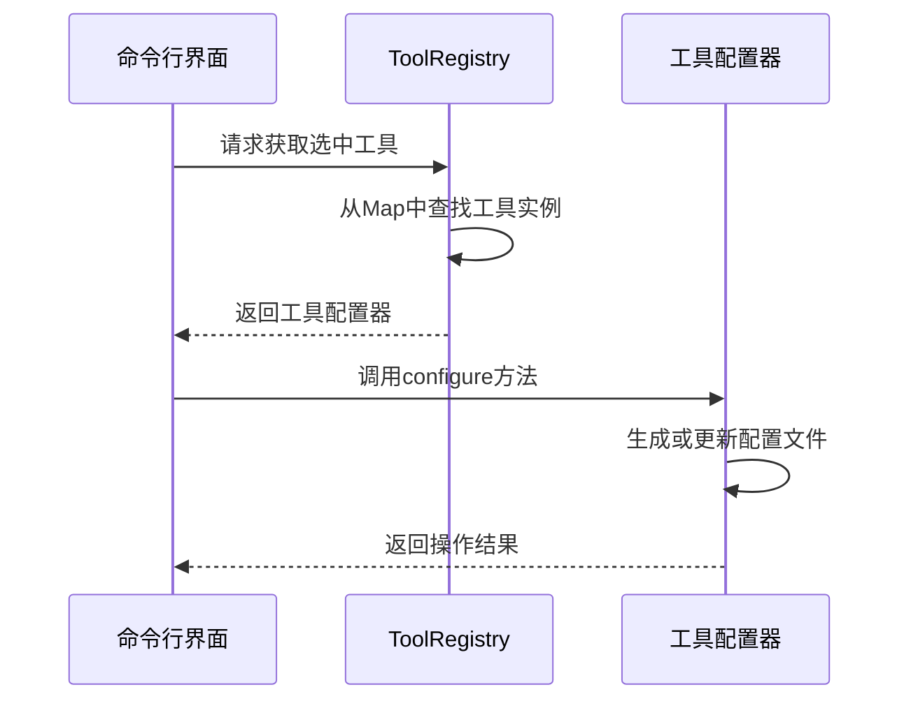
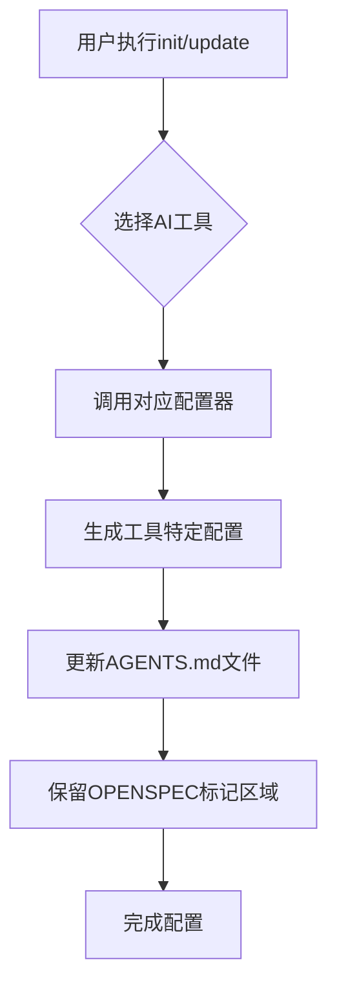

# 支持的AI工具

<cite>
**本文档中引用的文件**  
- [registry.ts](file://src/core/configurators/registry.ts)
- [base.ts](file://src/core/configurators/base.ts)
- [AGENTS.md](file://AGENTS.md)
- [slash/claude.ts](file://src/core/configurators/slash/claude.ts)
- [slash/github-copilot.ts](file://src/core/configurators/slash/github-copilot.ts)
- [slash/cursor.ts](file://src/core/configurators/slash/cursor.ts)
- [slash/qoder.ts](file://src/core/configurators/slash/qoder.ts)
- [slash/costrict.ts](file://src/core/configurators/slash/costrict.ts)
- [slash/qwen.ts](file://src/core/configurators/slash/qwen.ts)
- [slash/codebuddy.ts](file://src/core/configurators/slash/codebuddy.ts)
- [slash/cline.ts](file://src/core/configurators/slash/cline.ts)
- [slash/crush.ts](file://src/core/configurators/slash/crush.ts)
- [slash/factory.ts](file://src/core/configurators/slash/factory.ts)
- [slash/amazon-q.ts](file://src/core/configurators/slash/amazon-q.ts)
- [slash/auggie.ts](file://src/core/configurators/slash/auggie.ts)
- [slash/codex.ts](file://src/core/configurators/slash/codex.ts)
- [slash/kilocode.ts](file://src/core/configurators/slash/kilocode.ts)
- [slash/opencode.ts](file://src/core/configurators/slash/opencode.ts)
- [slash/windsurf.ts](file://src/core/configurators/slash/windsurf.ts)
</cite>

## 目录
1. [简介](#简介)
2. [工具注册机制](#工具注册机制)
3. [配置器基类](#配置器基类)
4. [各AI工具配置详情](#各ai工具配置详情)
5. [init与update命令行为](#init与update命令行为)
6. [AGENTS.md中的表示与CLI交互](#agentsmd中的表示与cli交互)

## 简介
OpenSpec支持多种AI编码助手工具，通过统一的注册表模式进行管理。本文档详细说明Claude、GitHub Copilot、Cursor、Qoder、Costrict、Qwen、CodeBuddy、Cline、Crush、Factory、Amazon Q、Auggie、Codex、Kilocode、OpenCode和Windsurf等工具的集成方式、配置路径及功能状态。

## 工具注册机制
OpenSpec使用`ToolRegistry`类（registry.ts）实现注册表模式来统一管理所有AI工具的配置器。该机制通过静态Map存储工具实例，并提供注册、获取和查询接口。

**图示来源**  
- [registry.ts](file://src/core/configurators/registry.ts#L10-L46)

**本节来源**  
- [registry.ts](file://src/core/configurators/registry.ts#L1-L47)

## 配置器基类
所有AI工具配置器均继承自`ToolConfigurator`接口（base.ts），定义了统一的契约。该接口包含工具名称、配置文件名、可用性状态以及配置方法。

**图示来源**  
- [base.ts](file://src/core/configurators/base.ts#L1-L6)

**本节来源**  
- [base.ts](file://src/core/configurators/base.ts#L1-L6)

## 各AI工具配置详情
以下列出所有支持的AI工具及其具体配置信息：

### Claude
- **功能状态**: 可用
- **配置路径**: `.claude/commands/openspec/`
- **文件结构**: 包含proposal.md、apply.md、archive.md三个命令文件
- **前端元数据**: 使用YAML frontmatter定义名称、描述和标签

**本节来源**  
- [slash/claude.ts](file://src/core/configurators/slash/claude.ts#L1-L43)

### GitHub Copilot
- **功能状态**: 可用
- **配置路径**: `.github/prompts/`
- **文件结构**: openspec-proposal.prompt.md、openspec-apply.prompt.md、openspec-archive.prompt.md
- **前端元数据**: 简化YAML格式，包含$ARGUMENTS占位符

**本节来源**  
- [slash/github-copilot.ts](file://src/core/configurators/slash/github-copilot.ts#L1-L40)

### Cursor
- **功能状态**: 可用
- **配置路径**: `.cursor/commands/`
- **文件结构**: openspec-proposal.md、openspec-apply.md、openspec-archive.md
- **前端元数据**: 包含name、id、category和description字段

**本节来源**  
- [slash/cursor.ts](file://src/core/configurators/slash/cursor.ts#L1-L43)

### Qoder
- **功能状态**: 可用
- **配置路径**: `.qoder/commands/openspec/`
- **文件结构**: proposal.md、apply.md、archive.md
- **前端元数据**: 完整YAML frontmatter，带openspec标签

**本节来源**  
- [slash/qoder.ts](file://src/core/configurators/slash/qoder.ts#L1-L84)

### Costrict
- **功能状态**: 可用
- **配置路径**: `.cospec/openspec/commands/`
- **文件结构**: openspec-proposal.md、openspec-apply.md、openspec-archive.md
- **前端元数据**: 包含argument-hint提示信息

**本节来源**  
- [slash/costrict.ts](file://src/core/configurators/slash/costrict.ts#L1-L36)

### Qwen
- **功能状态**: 可用
- **配置路径**: `.qwen/commands/`
- **文件结构**: openspec-proposal.md、openspec-apply.md、openspec-archive.md
- **前端元数据**: 定义name、id、category和description

**本节来源**  
- [slash/qwen.ts](file://src/core/configurators/slash/qwen.ts#L1-L80)

### CodeBuddy
- **功能状态**: 可用
- **配置路径**: `.codebuddy/commands/openspec/`
- **文件结构**: proposal.md、apply.md、archive.md
- **前端元数据**: 标准YAML格式，带openspec标签

**本节来源**  
- [slash/codebuddy.ts](file://src/core/configurators/slash/codebuddy.ts#L1-L44)

### Cline
- **功能状态**: 可用
- **配置路径**: `.clinerules/`
- **文件结构**: openspec-proposal.md、openspec-apply.md、openspec-archive.md
- **前端元数据**: 使用Markdown标题和描述文本

**本节来源**  
- [slash/cline.ts](file://src/core/configurators/slash/cline.ts#L1-L28)

### Crush
- **功能状态**: 可用
- **配置路径**: `.crush/commands/openspec/`
- **文件结构**: proposal.md、apply.md、archive.md
- **前端元数据**: 标准YAML frontmatter格式

**本节来源**  
- [slash/crush.ts](file://src/core/configurators/slash/crush.ts#L1-L42)

### Factory
- **功能状态**: 可用
- **配置路径**: `.factory/commands/`
- **文件结构**: openspec-proposal.md、openspec-apply.md、openspec-archive.md
- **前端元数据**: 包含argument-hint，且在正文添加$ARGUMENTS

**本节来源**  
- [slash/factory.ts](file://src/core/configurators/slash/factory.ts#L1-L42)

### Amazon Q
- **功能状态**: 可用
- **配置路径**: `.amazonq/prompts/`
- **文件结构**: openspec-proposal.md、openspec-apply.md、openspec-archive.md
- **前端元数据**: 包含<UserRequest>或<ChangeId>包装的$ARGUMENTS

**本节来源**  
- [slash/amazon-q.ts](file://src/core/configurators/slash/amazon-q.ts#L1-L51)

### Auggie
- **功能状态**: 可用
- **配置路径**: `.augment/commands/`
- **文件结构**: openspec-proposal.md、openspec-apply.md、openspec-archive.md
- **前端元数据**: 包含description和argument-hint字段

**本节来源**  
- [slash/auggie.ts](file://src/core/configurators/slash/auggie.ts#L1-L38)

### Codex
- **功能状态**: 可用
- **配置路径**: 全局`.codex/prompts/`目录
- **文件结构**: openspec-proposal.md、openspec-apply.md、openspec-archive.md
- **特殊行为**: 使用CODEX_HOME环境变量或用户主目录下的全局位置
- **更新机制**: 使用OPENSPEC标记包裹内容以支持安全更新

**本节来源**  
- [slash/codex.ts](file://src/core/configurators/slash/codex.ts#L1-L127)

### Kilocode
- **功能状态**: 可用
- **配置路径**: `.kilocode/workflows/`
- **文件结构**: openspec-proposal.md、openspec-apply.md、openspec-archive.md
- **前端元数据**: 无，仅使用纯文本文件

**本节来源**  
- [slash/kilocode.ts](file://src/core/configurators/slash/kilocode.ts#L1-L22)

### OpenCode
- **功能状态**: 可用
- **配置路径**: `.opencode/command/`
- **文件结构**: openspec-proposal.md、openspec-apply.md、openspec-archive.md
- **前端元数据**: 包含agent: build字段
- **特殊行为**: 在update时重写archive文件以确保标记完整性

**本节来源**  
- [slash/opencode.ts](file://src/core/configurators/slash/opencode.ts#L1-L87)

### Windsurf
- **功能状态**: 可用
- **配置路径**: `.windsurf/workflows/`
- **文件结构**: openspec-proposal.md、openspec-apply.md、openspec-archive.md
- **前端元数据**: 包含auto_execution_mode: 3设置

**本节来源**  
- [slash/windsurf.ts](file://src/core/configurators/slash/windsurf.ts#L1-L28)

## init与update命令行为
当执行`init`或`update`命令时，系统会根据用户选择的工具调用相应的配置器。`init`命令创建新的配置文件，而`update`命令则更新现有文件中的OpenSpec标记区域。对于支持全局配置的工具（如Codex），会定位到全局目录进行操作。

**图示来源**  
- [registry.ts](file://src/core/configurators/registry.ts#L35-L36)
- 各工具配置器实现文件

**本节来源**  
- [registry.ts](file://src/core/configurators/registry.ts#L31-L46)
- 各工具配置器实现文件

## AGENTS.md中的表示与CLI交互
AGENTS.md文件包含AI助手的通用指令，通过特殊标记`<!-- OPENSPEC:START -->`和`<!-- OPENSPEC:END -->`界定可管理区域。当执行`openspec update`时，系统会刷新此区域的内容。

**图示来源**  
- [AGENTS.md](file://AGENTS.md#L1-L19)

**本节来源**  
- [AGENTS.md](file://AGENTS.md#L1-L19)