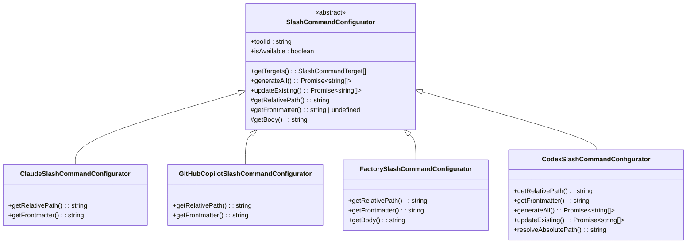

# 斜杠命令集成

<cite>
**本文档中引用的文件**  
- [registry.ts](file://src/core/configurators/slash/registry.ts)
- [slash-command-templates.ts](file://src/core/templates/slash-command-templates.ts)
- [base.ts](file://src/core/configurators/slash/base.ts)
- [claude.ts](file://src/core/configurators/slash/claude.ts)
- [github-copilot.ts](file://src/core/configurators/slash/github-copilot.ts)
- [cursor.ts](file://src/core/configurators/slash/cursor.ts)
- [cline.ts](file://src/core/configurators/slash/cline.ts)
- [factory.ts](file://src/core/configurators/slash/factory.ts)
- [windsurf.ts](file://src/core/configurators/slash/windsurf.ts)
- [codex.ts](file://src/core/configurators/slash/codex.ts)
- [amazon-q.ts](file://src/core/configurators/slash/amazon-q.ts)
- [qwen.ts](file://src/core/configurators/slash/qwen.ts)
</cite>

## 目录
1. [简介](#简介)
2. [核心组件](#核心组件)
3. [SlashCommandRegistry 设计原理](#slashcommandregistry-设计原理)
4. [斜杠命令模板系统](#斜杠命令模板系统)
5. [各AI工具的斜杠命令配置](#各ai工具的斜杠命令配置)
6. [init 命令的工作流程](#init-命令的工作流程)
7. [update 命令的刷新机制](#update-命令的刷新机制)
8. [继承关系与方法重写](#继承关系与方法重写)
9. [结论](#结论)

## 简介
OpenSpec系统通过斜杠命令集成机制，为多种AI开发工具提供标准化的命令配置。该系统允许开发者通过统一的接口与不同AI工具交互，执行如提案、应用和归档等核心操作。本文档深入解析`SlashCommandRegistry`的设计原理和工作流程，说明如何为不同AI工具生成特定的斜杠命令配置。

## 核心组件

OpenSpec的斜杠命令系统由多个核心组件构成，包括`SlashCommandRegistry`、`SlashCommandConfigurator`基类、各种具体工具的配置器实现以及模板管理系统。这些组件协同工作，实现了跨平台的斜杠命令集成。

**本节来源**  
- [registry.ts](file://src/core/configurators/slash/registry.ts#L1-L70)
- [base.ts](file://src/core/configurators/slash/base.ts#L1-L96)
- [slash-command-templates.ts](file://src/core/templates/slash-command-templates.ts#L1-L59)

## SlashCommandRegistry 设计原理

`SlashCommandRegistry`是斜杠命令系统的中心注册表，采用单例模式管理所有可用的斜杠命令配置器。该类在静态初始化块中预注册了所有支持的AI工具配置器，包括Claude、GitHub Copilot、Cursor等。

注册表使用`Map<string, SlashCommandConfigurator>`数据结构存储配置器实例，以工具ID作为键。这种设计提供了O(1)时间复杂度的查找性能，确保在运行时能够快速获取特定工具的配置器。

注册表提供了三个主要接口：
- `get(toolId: string)`：根据工具ID获取对应的配置器实例
- `getAll()`：获取所有已注册配置器的数组
- `register(configurator)`：动态注册新的配置器

这种设计模式实现了配置器的集中管理和解耦，新工具的集成只需实现相应的配置器类并注册到系统中即可。

**图表来源**  
- [registry.ts](file://src/core/configurators/slash/registry.ts#L19-L69)
- [base.ts](file://src/core/configurators/slash/base.ts#L13-L96)

**本节来源**  
- [registry.ts](file://src/core/configurators/slash/registry.ts#L1-L70)

## 斜杠命令模板系统

斜杠命令模板系统通过`slash-command-templates.ts`文件定义了三种核心命令的通用内容模板：`proposal`（提案）、`apply`（应用）和`archive`（归档）。这些模板采用分层结构，包含基础护栏、具体步骤和参考信息三个部分。

模板系统使用`Record<SlashCommandId, string>`类型定义模板体，通过`getSlashCommandBody`函数提供访问接口。所有AI工具共享相同的核心命令内容，确保了跨平台行为的一致性。

模板内容设计遵循OpenSpec的最佳实践，包括：
- **基础护栏**：强调简单实现优先、变更范围最小化等原则
- **具体步骤**：提供详细的执行流程指导
- **参考信息**：列出相关命令和查询方法

这种模板化设计实现了内容与格式的分离，使得核心指导原则可以在不同工具间复用，同时允许各工具根据自身特点定制文件格式和位置。

**图表来源**  
- [slash-command-templates.ts](file://src/core/templates/slash-command-templates.ts#L1-L59)

**本节来源**  
- [slash-command-templates.ts](file://src/core/templates/slash-command-templates.ts#L1-L59)
- [index.ts](file://src/core/templates/index.ts#L7-L47)

## 各AI工具的斜杠命令配置

OpenSpec为不同AI工具生成特定的斜杠命令配置，每个工具都有其独特的文件路径和元数据格式。

### Claude 配置
Claude工具的斜杠命令配置位于`.claude/commands/openspec/`目录下，使用YAML前言定义命令元数据，包括名称、描述、分类和标签。文件路径遵循`.claude/commands/openspec/{command}.md`的模式。

### GitHub Copilot 配置
GitHub Copilot的配置存储在`.github/prompts/`目录中，文件扩展名为`.prompt.md`。其前言包含描述信息，并在正文中使用`$ARGUMENTS`占位符捕获用户输入。

### Cursor 配置
Cursor工具的配置位于`.cursor/commands/`目录，使用标准的YAML前言格式，包含名称、ID、分类和描述等元数据字段。

### 其他工具配置
- **Cline**: 使用`.clinerules/`目录，前言为Markdown标题格式
- **Factory**: 在`.factory/commands/`目录，前言包含`argument-hint`字段
- **Windsurf**: 位于`.windsurf/workflows/`目录，前言包含`auto_execution_mode`字段
- **Codex**: 存储在`.codex/prompts/`目录，支持全局提示目录
- **Amazon Q**: 在`.amazonq/prompts/`目录，前言包含用户请求包装
- **Qwen**: 位于`.qwen/commands/`目录，使用标准YAML前言

**图表来源**  
- [claude.ts](file://src/core/configurators/slash/claude.ts#L4-L8)
- [github-copilot.ts](file://src/core/configurators/slash/github-copilot.ts#L4-L8)
- [cursor.ts](file://src/core/configurators/slash/cursor.ts#L4-L8)
- [cline.ts](file://src/core/configurators/slash/cline.ts#L4-L8)
- [factory.ts](file://src/core/configurators/slash/factory.ts#L4-L8)
- [windsurf.ts](file://src/core/configurators/slash/windsurf.ts#L4-L8)
- [codex.ts](file://src/core/configurators/slash/codex.ts#L9-L13)
- [amazon-q.ts](file://src/core/configurators/slash/amazon-q.ts#L4-L8)
- [qwen.ts](file://src/core/configurators/slash/qwen.ts#L15-L19)

**本节来源**  
- [claude.ts](file://src/core/configurators/slash/claude.ts#L1-L43)
- [github-copilot.ts](file://src/core/configurators/slash/github-copilot.ts#L1-L40)
- [cursor.ts](file://src/core/configurators/slash/cursor.ts#L1-L43)
- [cline.ts](file://src/core/configurators/slash/cline.ts#L1-L28)
- [factory.ts](file://src/core/configurators/slash/factory.ts#L1-L42)
- [windsurf.ts](file://src/core/configurators/slash/windsurf.ts#L1-L28)
- [codex.ts](file://src/core/configurators/slash/codex.ts#L1-L127)
- [amazon-q.ts](file://src/core/configurators/slash/amazon-q.ts#L1-L51)
- [qwen.ts](file://src/core/configurators/slash/qwen.ts#L1-L80)

## init 命令的工作流程

`init`命令是斜杠命令系统的入口点，负责根据用户选择的AI工具初始化相应的斜杠命令配置。当用户执行`openspec init`命令时，系统会：

1. 检测用户选择的工具或提示用户选择
2. 通过`SlashCommandRegistry.get(toolId)`获取对应工具的配置器实例
3. 调用配置器的`generateAll()`方法生成所有必要的斜杠命令文件
4. 在项目根目录创建相应的配置文件和目录结构

对于全局安装的工具如Codex，`init`命令还会检查环境变量`CODEX_HOME`，并在用户主目录的`.codex/prompts`目录中创建全局提示文件。

该流程确保了无论使用何种AI工具，都能获得一致的OpenSpec集成体验，同时尊重各工具的约定和最佳实践。

**本节来源**  
- [registry.ts](file://src/core/configurators/slash/registry.ts#L62-L64)
- [base.ts](file://src/core/configurators/slash/base.ts#L25-L49)
- [codex.ts](file://src/core/configurators/slash/codex.ts#L58-L83)

## update 命令的刷新机制

`update`命令用于刷新现有的斜杠命令配置，确保命令内容与最新的OpenSpec规范保持同步。其工作流程如下：

1. 通过`SlashCommandRegistry.getAll()`获取所有已注册的配置器
2. 对每个配置器调用`updateExisting()`方法
3. 检查目标文件是否存在，仅更新已存在的文件
4. 使用`updateBody()`方法更新文件中的OpenSpec标记区域内容

`updateBody()`方法通过查找`OPENSPEC_MARKERS.start`和`OPENSPEC_MARKERS.end`标记来定位需要更新的内容区域，确保只替换核心命令体而不影响文件的其他部分。这种设计允许用户在命令文件中添加自定义内容，同时保证核心指导原则的更新。

对于像Codex这样的全局工具，`update`命令会定位到全局提示目录并更新相应的文件，确保全局配置的一致性。

**本节来源**  
- [base.ts](file://src/core/configurators/slash/base.ts#L51-L64)
- [base.ts](file://src/core/configurators/slash/base.ts#L80-L94)
- [codex.ts](file://src/core/configurators/slash/codex.ts#L85-L99)

## 继承关系与方法重写

斜杠命令系统采用面向对象的继承架构，以`SlashCommandConfigurator`为抽象基类，各具体工具配置器继承并重写特定方法。

### 基类功能
`base.ts`中的`SlashCommandConfigurator`定义了所有配置器的公共接口和默认实现：
- `getTargets()`：获取所有命令目标
- `generateAll()`：生成所有命令文件
- `updateExisting()`：更新现有命令文件
- `getBody()`：获取命令体内容
- `updateBody()`：更新文件内容

### 方法重写模式
各子类主要重写以下抽象方法：
- `getRelativePath(id)`：定义工具特定的文件路径
- `getFrontmatter(id)`：定义工具特定的元数据格式

部分工具如`FactorySlashCommandConfigurator`还会重写`getBody()`方法，在基础模板上添加额外内容（如`$ARGUMENTS`占位符）。`CodexSlashCommandConfigurator`则完全重写了`generateAll()`和`updateExisting()`方法，以支持全局提示目录。

这种继承模式实现了"约定优于配置"的设计原则，大多数工具只需定义路径和元数据，而复杂工具可以完全定制行为。

**图表来源**  
- [base.ts](file://src/core/configurators/slash/base.ts#L13-L96)
- [claude.ts](file://src/core/configurators/slash/claude.ts#L31-L43)
- [github-copilot.ts](file://src/core/configurators/slash/github-copilot.ts#L28-L40)
- [factory.ts](file://src/core/configurators/slash/factory.ts#L25-L42)
- [codex.ts](file://src/core/configurators/slash/codex.ts#L15-L127)

**本节来源**  
- [base.ts](file://src/core/configurators/slash/base.ts#L13-L96)
- [claude.ts](file://src/core/configurators/slash/claude.ts#L31-L43)
- [factory.ts](file://src/core/configurators/slash/factory.ts#L25-L42)
- [codex.ts](file://src/core/configurators/slash/codex.ts#L15-L127)

## 结论
OpenSpec的斜杠命令集成系统通过精心设计的注册表模式、模板系统和继承架构，实现了对多种AI工具的无缝集成。`SlashCommandRegistry`作为中心枢纽，统一管理所有配置器；模板系统确保核心指导原则的一致性；而灵活的继承机制则允许各工具保持其独特性。`init`和`update`命令提供了完整的生命周期管理，使得开发者能够轻松地在不同AI工具间切换，同时享受OpenSpec带来的标准化开发流程。