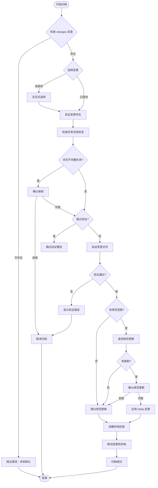
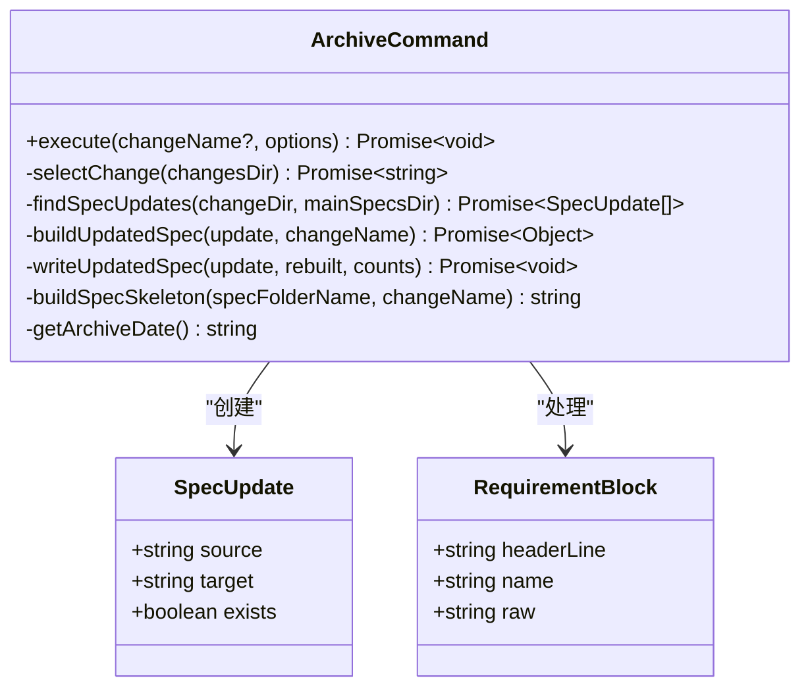
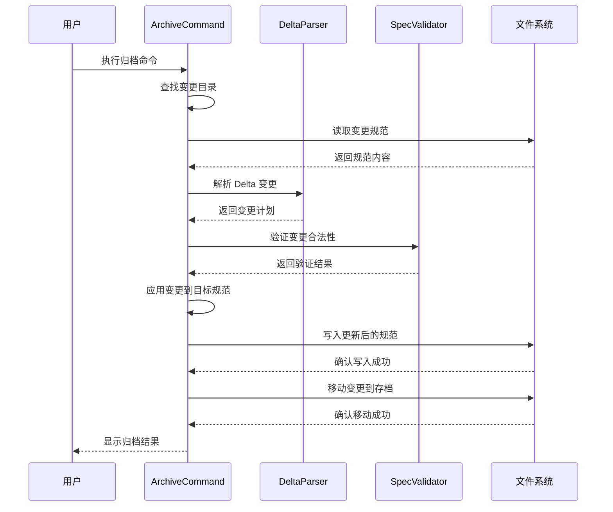

# archive 命令

<cite>
**本文档中引用的文件**
- [src/core/archive.ts](file://src/core/archive.ts)
- [src/cli/index.ts](file://src/cli/index.ts)
- [test/core/archive.test.ts](file://test/core/archive.test.ts)
- [openspec/changes/archive/2025-08-13-add-archive-command/proposal.md](file://openspec/changes/archive/2025-08-13-add-archive-command/proposal.md)
- [openspec/changes/archive/2025-08-13-add-archive-command/tasks.md](file://openspec/changes/archive/2025-08-13-add-archive-command/tasks.md)
- [openspec/changes/archive/2025-08-13-add-archive-command/specs/cli-archive/spec.md](file://openspec/changes/archive/2025-08-13-add-archive-command/specs/cli-archive/spec.md)
- [openspec/specs/cli-archive/spec.md](file://openspec/specs/cli-archive/spec.md)
- [openspec/changes/archive/2025-08-19-add-skip-specs-archive-option/proposal.md](file://openspec/changes/archive/2025-08-19-add-skip-specs-archive-option/proposal.md)
- [openspec/changes/archive/2025-08-19-add-skip-specs-archive-option/tasks.md](file://openspec/changes/archive/2025-08-19-add-skip-specs-archive-option/tasks.md)
- [openspec/changes/archive/2025-08-19-add-skip-specs-archive-option/specs/cli-archive/spec.md](file://openspec/changes/archive/2025-08-19-add-skip-specs-archive-option/specs/cli-archive/spec.md)
</cite>

## 目录
1. [简介](#简介)
2. [命令语法](#命令语法)
3. [核心功能](#核心功能)
4. [工作流程](#工作流程)
5. [详细组件分析](#详细组件分析)
6. [选项参数](#选项参数)
7. [使用示例](#使用示例)
8. [目录结构变化](#目录结构变化)
9. [错误处理与故障排除](#错误处理与故障排除)
10. [最佳实践](#最佳实践)

## 简介

`openspec archive` 命令是 OpenSpec 框架中的核心工具，用于将已完成的变更提案从活动变更目录归档到历史存档目录。该命令实现了 OpenSpec 规范演进的关键环节，通过交互式选择变更、任务完成检查、Delta 解析和文件操作，确保规范的正确更新和版本管理。

归档过程包含以下关键步骤：
- **变更选择**：支持交互式或直接指定变更名称
- **任务验证**：检查变更中的任务完成状态
- **规范更新**：基于 Delta 格式的变更应用到主规范
- **历史归档**：将变更移动到带日期前缀的存档目录

## 命令语法

```bash
openspec archive [change-name] [--yes|-y] [--skip-specs] [--no-validate]
```

## 核心功能

### 变更管理
- **交互式选择**：当未提供变更名称时，显示可用变更列表供用户选择
- **直接指定**：支持通过命令行参数直接指定要归档的变更
- **存在性验证**：确保指定的变更确实存在于 `changes/` 目录中

### 任务完整性检查
- **任务文件解析**：读取 `tasks.md` 文件中的任务状态
- **不完整任务警告**：检测并报告未完成的任务
- **安全确认**：在存在不完整任务时要求用户确认继续

### 规范更新机制
- **Delta 解析**：解析 `proposal.md` 中的 Delta 格式变更
- **原子操作**：确保所有规范更新作为一个整体成功或失败
- **冲突检测**：防止重复定义和跨节冲突

### 归档存储
- **时间戳命名**：使用 `YYYY-MM-DD-[change-name]` 格式命名存档
- **目录结构**：将变更移动到 `changes/archive/` 目录下
- **防重写保护**：避免覆盖已存在的存档

## 工作流程



**图表来源**
- [src/core/archive.ts](file://src/core/archive.ts#L22-L256)

## 详细组件分析

### ArchiveCommand 类架构



**图表来源**
- [src/core/archive.ts](file://src/core/archive.ts#L15-L21)
- [src/core/archive.ts](file://src/core/archive.ts#L21-L25)

### Delta 变更处理流程



**图表来源**
- [src/core/archive.ts](file://src/core/archive.ts#L348-L595)

**章节来源**
- [src/core/archive.ts](file://src/core/archive.ts#L22-L256)

## 选项参数

### 主要选项

| 选项 | 别名 | 类型 | 默认值 | 描述 |
|------|------|------|--------|------|
| `--yes` | `-y` | boolean | false | 跳过所有确认提示，用于自动化场景 |
| `--skip-specs` | 无 | boolean | false | 跳过规范更新操作，适用于非规范变更 |
| `--no-validate` | 无 | boolean | false | 跳过验证检查（不推荐，需要确认） |

### 验证控制

| 参数 | 描述 | 使用场景 |
|------|------|----------|
| `--no-validate` | 完全跳过验证 | 快速归档，了解风险 |
| `--validate false` | 禁用验证模式 | 测试环境，快速迭代 |

### 自动化支持

| 场景 | 命令示例 | 说明 |
|------|----------|------|
| 完全自动归档 | `openspec archive --yes` | 无交互，自动完成 |
| 跳过规范归档 | `openspec archive --skip-specs` | 仅移动变更，不更新规范 |
| 组合使用 | `openspec archive --yes --skip-specs` | 最大化自动化程度 |

**章节来源**
- [src/cli/index.ts](file://src/cli/index.ts#L185-L198)

## 使用示例

### 基本归档操作

```bash
# 1. 交互式选择要归档的变更
openspec archive

# 2. 直接归档特定变更
openspec archive add-archive-command

# 3. 完全自动归档（无确认）
openspec archive add-archive-command --yes
```

### 规范无关变更归档

```bash
# 归档基础设施变更（无规范修改）
openspec archive update-build-tools --skip-specs

# 归档文档更新
openspec archive improve-readme --skip-specs

# 自动化脚本归档
openspec archive update-ci-scripts --yes --skip-specs
```

### 开发工作流集成

```bash
# 归档完成后验证
openspec archive complete-feature && openspec validate

# 归档并立即部署
openspec archive deploy-changes --yes && git push origin main

# 归档并更新版本
openspec archive release-v1.2.0 --yes && npm version patch
```

### 错误恢复场景

```bash
# 如果归档失败，先修复问题
openspec validate complete-feature --strict

# 修复后重新归档
openspec archive complete-feature --yes

# 或者跳过验证（谨慎使用）
openspec archive complete-feature --no-validate
```

**章节来源**
- [test/core/archive.test.ts](file://test/core/archive.test.ts#L55-L681)

## 目录结构变化

### 归档前结构

```
openspec/
├── changes/
│   ├── add-archive-command/
│   │   ├── specs/
│   │   │   └── cli-archive/
│   │   │       └── spec.md
│   │   ├── proposal.md
│   │   └── tasks.md
│   └── archive/
│       └── 2025-08-13-add-archive-command/
│           ├── specs/
│           │   └── cli-archive/
│           │       └── spec.md
│           ├── proposal.md
│           └── tasks.md
├── specs/
│   └── cli-archive/
│       └── spec.md
└── AGENTS.md
```

### 归档后结构

```
openspec/
├── changes/
│   ├── add-archive-command/
│   │   ├── specs/
│   │   │   └── cli-archive/
│   │   │       └── spec.md
│   │   ├── proposal.md
│   │   └── tasks.md
│   └── archive/
│       ├── 2025-08-13-add-archive-command/
│       │   ├── specs/
│       │   │   └── cli-archive/
│       │   │       └── spec.md
│       │   ├── proposal.md
│       │   └── tasks.md
│       └── 2025-11-15-add-archive-command/
│           ├── specs/
│           │   └── cli-archive/
│           │       └── spec.md
│           ├── proposal.md
│           └── tasks.md
├── specs/
│   └── cli-archive/
│       └── spec.md  ← 更新为最新版本
└── AGENTS.md
```

### 存储模式说明

| 目录 | 用途 | 版本控制 |
|------|------|----------|
| `changes/` | 活动变更提案 | Git 追踪 |
| `changes/archive/` | 历史归档 | Git 追踪 |
| `specs/` | 当前规范版本 | Git 追踪 |

**章节来源**
- [openspec/specs/cli-archive/spec.md](file://openspec/specs/cli-archive/spec.md#L1-L210)

## 错误处理与故障排除

### 常见错误类型

#### 1. 初始化错误
```bash
# 错误：未初始化项目
Error: No OpenSpec changes directory found. Run 'openspec init' first.

# 解决方案：先初始化项目
openspec init
```

#### 2. 变更不存在
```bash
# 错误：变更不存在
Error: Change 'non-existent-change' not found.

# 解决方案：检查变更名称或使用交互式选择
openspec archive
```

#### 3. 存档冲突
```bash
# 错误：存档已存在
Error: Archive '2025-11-15-add-archive-command' already exists.

# 解决方案：等待到第二天或使用不同变更名称
```

#### 4. 规范验证失败
```bash
# 错误：规范格式错误
Error: Validation errors in change delta specs

# 解决方案：修复规范文件或跳过验证
openspec archive change-name --no-validate
```

### 故障排除指南

#### 验证问题诊断

```bash
# 1. 检查变更状态
openspec list

# 2. 验证变更文件
openspec validate change-name

# 3. 检查任务完成情况
cat openspec/changes/change-name/tasks.md
```

#### 回滚操作

```bash
# 1. 检查归档状态
ls openspec/changes/archive/

# 2. 手动恢复（如果需要）
mv openspec/changes/archive/2025-11-15-change-name/* openspec/changes/
rm -rf openspec/changes/archive/2025-11-15-change-name/
```

#### 性能优化

```bash
# 使用跳过选项提高性能
openspec archive large-change --skip-specs --yes

# 并行验证多个变更
openspec validate --all --concurrency 4
```

**章节来源**
- [src/core/archive.ts](file://src/core/archive.ts#L31-L58)

## 最佳实践

### 开发工作流

1. **变更完成检查清单**
   - [ ] 所有任务标记为完成
   - [ ] 规范文件格式正确
   - [ ] 测试用例通过
   - [ ] 文档更新完整

2. **归档时机选择**
   - 在功能完全测试后归档
   - 在代码审查通过后归档
   - 在部署准备就绪后归档

3. **自动化集成**
   ```bash
   # CI/CD 流水线中的归档
   openspec archive --yes --skip-specs
   ```

### 规范管理策略

1. **Delta 变更格式**
   - 使用标准的 ADDED/MODIFIED/REMOVED/RENAMED 格式
   - 保持要求标题的一致性
   - 提供清晰的变更说明

2. **版本控制最佳实践**
   - 归档前提交所有更改
   - 使用有意义的变更名称
   - 保持归档历史的可追溯性

3. **团队协作规范**
   - 归档前通知团队成员
   - 同步规范更新信息
   - 维护变更日志记录

### 错误预防措施

1. **预归档验证**
   ```bash
   # 归档前验证
   openspec validate change-name --strict
   
   # 检查任务完成状态
   openspec list --changes
   ```

2. **备份策略**
   ```bash
   # 归档前备份重要文件
   cp -r openspec/specs/ backup/specs/
   ```

3. **监控和审计**
   ```bash
   # 监控归档活动
   ls -la openspec/changes/archive/
   
   # 检查归档质量
   openspec validate --all
   ```

**章节来源**
- [openspec/changes/archive/2025-08-13-add-archive-command/tasks.md](file://openspec/changes/archive/2025-08-13-add-archive-command/tasks.md#L1-L44)
- [openspec/changes/archive/2025-08-19-add-skip-specs-archive-option/tasks.md](file://openspec/changes/archive/2025-08-19-add-skip-specs-archive-option/tasks.md#L1-L57)