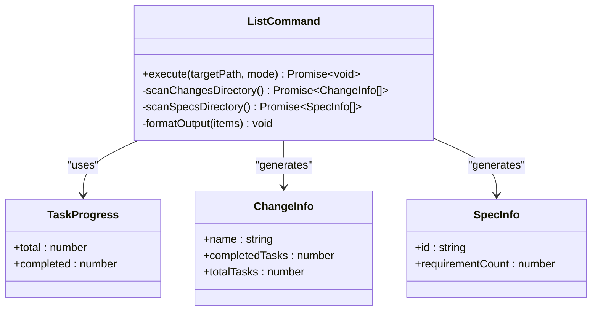

# list 命令

<cite>
**本文档中引用的文件**
- [src/core/list.ts](file://src/core/list.ts)
- [src/cli/index.ts](file://src/cli/index.ts)
- [test/core/list.test.ts](file://test/core/list.test.ts)
- [src/utils/task-progress.ts](file://src/utils/task-progress.ts)
- [openspec/specs/cli-list/spec.md](file://openspec/specs/cli-list/spec.md)
- [openspec/specs/openspec-conventions/spec.md](file://openspec/specs/openspec-conventions/spec.md)
</cite>

## 目录
1. [简介](#简介)
2. [核心功能](#核心功能)
3. [命令语法](#命令语法)
4. [实现架构](#实现架构)
5. [参数选项](#参数选项)
6. [输出格式](#输出格式)
7. [使用示例](#使用示例)
8. [错误处理](#错误处理)
9. [调试指南](#调试指南)
10. [最佳实践](#最佳实践)

## 简介

`openspec list` 命令是 OpenSpec 工具链中的核心命令之一，用于快速查看项目中所有活动的变更提案（changes）或已定义的规范（specs）。该命令为开发者提供了项目演进状态的概览，帮助用户了解当前正在进行的工作、已完成的变更以及可用的规范能力。

## 核心功能

`openspec list` 命令的主要功能包括：

### 变更列表显示
- 扫描 `openspec/changes/` 目录，识别所有活动的变更提案
- 解析每个变更的 `tasks.md` 文件，计算任务完成进度
- 按字母顺序排序显示变更名称和任务状态

### 规范列表显示  
- 扫描 `openspec/specs/` 目录，识别所有可用的规范
- 解析每个规范的 `spec.md` 文件，统计需求数量
- 按字母顺序排序显示规范标识符和需求计数

### 状态指示
- 完成状态：显示为 "✓ Complete"
- 进行中状态：显示为 "X/Y tasks"
- 无任务状态：显示为 "No tasks"

**章节来源**
- [src/core/list.ts](file://src/core/list.ts#L14-L104)
- [openspec/specs/cli-list/spec.md](file://openspec/specs/cli-list/spec.md#L1-L103)

## 命令语法

```bash
openspec list [--specs] [--changes]
```

### 默认行为
- 不带任何标志时，默认显示变更列表（`--changes`）
- 显示 `openspec/changes/` 目录下的所有活动变更

### 参数说明
- `--specs`：切换到显示规范列表模式
- `--changes`：显式指定显示变更列表（与默认行为相同）

**章节来源**
- [src/cli/index.ts](file://src/cli/index.ts#L91-L106)

## 实现架构



**图表来源**
- [src/core/list.ts](file://src/core/list.ts#L8-L13)
- [src/utils/task-progress.ts](file://src/utils/task-progress.ts#L7-L10)

### 核心组件

#### ListCommand 类
负责执行列表操作的主要类，支持两种模式：
- **changes 模式**：扫描变更目录，解析任务进度
- **specs 模式**：扫描规范目录，统计需求数量

#### 任务进度计算
通过正则表达式解析 `tasks.md` 文件中的 Markdown 复选框标记：
- `- [x]`：已完成的任务
- `- [ ]`：进行中的任务

#### 输出格式化
- 自动计算列宽，确保对齐
- 使用 Unicode 符号增强可读性
- 支持颜色输出控制

**章节来源**
- [src/core/list.ts](file://src/core/list.ts#L14-L104)
- [src/utils/task-progress.ts](file://src/utils/task-progress.ts#L1-L44)

## 参数选项

### --specs 选项
启用规范列表模式，显示 `openspec/specs/` 目录下的所有规范。

**使用场景**：
- 查看项目中可用的所有规范能力
- 了解当前部署的功能模块
- 验证规范的完整性

### --changes 选项
启用变更列表模式，这是默认行为，显示 `openspec/changes/` 目录下的所有活动变更。

**使用场景**：
- 跟踪正在进行的开发工作
- 识别即将完成的变更
- 查看任务完成进度

### 参数优先级
- `--specs` 选项具有最高优先级
- `--changes` 选项覆盖默认行为
- 如果两个选项都未指定，则使用默认的 `--changes` 行为

**章节来源**
- [src/cli/index.ts](file://src/cli/index.ts#L94-L96)

## 输出格式

### 变更列表格式

```
Changes:
  add-auth-feature     3/5 tasks
  update-api-docs      ✓ Complete
  fix-validation       0/2 tasks
  add-list-command     1/4 tasks
```

#### 列说明
1. **变更名称**：目录名称，保持原始格式
2. **任务状态**：显示完成情况
   - `X/Y tasks`：部分完成，显示完成/总数
   - `✓ Complete`：全部完成
   - `No tasks`：没有任务文件

### 规范列表格式

```
Specs:
  cli-list             requirements 12
  cli-show             requirements 8
  cli-validate         requirements 15
```

#### 列说明
1. **规范标识符**：目录名称
2. **需求计数**：规范中定义的需求数量

### 对齐机制
- 自动计算最长名称长度
- 使用空格填充确保列对齐
- 支持多语言字符宽度处理

**章节来源**
- [src/core/list.ts](file://src/core/list.ts#L52-L103)

## 使用示例

### 基本用法

#### 显示变更列表（默认）
```bash
# 显示当前项目中的所有活动变更
openspec list

# 输出示例：
Changes:
  add-list-command     1/4 tasks
  update-cli-help      2/3 tasks
  improve-error-handling ✓ Complete
```

#### 显示规范列表
```bash
# 显示当前部署的所有规范
openspec list --specs

# 输出示例：
Specs:
  cli-list             requirements 12
  cli-show             requirements 8
  cli-validate         requirements 15
```

### 高级用法

#### 结合其他命令
```bash
# 查看变更列表并排序
openspec list | sort

# 统计变更数量
openspec list | wc -l

# 查找特定状态的变更
openspec list | grep "tasks"
```

#### 在脚本中使用
```bash
#!/bin/bash
echo "=== 当前项目状态 ==="
echo "活动变更："
openspec list --changes | head -5
echo ""
echo "可用规范："
openspec list --specs | head -5
```

### 实际项目示例

基于项目结构的实际输出：

```bash
# 假设项目中有以下变更
openspec list --changes
Changes:
  add-list-command     1/4 tasks
  improve-task-tracking 3/5 tasks
  update-cli-documentation ✓ Complete

# 假设项目中有以下规范
openspec list --specs
Specs:
  cli-list             requirements 12
  cli-show             requirements 8
  cli-validate         requirements 15
```

**章节来源**
- [test/core/list.test.ts](file://test/core/list.test.ts#L1-L165)

## 错误处理

### 目录不存在错误

#### 场景：缺少变更目录
当项目尚未初始化或 `openspec/changes/` 目录不存在时：

```bash
$ openspec list
Error: No OpenSpec changes directory found. Run 'openspec init' first.
```

**解决方案**：
1. 运行 `openspec init` 初始化项目
2. 确认项目根目录包含 `openspec/` 目录结构

#### 场景：缺少规范目录
当 `openspec/specs/` 目录不存在时：

```bash
$ openspec list --specs
No specs found.
```

**解决方案**：
1. 确认项目包含规范文件
2. 检查 `openspec/specs/` 目录是否存在

### 空状态处理

#### 场景：无活动变更
```bash
$ openspec list
No active changes found.
```

#### 场景：无规范
```bash
$ openspec list --specs
No specs found.
```

### 文件读取错误

#### 场景：任务文件损坏
如果某个变更的 `tasks.md` 文件无法读取：

```bash
# 输出示例
Changes:
  broken-change        No tasks
```

**解决方案**：
1. 检查 `tasks.md` 文件格式
2. 确保文件编码正确（UTF-8）
3. 验证文件权限设置

**章节来源**
- [src/core/list.ts](file://src/core/list.ts#L19-L35)
- [src/core/list.ts](file://src/core/list.ts#L66-L71)

## 调试指南

### 常见问题诊断

#### 为什么某些变更未被列出？

**可能原因**：
1. **状态不是 active**：只有 `openspec/changes/` 目录下的变更会被列出，`archive/` 子目录中的变更会被自动排除
2. **目录结构不正确**：变更目录必须位于 `openspec/changes/` 下
3. **权限问题**：程序没有访问目录的权限
4. **文件损坏**：`tasks.md` 文件格式不正确

**调试步骤**：
```bash
# 检查目录结构
ls -la openspec/changes/

# 检查具体变更目录
ls -la openspec/changes/specific-change/

# 检查任务文件
cat openspec/changes/specific-change/tasks.md
```

#### 如何验证任务计数准确性？

**检查方法**：
1. 手动检查 `tasks.md` 文件中的复选框标记
2. 确认格式符合预期：`- [x]` 或 `- [ ]`
3. 验证文件编码和换行符

#### 性能优化建议

对于大型项目，可以考虑：
1. 减少不必要的变更数量
2. 优化任务文件结构
3. 使用符号链接减少重复内容

### 调试输出

启用调试模式查看更多详细信息：

```bash
DEBUG=1 openspec list
```

这将显示额外的调试信息，包括文件路径和解析过程。

**章节来源**
- [src/core/list.ts](file://src/core/list.ts#L26-L30)
- [src/utils/task-progress.ts](file://src/utils/task-progress.ts#L27-L34)

## 最佳实践

### 项目组织

#### 变更管理
1. **及时归档**：完成的变更应尽快归档到 `archive/` 目录
2. **清晰命名**：变更目录使用描述性的名称
3. **完整任务清单**：确保 `tasks.md` 包含所有必要的任务

#### 规范维护
1. **定期更新**：随着项目发展定期添加新的规范
2. **一致性格式**：遵循 OpenSpec 约定的格式要求
3. **版本控制**：将规范文件纳入版本控制系统

### 团队协作

#### 代码审查
1. **变更可见性**：使用 `openspec list` 快速了解团队进展
2. **状态同步**：定期检查变更状态，避免重复工作
3. **优先级管理**：根据任务完成度确定工作优先级

#### 文档维护
1. **自动化检查**：集成 `openspec list` 到 CI/CD 流水线
2. **状态报告**：定期生成项目状态报告
3. **历史追踪**：监控变更历史趋势

### 工具集成

#### 开发环境
```bash
# 添加到 shell 配置文件
alias ol='openspec list'
alias os='openspec show'

# 创建项目状态脚本
#!/bin/bash
echo "=== OpenSpec 项目状态 ==="
echo "变更列表："
ol --changes
echo ""
echo "规范列表："
ol --specs
```

#### 自动化脚本
```bash
#!/bin/bash
# 生成每日状态报告
REPORT_FILE="daily-status-$(date +%Y%m%d).md"
{
  echo "# OpenSpec 项目状态报告"
  echo ""
  echo "## 变更状态"
  openspec list --changes
  
  echo ""
  echo "## 规范状态"
  openspec list --specs
} > "$REPORT_FILE"
echo "报告已生成：$REPORT_FILE"
```

**章节来源**
- [openspec/specs/openspec-conventions/spec.md](file://openspec/specs/openspec-conventions/spec.md#L233-L262)
- [openspec/specs/cli-list/spec.md](file://openspec/specs/cli-list/spec.md#L97-L103)

## 总结

`openspec list` 命令是 OpenSpec 生态系统中的重要工具，它提供了项目状态的快速概览。通过理解其工作原理、参数选项和最佳实践，开发者可以更好地利用这一功能来管理项目演进、跟踪开发进度和维护项目文档。

该命令的设计体现了 OpenSpec 的核心理念：简单性、一致性和可自动化。无论是个人开发者还是大型团队，都可以从这个命令中获得项目状态的清晰视图，从而提高开发效率和项目质量。