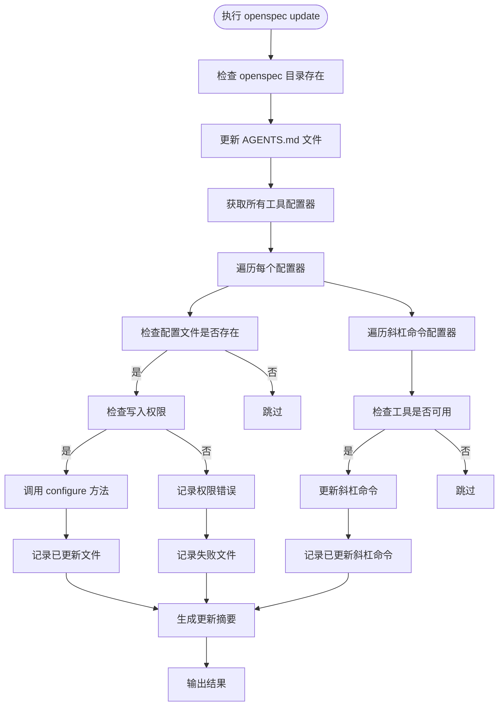
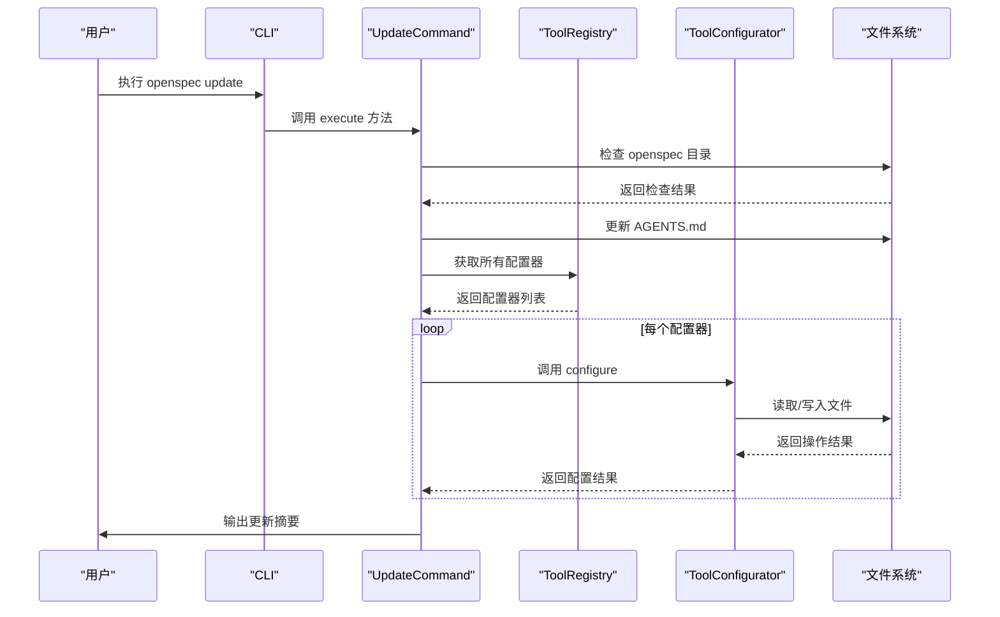
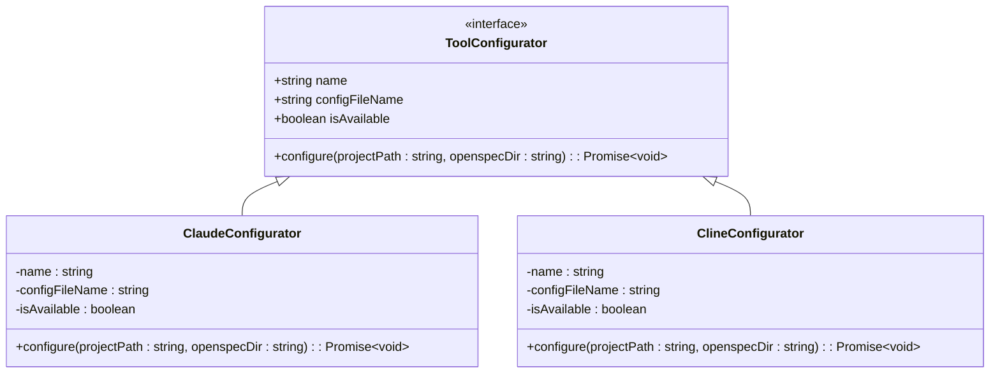
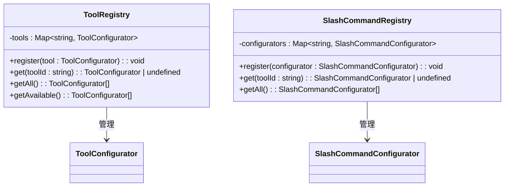
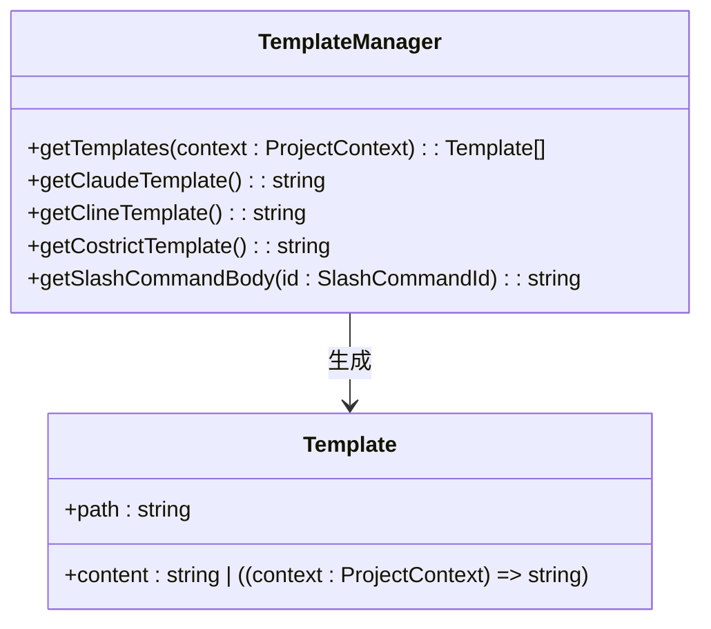

# update 命令

<cite>
**本文档中引用的文件**  
- [update.ts](file://src/core/update.ts)
- [registry.ts](file://src/core/configurators/registry.ts)
- [slash/registry.ts](file://src/core/configurators/slash/registry.ts)
- [claude.ts](file://src/core/configurators/claude.ts)
- [slash/claude.ts](file://src/core/configurators/slash/claude.ts)
- [agents-template.ts](file://src/core/templates/agents-template.ts)
- [AGENTS.md](file://openspec/AGENTS.md)
- [specs/cli-update/spec.md](file://openspec/specs/cli-update/spec.md)
</cite>

## 目录
1. [简介](#简介)
2. [核心功能](#核心功能)
3. [工作流程](#工作流程)
4. [配置器注册机制](#配置器注册机制)
5. [模板系统](#模板系统)
6. [使用示例](#使用示例)
7. [常见问题与故障排除](#常见问题与故障排除)
8. [相关规格文档](#相关规格文档)

## 简介

`openspec update` 命令是 OpenSpec 工具链中的关键组件，用于刷新项目中所有已配置的 AI 编码助手的指令文件。该命令确保 `.claude/commands/`、`.github/prompts/` 等目录下的指令文件与最新的 `AGENTS.md` 和 `project.md` 保持同步。当项目规范更新后，运行此命令可以确保所有 AI 助手使用最新的开发指南和工作流程。

该命令通过遍历所有激活的工具配置器（ToolConfigurator）并调用其 `update` 方法来实现功能，同时利用 `templates/` 目录下的模板生成新文件。它在团队协作环境中尤为重要，确保所有成员使用的 AI 助手都遵循统一的开发标准。

**Section sources**
- [update.ts](file://src/core/update.ts#L1-L130)
- [AGENTS.md](file://openspec/AGENTS.md#L1-L455)

## 核心功能

`openspec update` 命令的核心功能包括：

1. **刷新核心指令文件**：始终更新 `AGENTS.md` 文件，确保其内容与最新模板同步。
2. **更新现有 AI 工具配置**：仅更新项目中已存在的 AI 工具配置文件，不会创建新的配置文件。
3. **支持多种 AI 工具**：通过配置器注册表支持 Claude、GitHub Copilot、Codex 等多种 AI 编码助手。
4. **处理斜杠命令**：更新各种 AI 工具的斜杠命令（slash commands）配置，如 `/openspec proposal`、`/openspec apply` 等。
5. **权限检查**：在修改文件前检查写入权限，避免因权限不足导致的错误。
6. **错误处理与报告**：对更新失败的文件进行记录，并在最终摘要中报告。

该命令的设计原则是"只更新存在的文件"，这避免了为未使用的 AI 工具创建不必要的配置文件，保持项目目录的整洁。



**Diagram sources**
- [update.ts](file://src/core/update.ts#L1-L130)

**Section sources**
- [update.ts](file://src/core/update.ts#L1-L130)

## 工作流程

`openspec update` 命令的执行流程如下：

1. **验证项目结构**：首先检查项目根目录下是否存在 `openspec` 目录，如果不存在则提示用户先运行 `openspec init`。
2. **更新核心文件**：直接将 `AGENTS.md` 文件替换为最新模板内容，确保所有项目都使用统一的开发规范。
3. **获取配置器列表**：从 `ToolRegistry` 和 `SlashCommandRegistry` 中获取所有已注册的工具配置器。
4. **处理常规配置器**：遍历每个常规工具配置器，检查其配置文件是否存在且可写，然后调用 `configure` 方法进行更新。
5. **处理斜杠命令配置器**：遍历每个斜杠命令配置器，仅更新已存在的斜杠命令文件，保持向后兼容性。
6. **生成执行摘要**：汇总更新结果，包括成功更新的文件、新创建的文件和更新失败的文件，并输出到控制台。

该流程确保了命令的安全性和可靠性，特别是在团队协作环境中，避免了意外的文件创建或覆盖。



**Diagram sources**
- [update.ts](file://src/core/update.ts#L1-L130)
- [registry.ts](file://src/core/configurators/registry.ts#L1-L47)

**Section sources**
- [update.ts](file://src/core/update.ts#L1-L130)

## 配置器注册机制

OpenSpec 使用注册表模式管理所有工具配置器，确保扩展性和灵活性。`ToolRegistry` 类负责管理常规工具配置器，而 `SlashCommandRegistry` 负责管理斜杠命令配置器。

### 工具配置器接口

所有工具配置器都实现 `ToolConfigurator` 接口，该接口定义了以下属性和方法：

- `name`: 工具名称
- `configFileName`: 配置文件名
- `isAvailable`: 工具是否可用
- `configure(projectPath, openspecDir)`: 配置方法



**Diagram sources**
- [base.ts](file://src/core/configurators/base.ts#L1-L6)
- [claude.ts](file://src/core/configurators/claude.ts#L1-L23)

### 注册表实现

`ToolRegistry` 在静态初始化块中注册所有支持的 AI 工具配置器，包括 Claude、Cline、CodeBuddy 等。每个配置器通过其工具 ID（如 'claude'、'cline'）进行注册，便于后续查找和管理。



**Diagram sources**
- [registry.ts](file://src/core/configurators/registry.ts#L1-L47)
- [slash/registry.ts](file://src/core/configurators/slash/registry.ts#L1-L70)

**Section sources**
- [registry.ts](file://src/core/configurators/registry.ts#L1-L47)
- [slash/registry.ts](file://src/core/configurators/slash/registry.ts#L1-L70)

## 模板系统

OpenSpec 使用模板系统来生成标准化的指令文件。`TemplateManager` 类负责管理所有模板，确保生成的文件格式统一、内容准确。

### 模板管理

`TemplateManager` 提供了获取各种模板的方法，包括：

- `getTemplates()`: 获取核心模板列表
- `getClaudeTemplate()`: 获取 Claude 专用模板
- `getClineTemplate()`: 获取 Cline 专用模板
- `getCostrictTemplate()`: 获取 Costrict 专用模板
- `getSlashCommandBody()`: 获取斜杠命令主体内容



**Diagram sources**
- [index.ts](file://src/core/templates/index.ts#L1-L51)

### 模板内容

`AGENTS.md` 模板包含了完整的开发指南，包括：

- 三阶段工作流程（创建变更、实施变更、归档变更）
- 快速启动命令
- 目录结构说明
- 变更提案创建指南
- 规范文件格式要求
- 故障排除指南

该模板确保所有 AI 助手都遵循相同的开发流程和标准。

**Section sources**
- [agents-template.ts](file://src/core/templates/agents-template.ts#L1-L458)
- [index.ts](file://src/core/templates/index.ts#L1-L51)

## 使用示例

### 基本用法

```bash
# 更新当前项目的 AI 助手指令文件
openspec update

# 更新指定路径项目的指令文件
openspec update /path/to/project
```

### 典型工作流

```bash
# 1. 初始化项目
openspec init

# 2. 创建变更提案
openspec change add-new-feature

# 3. 当项目规范更新后，刷新所有 AI 助手的指令
openspec update

# 4. 验证变更
openspec validate add-new-feature --strict

# 5. 归档已完成的变更
openspec archive add-new-feature --yes
```

### 与 CI/CD 集成

```yaml
# GitHub Actions 示例
name: Update OpenSpec
on:
  push:
    branches: [main]
    paths:
      - 'openspec/project.md'
      - 'openspec/specs/**'

jobs:
  update:
    runs-on: ubuntu-latest
    steps:
      - uses: actions/checkout@v3
      - name: Setup Node.js
        uses: actions/setup-node@v3
        with:
          node-version: '18'
      - name: Install OpenSpec
        run: npm install -g openspec
      - name: Update AI instructions
        run: openspec update
      - name: Commit updated instructions
        run: |
          git config user.name "github-actions"
          git config user.email "github-actions@github.com"
          git add .
          git commit -m "chore: update AI instructions" || exit 0
          git push
```

**Section sources**
- [cli/index.ts](file://src/cli/index.ts#L76-L89)
- [AGENTS.md](file://openspec/AGENTS.md#L102)

## 常见问题与故障排除

### 为什么某些工具的配置未被更新？

最常见的原因是该工具未在 `AGENTS.md` 中启用或其配置文件不存在。`openspec update` 命令遵循"只更新存在的文件"原则，不会为未使用的 AI 工具创建配置文件。

**解决方案**：
1. 确认该 AI 工具是否已在项目中使用
2. 如果需要使用该工具，先运行 `openspec init` 并选择该工具
3. 或手动创建相应的配置文件，然后运行 `openspec update`

### 权限错误

如果遇到权限错误，如 `Insufficient permissions to modify CLAUDE.md`，请检查：

1. 文件是否被其他程序锁定
2. 当前用户是否有写入权限
3. 文件系统是否为只读

### 缺少 OpenSpec 目录

如果收到 `No OpenSpec directory found. Run 'openspec init' first.` 错误，请先运行 `openspec init` 初始化项目。

### 斜杠命令更新失败

斜杠命令更新失败可能是因为：
- 目标文件不存在且配置器不允许创建新文件
- 文件路径权限不足
- YAML 前置内容格式错误

**Section sources**
- [update.ts](file://src/core/update.ts#L47-L51)
- [AGENTS.md](file://openspec/AGENTS.md#L288-L316)

## 相关规格文档

`openspec update` 命令的详细规格定义在 `specs/cli-update/spec.md` 文件中，主要要求包括：

- 更新命令必须更新 OpenSpec 指令文件到最新模板
- 仅更新现有的 AI 工具配置文件，不创建新文件
- 始终更新核心 OpenSpec 文件（如 AGENTS.md）
- 显示 ASCII 安全的成功消息
- 支持通过路径参数指定目标项目

这些规格确保了命令的稳定性和一致性，使其成为 OpenSpec 工作流中可靠的一环。

**Section sources**
- [specs/cli-update/spec.md](file://openspec/specs/cli-update/spec.md#L1-L15)
- [AGENTS.md](file://openspec/AGENTS.md#L102)