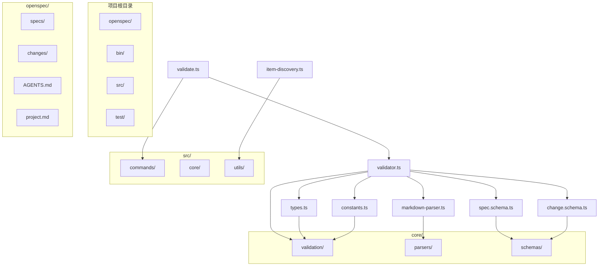
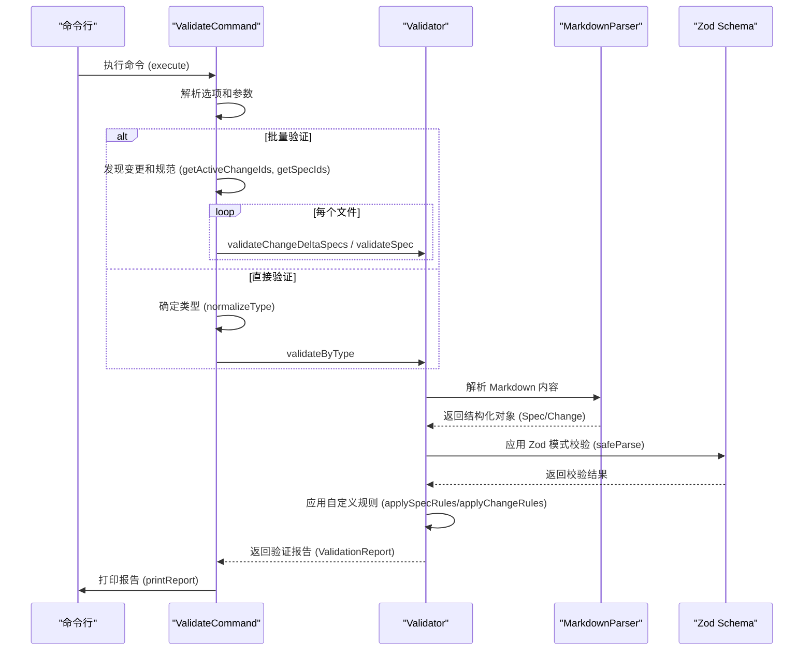
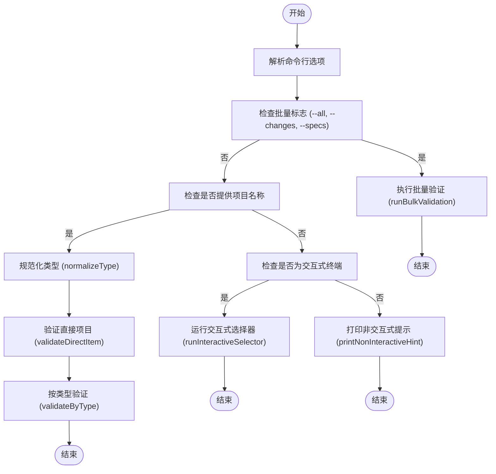
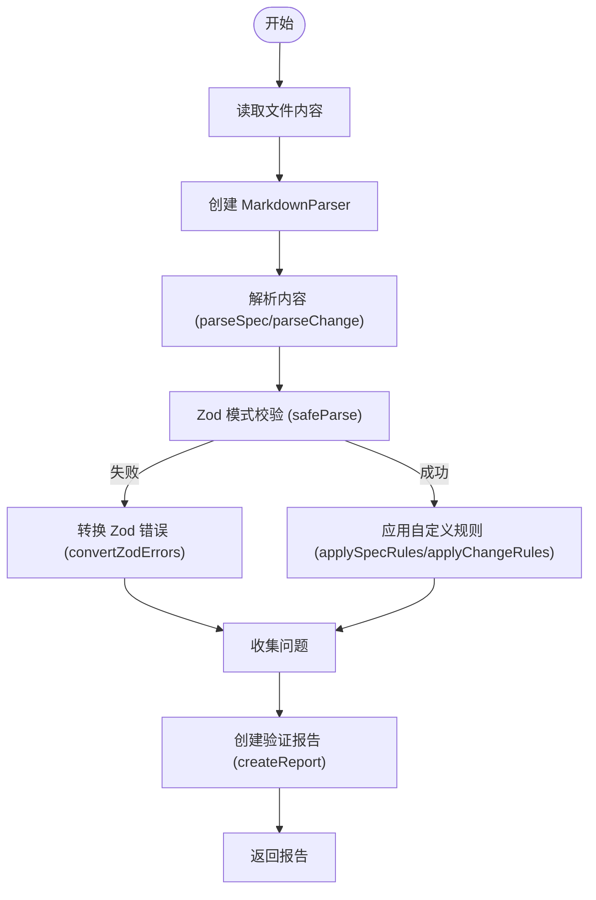
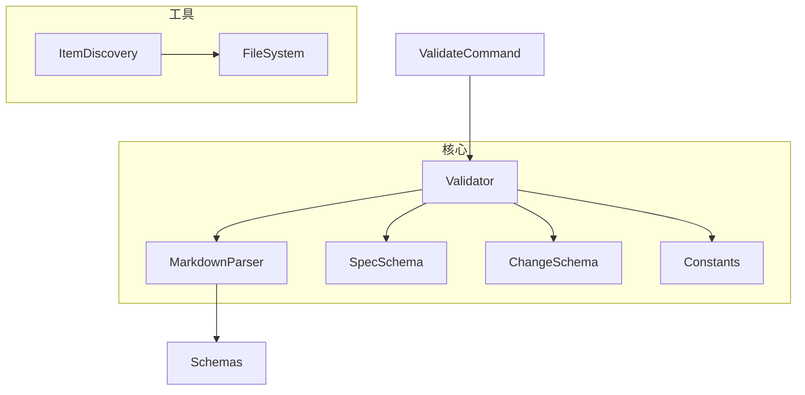

# validate 命令

<cite>
**本文档中引用的文件**  
- [validate.ts](file://src/commands/validate.ts)
- [validator.ts](file://src/core/validation/validator.ts)
- [types.ts](file://src/core/validation/types.ts)
- [constants.ts](file://src/core/validation/constants.ts)
- [markdown-parser.ts](file://src/core/parsers/markdown-parser.ts)
- [spec.schema.ts](file://src/core/schemas/spec.schema.ts)
- [change.schema.ts](file://src/core/schemas/change.schema.ts)
- [item-discovery.ts](file://src/utils/item-discovery.ts)
- [specs/cli-validate/spec.md](file://openspec/specs/cli-validate/spec.md)
</cite>

## 目录
1. [简介](#简介)
2. [项目结构](#项目结构)
3. [核心组件](#核心组件)
4. [架构概述](#架构概述)
5. [详细组件分析](#详细组件分析)
6. [依赖分析](#依赖分析)
7. [性能考虑](#性能考虑)
8. [故障排除指南](#故障排除指南)
9. [结论](#结论)

## 简介
`openspec validate` 命令是 OpenSpec 工具链中的核心验证工具，用于确保 `changes/` 和 `specs/` 目录下的所有 `.md` 文件符合 OpenSpec 规范。该命令通过多层次的验证流程，检查文件的结构、格式和内容规则，保证规范的一致性和完整性。它支持交互式和非交互式模式，能够批量验证变更和规范文件，并提供详细的验证报告。

## 项目结构
OpenSpec 项目的结构清晰地分离了当前规范（`specs/`）和变更提案（`changes/`）。`validate` 命令主要作用于这两个目录，通过解析 Markdown 文件并应用 Zod 模式和自定义规则来验证其内容。

**图示来源**
- [validate.ts](file://src/commands/validate.ts)
- [validator.ts](file://src/core/validation/validator.ts)
- [types.ts](file://src/core/validation/types.ts)
- [constants.ts](file://src/core/validation/constants.ts)
- [markdown-parser.ts](file://src/core/parsers/markdown-parser.ts)
- [spec.schema.ts](file://src/core/schemas/spec.schema.ts)
- [change.schema.ts](file://src/core/schemas/change.schema.ts)
- [item-discovery.ts](file://src/utils/item-discovery.ts)

## 核心组件
`validate` 命令的核心功能由 `ValidateCommand` 类和 `Validator` 类实现。`ValidateCommand` 负责处理命令行参数、用户交互和批量验证的调度，而 `Validator` 则专注于具体的验证逻辑，包括 Markdown 解析、Zod 模式校验和自定义规则检查。

**组件来源**
- [validate.ts](file://src/commands/validate.ts#L30-L306)
- [validator.ts](file://src/core/validation/validator.ts#L15-L449)

## 架构概述
`validate` 命令的架构遵循分层设计，从命令行接口到核心验证逻辑，各层职责分明。命令首先解析用户输入，然后根据模式（交互式、批量或直接）调用相应的验证方法。核心验证器使用 Markdown 解析器提取结构化数据，并通过 Zod 模式进行类型安全的校验，最后应用自定义业务规则。

**图示来源**
- [validate.ts](file://src/commands/validate.ts#L30-L306)
- [validator.ts](file://src/core/validation/validator.ts#L15-L449)
- [markdown-parser.ts](file://src/core/parsers/markdown-parser.ts#L1-L237)

## 详细组件分析

### ValidateCommand 分析
`ValidateCommand` 是 `validate` 命令的入口点，负责协调整个验证流程。它处理各种执行模式，包括批量验证、交互式选择和直接文件验证。

#### 执行流程

**图示来源**
- [validate.ts](file://src/commands/validate.ts#L30-L306)

**组件来源**
- [validate.ts](file://src/commands/validate.ts#L30-L306)

### Validator 分析
`Validator` 类是验证逻辑的核心，它实现了对规范和变更文件的深度验证。

#### 验证流程

**图示来源**
- [validator.ts](file://src/core/validation/validator.ts#L15-L449)

#### 自定义规则检查
`Validator` 应用一系列自定义规则来确保内容符合业务要求：
- **规范文件规则**:
  - `Purpose` 部分长度不少于 50 个字符（警告）
  - 每个需求必须包含至少一个场景（警告）
  - 需求文本长度超过 500 个字符时发出信息提示
- **变更文件规则**:
  - `Why` 部分长度在 50-1000 字符之间
  - 每个 `delta` 的描述不应过短（警告）
  - `ADDED` 或 `MODIFIED` 操作应包含需求（警告）

这些规则在 `applySpecRules` 和 `applyChangeRules` 方法中实现。

**组件来源**
- [validator.ts](file://src/core/validation/validator.ts#L288-L345)
- [constants.ts](file://src/core/validation/constants.ts#L5-L49)

## 依赖分析
`validate` 命令的依赖关系清晰，遵循单一职责原则。`ValidateCommand` 依赖于 `Validator` 进行核心验证，而 `Validator` 又依赖于 `MarkdownParser` 和 Zod 模式进行解析和校验。

**图示来源**
- [validate.ts](file://src/commands/validate.ts)
- [validator.ts](file://src/core/validation/validator.ts)
- [markdown-parser.ts](file://src/core/parsers/markdown-parser.ts)
- [spec.schema.ts](file://src/core/schemas/spec.schema.ts)
- [change.schema.ts](file://src/core/schemas/change.schema.ts)
- [constants.ts](file://src/core/validation/constants.ts)
- [item-discovery.ts](file://src/utils/item-discovery.ts)

## 性能考虑
`validate` 命令在批量验证时采用了并发处理机制，以提高效率。通过 `concurrency` 选项或 `OPENSPEC_CONCURRENCY` 环境变量可以控制并发数，默认值为 6。这允许同时验证多个文件，充分利用系统资源。

## 故障排除指南
当 `validate` 命令失败时，通常会提供明确的错误信息和解决建议。常见问题包括：

- **YAML frontmatter 格式错误**: 确保 YAML 前置内容语法正确，没有缩进错误。
- **缺失的 `tasks.md`**: 虽然 `validate` 命令主要关注 `specs/` 目录，但完整的变更应包含 `tasks.md`。如果 AI 工具未生成此文件，可手动创建或提示 AI 补充。
- **Delta 格式错误**: 确保变更目录下的 `specs/` 子目录中包含正确的 Delta 标题，如 `## ADDED Requirements`。
- **缺少必要部分**: 规范文件必须包含 `## Purpose` 和 `## Requirements` 部分，变更文件必须包含 `## Why` 和 `## What Changes` 部分。

使用 `--json` 选项可以获取结构化的验证报告，便于调试和自动化处理。

**组件来源**
- [validate.ts](file://src/commands/validate.ts#L168-L181)
- [validator.ts](file://src/core/validation/validator.ts#L347-L359)

## 结论
`openspec validate` 命令是确保 OpenSpec 项目质量和一致性的关键工具。它通过结合 Zod 模式校验和自定义业务规则，提供了强大而灵活的验证能力。`--strict` 模式将警告升级为错误，适用于 CI/CD 环境，确保只有完全合规的变更才能通过。该命令的设计充分考虑了用户体验，提供了清晰的输出和实用的故障排除建议。