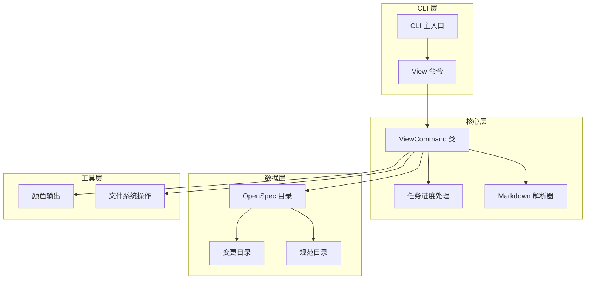
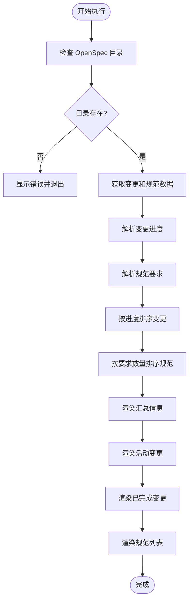
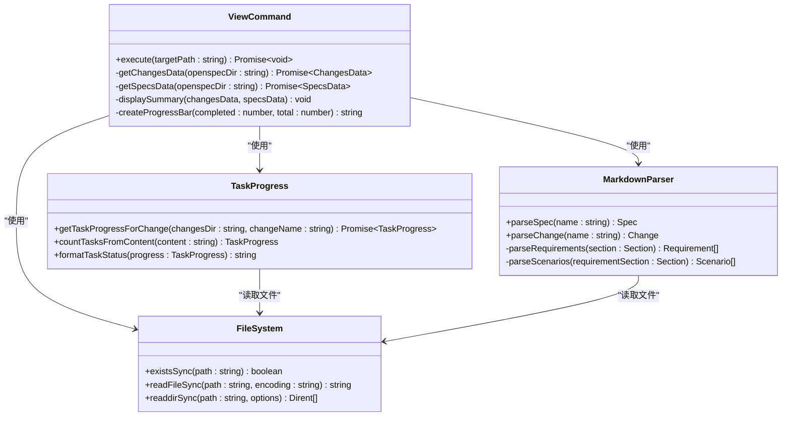
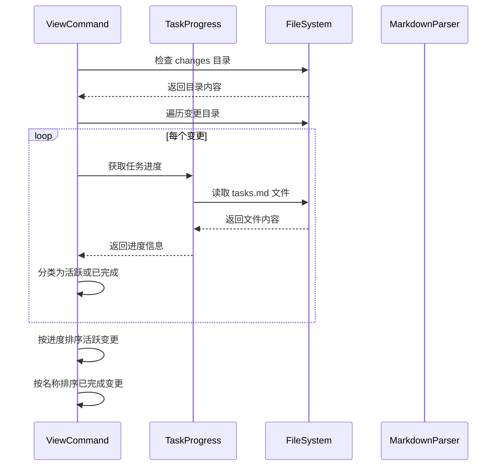
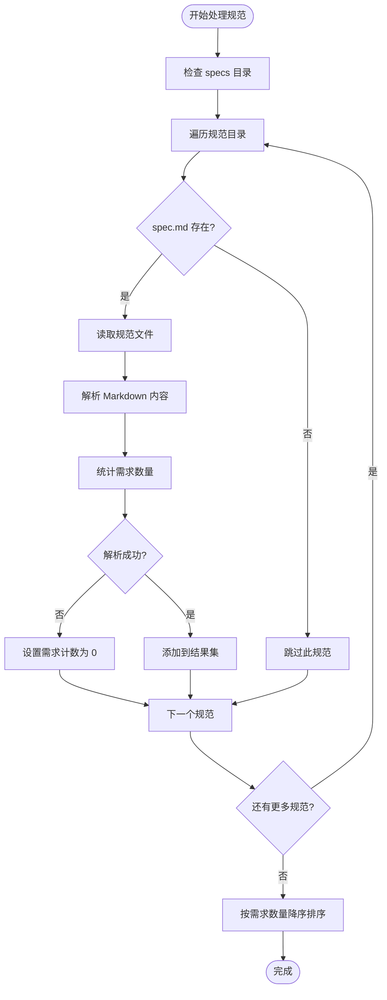
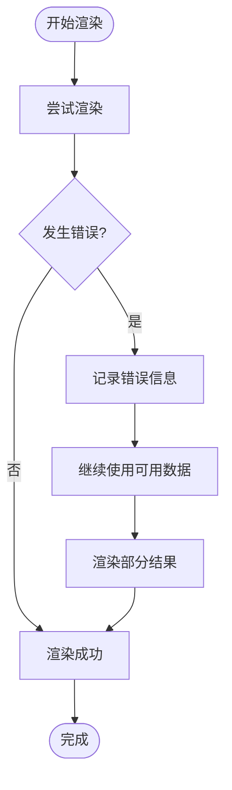
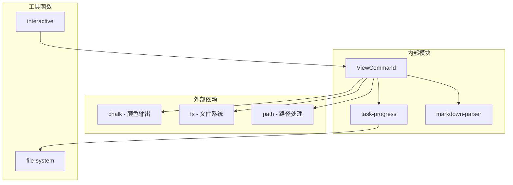

# view 命令

<cite>
**本文档中引用的文件**
- [src/core/view.ts](file://src/core/view.ts)
- [openspec/specs/cli-view/spec.md](file://openspec/specs/cli-view/spec.md)
- [src/utils/task-progress.ts](file://src/utils/task-progress.ts)
- [src/core/parsers/markdown-parser.ts](file://src/core/parsers/markdown-parser.ts)
- [src/cli/index.ts](file://src/cli/index.ts)
- [test/core/view.test.ts](file://test/core/view.test.ts)
- [src/utils/interactive.ts](file://src/utils/interactive.ts)
- [openspec/changes/archive/2025-09-12-add-view-dashboard-command/specs/cli-view/spec.md](file://openspec/changes/archive/2025-09-12-add-view-dashboard-command/specs/cli-view/spec.md)
</cite>

## 目录
1. [简介](#简介)
2. [项目结构](#项目结构)
3. [核心组件](#核心组件)
4. [架构概览](#架构概览)
5. [详细组件分析](#详细组件分析)
6. [依赖关系分析](#依赖关系分析)
7. [性能考虑](#性能考虑)
8. [故障排除指南](#故障排除指南)
9. [结论](#结论)

## 简介

`openspec view` 命令是一个交互式的终端仪表板，为 OpenSpec 项目提供了一个统一的可视化概览界面。该命令整合了项目的状态信息，包括活动变更、已完成变更和规范列表，通过直观的进度条和颜色编码系统帮助开发者快速了解项目整体状态。

该命令的核心价值在于：
- 提供项目状态的实时概览
- 按进度排序活动变更，便于优先级管理
- 统一显示所有项目元素，避免分散在多个命令中
- 使用交互式界面增强用户体验

## 项目结构

**图表来源**
- [src/cli/index.ts](file://src/cli/index.ts#L108-L118)
- [src/core/view.ts](file://src/core/view.ts#L1-L189)

**章节来源**
- [src/core/view.ts](file://src/core/view.ts#L1-L189)
- [src/cli/index.ts](file://src/cli/index.ts#L108-L118)

## 核心组件

### ViewCommand 类

`ViewCommand` 是 `openspec view` 命令的核心实现类，负责协调整个仪表板的渲染过程。该类提供了以下关键功能：

- **项目初始化检查**：验证是否存在有效的 OpenSpec 目录
- **数据收集**：从项目结构中提取变更和规范信息
- **进度计算**：基于任务文件计算变更完成百分比
- **格式化输出**：使用颜色和符号创建视觉化的仪表板

### 数据处理管道

**图表来源**
- [src/core/view.ts](file://src/core/view.ts#L8-L69)

**章节来源**
- [src/core/view.ts](file://src/core/view.ts#L7-L189)

## 架构概览

`openspec view` 命令采用模块化架构设计，将不同功能分离到独立的模块中：

**图表来源**
- [src/core/view.ts](file://src/core/view.ts#L7-L189)
- [src/utils/task-progress.ts](file://src/utils/task-progress.ts#L1-L44)
- [src/core/parsers/markdown-parser.ts](file://src/core/parsers/markdown-parser.ts#L1-L237)

## 详细组件分析

### 变更数据处理

变更数据处理是仪表板的核心功能之一，负责从项目结构中提取和处理变更信息：

**图表来源**
- [src/core/view.ts](file://src/core/view.ts#L71-L109)
- [src/utils/task-progress.ts](file://src/utils/task-progress.ts#L27-L34)

#### 进度排序算法

仪表板实现了智能的变更排序算法，确保用户能够快速识别需要关注的项目：

| 排序规则 | 描述 | 实现位置 |
|---------|------|----------|
| 完成百分比升序 | 0% 的变更优先显示，便于识别新启动的项目 | [src/core/view.ts](file://src/core/view.ts#L98-L106) |
| 字母顺序降级 | 当完成百分比相同时，按变更名称字母顺序排列 | [src/core/view.ts](file://src/core/view.ts#L105-L106) |
| 缺失进度处理 | 将缺失进度视为 0% 进行排序 | [src/core/view.ts](file://src/core/view.ts#L100-L101) |

### 规范数据处理

规范数据处理负责从项目中提取规范信息并进行统计：

**图表来源**
- [src/core/view.ts](file://src/core/view.ts#L112-L141)
- [src/core/parsers/markdown-parser.ts](file://src/core/parsers/markdown-parser.ts#L24-L48)

### 进度条渲染系统

仪表板使用 Unicode 字符创建美观的进度条，提供直观的视觉反馈：

| 符号类型 | Unicode 字符 | 颜色代码 | 用途 |
|---------|-------------|----------|------|
| 完成部分 | `█` | 绿色 | 表示已完成的任务 |
| 未完成部分 | `░` | 淡灰色 | 表示待完成的任务 |
| 边框线 | `─` | 淡灰色 | 用于空进度条的占位符 |

**章节来源**
- [src/core/view.ts](file://src/core/view.ts#L177-L188)

### 错误处理机制

仪表板实现了健壮的错误处理机制，确保即使在部分数据损坏的情况下仍能提供有用的信息：

**图表来源**
- [src/core/view.ts](file://src/core/view.ts#L133-L136)

**章节来源**
- [src/core/view.ts](file://src/core/view.ts#L133-L136)

## 依赖关系分析

`openspec view` 命令的依赖关系体现了清晰的分层架构：

**图表来源**
- [src/core/view.ts](file://src/core/view.ts#L1-L6)
- [src/cli/index.ts](file://src/cli/index.ts#L108-L118)

**章节来源**
- [src/core/view.ts](file://src/core/view.ts#L1-L6)
- [src/cli/index.ts](file://src/cli/index.ts#L108-L118)

## 性能考虑

### 异步数据加载

仪表板采用异步数据加载策略，避免阻塞用户界面：

- **并行处理**：变更数据和规范数据同时加载
- **流式处理**：逐个处理项目，避免内存峰值
- **缓存机制**：重复访问相同数据时使用缓存

### 渲染优化

- **延迟渲染**：仅在有数据时才渲染相应部分
- **条件输出**：空状态不显示标题栏
- **字符优化**：使用单字节字符减少输出大小

## 故障排除指南

### 常见问题及解决方案

#### 1. 交互式界面无响应

**症状**：运行 `openspec view` 后界面冻结，无法输入任何指令

**原因**：终端兼容性问题或环境变量配置错误

**解决方案**：
- 检查终端是否支持 TTY 模式：`echo $TERM`
- 设置环境变量：`export OPEN_SPEC_INTERACTIVE=1`
- 使用非交互模式：`openspec view --no-interactive`

#### 2. 项目目录未找到

**症状**：显示 "No openspec directory found" 错误

**原因**：当前目录不是 OpenSpec 项目根目录

**解决方案**：
- 确保在项目根目录下运行命令
- 检查是否存在 `openspec/` 目录
- 使用绝对路径：`openspec view /path/to/project`

#### 3. 规范解析失败

**症状**：某些规范显示为 0 个需求

**原因**：规范文件格式不正确或包含无效 Markdown

**解决方案**：
- 检查规范文件的 Markdown 格式
- 确保文件包含有效的 "Requirements" 部分
- 验证文件编码为 UTF-8

#### 4. 进度显示异常

**症状**：进度条显示不正确或百分比计算错误

**原因**：任务文件格式不符合预期

**解决方案**：
- 检查 `tasks.md` 文件格式
- 确保任务行以 `- [ ]` 或 `- [x]` 开头
- 验证任务文件编码

### 调试技巧

1. **启用详细输出**：使用调试标志查看详细日志
2. **检查文件权限**：确保对项目文件具有读取权限
3. **验证数据完整性**：检查项目结构是否符合 OpenSpec 规范

**章节来源**
- [src/utils/interactive.ts](file://src/utils/interactive.ts#L1-L5)
- [src/core/view.ts](file://src/core/view.ts#L11-L14)

## 结论

`openspec view` 命令代表了 OpenSpec 项目管理工具的重要创新，它不仅仅是一个简单的命令，而是一个精心设计的项目状态仪表板。通过整合变更管理和规范管理功能，它为开发者提供了一个统一的项目概览界面。

该命令的主要优势包括：

- **统一视图**：在一个界面中同时查看变更和规范状态
- **智能排序**：按进度优先级组织信息，提高工作效率
- **可视化反馈**：使用颜色和进度条提供直观的状态指示
- **健壮性**：完善的错误处理确保在各种情况下都能提供有用信息

随着 OpenSpec 生态系统的不断发展，`openspec view` 命令将继续演进，为项目管理提供更加智能化和人性化的体验。对于希望深入了解项目状态的开发者来说，这个命令无疑是一个不可或缺的工具。