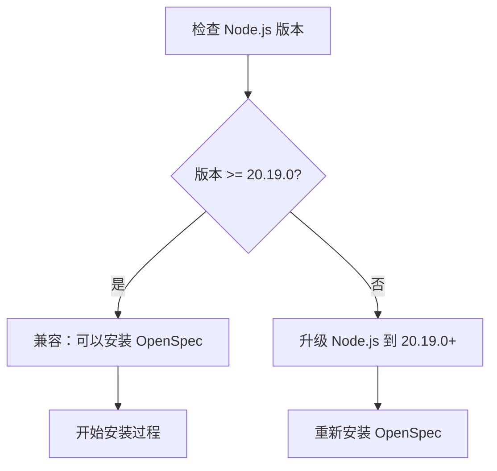
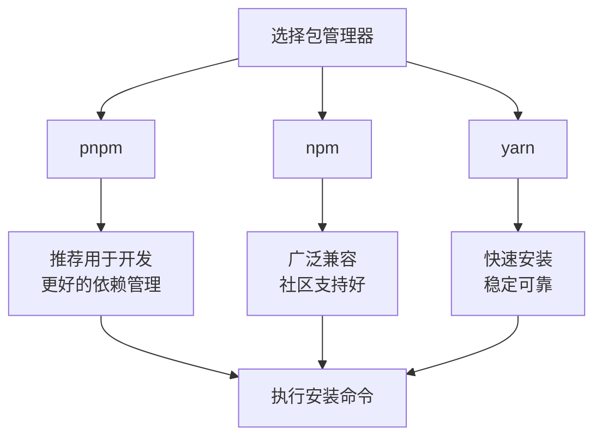
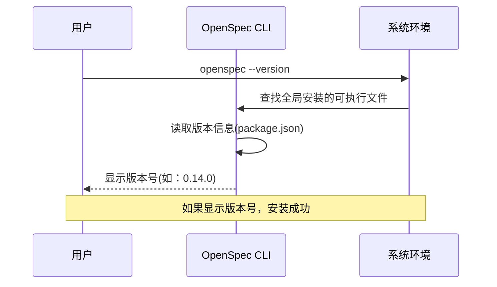
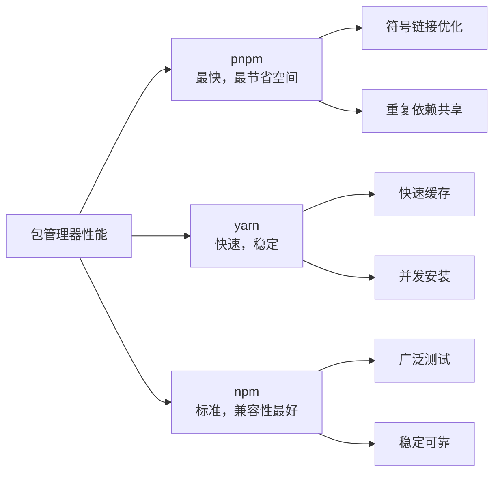
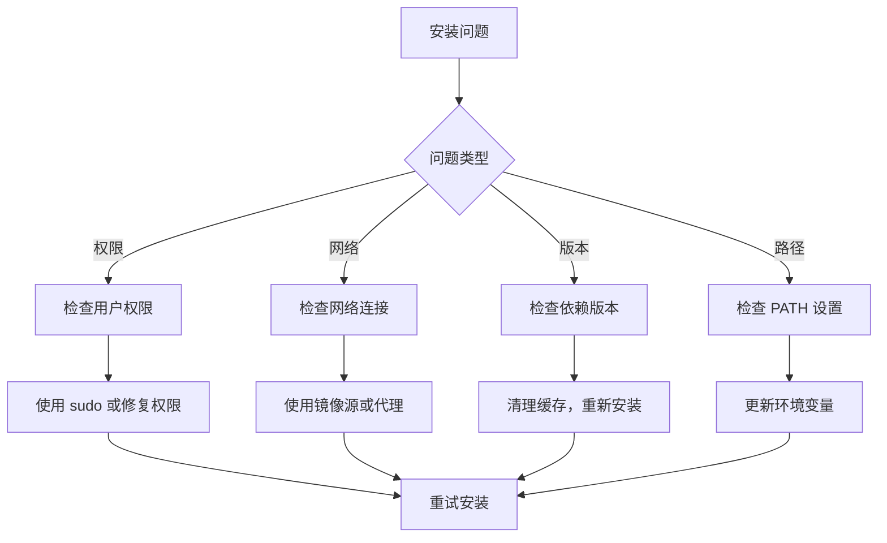
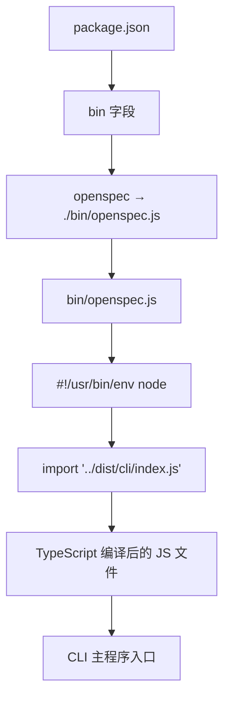
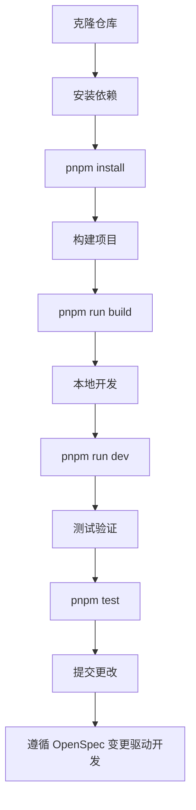

# 安装指南

<cite>
**本文档中引用的文件**
- [package.json](file://package.json)
- [bin/openspec.js](file://bin/openspec.js)
- [README.md](file://README.md)
- [build.js](file://build.js)
- [tsconfig.json](file://tsconfig.json)
- [src/cli/index.ts](file://src/cli/index.ts)
- [vitest.config.ts](file://vitest.config.ts)
- [vitest.setup.ts](file://vitest.setup.ts)
- [test/helpers/run-cli.ts](file://test/helpers/run-cli.ts)
</cite>

## 目录
1. [系统要求](#系统要求)
2. [包管理器选择](#包管理器选择)
3. [全局安装方法](#全局安装方法)
4. [安装验证](#安装验证)
5. [包管理器差异对比](#包管理器差异对比)
6. [故障排除](#故障排除)
7. [CLI可执行文件机制](#cli可执行文件机制)
8. [开发环境设置](#开发环境设置)

## 系统要求

### Node.js 版本要求
OpenSpec CLI 需要 **Node.js 版本 20.19.0 或更高版本**。这是项目在 `package.json` 中明确指定的引擎要求。



**验证方法：**
```bash
node --version
```

### pnpm 版本要求
虽然项目主要使用 pnpm 进行开发和构建，但安装时需要的是 Node.js 环境本身，而不是特定的 pnpm 版本。不过，建议使用 pnpm 9+ 以获得最佳体验。

**节源**
- [package.json](file://package.json#L55-L57)

## 包管理器选择

OpenSpec CLI 支持多种包管理器进行全局安装，每种都有其特点和适用场景：

### 主要支持的包管理器
1. **pnpm** - 推荐用于开发环境
2. **npm** - 广泛兼容性
3. **yarn** - 社区广泛使用



## 全局安装方法

### 使用 pnpm 安装

```bash
# 安装最新版本
pnpm install -g @fission-ai/openspec@latest

# 指定特定版本
pnpm install -g @fission-ai/openspec@0.14.0
```

### 使用 npm 安装

```bash
# 安装最新版本
npm install -g @fission-ai/openspec@latest

# 指定特定版本
npm install -g @fission-ai/openspec@0.14.0
```

### 使用 yarn 安装

```bash
# 安装最新版本
yarn global add @fission-ai/openspec@latest

# 指定特定版本
yarn global add @fission-ai/openspec@0.14.0
```

### 安装命令详解

每个安装命令都包含以下组件：
- `-g` 或 `global`：全局安装标志
- `@fission-ai/openspec`：包名称
- `@latest` 或具体版本号：版本标识

**节源**
- [package.json](file://package.json#L1-L74)

## 安装验证

### 验证安装是否成功

安装完成后，通过以下命令验证 OpenSpec CLI 是否正确安装：

```bash
openspec --version
```

**预期输出示例：**
```
0.14.0
```

### 验证安装的完整流程



**图表源**
- [src/cli/index.ts](file://src/cli/index.ts#L18-L24)

### 常见验证问题

1. **命令未找到**：检查 PATH 环境变量
2. **版本不匹配**：重新安装或清理缓存
3. **权限问题**：使用管理员权限或修复 npm/pnpm/yarn 配置

## 包管理器差异对比

### 功能特性对比

| 特性 | pnpm | npm | yarn |
|------|------|-----|------|
| **安装速度** | 快 | 中等 | 快 |
| **磁盘空间** | 高效共享存储 | 标准 | 中等 |
| **依赖解析** | 更快更精确 | 标准 | 快速 |
| **生态系统支持** | 良好 | 最佳 | 良好 |
| **开发体验** | 优秀 | 良好 | 良好 |

### 性能影响对比



### 选择建议

- **开发团队**：优先选择 pnpm，获得最佳性能和依赖管理
- **生产部署**：npm 提供最佳兼容性和稳定性
- **企业环境**：yarn 提供稳定的长期支持

## 故障排除

### 常见安装问题及解决方案

#### 1. 权限错误

**问题症状：**
```
Error: EACCES: permission denied, access '/usr/local/lib/node_modules'
```

**解决方案：**

```bash
# 方法1：使用 sudo（不推荐）
sudo npm install -g @fission-ai/openspec@latest

# 方法2：修复 npm 权限（推荐）
mkdir ~/.npm-global
npm config set prefix '~/.npm-global'
export PATH=~/.npm-global/bin:$PATH
source ~/.bashrc

# 方法3：使用 nvm 管理 Node.js
nvm install --lts
nvm use --lts
npm install -g @fission-ai/openspec@latest
```

#### 2. 网络连接问题

**问题症状：**
```
npm ERR! network request to https://registry.npmjs.org/@fission-ai/openspec failed
```

**解决方案：**

```bash
# 使用国内镜像源
npm config set registry https://registry.npmmirror.com/

# 或使用 cnpm
cnpm install -g @fission-ai/openspec@latest

# 或使用 pnpm 的镜像
pnpm config set registry https://registry.npmmirror.com/
```

#### 3. 版本冲突

**问题症状：**
```
npm ERR! peer dep missing: typescript@^5.x, required by @fission-ai/openspec@0.14.0
```

**解决方案：**

```bash
# 清理 npm 缓存
npm cache clean --force

# 卸载旧版本
npm uninstall -g @fission-ai/openspec

# 强制重新安装
npm install -g @fission-ai/openspec@latest --force
```

#### 4. 可执行文件路径问题

**问题症状：**
```
openspec: command not found
```

**解决方案：**

```bash
# 检查可执行文件位置
which openspec

# 手动添加到 PATH
export PATH=$(npm bin -g):$PATH

# 或永久添加到 shell 配置
echo 'export PATH=$(npm bin -g):$PATH' >> ~/.bashrc
source ~/.bashrc
```

### 调试工具和技巧



## CLI可执行文件机制

### bin 字段配置

OpenSpec CLI 通过 `package.json` 中的 `bin` 字段定义可执行文件：

```json
{
  "bin": {
    "openspec": "./bin/openspec.js"
  }
}
```

这个配置告诉 npm 将 `./bin/openspec.js` 文件链接到系统的可执行路径，命名为 `openspec`。

### 可执行文件结构



**图表源**
- [package.json](file://package.json#L29-L31)
- [bin/openspec.js](file://bin/openspec.js#L1-L3)

### 构建过程

CLI 可执行文件的生成经历以下步骤：

1. **TypeScript 编译**：将 `src/cli/index.ts` 编译为 JavaScript
2. **文件打包**：生成 `dist/cli/index.js`
3. **可执行文件创建**：通过 `bin/openspec.js` 引导加载
4. **全局链接**：npm/pnpm/yarn 创建系统级可执行文件

**节源**
- [build.js](file://build.js#L1-L32)
- [tsconfig.json](file://tsconfig.json#L1-L21)

### 跨平台兼容性

可执行文件设计考虑了跨平台兼容性：

- **Shebang 行**：`#!/usr/bin/env node` 确保使用正确的 Node.js 解释器
- **模块导入**：使用 ES 模块语法确保兼容性
- **路径处理**：相对路径确保部署一致性

## 开发环境设置

### 本地开发安装

对于希望参与 OpenSpec 开发的贡献者：

```bash
# 克隆仓库
git clone https://github.com/Fission-AI/OpenSpec.git
cd OpenSpec

# 安装依赖
pnpm install

# 构建项目
pnpm run build

# 在本地测试
pnpm run dev:cli -- --version
```

### 开发工作流程



**节源**
- [README.md](file://README.md#L361-L367)
- [vitest.config.ts](file://vitest.config.ts#L1-L26)

### 测试和验证

项目包含完整的测试套件，确保安装和功能正常：

```bash
# 运行所有测试
pnpm test

# 开发模式测试
pnpm run test:watch

# 代码覆盖率
pnpm run test:coverage
```

**节源**
- [vitest.setup.ts](file://vitest.setup.ts#L1-L6)
- [test/helpers/run-cli.ts](file://test/helpers/run-cli.ts#L56-L112)

### TypeScript 配置

项目使用严格的 TypeScript 配置确保代码质量：

- **目标版本**：ES2022
- **模块系统**：NodeNext
- **严格模式**：启用所有严格检查
- **声明文件**：自动生成类型定义

**节源**
- [tsconfig.json](file://tsconfig.json#L2-L18)

## 总结

OpenSpec CLI 提供了灵活多样的安装方式，支持主流的包管理器和操作系统。通过本指南，您可以：

1. **正确设置系统要求**：确保 Node.js 版本符合要求
2. **选择合适的包管理器**：根据需求选择 pnpm、npm 或 yarn
3. **完成全局安装**：使用推荐的安装命令
4. **验证安装结果**：通过版本检查确认安装成功
5. **解决常见问题**：应对权限、网络和版本冲突问题
6. **理解技术机制**：了解可执行文件的创建和链接过程

无论您是个人开发者还是企业团队，都可以根据本指南轻松安装和使用 OpenSpec CLI，开启规范驱动的 AI 辅助开发之旅。