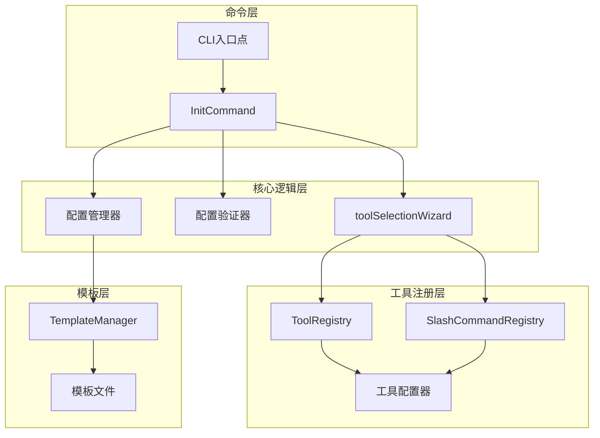
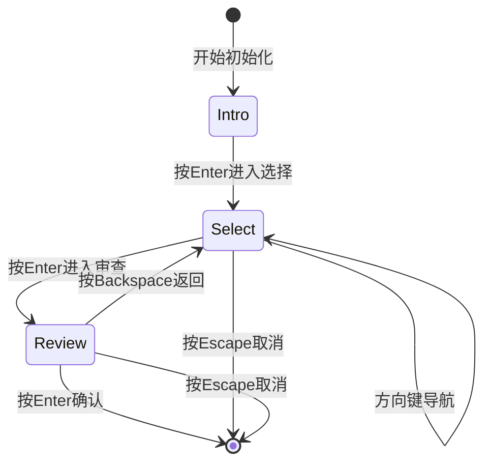
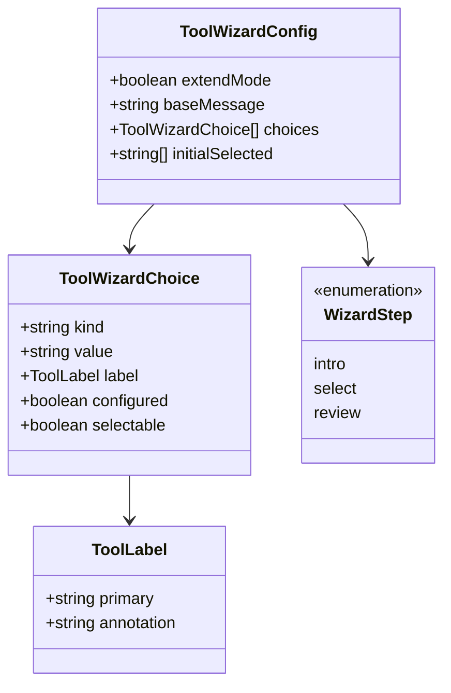
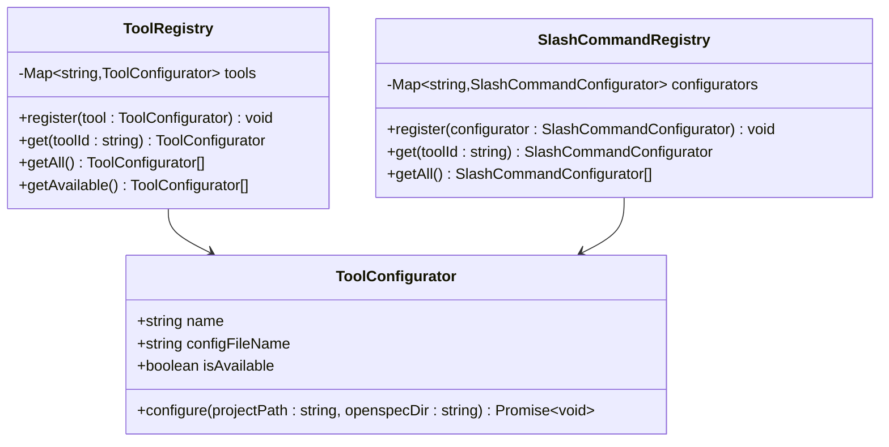
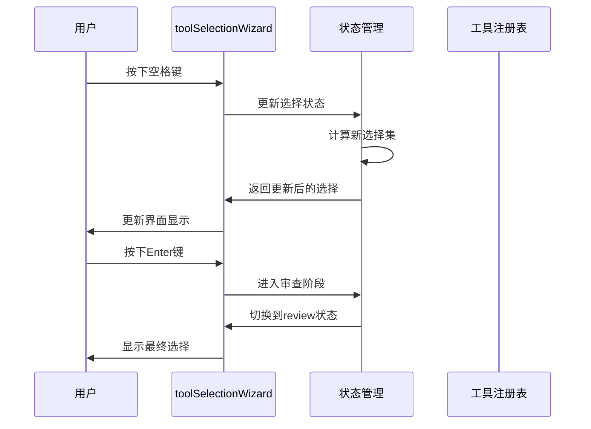

# 交互式初始化

<cite>
**本文档中引用的文件**
- [src/core/init.ts](file://src/core/init.ts)
- [src/cli/index.ts](file://src/cli/index.ts)
- [src/utils/interactive.ts](file://src/utils/interactive.ts)
- [src/core/config.ts](file://src/core/config.ts)
- [src/core/configurators/registry.ts](file://src/core/configurators/registry.ts)
- [src/core/configurators/slash/registry.ts](file://src/core/configurators/slash/registry.ts)
- [src/core/configurators/base.ts](file://src/core/configurators/base.ts)
- [src/core/configurators/claude.ts](file://src/core/configurators/claude.ts)
- [src/core/templates/index.ts](file://src/core/templates/index.ts)
- [test/core/init.test.ts](file://test/core/init.test.ts)
</cite>

## 目录
1. [简介](#简介)
2. [系统架构概览](#系统架构概览)
3. [交互式初始化流程](#交互式初始化流程)
4. [工具选择界面实现](#工具选择界面实现)
5. [工具注册机制](#工具注册机制)
6. [选择队列处理机制](#选择队列处理机制)
7. [异常处理策略](#异常处理策略)
8. [常见问题排查](#常见问题排查)
9. [总结](#总结)

## 简介

OpenSpec的交互式初始化功能为用户提供了一个直观的向导式界面，用于选择和配置AI工具。该功能基于`@inquirer/prompts`库构建，提供了多选界面、键盘导航和实时反馈等现代化用户体验。

核心特性包括：
- 基于`@inquirer/prompts`的多选界面
- 工具可用性检测和状态标识
- 分步骤的配置流程（介绍 → 选择 → 审查）
- 异常处理和用户中断保护
- 动态工具列表生成

## 系统架构概览

交互式初始化系统采用模块化设计，主要组件包括：

**图表来源**
- [src/cli/index.ts](file://src/cli/index.ts#L40-L74)
- [src/core/init.ts](file://src/core/init.ts#L376-L383)

## 交互式初始化流程

### 流程阶段划分

交互式初始化分为三个清晰的阶段：

**图表来源**
- [src/core/init.ts](file://src/core/init.ts#L101-L264)

### 阶段详细说明

#### 1. 介绍阶段（Intro）
- 显示欢迎横幅和项目信息
- 根据是否为扩展模式显示不同消息
- 用户按Enter键进入选择阶段

#### 2. 选择阶段（Select）
- 显示可选的AI工具列表
- 支持键盘导航：↑/↓移动光标
- 支持多选操作：空格键切换选择
- 支持单选操作：Enter键选择当前高亮项
- 支持取消操作：Escape键清空选择

#### 3. 审查阶段（Review）
- 显示最终选择结果
- 提供确认或修改选项
- 按Enter确认配置
- 按Backspace/Escape返回上一步

**章节来源**
- [src/core/init.ts](file://src/core/init.ts#L296-L367)

## 工具选择界面实现

### 多选界面设计

工具选择界面基于`@inquirer/prompts`的`createPrompt`函数构建，实现了复杂的交互逻辑：

**图表来源**
- [src/core/init.ts](file://src/core/init.ts#L67-L98)

### 界面元素构成

#### 1. 工具分类显示
- **原生支持提供商**：标记为"✔ OpenSpec custom slash commands available"
- **其他工具**：标记为"always available"
- **分隔符**：视觉分隔不同类别

#### 2. 状态指示器
- ✗ ○：未选择状态
- ✔ ◉：已选择状态  
- (already configured)：已配置状态标识

#### 3. 键盘快捷键提示
- ↑/↓：移动光标
- Space：切换选择
- Enter：确认选择/进入审查
- Escape：取消操作

**章节来源**
- [src/core/init.ts](file://src/core/init.ts#L574-L630)

## 工具注册机制

### ToolRegistry 动态生成

工具注册系统负责管理和动态生成支持的AI工具列表：

**图表来源**
- [src/core/configurators/registry.ts](file://src/core/configurators/registry.ts#L1-L46)
- [src/core/configurators/slash/registry.ts](file://src/core/configurators/slash/registry.ts#L19-L69)

### 支持的AI工具列表

系统支持以下AI工具：

| 工具名称 | 值 | 可用性 | 特殊功能 |
|---------|-----|--------|----------|
| Auggie (Augment CLI) | auggie | ✅ 可用 | 自定义指令支持 |
| Claude Code | claude | ✅ 可用 | 专用配置文件 |
| Cline | cline | ✅ 可用 | CLI集成 |
| CodeBuddy Code (CLI) | codebuddy | ✅ 可用 | 团队协作 |
| CoStrict | costrict | ✅ 可用 | 代码规范 |
| Crush | crush | ✅ 可用 | 快速开发 |
| Cursor | cursor | ✅ 可用 | 编辑器集成 |
| Factory Droid | factory | ✅ 可用 | 自动化 |
| OpenCode | opencode | ✅ 可用 | 开源项目 |
| Kilo Code | kilocode | ✅ 可用 | 性能优化 |
| Qoder (CLI) | qoder | ✅ 可用 | 查询工具 |
| Windsurf | windsurf | ✅ 可用 | 文件导航 |
| Codex | codex | ✅ 可用 | 全局指令 |
| GitHub Copilot | github-copilot | ✅ 可用 | 微软集成 |
| Amazon Q Developer | amazon-q | ✅ 可用 | AWS集成 |
| Qwen Code | qwen | ✅ 可用 | 阿里云集成 |
| AGENTS.md | agents | ❌ 不可用 | 通用兼容 |

**章节来源**
- [src/core/config.ts](file://src/core/config.ts#L19-L37)

## 选择队列处理机制

### 状态管理

选择队列通过React Hook模式实现状态管理：

**图表来源**
- [src/core/init.ts](file://src/core/init.ts#L101-L131)

### 选择算法

选择队列的核心算法包括：

1. **初始状态设置**：根据现有配置预选工具
2. **状态更新**：使用Set数据结构维护选择状态
3. **顺序保持**：确保选择顺序与界面显示一致
4. **边界检查**：防止无效选择操作

**章节来源**
- [src/core/init.ts](file://src/core/init.ts#L126-L131)

## 异常处理策略

### 用户中断处理

系统实现了多层次的异常处理机制：

**图表来源**
- [src/core/init.ts](file://src/core/init.ts#L385-L460)

### 具体异常类型

#### 1. 权限不足
- **触发条件**：目标目录无写权限
- **处理方式**：抛出明确的权限错误信息
- **用户提示**：建议检查目录权限

#### 2. 工具选择无效
- **触发条件**：选择了不存在的工具
- **处理方式**：显示可用工具列表
- **用户提示**：提供正确的工具名称

#### 3. 网络连接问题
- **触发条件**：工具配置需要网络访问
- **处理方式**：提供离线配置选项
- **用户提示**：说明网络要求

**章节来源**
- [src/core/init.ts](file://src/core/init.ts#L462-L472)
- [test/core/init.test.ts](file://test/core/init.test.ts#L1423-L1447)

## 常见问题排查

### 无法渲染选择界面

**症状**：界面无法正常显示或响应

**可能原因**：
1. 终端不支持TTY模式
2. @inquirer/prompts依赖缺失
3. 终端编码问题

**解决方案**：
1. 检查终端是否支持TTY：`echo $TERM`
2. 验证依赖安装：`pnpm list @inquirer/prompts`
3. 设置环境变量：`export OPEN_SPEC_INTERACTIVE=1`

### 工具选择无效

**症状**：选择特定工具后无响应或报错

**排查步骤**：
1. 检查工具可用性：确认工具在AI_TOOLS列表中
2. 验证配置文件：检查对应配置文件是否存在
3. 查看日志输出：启用详细日志记录

**章节来源**
- [src/utils/interactive.ts](file://src/utils/interactive.ts#L1-L8)

### 配置文件冲突

**症状**：已有配置文件被覆盖或损坏

**预防措施**：
1. 使用扩展模式而非全新初始化
2. 备份重要配置文件
3. 检查文件权限设置

## 总结

OpenSpec的交互式初始化功能通过精心设计的架构和完善的异常处理，为用户提供了流畅的工具配置体验。其核心优势包括：

### 技术亮点
- **模块化设计**：清晰的职责分离和可扩展的架构
- **用户体验**：直观的多选界面和实时反馈
- **健壮性**：全面的异常处理和用户中断保护
- **灵活性**：支持非交互模式和批量配置

### 最佳实践
- 使用工具注册机制动态管理支持的AI工具
- 实现状态管理确保选择队列的一致性
- 提供清晰的错误信息和用户指导
- 支持多种交互模式满足不同使用场景

该系统为OpenSpec项目的工具配置提供了标准化、用户友好的解决方案，是现代CLI应用设计的优秀范例。