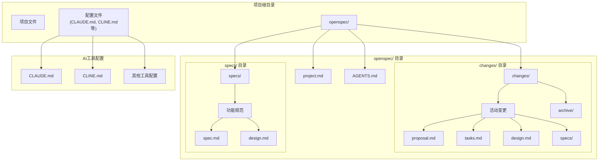
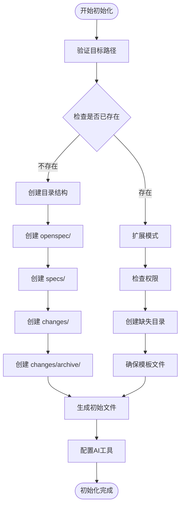
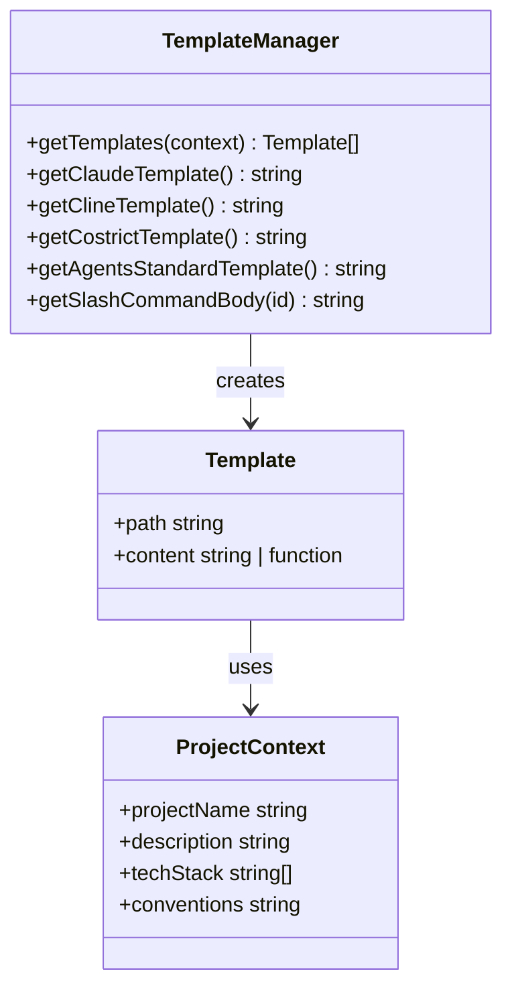
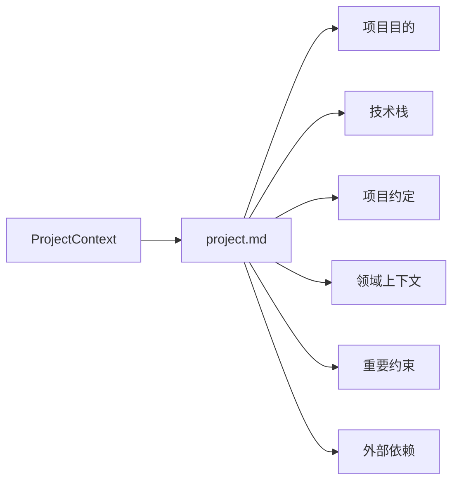
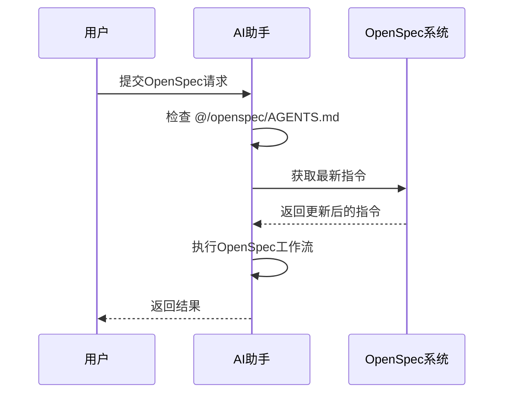
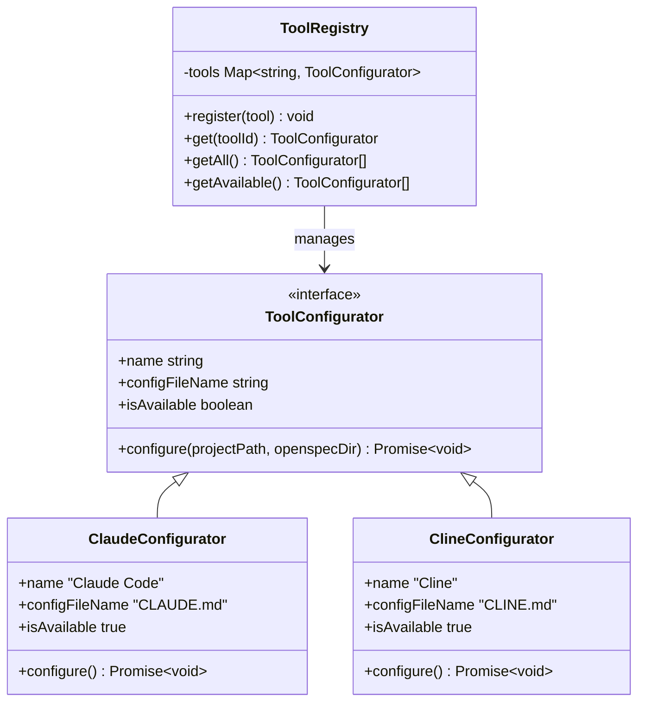
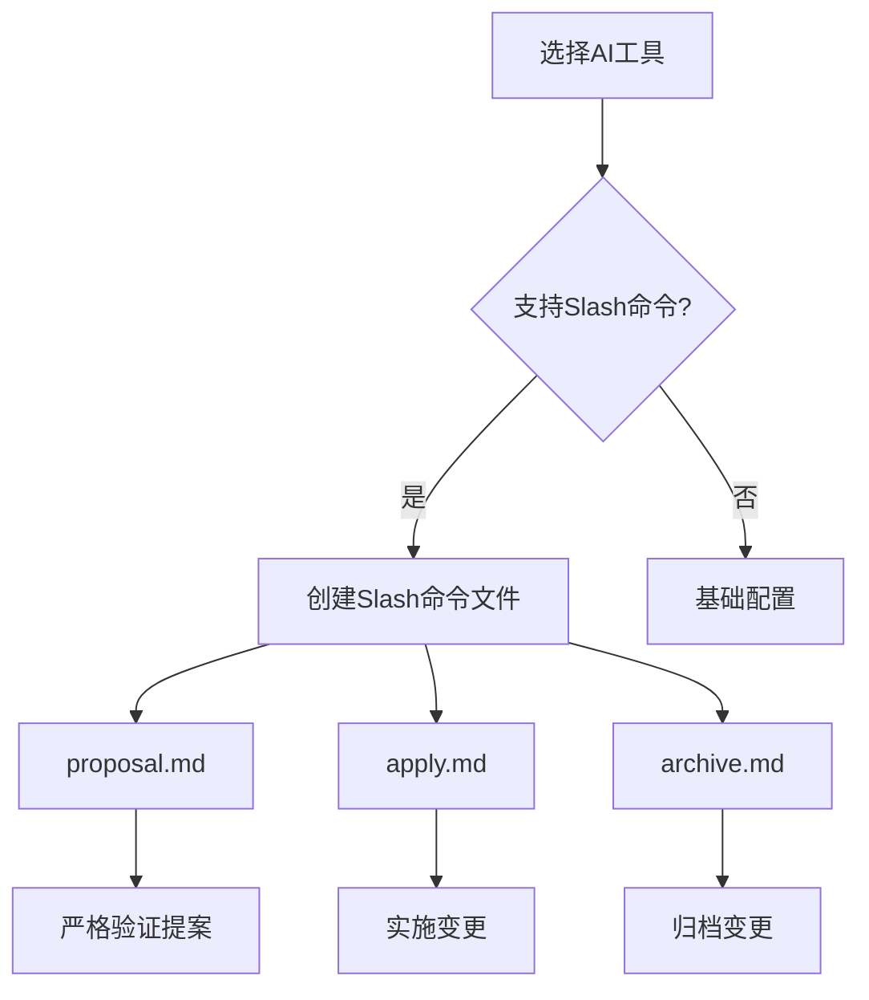
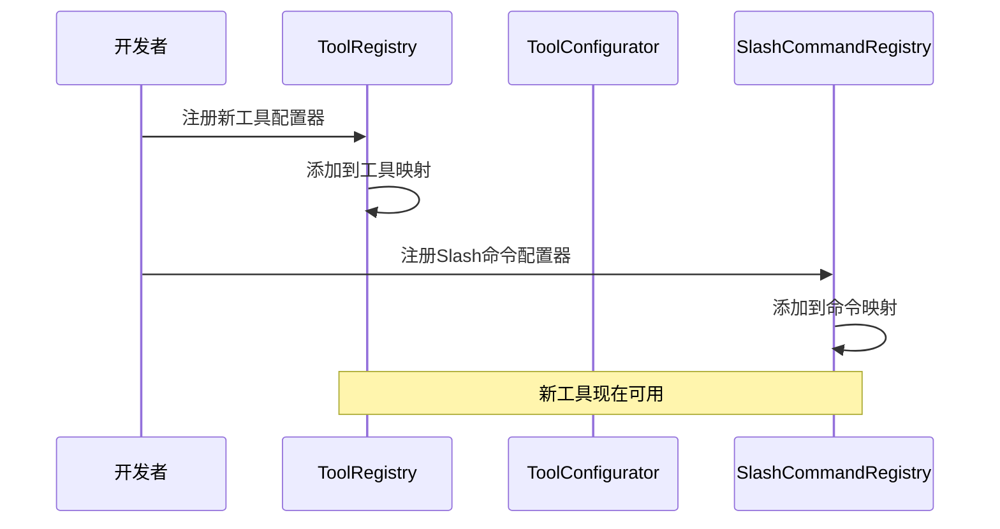
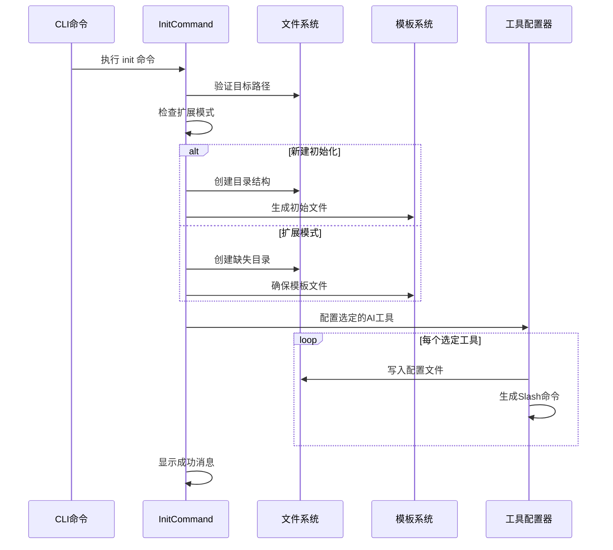

# 初始化文件结构

<cite>
**本文档中引用的文件**
- [src/core/init.ts](file://src/core/init.ts)
- [src/core/templates/index.ts](file://src/core/templates/index.ts)
- [src/core/templates/project-template.ts](file://src/core/templates/project-template.ts)
- [src/core/templates/agents-template.ts](file://src/core/templates/agents-template.ts)
- [src/core/templates/agents-root-stub.ts](file://src/core/templates/agents-root-stub.ts)
- [src/core/configurators/base.ts](file://src/core/configurators/base.ts)
- [src/core/configurators/registry.ts](file://src/core/configurators/registry.ts)
- [src/core/configurators/claude.ts](file://src/core/configurators/claude.ts)
- [src/core/configurators/slash/registry.ts](file://src/core/configurators/slash/registry.ts)
- [src/core/configurators/slash/claude.ts](file://src/core/configurators/slash/claude.ts)
- [src/core/configurators/slash/qoder.ts](file://src/core/configurators/slash/qoder.ts)
- [src/core/templates/slash-command-templates.ts](file://src/core/templates/slash-command-templates.ts)
- [src/core/config.ts](file://src/core/config.ts)
- [src/utils/file-system.ts](file://src/utils/file-system.ts)
- [test/core/init.test.ts](file://test/core/init.test.ts)
</cite>

## 目录
1. [简介](#简介)
2. [项目结构概览](#项目结构概览)
3. [目录创建逻辑](#目录创建逻辑)
4. [模板系统架构](#模板系统架构)
5. [项目上下文文件](#项目上下文文件)
6. [AI工具配置器](#ai工具配置器)
7. [自定义模板扩展](#自定义模板扩展)
8. [初始化流程详解](#初始化流程详解)
9. [最佳实践与故障排除](#最佳实践与故障排除)

## 简介

OpenSpec的`init`命令为项目提供了一个标准化的初始化流程，自动创建必要的目录结构和配置文件。该系统采用模块化设计，支持多种AI工具集成，并提供了灵活的模板机制来适应不同的项目需求。

## 项目结构概览

OpenSpec初始化后会在项目根目录创建以下核心结构：

**图表来源**
- [src/core/init.ts](file://src/core/init.ts#L708-L718)
- [src/core/templates/index.ts](file://src/core/templates/index.ts#L13-L26)

**章节来源**
- [src/core/init.ts](file://src/core/init.ts#L708-L718)

## 目录创建逻辑

初始化命令首先验证目标路径的有效性，然后创建标准的OpenSpec目录结构：

### 核心目录结构

**图表来源**
- [src/core/init.ts](file://src/core/init.ts#L417-L459)

### 目录创建步骤

系统按照以下顺序创建目录：

1. **主目录**：`openspec/`
2. **规范目录**：`openspec/specs/`
3. **变更目录**：`openspec/changes/`
4. **归档目录**：`openspec/changes/archive/`

每个目录都使用递归创建方式，确保父目录不存在时也能正确创建。

**章节来源**
- [src/core/init.ts](file://src/core/init.ts#L708-L718)

## 模板系统架构

OpenSpec采用基于TypeScript模块的模板系统，提供类型安全和动态内容注入能力。

### 模板管理器

**图表来源**
- [src/core/templates/index.ts](file://src/core/templates/index.ts#L13-L35)
- [src/core/templates/project-template.ts](file://src/core/templates/project-template.ts#L1-L38)

### 模板类型

系统支持两种类型的模板：

1. **静态模板**：直接字符串内容
2. **动态模板**：接受ProjectContext参数的函数

**章节来源**
- [src/core/templates/index.ts](file://src/core/templates/index.ts#L13-L35)

## 项目上下文文件

### project.md 文件

`project.md`是项目上下文的核心文件，包含项目的基本信息和约定。

#### 模板结构

**图表来源**
- [src/core/templates/project-template.ts](file://src/core/templates/project-template.ts#L1-L38)

#### 动态数据注入

项目上下文模板支持以下动态字段：
- `projectName`：项目名称
- `description`：项目描述
- `techStack`：技术栈列表
- `conventions`：项目约定

虽然当前实现中这些字段为空对象，但系统设计支持后续添加交互式提示来收集项目信息。

**章节来源**
- [src/core/templates/project-template.ts](file://src/core/templates/project-template.ts#L1-L38)
- [src/core/init.ts](file://src/core/init.ts#L740-L742)

### AGENTS.md 文件

`AGENTS.md`是AI助手的工作指南，定义了OpenSpec工作流程和最佳实践。

#### 标准模板

系统提供统一的标准模板，所有AI工具共享相同的指令格式：

**图表来源**
- [src/core/templates/agents-root-stub.ts](file://src/core/templates/agents-root-stub.ts#L1-L16)
- [src/core/configurators/agents.ts](file://src/core/configurators/agents.ts#L1-L23)

**章节来源**
- [src/core/templates/agents-template.ts](file://src/core/templates/agents-template.ts#L1-L458)
- [src/core/templates/agents-root-stub.ts](file://src/core/templates/agents-root-stub.ts#L1-L16)

## AI工具配置器

OpenSpec支持多种AI工具的自动配置，每种工具都有专门的配置器。

### 工具注册系统

**图表来源**
- [src/core/configurators/registry.ts](file://src/core/configurators/registry.ts#L10-L46)
- [src/core/configurators/base.ts](file://src/core/configurators/base.ts#L1-L6)

### 支持的AI工具

系统目前支持以下AI工具：

| 工具名称 | 配置文件 | 标记位置 | 可用性 |
|---------|---------|---------|--------|
| Claude Code | CLAUDE.md | <!-- OPENSPEC:START --> | ✅ |
| Cline | CLINE.md | <!-- OPENSPEC:START --> | ✅ |
| CodeBuddy | CODEBUDDY.md | <!-- OPENSPEC:START --> | ✅ |
| CoStrict | COSTRICT.md | <!-- OPENSPEC:START --> | ✅ |
| Qoder | QODER.md | <!-- OPENSPEC:START --> | ✅ |
| Qwen | QWEN.md | <!-- OPENSPEC:START --> | ✅ |
| AGENTS.md | AGENTS.md | 固定位置 | ⚠️ |

**章节来源**
- [src/core/config.ts](file://src/core/config.ts#L19-L36)
- [src/core/configurators/registry.ts](file://src/core/configurators/registry.ts#L10-L46)

### Slash命令配置

除了基本配置文件，某些工具还支持Slash命令配置：

**图表来源**
- [src/core/configurators/slash/registry.ts](file://src/core/configurators/slash/registry.ts#L40-L69)
- [src/core/templates/slash-command-templates.ts](file://src/core/templates/slash-command-templates.ts#L50-L58)

**章节来源**
- [src/core/configurators/slash/claude.ts](file://src/core/configurators/slash/claude.ts#L1-L43)
- [src/core/configurators/slash/qoder.ts](file://src/core/configurators/slash/qoder.ts#L46-L84)

## 自定义模板扩展

OpenSpec提供了灵活的扩展机制，允许开发者添加新的AI工具和自定义模板。

### 新工具注册流程

**图表来源**
- [src/core/configurators/registry.ts](file://src/core/configurators/registry.ts#L31-L32)
- [src/core/configurators/slash/registry.ts](file://src/core/configurators/slash/registry.ts#L67-L69)

### 模板扩展点

开发者可以通过以下方式扩展模板系统：

1. **添加新的配置器**：实现`ToolConfigurator`接口
2. **添加Slash命令**：实现`SlashCommandConfigurator`接口
3. **修改现有模板**：更新相应的模板文件
4. **添加新模板类型**：在`TemplateManager`中注册

**章节来源**
- [src/core/configurators/base.ts](file://src/core/configurators/base.ts#L1-L6)
- [src/core/configurators/slash/base.ts](file://src/core/configurators/slash/base.ts)

## 初始化流程详解

### 完整初始化序列

**图表来源**
- [src/core/init.ts](file://src/core/init.ts#L385-L459)

### 错误处理机制

系统实现了完善的错误处理和回滚机制：

1. **权限检查**：初始化前验证写入权限
2. **原子操作**：目录创建采用原子方式
3. **回滚支持**：失败时清理已创建的文件
4. **状态检测**：智能识别现有配置状态

**章节来源**
- [src/core/init.ts](file://src/core/init.ts#L462-L472)
- [src/core/init.ts](file://src/core/init.ts#L763-L806)

## 最佳实践与故障排除

### 初始化最佳实践

1. **目录结构**：保持项目根目录整洁，避免与其他工具冲突
2. **权限管理**：确保有足够的写入权限
3. **工具选择**：根据团队使用的AI工具选择合适的配置
4. **扩展模式**：使用`openspec update`而非重复初始化

### 常见问题解决

| 问题 | 原因 | 解决方案 |
|------|------|----------|
| 权限不足 | 目标目录无写入权限 | 使用sudo或更改目录权限 |
| 已初始化 | 项目已包含OpenSpec结构 | 使用`openspec update`命令 |
| 工具配置失败 | 配置文件被手动修改 | 删除配置文件重新初始化 |
| Slash命令不工作 | 工具不支持Slash命令 | 检查工具文档或使用通用AGENTS.md |

### 测试验证

系统提供了完整的测试覆盖，包括：

- 目录结构创建测试
- 模板文件生成测试
- AI工具配置测试
- 扩展模式测试
- 错误处理测试

**章节来源**
- [test/core/init.test.ts](file://test/core/init.test.ts#L647-L689)