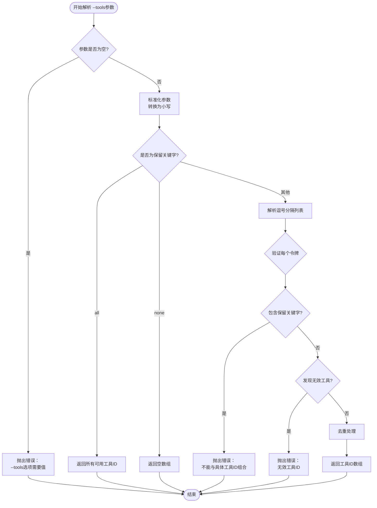
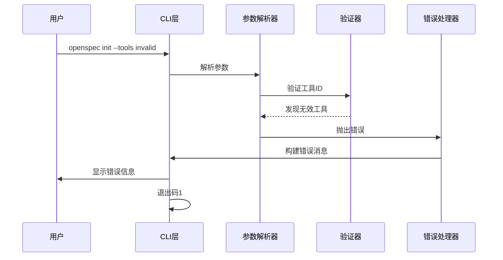

# 非交互式初始化

<cite>
**本文档中引用的文件**
- [src/cli/index.ts](file://src/cli/index.ts)
- [src/core/init.ts](file://src/core/init.ts)
- [src/core/config.ts](file://src/core/config.ts)
- [src/core/templates/index.ts](file://src/core/templates/index.ts)
- [src/core/configurators/registry.ts](file://src/core/configurators/registry.ts)
- [test/cli-e2e/basic.test.ts](file://test/cli-e2e/basic.test.ts)
- [test/core/init.test.ts](file://test/core/init.test.ts)
- [README.md](file://README.md)
</cite>

## 目录
1. [简介](#简介)
2. [命令语法](#命令语法)
3. [工具参数详解](#工具参数详解)
4. [参数解析逻辑](#参数解析逻辑)
5. [错误处理机制](#错误处理机制)
6. [CI/CD集成场景](#cicd集成场景)
7. [实际使用示例](#实际使用示例)
8. [常见配置错误](#常见配置错误)
9. [最佳实践](#最佳实践)
10. [故障排除指南](#故障排除指南)

## 简介

OpenSpec的`openspec init`命令提供了强大的非交互式初始化功能，特别适用于CI/CD流水线、自动化脚本和批量部署场景。通过`--tools`参数，用户可以精确控制要配置的AI工具集合，实现完全自动化的项目初始化流程。

## 命令语法

```bash
openspec init [path] [--tools <tools>]
```

### 参数说明

- **[path]**: 可选的目标路径，默认为当前目录
- **--tools**: 配置AI工具的非交互式选项

**节来源**
- [src/cli/index.ts](file://src/cli/index.ts#L41-L44)

## 工具参数详解

`--tools`参数支持三种主要模式，每种模式都有特定的应用场景：

### 1. `all` 模式：启用所有支持的工具

```bash
openspec init --tools all
```

**特点：**
- 自动选择所有可用的AI工具
- 创建每个工具的专用配置文件
- 适用于需要完整AI工具链的项目

**生成的文件：**
- `CLAUDE.md` (Claude配置)
- `.cursor/commands/openspec-proposal.md` (Cursor配置)
- `.windsurf/workflows/openspec-proposal.md` (Windsurf配置)
- 其他工具的相应配置文件

### 2. `none` 模式：不启用任何工具

```bash
openspec init --tools none
```

**特点：**
- 跳过AI工具配置
- 仅创建OpenSpec目录结构和基础模板
- 适用于仅使用AGENTS.md标准的项目

**生成的文件：**
- `AGENTS.md` (根目录代理配置)
- `project.md` (项目上下文描述)
- `openspec/` 目录结构

### 3. 工具列表模式：指定具体工具

```bash
openspec init --tools claude,cursor,windsurf
```

**特点：**
- 支持逗号分隔的工具列表
- 自动去重和大小写标准化
- 提供精确的工具选择控制

**支持的工具ID：**
- `auggie` - Augment CLI
- `claude` - Claude Code
- `cline` - Cline
- `codebuddy` - CodeBuddy Code
- `costrict` - CoStrict
- `crush` - Crush
- `cursor` - Cursor
- `factory` - Factory Droid
- `opencode` - OpenCode
- `kilocode` - Kilo Code
- `qoder` - Qoder CLI
- `windsurf` - Windsurf
- `codex` - Codex
- `github-copilot` - GitHub Copilot
- `amazon-q` - Amazon Q Developer
- `qwen` - Qwen Code

**节来源**
- [src/core/config.ts](file://src/core/config.ts#L19-L36)
- [src/cli/index.ts](file://src/cli/index.ts#L37-L38)

## 参数解析逻辑

### 解析流程图



**图表来源**
- [src/core/init.ts](file://src/core/init.ts#L496-L556)

### 核心解析算法

参数解析过程包含以下关键步骤：

1. **输入验证**：检查参数是否存在且非空
2. **标准化处理**：转换为小写并去除多余空白
3. **保留关键字检查**：识别`all`和`none`特殊值
4. **逗号分割**：将字符串分解为工具ID列表
5. **重复检测**：确保工具ID唯一性
6. **有效性验证**：确认每个工具ID在可用列表中

**节来源**
- [src/core/init.ts](file://src/core/init.ts#L513-L556)

## 错误处理机制

### 错误类型分类

| 错误类型 | 触发条件 | 错误消息示例 | 处理方式 |
|---------|---------|-------------|---------|
| 空参数错误 | `--tools`后无值 | `The --tools option requires a value.` | 显示帮助信息 |
| 保留关键字冲突 | 同时使用`all`/`none`与具体ID | `Cannot combine reserved values "all" or "none" with specific tool IDs.` | 提示正确用法 |
| 无效工具名 | 使用不存在的工具ID | `Invalid tool(s): invalid-tool. Available values: claude,cursor,...` | 列出可用工具 |
| 空列表错误 | 使用逗号但无工具ID | `The --tools option requires at least one tool ID when not using "all" or "none".` | 显示帮助信息 |

### 错误处理流程



**图表来源**
- [src/core/init.ts](file://src/core/init.ts#L513-L556)
- [src/cli/index.ts](file://src/cli/index.ts#L69-L72)

**节来源**
- [test/core/init.test.ts](file://test/core/init.test.ts#L1310-L1338)
- [test/cli-e2e/basic.test.ts](file://test/cli-e2e/basic.test.ts#L130-L156)

## CI/CD集成场景

### 自动化部署流水线

在CI/CD环境中，非交互式初始化特别有用：

#### GitHub Actions 示例

```yaml
name: OpenSpec Setup
on: [push]

jobs:
  setup:
    runs-on: ubuntu-latest
    steps:
      - uses: actions/checkout@v4
      
      - name: Setup Node.js
        uses: actions/setup-node@v4
        with:
          node-version: '20'
          
      - name: Install OpenSpec
        run: npm install -g @fission-ai/openspec
        
      - name: Initialize OpenSpec
        run: |
          openspec init --tools all
          echo "OpenSpec initialized with all AI tools"
        
      - name: Validate Configuration
        run: openspec validate --all
```

#### GitLab CI 示例

```yaml
stages:
  - setup
  - validate

openspec-setup:
  stage: setup
  image: node:20
  script:
    - npm install -g @fission-ai/openspec
    - openspec init --tools claude,cursor
    - openspec list
  artifacts:
    paths:
      - openspec/
    expire_in: 1 hour
```

#### Jenkins Pipeline 示例

```groovy
pipeline {
    agent any
    
    stages {
        stage('Setup OpenSpec') {
            steps {
                sh 'npm install -g @fission-ai/openspec'
                sh 'openspec init --tools none'
                
                // 验证初始化结果
                sh 'ls -la openspec/'
                sh 'openspec list'
            }
        }
    }
    
    post {
        always {
            archiveArtifacts artifacts: 'openspec/**/*', fingerprint: true
        }
    }
}
```

### 批量项目初始化

对于需要同时初始化多个项目的场景：

```bash
#!/bin/bash
# 批量初始化脚本

PROJECTS=(
    "project-a"
    "project-b"
    "project-c"
)

TOOLS="claude,cursor,windsurf"

for project in "${PROJECTS[@]}"; do
    echo "Initializing $project..."
    
    if [ ! -d "$project" ]; then
        mkdir -p "$project"
    fi
    
    pushd "$project" >/dev/null
    
    if openspec init --tools "$TOOLS" 2>&1; then
        echo "✓ $project initialized successfully"
        openspec list
    else
        echo "✗ $project initialization failed"
        # 记录失败原因
        openspec list 2>&1 | tee "$project-init-error.log"
    fi
    
    popd >/dev/null
done
```

**节来源**
- [test/cli-e2e/basic.test.ts](file://test/cli-e2e/basic.test.ts#L74-L156)

## 实际使用示例

### 基础示例

#### 完整工具链配置
```bash
# 初始化并配置所有可用工具
openspec init --tools all
```

#### 最小化配置
```bash
# 仅创建OpenSpec结构，不配置AI工具
openspec init --tools none
```

#### 精确工具选择
```bash
# 仅配置Claude和Cursor
openspec init --tools claude,cursor

# 包含多个工具（支持空格分隔）
openspec init --tools "claude, cursor, windsurf"
```

### 高级用法示例

#### 条件化工具配置
```bash
#!/bin/bash
# 根据环境变量选择工具

if [[ "$ENVIRONMENT" == "production" ]]; then
    TOOLS="claude,cursor"
elif [[ "$ENVIRONMENT" == "development" ]]; then
    TOOLS="all"
else
    TOOLS="none"
fi

openspec init --tools "$TOOLS"
```

#### 工具链验证
```bash
# 初始化后验证配置
openspec init --tools claude,cursor
openspec list  # 显示已配置的工具
openspec validate --all  # 验证所有配置
```

#### 错误处理示例
```bash
# 带错误处理的初始化
if ! openspec init --tools invalid-tool; then
    echo "Initialization failed. Available tools:"
    openspec init --help | grep "Use \"all\", \"none\""
    exit 1
fi
```

**节来源**
- [test/core/init.test.ts](file://test/core/init.test.ts#L1250-L1338)

## 常见配置错误

### 拼写错误

#### 错误示例
```bash
# 错误：工具名拼写错误
openspec init --tools claud,cursor

# 错误：大小写不一致
openspec init --tools CLAUDE,CURSOR

# 错误：使用不存在的工具
openspec init --tools gpt4,chatgpt
```

#### 正确示例
```bash
# 正确：使用正确的工具ID
openspec init --tools claude,cursor

# 正确：大小写不敏感
openspec init --tools Claude,CURSOR
```

### 格式错误

#### 错误示例
```bash
# 错误：逗号后缺少空格
openspec init --tools claude,cursor,windsurf

# 错误：连续逗号
openspec init --tools claude,,cursor

# 错误：空工具列表
openspec init --tools ""
```

#### 正确示例
```bash
# 正确：逗号后带空格
openspec init --tools "claude, cursor, windsurf"

# 正确：单个工具
openspec init --tools claude
```

### 语义错误

#### 错误示例
```bash
# 错误：混合保留关键字和具体ID
openspec init --tools all,claude

# 错误：使用不存在的工具
openspec init --tools claude,unknown-tool
```

#### 正确示例
```bash
# 正确：单独使用保留关键字
openspec init --tools all

# 正确：单独使用具体ID
openspec init --tools claude
```

### 环境相关错误

#### 错误示例
```bash
# 错误：权限不足
sudo openspec init --tools all  # 在容器中可能无效

# 错误：路径不存在
openspec init ./nonexistent/path --tools all
```

#### 正确示例
```bash
# 正确：确保路径存在
mkdir -p ./project
openspec init ./project --tools all

# 正确：检查权限
chmod +x ./script.sh
./script.sh
```

**节来源**
- [test/core/init.test.ts](file://test/core/init.test.ts#L1310-L1338)
- [test/cli-e2e/basic.test.ts](file://test/cli-e2e/basic.test.ts#L130-L156)

## 最佳实践

### 1. 工具选择策略

#### 生产环境
```bash
# 选择核心工具，避免过度配置
openspec init --tools claude,cursor
```

#### 开发环境
```bash
# 使用完整工具链进行测试
openspec init --tools all
```

#### 轻量级项目
```bash
# 仅使用AGENTS.md标准
openspec init --tools none
```

### 2. 版本控制集成

```bash
# 将OpenSpec配置纳入版本控制
git add openspec/
git commit -m "Add OpenSpec configuration"
```

### 3. 验证和测试

```bash
# 初始化后立即验证
openspec init --tools claude,cursor
openspec list  # 检查配置状态
openspec validate --all  # 确保配置有效
```

### 4. 文档化

```bash
# 记录初始化配置
echo "OpenSpec initialized with: claude, cursor" >> DEPLOYMENT_NOTES.md
```

### 5. 渐进式采用

```bash
# 从最小配置开始
openspec init --tools none
# 后续逐步添加工具
openspec init --tools claude
```

## 故障排除指南

### 诊断步骤

#### 1. 检查工具可用性
```bash
# 查看可用工具列表
openspec init --help
```

#### 2. 验证配置
```bash
# 检查现有配置
ls -la openspec/
openspec list
```

#### 3. 测试工具
```bash
# 验证特定工具
openspec show --type change <change-name>
```

### 常见问题解决

#### 问题：工具配置未生效
**原因**：工具ID拼写错误或工具不可用
**解决方案**：
```bash
# 检查可用工具
openspec init --help

# 使用正确的工具ID重新初始化
openspec init --tools claude,cursor
```

#### 问题：权限错误
**原因**：目标目录权限不足
**解决方案**：
```bash
# 检查权限
ls -la ./target-directory/

# 修复权限
chmod -R u+w ./target-directory/
openspec init ./target-directory --tools all
```

#### 问题：重复初始化
**原因**：项目已存在OpenSpec配置
**解决方案**：
```bash
# 使用扩展模式
openspec init --tools claude  # 添加新工具

# 或者清理后重新初始化
rm -rf openspec/
openspec init --tools all
```

### 调试技巧

#### 详细输出
```bash
# 使用JSON输出进行调试
openspec validate --all --json > validation-report.json
```

#### 分步验证
```bash
# 分别验证不同组件
openspec validate --changes
openspec validate --specs
```

**节来源**
- [test/core/init.test.ts](file://test/core/init.test.ts#L1423-L1448)

## 总结

OpenSpec的非交互式初始化功能为现代软件开发提供了强大而灵活的自动化能力。通过`--tools`参数的三种模式，开发者可以根据具体需求精确控制AI工具的配置，无论是完整的工具链还是精简的代理配置都能轻松实现。

在CI/CD环境中，这种非交互式特性使得OpenSpec能够无缝集成到自动化流水线中，确保每次部署都具有统一且可预测的配置状态。配合完善的错误处理和验证机制，开发者可以构建健壮的自动化工作流程，显著提升开发效率和项目质量。

掌握这些非交互式初始化的最佳实践，将帮助团队更好地利用OpenSpec的强大功能，在AI驱动的软件开发中取得更好的成果。