# 项目初始化

<cite>
**本文档中引用的文件**
- [src/cli/index.ts](file://src/cli/index.ts)
- [src/core/init.ts](file://src/core/init.ts)
- [src/core/config.ts](file://src/core/config.ts)
- [src/core/templates/index.ts](file://src/core/templates/index.ts)
- [src/core/configurators/registry.ts](file://src/core/configurators/registry.ts)
- [src/utils/file-system.ts](file://src/utils/file-system.ts)
- [openspec/project.md](file://openspec/project.md)
- [test/core/init.test.ts](file://test/core/init.test.ts)
</cite>

## 目录
1. [简介](#简介)
2. [项目结构概览](#项目结构概览)
3. [初始化命令架构](#初始化命令架构)
4. [交互式模式详解](#交互式模式详解)
5. [非交互式模式](#非交互式模式)
6. [目录结构与文件管理](#目录结构与文件管理)
7. [项目上下文文件生成](#项目上下文文件生成)
8. [AI工具注册与配置](#ai工具注册与配置)
9. [扩展与自定义](#扩展与自定义)
10. [故障排除指南](#故障排除指南)
11. [总结](#总结)

## 简介

OpenSpec的`openspec init`命令是一个智能的项目初始化系统，旨在为开发者提供完整的AI驱动规范开发环境。该命令不仅创建必要的目录结构，还配置各种AI工具以确保最佳的开发体验。

### 核心特性

- **智能检测**: 自动检测现有OpenSpec设置并提供扩展选项
- **多模式支持**: 同时支持交互式和非交互式初始化
- **模块化工具**: 支持17种不同的AI工具集成
- **灵活配置**: 可选择性地配置特定工具或批量配置
- **模板系统**: 自动生成项目上下文和AI助手指令文件

## 项目结构概览

OpenSpec项目采用清晰的分层架构，每个组件都有明确的职责：

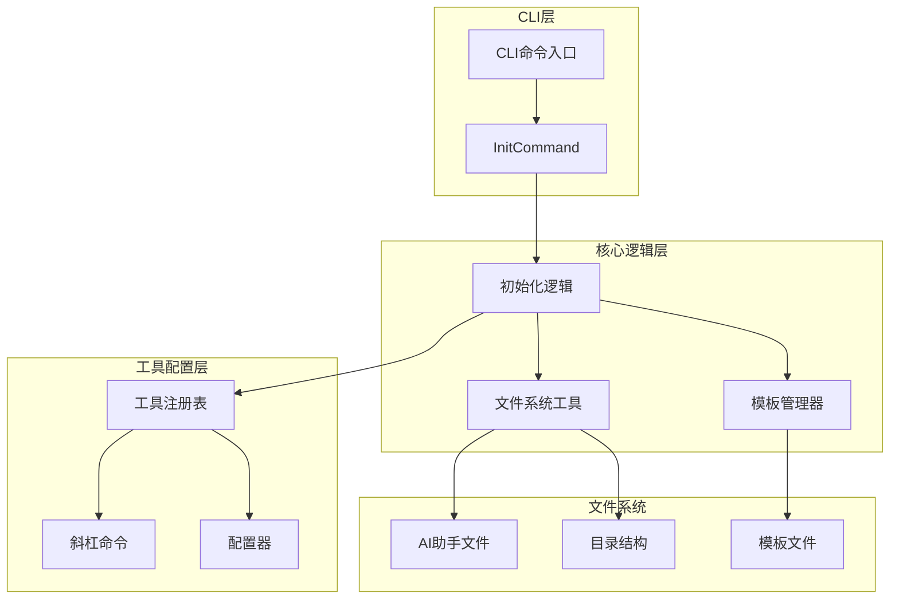

**图表来源**
- [src/cli/index.ts](file://src/cli/index.ts#L40-L74)
- [src/core/init.ts](file://src/core/init.ts#L376-L460)

**章节来源**
- [src/cli/index.ts](file://src/cli/index.ts#L1-L254)
- [src/core/init.ts](file://src/core/init.ts#L1-L971)

## 初始化命令架构

### 命令入口点

初始化命令通过CLI层进行入口管理，支持路径参数和工具配置选项：

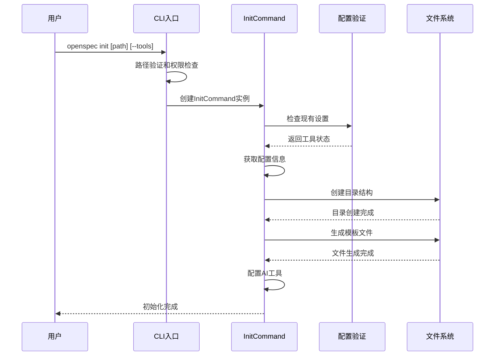

**图表来源**
- [src/cli/index.ts](file://src/cli/index.ts#L40-L74)
- [src/core/init.ts](file://src/core/init.ts#L385-L460)

### 核心类设计

初始化系统的核心是`InitCommand`类，它封装了完整的初始化逻辑：

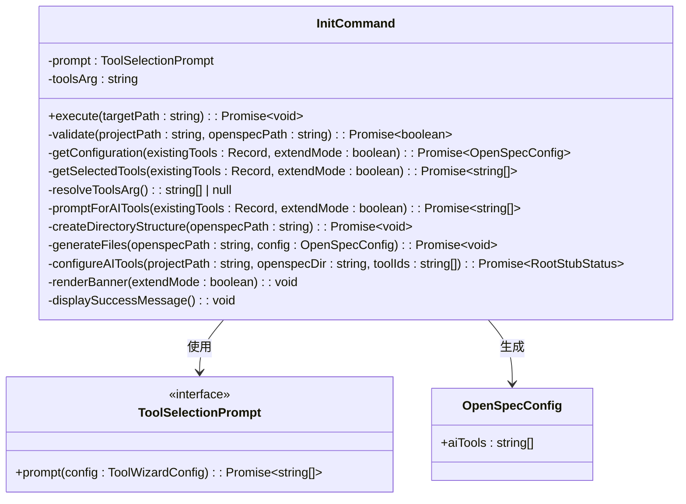

**图表来源**
- [src/core/init.ts](file://src/core/init.ts#L376-L460)

**章节来源**
- [src/core/init.ts](file://src/core/init.ts#L376-L460)

## 交互式模式详解

### 工具选择流程

交互式模式提供了直观的工具选择界面，支持键盘导航和多选操作：

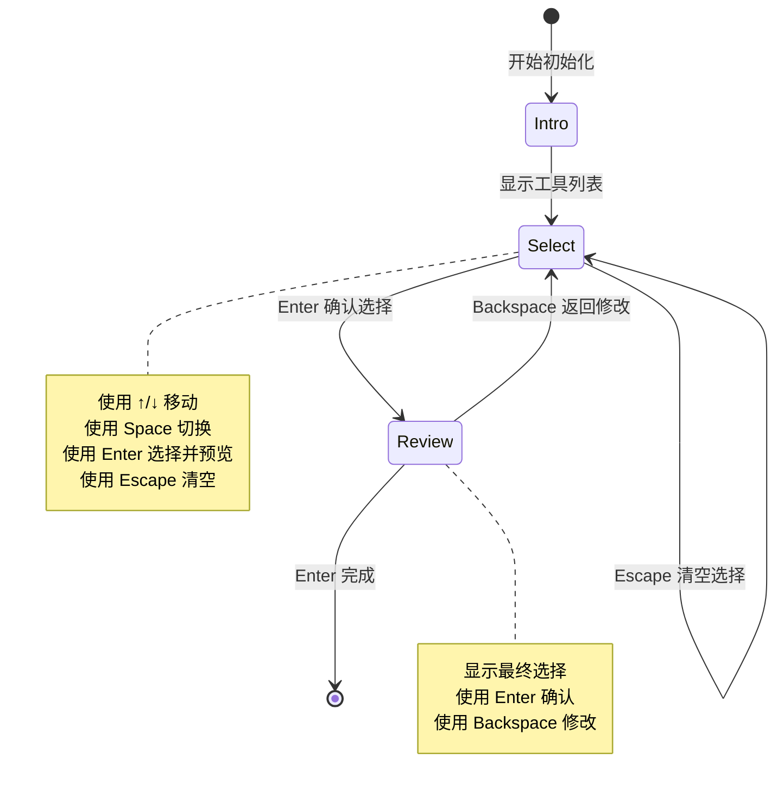

**图表来源**
- [src/core/init.ts](file://src/core/init.ts#L100-L264)

### 键盘操作映射

交互式工具选择支持以下键盘操作：

| 操作 | 键位 | 功能描述 |
|------|------|----------|
| 导航上 | ↑ | 在可选择项间向上移动光标 |
| 导航下 | ↓ | 在可选择项间向下移动光标 |
| 切换选择 | Space | 切换当前高亮工具的选择状态 |
| 确认选择 | Enter | 添加当前高亮工具到选择列表并进入预览阶段 |
| 返回修改 | Backspace | 从预览阶段返回到选择阶段进行修改 |
| 清空选择 | Escape | 清空所有选择并返回到初始状态 |

### 工具列表渲染

工具列表分为两个主要部分：

1. **原生支持提供商** (`Natively supported providers`)
   - 包含16个直接支持OpenSpec斜杠命令的AI工具
   - 标记为"✔ OpenSpec custom slash commands available"
   - 显示工具名称和注释信息

2. **通用工具** (`Other tools`)
   - 包含通用的AI助手配置选项
   - 提供"Universal AGENTS.md"作为兼容性选项
   - 对于不支持斜杠命令的工具提供基础配置

### 审查步骤

在选择完成后，用户会进入审查阶段：

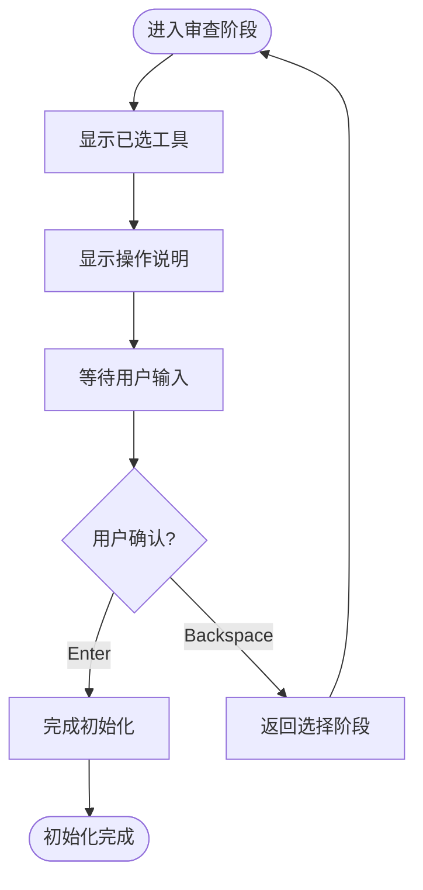

**图表来源**
- [src/core/init.ts](file://src/core/init.ts#L247-L264)

**章节来源**
- [src/core/init.ts](file://src/core/init.ts#L100-L368)

## 非交互式模式

### --tools 参数语法

非交互式模式通过`--tools`参数提供完全自动化的初始化方式：

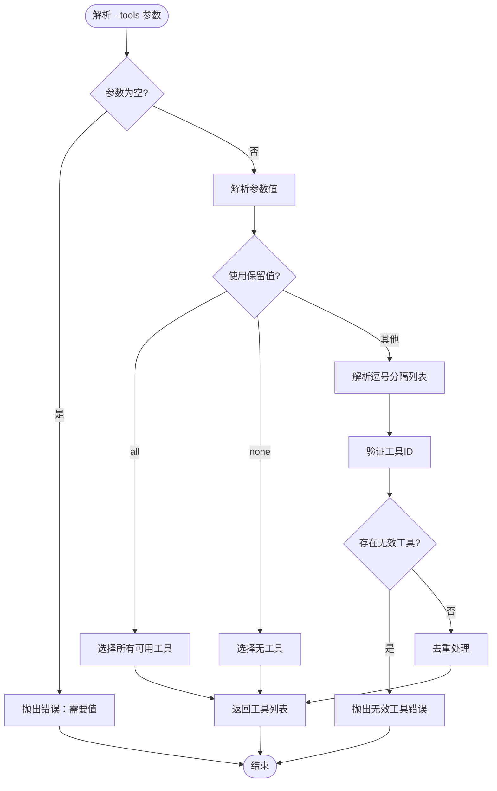

**图表来源**
- [src/core/init.ts](file://src/core/init.ts#L496-L556)

### 参数值类型

支持以下几种参数格式：

| 格式 | 示例 | 描述 |
|------|------|------|
| 全部工具 | `--tools all` | 选择所有可用的AI工具 |
| 无工具 | `--tools none` | 不选择任何AI工具 |
| 工具列表 | `--tools claude,cline,cursor` | 选择指定的工具组合 |
| 大小写不敏感 | `--tools Claude,Cline` | 忽略大小写差异 |
| 去重处理 | `--tools claude,claude,cursor` | 自动去除重复的工具ID |

### 自动化应用场景

非交互式模式特别适用于以下场景：

1. **CI/CD流水线**
   ```bash
   # 在持续集成中自动初始化
   openspec init --tools all
   ```

2. **脚本部署**
   ```bash
   # 批量部署多个项目
   for project in project1 project2 project3; do
     cd $project
     openspec init --tools claude,cursor
   done
   ```

3. **容器化环境**
   ```dockerfile
   # Dockerfile 中的初始化步骤
   RUN openspec init --tools none && \
       openspec update
   ```

**章节来源**
- [src/core/init.ts](file://src/core/init.ts#L487-L556)

## 目录结构与文件管理

### 标准目录结构

OpenSpec项目采用标准化的目录结构，支持规范和变更的分离管理：

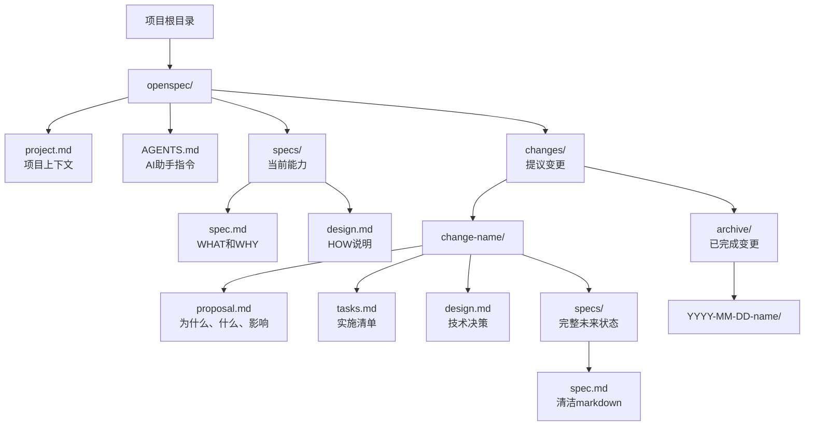

**图表来源**
- [src/core/init.ts](file://src/core/init.ts#L708-L718)

### 目录创建策略

初始化过程按顺序创建目录，确保原子性操作：

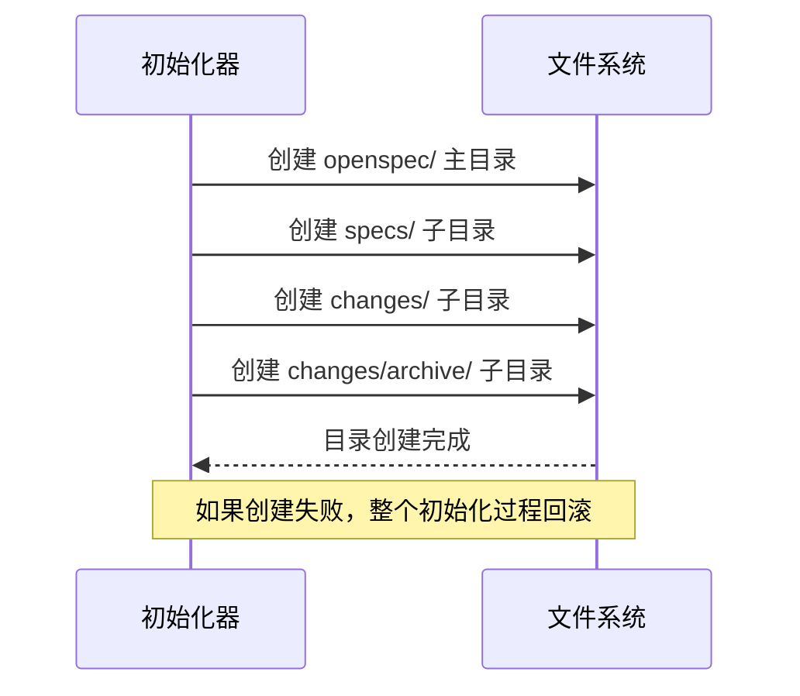

**图表来源**
- [src/core/init.ts](file://src/core/init.ts#L708-L718)

### 文件系统工具

`FileSystemUtils`类提供了可靠的文件系统操作：

| 方法 | 功能 | 异常处理 |
|------|------|----------|
| `createDirectory()` | 递归创建目录 | 成功创建或目录已存在 |
| `fileExists()` | 检查文件是否存在 | 静默处理不存在的情况 |
| `writeFile()` | 写入文件内容 | 自动创建父目录 |
| `readFile()` | 读取文件内容 | 抛出文件不存在异常 |
| `ensureWritePermissions()` | 检查写入权限 | 返回布尔值而非抛出异常 |
| `updateFileWithMarkers()` | 带标记更新文件 | 支持增量更新和标记定位 |

**章节来源**
- [src/core/init.ts](file://src/core/init.ts#L708-L761)
- [src/utils/file-system.ts](file://src/utils/file-system.ts#L1-L188)

## 项目上下文文件生成

### project.md 模板系统

`project.md`文件是项目上下文的核心，包含了项目的关键信息：

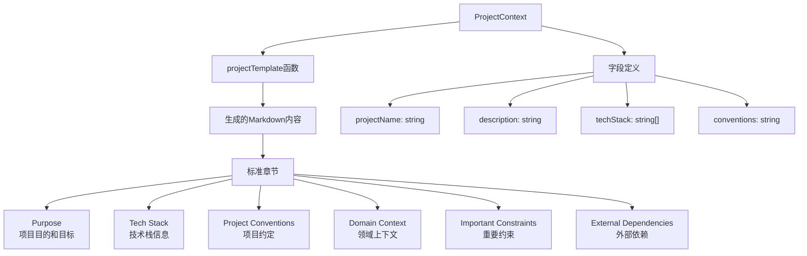

**图表来源**
- [src/core/templates/project-template.ts](file://src/core/templates/project-template.ts#L1-L38)

### 模板管理器

`TemplateManager`负责管理所有模板文件的生成：

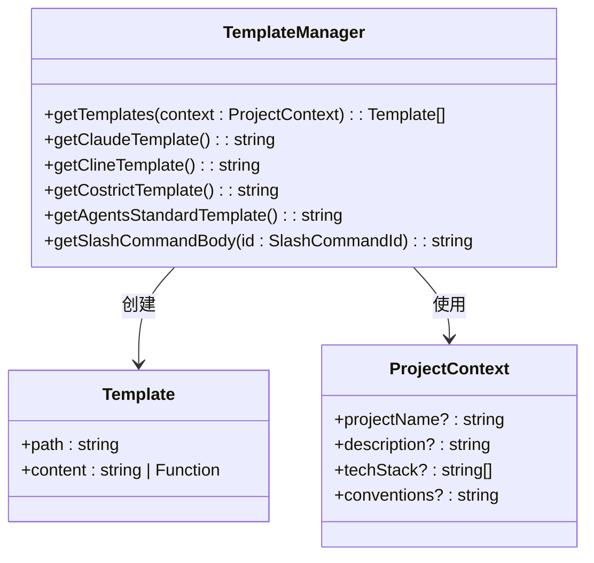

**图表来源**
- [src/core/templates/index.ts](file://src/core/templates/index.ts#L14-L47)

### 默认模板内容

系统提供以下默认模板：

| 模板文件 | 类型 | 功能 |
|----------|------|------|
| `AGENTS.md` | AI助手指令 | 为所有支持的AI工具生成统一的指令模板 |
| `project.md` | 项目上下文 | 自动生成项目特定的上下文信息 |
| `CLAUDE.md` | Claude专用 | Claude Code编辑器的配置文件 |
| `CLINE.md` | Cline专用 | Cline编辑器的配置文件 |
| `COSTRICT.md` | CoStrict专用 | CoStrict编辑器的配置文件 |
| `WINDSURF/` | 工作流文件 | Windsurf工具的工作流配置 |

**章节来源**
- [src/core/templates/index.ts](file://src/core/templates/index.ts#L1-L51)
- [src/core/templates/project-template.ts](file://src/core/templates/project-template.ts#L1-L38)

## AI工具注册与配置

### 工具注册表架构

OpenSpec使用注册表模式管理AI工具配置器：

```mermaid
graph TB
subgraph "工具注册表"
    Registry["ToolRegistry"]
    Tools["工具映射表"]
end
subgraph "配置器接口"
    Base["ToolConfigurator"]
    Config["配置方法"]
    FileName["配置文件名"]
    Available["可用性检查"]
end
subgraph "具体配置器"
    Claude["ClaudeConfigurator"]
    Cline["ClineConfigurator"]
    CodeBuddy["CodeBuddyConfigurator"]
    Costrict["CostrictConfigurator"]
    Qoder["QoderConfigurator"]
    Agents["AgentsStandardConfigurator"]
    Qwen["QwenConfigurator"]
end
Registry --> Tools
Tools --> Base
Base --> Config
Base --> FileName
Base --> Available
Base <|-- Claude
Base <|-- Cline
Base <|-- CodeBuddy
Base <|-- Costrict
Base <|-- Qoder
Base <|-- Agents
Base <|-- Qwen
```

**图表来源**
- [src/core/configurators/registry.ts](file://src/core/configurators/registry.ts#L10-L46)

### 支持的AI工具

系统目前支持17种AI工具，分为两类：

| 分类 | 工具名称 | 配置文件 | 斜杠命令支持 |
|------|----------|----------|--------------|
| 原生支持 | Auggie | AUGGIE.md | ✅ |
| 原生支持 | Claude Code | CLAUDE.md | ✅ |
| 原生支持 | Cline | CLINE.md | ✅ |
| 原生支持 | CodeBuddy Code | CODEBUDDY.md | ✅ |
| 原生支持 | CoStrict | COSTRICT.md | ✅ |
| 原生支持 | Crush | CRUSH.md | ✅ |
| 原生支持 | Cursor | CURSOR.md | ✅ |
| 原生支持 | Factory Droid | FACTORY.md | ✅ |
| 原生支持 | OpenCode | OPENCODE.md | ✅ |
| 原生支持 | Kilo Code | KILOCODE.md | ✅ |
| 原生支持 | Qoder | QODER.md | ✅ |
| 原生支持 | Windsurf | WINDSURF/ | ✅ |
| 原生支持 | Codex | ~/.codex/prompts/ | ✅ |
| 原生支持 | GitHub Copilot | .vscode/settings.json | ✅ |
| 原生支持 | Amazon Q Developer | AMAZON-Q/ | ✅ |
| 原生支持 | Qwen Code | QWEN.md | ✅ |
| 通用支持 | AGENTS.md | AGENTS.md | ❌ |

### 工具配置流程

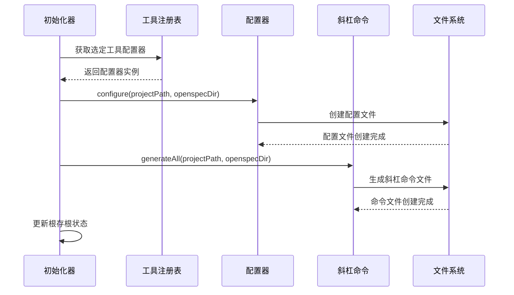

**图表来源**
- [src/core/init.ts](file://src/core/init.ts#L763-L785)

### 工具状态检测

系统能够智能检测现有工具配置状态：

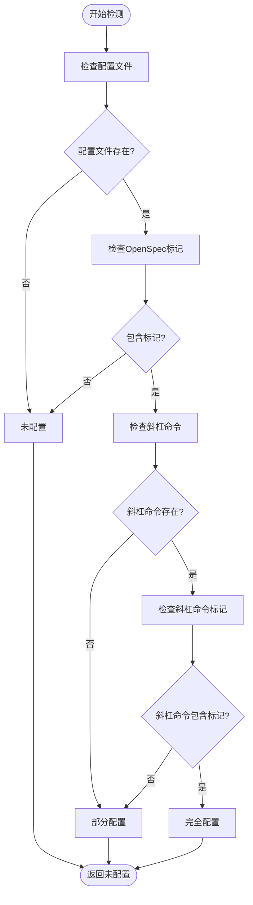

**图表来源**
- [src/core/init.ts](file://src/core/init.ts#L648-L706)

**章节来源**
- [src/core/configurators/registry.ts](file://src/core/configurators/registry.ts#L1-L47)
- [src/core/config.ts](file://src/core/config.ts#L19-L37)

## 扩展与自定义

### 添加新AI工具支持

要向OpenSpec添加新的AI工具支持，需要遵循以下步骤：

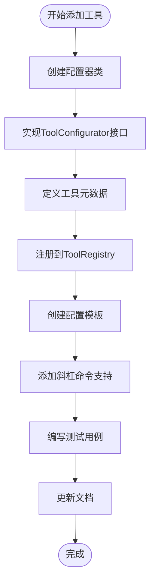

### 实现步骤详解

1. **创建配置器类**
   ```typescript
   // 示例：新工具配置器
   export class NewToolConfigurator implements ToolConfigurator {
     name = 'New Tool';
     configFileName = 'NEWTOOL.md';
     isAvailable = true;
     
     async configure(projectPath: string, openspecDir: string): Promise<void> {
       // 实现配置逻辑
     }
   }
   ```

2. **注册到工具注册表**
   ```typescript
   // 在 src/core/configurators/registry.ts 中
   static {
     // ... 现有工具注册
     this.tools.set('newtool', new NewToolConfigurator());
   }
   ```

3. **创建配置模板**
   ```typescript
   // 在 src/core/templates/ 目录中
   export const newToolTemplate = `# New Tool Configuration
   
   <!-- OPENSPEC:START -->
   @/openspec/AGENTS.md
   openspec update
   <!-- OPENSPEC:END -->
   
   ## Instructions for New Tool
   [工具特定的配置说明]
   `;
   ```

### 自定义模板扩展

项目上下文模板支持动态内容生成：

```typescript
// ProjectContext 接口扩展
export interface ProjectContext {
  projectName?: string;
  description?: string;
  techStack?: string[];
  conventions?: string;
  customFields?: Record<string, string>; // 新增自定义字段
}

// 模板函数扩展
export const projectTemplate = (context: ProjectContext = {}) => `
# ${context.projectName || 'Project'} Context

## Purpose
${context.description || '[项目描述]'}

## Tech Stack
${context.techStack?.map(tech => `- ${tech}`).join('\n') || '- [技术栈]'}
${context.customFields?.techStackDetails || ''}

## Project Conventions
${context.conventions || '[项目约定]'}
${context.customFields?.conventionDetails || ''}
`;
```

### 配置文件标记系统

OpenSpec使用标记系统确保配置文件的安全更新：

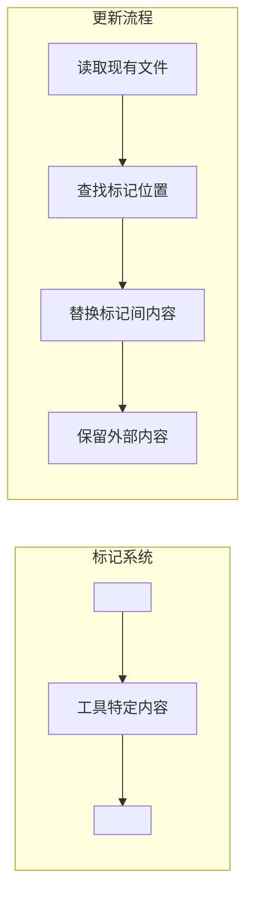

**图表来源**
- [src/utils/file-system.ts](file://src/utils/file-system.ts#L129-L164)

**章节来源**
- [src/core/configurators/registry.ts](file://src/core/configurators/registry.ts#L31-L46)
- [src/core/templates/index.ts](file://src/core/templates/index.ts#L14-L47)

## 故障排除指南

### 常见问题与解决方案

| 问题 | 症状 | 解决方案 |
|------|------|----------|
| 权限不足 | "Insufficient permissions to write to [path]" | 检查目录写入权限，使用sudo或更改目录所有权 |
| 工具ID无效 | "Invalid tool(s): [tool]" | 确认工具ID拼写正确，参考可用工具列表 |
| 目录冲突 | "Directory already exists" | 使用不同的目标路径或删除现有目录 |
| 网络问题 | 工具配置失败 | 检查网络连接，手动配置工具设置 |
| 版本冲突 | "Incompatible OpenSpec version" | 更新OpenSpec到最新版本 |

### 调试技巧

1. **启用详细输出**
   ```bash
   DEBUG=* openspec init
   ```

2. **检查现有配置**
   ```bash
   # 查看当前OpenSpec设置
   ls -la openspec/
   cat openspec/AGENTS.md
   ```

3. **清理并重新初始化**
   ```bash
   # 清理现有设置
   rm -rf openspec/
   
   # 重新初始化
   openspec init
   ```

### 性能优化建议

1. **非交互式初始化**：在CI/CD环境中使用`--tools none`避免不必要的交互
2. **批量工具配置**：使用`--tools all`一次性配置所有工具
3. **并行处理**：对于大型项目，考虑分阶段初始化

**章节来源**
- [src/core/init.ts](file://src/core/init.ts#L462-L472)
- [test/core/init.test.ts](file://test/core/init.test.ts#L1-L200)

## 总结

OpenSpec的`openspec init`命令提供了一个完整、智能且可扩展的项目初始化解决方案。通过交互式和非交互式两种模式，它能够适应不同场景的需求，从开发者的日常使用到CI/CD流水线的自动化部署。

### 主要优势

1. **智能检测与扩展**：自动识别现有设置并提供升级选项
2. **灵活的配置方式**：支持交互式选择和完全自动化
3. **模块化架构**：易于添加新的AI工具支持
4. **可靠的文件管理**：原子性操作和安全的文件更新
5. **标准化的项目结构**：促进团队协作和项目维护

### 最佳实践建议

1. **开发环境**：使用交互式模式获得最佳的用户体验
2. **生产环境**：使用非交互式模式确保一致性
3. **团队项目**：共享相同的工具配置以保持一致性
4. **持续集成**：在CI/CD中使用自动化模式
5. **定期维护**：使用扩展模式更新现有项目

通过合理使用`openspec init`命令，开发团队可以快速建立标准化的AI驱动规范开发环境，提高开发效率和代码质量。