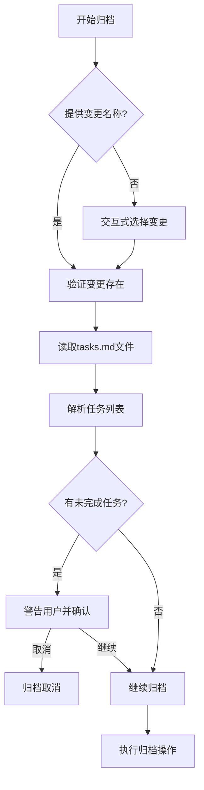
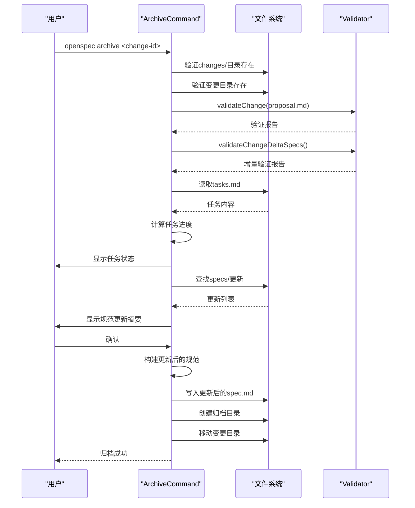

# 实施与归档

<cite>
**本文档中引用的文件**  
- [AGENTS.md](file://AGENTS.md)
- [archive.ts](file://src/core/archive.ts)
- [task-progress.ts](file://src/utils/task-progress.ts)
- [index.ts](file://src/cli/index.ts)
- [add-scaffold-command/tasks.md](file://openspec/changes/add-scaffold-command/tasks.md)
- [add-scaffold-command/proposal.md](file://openspec/changes/add-scaffold-command/proposal.md)
- [add-archive-command/proposal.md](file://openspec/changes/archive/2025-08-13-add-archive-command/proposal.md)
- [add-skip-specs-archive-option/proposal.md](file://openspec/changes/archive/2025-08-19-add-skip-specs-archive-option/proposal.md)
- [add-archive-command/specs/cli-archive/spec.md](file://openspec/changes/archive/2025-08-13-add-archive-command/specs/cli-archive/spec.md)
- [add-skip-specs-archive-option/specs/cli-archive/spec.md](file://openspec/changes/archive/2025-08-19-add-skip-specs-archive-option/specs/cli-archive/spec.md)
</cite>

## 目录
1. [变更实施流程](#变更实施流程)
2. [任务进度跟踪机制](#任务进度跟踪机制)
3. [归档命令工作原理](#归档命令工作原理)
4. [多能力变更处理策略](#多能力变更处理策略)
5. [部署后归档最佳实践](#部署后归档最佳实践)

## 变更实施流程

OpenSpec项目中的变更实施遵循严格的三阶段工作流程，确保变更的规范性和可追溯性。根据AGENTS.md中的指导，变更实施始于创建变更提案，通过`tasks.md`文件中的待办事项列表进行系统化实施。

变更实施的第一步是创建变更提案。当需要添加新功能、进行破坏性变更或修改架构时，开发人员需创建一个以动词开头的唯一`change-id`（如`add-`、`update-`、`remove-`），并在`openspec/changes/`目录下创建相应的变更目录。该目录包含`proposal.md`（说明变更原因和影响）、`tasks.md`（实施检查清单）和可选的`design.md`（技术决策），以及位于`specs/`子目录下的增量规范文件。

实施阶段严格遵循`tasks.md`中的待办事项列表。开发人员必须按顺序完成每个任务，确保所有实现步骤都被系统化地执行。在实施前，开发人员需要检查现有变更以避免冲突，并运行`openspec list`和`openspec list --specs`来了解当前上下文。这种基于任务清单的实施方法确保了变更的完整性和一致性，防止遗漏关键步骤。

**Section sources**
- [AGENTS.md](file://AGENTS.md#L49-L57)
- [add-scaffold-command/proposal.md](file://openspec/changes/add-scaffold-command/proposal.md#L1-L12)

## 任务进度跟踪机制

OpenSpec通过`task-progress.ts`工具和`tasks.md`文件实现任务完成状态的跟踪。`tasks.md`文件采用标准的Markdown待办事项列表格式，使用`- [ ]`表示待办任务，`- [x]`表示已完成任务。这种简单的标记系统使得任务状态的识别和跟踪变得直观且易于自动化。

`src/utils/task-progress.ts`文件中的`getTaskProgressForChange`函数负责解析`tasks.md`文件并计算任务进度。该函数读取指定变更目录下的`tasks.md`文件内容，通过正则表达式`/^[-*]\s+\[[\sx]\]/i`匹配所有任务项，并使用`/^[-*]\s+\[x\]/i`识别已完成的任务。它返回一个包含`total`（总任务数）和`completed`（已完成任务数）的`TaskProgress`对象。

在归档过程中，`ArchiveCommand`会调用`getTaskProgressForChange`来检查任务完成状态。如果发现未完成的任务，系统会向用户发出警告并提示确认是否继续归档。这种机制防止了不完整变更的意外归档，确保只有完全实现的变更才能被归档。`formatTaskStatus`函数将进度数据格式化为用户友好的字符串，如"2/5 tasks"或"✓ Complete"，便于在命令行界面中显示。

**Diagram sources**
- [task-progress.ts](file://src/utils/task-progress.ts#L1-L44)
- [archive.ts](file://src/core/archive.ts#L144-L163)

**Section sources**
- [task-progress.ts](file://src/utils/task-progress.ts#L1-L44)
- [archive.ts](file://src/core/archive.ts#L144-L163)

## 归档命令工作原理

`openspec archive`命令是OpenSpec变更管理流程的核心，负责将已完成的变更从活动目录移动到归档目录，并更新主规范文件。该命令的实现位于`src/core/archive.ts`中的`ArchiveCommand`类，通过一系列步骤确保归档过程的安全性和完整性。

归档过程首先验证变更目录的存在性。如果未提供变更名称，命令会显示一个交互式列表供用户选择要归档的变更。然后，命令执行验证检查，包括对`proposal.md`和增量规范文件的验证。如果验证失败，归档将被阻止，除非使用`--no-validate`标志跳过验证（不推荐）。

在验证通过后，命令会检查`tasks.md`中的任务完成状态。如果存在未完成的任务，系统会发出警告并提示用户确认是否继续。接下来，命令处理规范更新。它会查找变更目录下的`specs/`子目录，并确定需要创建或更新的主规范文件。系统会显示一个摘要，列出将被创建或更新的规范，并提示用户确认。

如果用户确认或使用`--yes`标志，命令会构建更新后的规范内容。它按特定顺序应用操作：重命名（RENAMED）→ 移除（REMOVED）→ 修改（MODIFIED）→ 添加（ADDED）。这确保了操作的正确性和一致性。更新后的规范文件会被写入`openspec/specs/`目录。最后，命令创建一个以当前日期为前缀的归档目录（格式为`YYYY-MM-DD-[change-name]`），并将变更目录移动到归档目录中。

**Diagram sources**
- [archive.ts](file://src/core/archive.ts#L22-L256)
- [index.ts](file://src/cli/index.ts#L184-L199)

### --skip-specs选项的使用场景

`--skip-specs`选项是为特定场景设计的重要功能，允许在不更新主规范文件的情况下归档变更。根据`add-skip-specs-archive-option`提案，此选项主要用于不修改规范的变更，如基础设施更新、工具配置更改或文档修改。

当使用`--skip-specs`标志时，归档命令会跳过整个规范更新流程。它不会查找变更中的`specs/`目录，也不会提示用户确认规范更新。相反，它会直接显示一条消息"Skipping spec updates (--skip-specs flag provided)."并继续执行归档操作。这使得归档过程更加高效，避免了不必要的交互和文件操作。

此选项在自动化脚本和CI/CD管道中特别有用。结合`--yes`标志，可以实现完全非交互式的归档操作，例如`openspec archive <change-id> --skip-specs --yes`。这种组合允许自动化系统在不修改主规范的情况下归档工具配置变更，确保归档过程的灵活性和适应性。

**Section sources**
- [add-skip-specs-archive-option/proposal.md](file://openspec/changes/archive/2025-08-19-add-skip-specs-archive-option/proposal.md#L1-L13)
- [archive.ts](file://src/core/archive.ts#L166-L189)

## 多能力变更处理策略

OpenSpec支持处理影响多个能力的复杂变更，通过在变更目录的`specs/`子目录下创建多个增量规范文件来实现。这种结构允许一个变更提案同时修改多个独立的能力，同时保持每个能力规范的清晰和分离。

处理多能力变更的策略始于变更提案的创建。开发人员在`changes/[change-id]/specs/`目录下为每个受影响的能力创建子目录和`spec.md`文件。例如，一个添加双因素认证的变更可能同时影响`auth`和`notifications`两个能力，因此需要创建`specs/auth/spec.md`和`specs/notifications/spec.md`两个文件。

在归档过程中，`ArchiveCommand`会自动发现并处理所有增量规范文件。`findSpecUpdates`方法会遍历变更目录下的`specs/`子目录，为每个找到的`spec.md`文件创建一个`SpecUpdate`对象。然后，`buildUpdatedSpec`方法会为每个主规范文件构建更新后的内容，应用所有相关的增量操作。

这种策略确保了多能力变更的原子性：所有规范更新要么全部成功，要么全部失败。如果任何一个规范文件的构建或验证失败，整个归档操作将被中止，防止部分更新导致系统状态不一致。这种设计既支持复杂的跨能力变更，又保持了系统的完整性和可靠性。

**Section sources**
- [AGENTS.md](file://AGENTS.md#L347-L373)
- [archive.ts](file://src/core/archive.ts#L307-L346)

## 部署后归档最佳实践

根据AGENTS.md中的归档指南，部署后通过单独的PR执行归档操作是确保变更管理流程完整性的关键最佳实践。这种分离的流程将变更的实现和归档作为两个独立的步骤，提高了透明度和可追溯性。

归档的最佳实践始于变更的批准和实施。开发人员必须在开始实施前获得变更提案的批准。实施完成后，变更应通过正常的代码审查和部署流程发布到生产环境。只有在变更成功部署后，才应创建单独的归档PR。

归档PR的创建遵循特定的流程。开发人员应使用`openspec archive <change-id>`命令来归档变更。该命令会自动处理规范更新和目录移动。对于仅更新工具配置的变更，应使用`--skip-specs`选项。归档后，应运行`openspec validate --strict`来确认归档的变更通过所有检查。

这种分离的流程有几个重要优势。首先，它确保了变更的实现和归档是可追溯的独立事件。其次，它允许在归档前验证变更在生产环境中的行为。最后，它提供了额外的审查机会，确保只有完全成功和部署的变更才会被归档。这种严谨的流程是OpenSpec规范驱动开发方法的核心，确保了项目文档和代码状态的一致性。

**Section sources**
- [AGENTS.md](file://AGENTS.md#L59-L65)
- [add-archive-command/proposal.md](file://openspec/changes/archive/2025-08-13-add-archive-command/proposal.md#L1-L15)