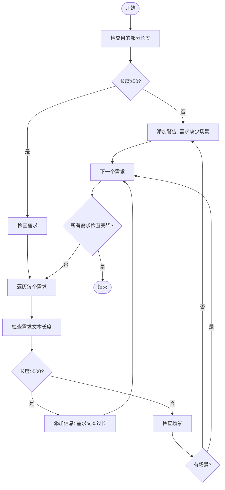
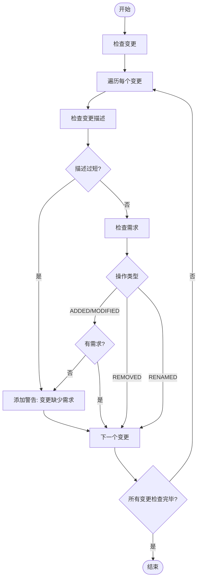

# 审查与验证

<cite>
**本文档中引用的文件**
- [validate.ts](file://src/commands/validate.ts)
- [validator.ts](file://src/core/validation/validator.ts)
- [constants.ts](file://src/core/validation/constants.ts)
- [types.ts](file://src/core/validation/types.ts)
- [markdown-parser.ts](file://src/core/parsers/markdown-parser.ts)
- [change-parser.ts](file://src/core/parsers/change-parser.ts)
- [base.schema.ts](file://src/core/schemas/base.schema.ts)
- [change.schema.ts](file://src/core/schemas/change.schema.ts)
- [item-discovery.ts](file://src/utils/item-discovery.ts)
</cite>

## 目录
1. [介绍](#介绍)
2. [验证命令使用模式](#验证命令使用模式)
3. [验证器检查机制](#验证器检查机制)
4. [验证报告输出格式](#验证报告输出格式)
5. [作用域感知验证](#作用域感知验证)
6. [常见验证错误处理策略](#常见验证错误处理策略)

## 介绍
OpenSpec系统提供了一套全面的验证机制，用于确保变更提案和规范文档的质量与一致性。`openspec validate`命令是这一机制的核心，它通过多层次的检查来验证文件结构、Markdown格式、Zod模式合规性以及业务规则。本文档详细介绍了该命令的各种使用模式、验证器的工作原理、报告输出格式以及高级功能。

## 验证命令使用模式

`openspec validate`命令提供了多种使用模式，以满足不同的验证需求。这些模式包括验证特定变更、验证所有变更以及使用`--strict`严格模式。

### 验证特定变更
要验证特定的变更或规范，可以直接指定项目名称：
```bash
openspec validate <item-name>
```
该命令会自动检测项目类型（变更或规范），如果名称在变更和规范中都存在，则会提示歧义并要求使用`--type`参数明确指定类型。

### 验证所有变更
使用`--all`标志可以验证所有活动变更和规范：
```bash
openspec validate --all
```
此模式会并行验证所有变更和规范，提供批量验证的效率。

### 验证所有变更或规范
可以分别验证所有变更或所有规范：
```bash
openspec validate --changes  # 仅验证所有变更
openspec validate --specs    # 仅验证所有规范
```

### 交互式验证
在交互式终端中运行`openspec validate`时，系统会提示用户选择要验证的项目：
```bash
openspec validate
```
用户可以选择验证全部、所有变更、所有规范或选择特定项目进行验证。

### 严格模式
使用`--strict`标志启用严格模式，该模式下警告也会导致验证失败：
```bash
openspec validate --all --strict
```
在严格模式下，只有没有任何错误和警告的项目才会被视为有效。

**Section sources**
- [validate.ts](file://src/commands/validate.ts#L30-L306)

## 验证器检查机制

验证器执行多层次的检查，确保变更提案和规范文档的质量。这些检查包括文件结构、Markdown格式、Zod模式合规性以及业务规则。

### 文件结构检查
验证器首先检查文件的基本结构是否符合预期。对于规范文件，必须包含"## Purpose"和"## Requirements"部分；对于变更提案，必须包含"## Why"和"## What Changes"部分。

### Markdown格式检查
验证器使用`MarkdownParser`类解析Markdown内容，确保标题层次结构正确，内容格式符合规范。解析器会识别各级标题并构建相应的节结构。

### Zod模式合规性检查
验证器使用Zod库定义的模式来验证数据结构的合规性。这些模式定义了字段的类型、长度限制和必需性。

#### 规范模式
规范模式要求：
- 名称不能为空
- 目的（Purpose）部分至少50个字符
- 必须包含至少一个需求
- 每个需求必须包含SHALL或MUST关键字
- 每个需求必须包含至少一个场景

#### 变更模式
变更模式要求：
- 名称不能为空
- Why部分至少50个字符
- What Changes部分不能为空
- 必须包含至少一个变更（delta）
- 变更描述不能为空

### 业务规则检查
除了基本的结构和格式检查外，验证器还执行特定的业务规则检查。

#### 规范业务规则


**Diagram sources**
- [validator.ts](file://src/core/validation/validator.ts#L288-L318)

#### 变更业务规则


**Diagram sources**
- [validator.ts](file://src/core/validation/validator.ts#L320-L345)

**Section sources**
- [validator.ts](file://src/core/validation/validator.ts#L15-L449)
- [constants.ts](file://src/core/validation/constants.ts#L1-L49)
- [base.schema.ts](file://src/core/schemas/base.schema.ts#L1-L20)
- [change.schema.ts](file://src/core/schemas/change.schema.ts#L1-L42)

## 验证报告输出格式

验证报告提供了详细的验证结果，包括错误、警告和信息消息的分类。

### 标准输出格式
在非JSON模式下，验证报告以人类可读的格式输出：
- 有效项目显示为"✓"
- 无效项目显示为"✗"
- 错误以"✗ ERROR"标记
- 警告以"⚠ WARNING"标记
- 信息以"ℹ INFO"标记

### JSON输出格式
使用`--json`标志可以输出结构化的JSON报告：
```json
{
  "items": [
    {
      "id": "change-id",
      "type": "change",
      "valid": false,
      "issues": [
        {
          "level": "ERROR",
          "path": "file",
          "message": "Change must have at least one delta"
        }
      ],
      "durationMs": 123
    }
  ],
  "summary": {
    "totals": {
      "items": 1,
      "passed": 0,
      "failed": 1
    },
    "byType": {
      "change": {
        "items": 1,
        "passed": 0,
        "failed": 1
      }
    }
  },
  "version": "1.0"
}
```

### 报告摘要
批量验证完成后，系统会输出摘要信息：
```
Totals: 3 passed, 2 failed (5 items)
```
摘要包括总项目数、通过数和失败数，按类型分类统计。

**Section sources**
- [validate.ts](file://src/commands/validate.ts#L149-L272)

## 作用域感知验证

结合make-validation-scope-aware变更提案，验证系统实现了作用域感知验证的高级功能。这种功能允许验证器根据不同的作用域应用不同的验证规则。

### 作用域定义
作用域可以基于以下因素定义：
- 项目类型（变更、规范）
- 项目状态（活动、归档）
- 项目领域（前端、后端、基础设施）

### 作用域特定规则
不同作用域可以应用不同的验证规则：
- 严格模式作用域：所有警告都视为错误
- 开发作用域：某些规则可以放宽
- 生产作用域：所有规则都必须严格遵守

### 动态规则应用
验证器根据项目的作用域动态选择和应用相应的验证规则。这种机制提高了验证系统的灵活性和适应性，使其能够满足不同环境和阶段的需求。

**Section sources**
- [validate.ts](file://src/commands/validate.ts#L130-L147)
- [validator.ts](file://src/core/validation/validator.ts#L18-L20)

## 常见验证错误处理策略

了解常见验证错误及其处理策略对于高效使用OpenSpec系统至关重要。

### 文件结构错误
**错误**: "No delta sections found"
**原因**: 变更提案的specs目录中缺少ADDED/MODIFIED/REMOVED/RENAMED部分
**解决方案**: 
1. 确保在specs/:spec-name/spec.md文件中添加适当的delta标题
2. 每个需求必须包含至少一个"#### Scenario:"块

### Markdown格式错误
**错误**: "Spec must have a Purpose section"
**原因**: 规范文件缺少"## Purpose"部分
**解决方案**: 
1. 添加"## Purpose"标题
2. 在标题后提供至少50个字符的目的描述

### Zod模式错误
**错误**: "Requirement must contain SHALL or MUST"
**原因**: 需求文本中缺少SHALL或MUST关键字
**解决方案**: 
1. 在需求文本中添加SHALL或MUST关键字
2. 确保关键字是完整的单词，而不是其他单词的一部分

### 业务规则错误
**错误**: "ADDED requirement must include at least one scenario"
**原因**: 新增需求缺少场景描述
**解决方案**: 
1. 为每个新增需求添加至少一个"#### Scenario:"块
2. 使用标准格式编写场景：
   ```
   #### Scenario: 场景名称
   - **WHEN** ...
   - **THEN** ...
   ```

### 最佳实践
1. **提前验证**: 在提交变更前使用`openspec validate`检查
2. **使用严格模式**: 在CI/CD管道中使用`--strict`标志
3. **批量验证**: 使用`--all`标志定期检查所有项目
4. **关注警告**: 即使警告不会导致验证失败，也应尽量修复
5. **使用JSON输出**: 在自动化脚本中使用`--json`标志获取结构化结果

**Section sources**
- [validator.ts](file://src/core/validation/validator.ts#L347-L359)
- [constants.ts](file://src/core/validation/constants.ts#L40-L48)