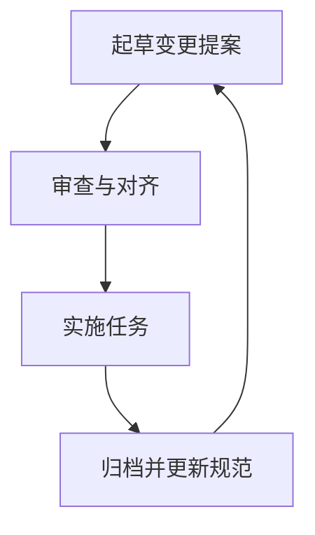
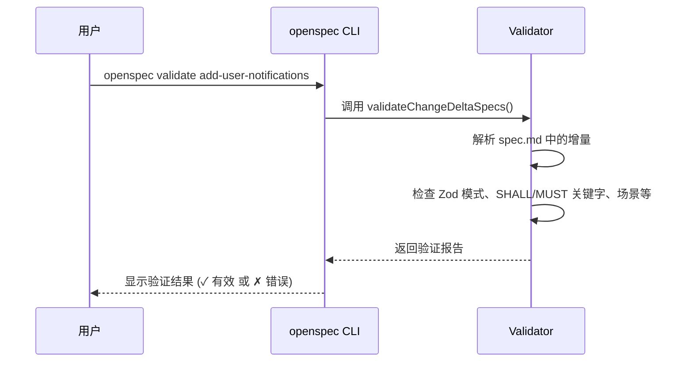
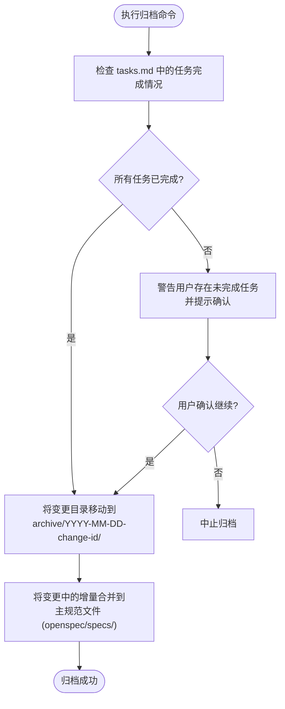

# 工作流程指南

<cite>
**本文档引用的文件**
- [README.md](file://README.md#L1-L371)
- [IMPLEMENTATION_ORDER.md](file://openspec/changes/IMPLEMENTATION_ORDER.md#L1-L68)
- [proposal.md](file://openspec/changes/add-scaffold-command/proposal.md#L1-L12)
- [spec.md](file://openspec/changes/add-scaffold-command/specs/cli-scaffold/spec.md#L1-L45)
- [tasks.md](file://openspec/changes/add-scaffold-command/tasks.md#L1-L12)
- [task-progress.ts](file://src/utils/task-progress.ts#L1-L44)
- [validator.ts](file://src/core/validation/validator.ts#L1-L449)
- [change.ts](file://src/commands/change.ts#L1-L292)
- [index.ts](file://src/cli/index.ts#L1-L254)
- [AGENTS.md](file://openspec/AGENTS.md#L75-L121)
- [package.json](file://package.json#L1-L74)
</cite>

## 目录
1. [简介](#简介)
2. [变更生命周期概览](#变更生命周期概览)
3. [创建变更提案](#创建变更提案)
4. [验证与审查](#验证与审查)
5. [实施代码变更](#实施代码变更)
6. [归档完成的变更](#归档完成的变更)
7. [任务进度跟踪机制](#任务进度跟踪机制)
8. [验证器行为与质量保证](#验证器行为与质量保证)
9. [高级策略](#高级策略)
10. [结论](#结论)

## 简介

OpenSpec 是一个为AI编码助手设计的规范驱动开发系统，旨在在编写任何代码之前，通过规范锁定开发意图，确保人类与AI对要构建的内容达成一致。该系统通过轻量级的工作流程，将变更提案、任务清单和规范更新组织在结构化的变更文件夹中，提供明确且可审计的开发过程。本指南将基于 `IMPLEMENTATION_ORDER.md` 中定义的实施顺序，详细介绍从创建变更提案到归档完成的完整生命周期流程。

**Section sources**
- [README.md](file://README.md#L1-L371)

## 变更生命周期概览

OpenSpec 的核心工作流程是一个清晰的四步循环，确保开发过程的可预测性和可追溯性。



**Diagram sources**
- [README.md](file://README.md#L54-L76)

此流程强调在实施前对规范进行审查和对齐，确保所有利益相关者（包括AI助手）对变更的预期行为达成共识。每个变更都作为一个独立的单元进行管理，从创建到最终归档，形成一个完整的生命周期。

**Section sources**
- [README.md](file://README.md#L78-L81)

## 创建变更提案

创建变更提案是启动任何新功能或修改的起点。此阶段的目标是生成一个结构化的变更目录，其中包含描述变更目的、范围和影响的初始文件。

### 创建变更目录

当您需要添加新功能（如“添加用户通知”）时，AI助手会自动创建一个新的变更目录。该目录位于 `openspec/changes/` 下，其名称通常采用 kebab-case 格式（如 `add-user-notifications`）。此目录是变更的专属工作区，所有相关的提案、任务和规范更新都将存放于此。

### 编写 proposal.md 和 spec.md

在变更目录中，AI助手会生成两个核心文件：

1.  **`proposal.md`**: 此文件阐述变更的“为什么”和“是什么”。它包含 `## Why`（原因）、`## What Changes`（变更内容）和 `## Impact`（影响）等部分，清晰地描述了变更的业务价值、具体修改和对现有系统的影响。
2.  **`specs/[capability]/spec.md`**: 此文件位于变更目录内的 `specs` 子目录下，包含对现有规范的“增量”（delta）。它使用 `## ADDED Requirements`、`## MODIFIED Requirements` 等特殊标题来明确指出哪些规范将被添加、修改或移除。这确保了变更的意图与实现细节是分离的。

**Section sources**
- [README.md](file://README.md#L174-L213)
- [proposal.md](file://openspec/changes/add-scaffold-command/proposal.md#L1-L12)
- [spec.md](file://openspec/changes/add-scaffold-command/specs/cli-scaffold/spec.md#L1-L45)

## 验证与审查

在开始实施之前，必须对变更提案进行验证和审查，以确保其质量和一致性。

### 使用 `validate` 命令检查

`openspec validate` 命令是确保变更质量的关键工具。它可以对单个变更或所有变更进行验证。



**Diagram sources**
- [validator.ts](file://src/core/validation/validator.ts#L113-L272)
- [change.ts](file://src/commands/change.ts#L185-L239)

该命令会执行严格的检查，例如：
- 确保每个 `ADDED` 或 `MODIFIED` 的需求都包含 `SHALL` 或 `MUST` 关键字。
- 确保每个需求至少有一个 `#### Scenario:` 场景。
- 检查增量部分（如 `## ADDED Requirements`）是否存在且不为空。

### 使用 `list` 和 `view` 命令跟踪进度

- **`openspec list`**: 此命令列出所有处于活动状态的变更。它提供了一个快速概览，帮助您了解当前正在进行的变更。
- **`openspec view`**: 此命令启动一个交互式仪表板，以更直观的方式展示所有规范和变更的状态，是进行全局审查的理想工具。

**Section sources**
- [README.md](file://README.md#L238-L245)
- [AGENTS.md](file://openspec/AGENTS.md#L75-L121)

## 实施代码变更

一旦变更提案通过验证并获得批准，即可进入实施阶段。

在此阶段，AI助手会根据 `tasks.md` 文件中定义的任务清单来编写代码。`tasks.md` 文件通常包含一个带复选框的待办事项列表（如 `- [ ] 1.1 添加数据库列`）。随着任务的完成，复选框会被标记为完成（`- [x]`），从而直观地跟踪实施进度。

**Section sources**
- [README.md](file://README.md#L204-L214)

## 归档完成的变更

当所有任务都完成后，最后一个步骤是使用 `archive` 命令将变更归档。



**Diagram sources**
- [index.ts](file://src/cli/index.ts#L184-L199)
- [AGENTS.md](file://openspec/AGENTS.md#L446-L455)

`openspec archive <change-id>` 命令会：
1.  检查 `tasks.md` 文件，如果存在未完成的任务，会发出警告并要求确认。
2.  将变更目录从 `openspec/changes/` 移动到 `openspec/archive/` 下，并以日期为前缀。
3.  （默认情况下）将变更中的规范增量合并到主规范库中，确保系统文档保持最新。

**Section sources**
- [README.md](file://README.md#L216-L233)
- [index.ts](file://src/cli/index.ts#L184-L199)

## 任务进度跟踪机制

OpenSpec 使用 `task-progress.ts` 文件中的逻辑来自动跟踪任务进度。该机制通过解析 `tasks.md` 文件中的 Markdown 语法来工作。

```typescript
// 伪代码表示 task-progress.ts 的核心逻辑
function countTasksFromContent(content: string): TaskProgress {
  const TASK_PATTERN = /^[-*]\s+\[[\sx]\]/i; // 匹配任务行
  const COMPLETED_TASK_PATTERN = /^[-*]\s+\[x\]/i; // 匹配已完成任务

  let total = 0;
  let completed = 0;

  for (const line of content.split('\n')) {
    if (line.match(TASK_PATTERN)) {
      total++;
      if (line.match(COMPLETED_TASK_PATTERN)) {
        completed++;
      }
    }
  }

  return { total, completed };
}
```

此机制使得 `openspec list --long` 等命令能够显示每个变更的 `[tasks 3/5]` 进度，为团队提供了一种简单而有效的方式来管理复杂变更的实施状态。

**Section sources**
- [task-progress.ts](file://src/utils/task-progress.ts#L1-L44)

## 验证器行为与质量保证

`validator.ts` 是 OpenSpec 的质量保证核心。它在工作流程的多个阶段发挥作用，确保所有规范和变更都符合预定义的规则。

### 验证器在流程各阶段的应用

- **创建后**: 在起草 `proposal.md` 和 `spec.md` 后，立即运行 `openspec validate` 可以捕获格式错误，防止问题进入后续阶段。
- **审查时**: 在审查过程中，验证器的输出为讨论提供了客观依据，确保所有需求都清晰、完整且无歧义。
- **归档前**: 在执行 `archive` 命令前，系统会自动进行最终验证，作为防止有缺陷的变更进入主规范库的最后防线。

验证器利用 Zod 库定义了严格的模式（schemas），并实现了自定义规则（如检查 `SHALL/MUST` 关键字），确保了整个系统的一致性和可靠性。

**Section sources**
- [validator.ts](file://src/core/validation/validator.ts#L1-L449)

## 高级策略

### 处理冲突与回滚

如果在归档后发现变更存在问题，可以通过以下方式处理：
1.  **回滚**: 从 `openspec/archive/` 目录中找到该变更的备份，手动恢复之前的规范文件。
2.  **创建修复变更**: 创建一个新的变更提案，其增量旨在撤销或修正前一个变更的错误。这保持了历史记录的完整性。

### 并行开发

多个团队成员可以同时在不同的变更上工作。由于每个变更都封装在独立的目录中，因此并行开发是安全的。`openspec list` 命令有助于协调，避免对同一功能进行重复工作。

### 并行实施机会

根据 `IMPLEMENTATION_ORDER.md` 的指导，即使在单个变更的实施过程中，也存在并行工作的机会。例如，在“基础”阶段，可以并行设计模式、实现验证规则和开发解析器。

**Section sources**
- [IMPLEMENTATION_ORDER.md](file://openspec/changes/IMPLEMENTATION_ORDER.md#L64-L68)

## 结论

通过遵循此循序渐进的工作流程指南，您可以有效地利用 OpenSpec 来管理项目中的变更。从创建结构化的变更提案，到使用验证器确保质量，再到通过归档完成生命周期，OpenSpec 提供了一套完整的工具来协调人类与AI的开发工作。任务进度跟踪和清晰的命令结构使得管理复杂项目变得简单明了，最终实现更可预测、更可审查的开发成果。