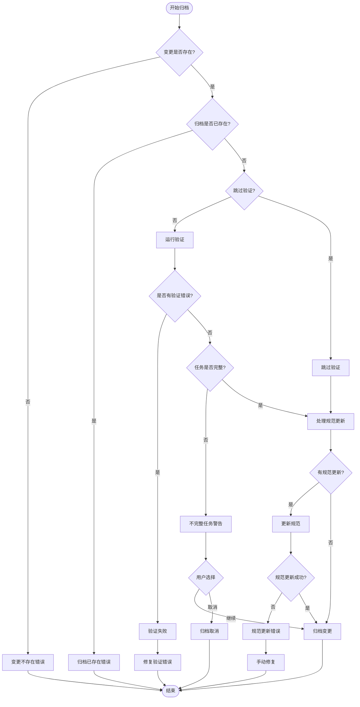
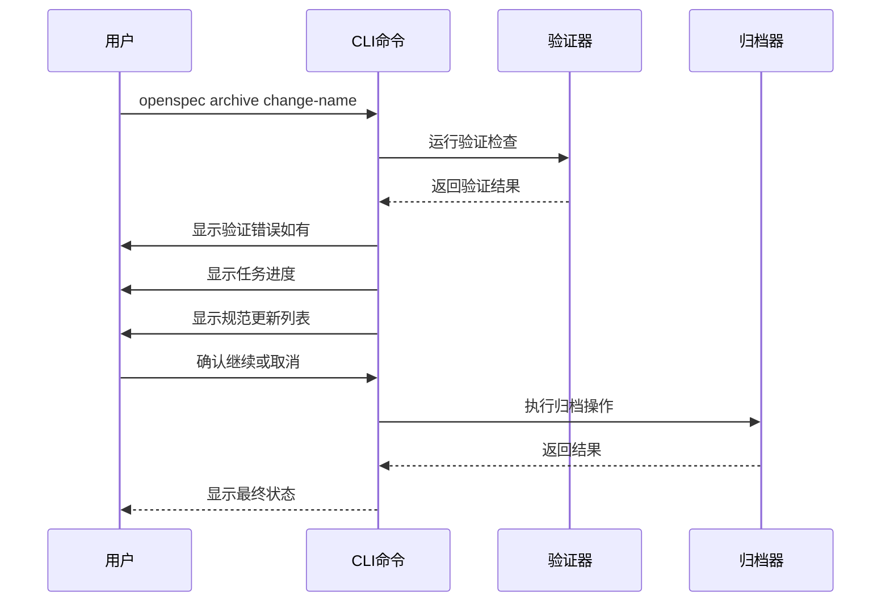
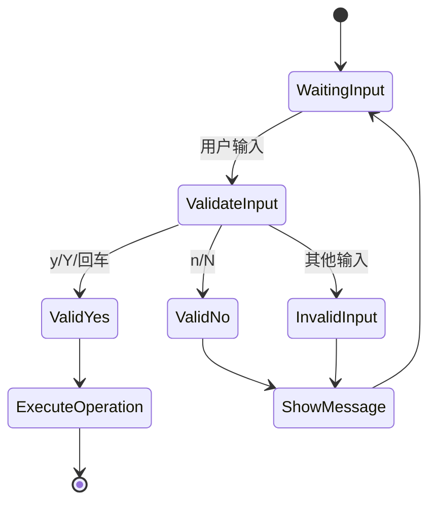

# 归档错误故障排除指南

<cite>
**本文档中引用的文件**
- [test/core/archive.test.ts](file://test/core/archive.test.ts)
- [src/core/archive.ts](file://src/core/archive.ts)
- [src/utils/task-progress.ts](file://src/utils/task-progress.ts)
- [src/core/parsers/requirement-blocks.ts](file://src/core/parsers/requirement-blocks.ts)
- [src/cli/index.ts](file://src/cli/index.ts)
- [src/core/validation/validator.ts](file://src/core/validation/validator.ts)
</cite>

## 目录
1. [简介](#简介)
2. [常见错误场景](#常见错误场景)
3. [详细故障排除指南](#详细故障排除指南)
4. [CLI标志和选项](#cli标志和选项)
5. [交互式模式处理](#交互式模式处理)
6. [调试技巧](#调试技巧)
7. [最佳实践](#最佳实践)
8. [总结](#总结)

## 简介

OpenSpec的归档（archive）功能是将完成的变更从活动状态转移到历史存档的重要机制。当执行`openspec archive`命令时，可能会遇到各种错误情况。本指南基于`archive.test.ts`测试用例，详细说明了典型错误场景、症状表现、根本原因分析和解决方案。

## 常见错误场景

### 1. 变更不存在错误

**症状：**
```
Error: Change 'non-existent-change' not found.
```

**根本原因：**
指定的变更名称在`openspec/changes/`目录下不存在。

**解决方案：**
- 使用`openspec list`查看可用的变更列表
- 确认变更名称拼写正确
- 检查是否已经归档过该变更

### 2. 归档目录已存在错误

**症状：**
```
Error: Archive '2025-01-11-add-update-command' already exists.
```

**根本原因：**
尝试归档的变更已经存在于`openspec/changes/archive/`目录中。

**解决方案：**
- 检查归档目录内容
- 如果需要重新归档，先清理旧的归档
- 或者使用不同的变更名称

### 3. 修改或删除操作引用了不存在的需求

**症状：**
```
Error: gamma MODIFIED failed for header "### Requirement: Missing" - not found
```

**根本原因：**
变更中的MODIFIED或REMOVED操作引用了主规范中不存在的需求。

**解决方案：**
- 检查主规范文件中的需求列表
- 确保MODIFIED和REMOVED操作引用的是存在的需求
- 如果需求已被移除，考虑使用ADDED添加新需求

### 4. 重命名后修改操作未引用新名称

**症状：**
```
Error: when a rename exists, MODIFIED must reference the NEW header "### Requirement: New"
```

**根本原因：**
在RENAMED操作之后，MODIFIED操作仍然引用原始需求名称，而不是重命名后的新名称。

**解决方案：**
- 在RENAMED操作中，确保MODIFIED操作引用新的需求名称
- 保持需求名称的一致性

### 5. 多规范更新时原子性失败

**症状：**
多个规范同时更新时，部分成功部分失败，导致数据不一致。

**根本原因：**
一个规范更新失败后，其他已经成功更新的规范不会回滚。

**解决方案：**
- 使用`--no-validate`跳过验证（谨慎使用）
- 手动检查和修复受影响的规范
- 考虑逐个更新规范

### 6. 不完整的任务项警告

**症状：**
```
Warning: 2 incomplete task(s) found
```

**根本原因：**
变更中的任务列表包含未完成的任务。

**解决方案：**
- 使用`--yes`标志跳过任务检查
- 完成所有任务后再归档
- 检查`tasks.md`文件格式

## 详细故障排除指南

### 错误诊断流程



**图表来源**
- [src/core/archive.ts](file://src/core/archive.ts#L22-L256)

### 具体错误处理

#### 变更不存在错误

**症状识别：**
- 错误消息：`Change 'change-name' not found.`
- 文件系统检查失败

**根因分析：**
- 变更目录不存在
- 目录权限问题
- 文件系统同步延迟

**解决步骤：**
1. 验证变更目录结构
2. 检查文件系统权限
3. 确认OpenSpec项目初始化状态

**预防措施：**
- 使用`openspec list`确认变更存在
- 定期备份项目状态
- 确保文件系统同步

#### 规范验证错误

**症状识别：**
- 验证错误列表
- 特定需求验证失败
- 格式化错误

**根因分析：**
- 需求格式不符合规范
- 缺少必需字段
- 重复的需求定义

**解决步骤：**
1. 检查变更规范文件格式
2. 验证需求标题唯一性
3. 确保必需字段完整

**预防措施：**
- 使用`openspec validate`预检查
- 遵循OpenSpec约定格式
- 定期进行规范审查

#### 任务进度警告

**症状识别：**
- 不完整任务数量显示
- 用户确认提示
- 归档过程暂停

**根因分析：**
- 任务标记格式错误
- 任务统计计算问题
- 用户交互中断

**解决步骤：**
1. 检查`tasks.md`文件格式
2. 确认任务标记语法正确
3. 使用`--yes`标志跳过确认

**预防措施：**
- 完成所有任务后再归档
- 定期更新任务状态
- 使用自动化工具检查任务完整性

**章节来源**
- [test/core/archive.test.ts](file://test/core/archive.test.ts#L130-L150)
- [src/core/archive.ts](file://src/core/archive.ts#L48-L82)

## CLI标志和选项

### 主要标志详解

| 标志 | 短标志 | 描述 | 使用场景 |
|------|--------|------|----------|
| `--yes` | `-y` | 跳过所有确认提示 | 自动化脚本、批量处理 |
| `--skip-specs` | 无 | 跳过规范更新操作 | 基础设施变更、文档更新 |
| `--no-validate` | 无 | 跳过验证检查 | 快速归档、紧急情况 |

### 交互式模式行为



**图表来源**
- [src/core/archive.ts](file://src/core/archive.ts#L128-L142)
- [src/core/archive.ts](file://src/core/archive.ts#L144-L163)

### 标志组合使用

**安全模式：**
```bash
openspec archive change-name
```
- 启用完整验证
- 显示任务进度
- 请求确认

**快速模式：**
```bash
openspec archive change-name --yes
```
- 跳过所有确认
- 保持验证检查

**跳过验证：**
```bash
openspec archive change-name --no-validate
```
- 跳过验证检查
- 需要额外确认
- 危险操作

**仅归档不更新：**
```bash
openspec archive change-name --skip-specs
```
- 归档变更但不更新规范
- 适用于文档或基础设施变更

**章节来源**
- [src/cli/index.ts](file://src/cli/index.ts#L184-L199)

## 交互式模式处理

### 确认提示类型

#### 1. 验证错误确认
**提示内容：**
```
Validation errors in change delta specs:
  ✗ Requirement not found in main spec
Continue? (y/N)
```

**处理策略：**
- 仔细阅读错误详情
- 修复相关问题后重试
- 使用`--no-validate`跳过验证（谨慎）

#### 2. 任务进度确认
**提示内容：**
```
Warning: 3 incomplete task(s) found. Continue?
```

**处理策略：**
- 完成所有任务后再继续
- 使用`--yes`跳过确认
- 评估任务重要性

#### 3. 规范更新确认
**提示内容：**
```
Proceed with spec updates?
```

**处理策略：**
- 查看即将更新的规范列表
- 确认更新内容符合预期
- 取消以避免意外更改

### 用户输入处理



**图表来源**
- [src/core/archive.ts](file://src/core/archive.ts#L128-L142)

### 异常情况处理

#### 用户取消操作
**症状：**
- Ctrl+C中断
- 输入'n'或'N'
- 空输入拒绝

**恢复策略：**
- 保持项目状态不变
- 清理临时文件
- 提供下一步建议

#### 系统中断
**症状：**
- 程序异常终止
- 文件系统错误
- 内存不足

**恢复策略：**
- 检查文件系统完整性
- 恢复损坏的文件
- 重新初始化项目状态

**章节来源**
- [test/core/archive.test.ts](file://test/core/archive.test.ts#L628-L680)
- [src/core/archive.ts](file://src/core/archive.ts#L258-L300)

## 调试技巧

### 1. 检查归档前后的文件差异

**使用Git比较：**
```bash
# 创建归档前的快照
git add .
git commit -m "before-archive"

# 执行归档
openspec archive change-name

# 比较归档前后的变化
git diff HEAD~1
```

**使用文件系统监控：**
```bash
# 监控文件系统变化
ls -la openspec/changes/
ls -la openspec/changes/archive/

# 检查规范文件变化
diff openspec/specs/old-spec/spec.md openspec/specs/new-spec/spec.md
```

### 2. 分析验证错误

**启用详细日志：**
```bash
# 设置环境变量启用调试
DEBUG=openspec:* openspec archive change-name

# 或使用验证报告
openspec validate change-name --json > validation-report.json
```

**检查特定错误类型：**
```bash
# 检查规范格式错误
grep -n "format" validation-report.json

# 检查需求验证错误
grep -n "requirement" validation-report.json
```

### 3. 测试验证规则

**单元测试验证：**
```javascript
// 基于测试用例的验证逻辑
const testCases = [
  { name: 'valid-change', expected: true },
  { name: 'invalid-change', expected: false }
];

testCases.forEach(test => {
  const result = validateChange(test.name);
  console.log(`${test.name}: ${result.valid}`);
});
```

### 4. 性能分析

**监控归档时间：**
```bash
# 使用时间命令测量
time openspec archive change-name

# 分析不同阶段耗时
openspec archive change-name 2>&1 | tee archive-log.txt
```

**内存使用监控：**
```bash
# 监控内存使用
ps aux | grep openspec

# 检查大文件处理
du -sh openspec/specs/* | sort -hr
```

### 5. 数据一致性检查

**验证规范完整性：**
```bash
# 检查所有规范的格式
find openspec/specs -name "*.md" -exec openspec validate {} \;

# 检查需求唯一性
grep -h "^### Requirement:" openspec/specs/*.md | sort | uniq -d
```

**章节来源**
- [test/core/archive.test.ts](file://test/core/archive.test.ts#L555-L582)
- [src/core/validation/validator.ts](file://src/core/validation/validator.ts#L288-L318)

## 最佳实践

### 1. 归档前准备

**文件组织检查：**
- 确保`proposal.md`文件完整
- 验证`tasks.md`格式正确
- 检查规范文件命名规范

**验证清单：**
```bash
# 检查变更完整性
openspec validate change-name --strict

# 查看任务进度
openspec show change-name --deltas-only

# 预览规范更新
openspec show change-name --json | jq '.specUpdates'
```

### 2. 错误预防策略

**自动化验证：**
```bash
#!/bin/bash
# 归档前验证脚本
CHANGE_NAME=$1

# 验证变更格式
openspec validate "$CHANGE_NAME" --strict

# 检查任务完成度
TASK_STATUS=$(openspec show "$CHANGE_NAME" --deltas-only | jq '.tasks')
if [[ $TASK_STATUS == *"false"* ]]; then
    echo "警告：任务未完成"
    exit 1
fi

# 执行归档
openspec archive "$CHANGE_NAME" --yes
```

**版本控制集成：**
```bash
# Git钩子示例
#!/bin/bash
# pre-commit hook
if git diff --cached --name-only | grep -q "openspec/"; then
    echo "正在验证OpenSpec文件..."
    openspec validate --all
fi
```

### 3. 回滚和恢复

**安全归档策略：**
```bash
# 创建备份
cp -r openspec/openspec-backup .

# 执行归档
openspec archive change-name --yes

# 验证成功
if [ $? -eq 0 ]; then
    echo "归档成功"
else
    echo "归档失败，正在恢复..."
    rm -rf openspec/changes/archive/*
    cp -r openspec-backup/* openspec/
fi
```

**增量归档：**
```bash
# 分批归档大型项目
CHANGES=$(openspec list --changes)
for change in $CHANGES; do
    openspec archive "$change" --yes && sleep 1
done
```

### 4. 团队协作最佳实践

**规范审查流程：**
1. 开发人员完成变更
2. 进行本地验证
3. 提交Pull Request
4. 团队成员审查
5. 执行归档

**文档维护：**
- 记录常见错误和解决方案
- 维护故障排除检查清单
- 更新团队培训材料

**章节来源**
- [src/utils/task-progress.ts](file://src/utils/task-progress.ts#L12-L44)
- [src/core/parsers/requirement-blocks.ts](file://src/core/parsers/requirement-blocks.ts#L15-L235)

## 总结

OpenSpec归档功能是项目管理的重要组成部分，正确处理各种错误情况对于维护项目健康状态至关重要。通过本指南提供的详细故障排除方法、CLI标志使用技巧、交互式模式处理和调试技术，用户可以有效地解决归档过程中遇到的各种问题。

### 关键要点回顾

1. **错误分类**：了解不同类型错误的症状和根本原因
2. **预防措施**：通过验证和检查减少错误发生
3. **交互处理**：正确理解和响应CLI提示
4. **调试技巧**：使用适当的工具和技术定位问题
5. **最佳实践**：建立安全的工作流程和备份策略

### 下一步行动

- 根据本指南检查当前项目的归档流程
- 实施自动化验证和监控
- 建立团队知识共享机制
- 定期审查和更新故障排除程序

通过遵循这些指导原则和最佳实践，用户可以确保OpenSpec归档过程的稳定性和可靠性，从而提高整个开发流程的效率和质量。