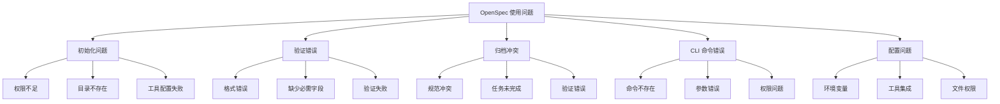
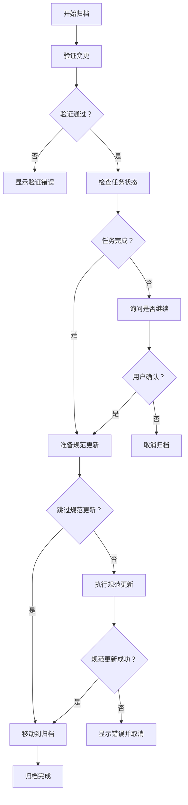
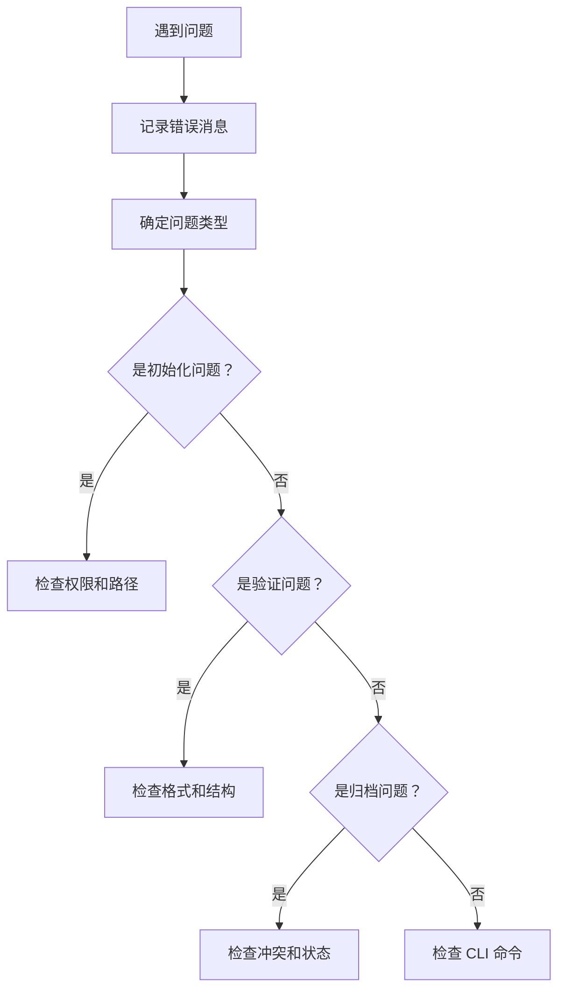

# 故障排除

<cite>
**本文档中引用的文件**
- [package.json](file://package.json)
- [README.md](file://README.md)
- [test/core/validation.test.ts](file://test/core/validation.test.ts)
- [test/core/init.test.ts](file://test/core/init.test.ts)
- [src/core/validation/validator.ts](file://src/core/validation/validator.ts)
- [src/core/init.ts](file://src/core/init.ts)
- [src/cli/index.ts](file://src/cli/index.ts)
- [src/commands/validate.ts](file://src/commands/validate.ts)
- [src/core/archive.ts](file://src/core/archive.ts)
- [src/core/validation/constants.ts](file://src/core/validation/constants.ts)
- [test/helpers/run-cli.ts](file://test/helpers/run-cli.ts)
</cite>

## 目录
1. [简介](#简介)
2. [常见问题分类](#常见问题分类)
3. [初始化问题](#初始化问题)
4. [验证错误](#验证错误)
5. [归档冲突](#归档冲突)
6. [CLI命令错误](#cli命令错误)
7. [调试技巧](#调试技巧)
8. [错误报告指南](#错误报告指南)
9. [故障排除流程](#故障排除流程)
10. [预防措施](#预防措施)

## 简介

OpenSpec 是一个面向 AI 的规范驱动开发系统，提供了完整的变更管理工作流。本指南旨在帮助用户识别、诊断和解决在使用 OpenSpec 过程中遇到的各种问题。无论您是初学者还是经验丰富的开发者，都能从本指南中获得实用的故障排除策略。

## 常见问题分类

OpenSpec 使用过程中可能遇到的问题主要分为以下几类：



## 初始化问题

### 问题：初始化失败

#### 症状
运行 `openspec init` 时出现错误消息，例如：
- "Insufficient permissions to write to [路径]"
- "Directory doesn't exist, it will be created."
- "Cannot access path '[路径]': [错误信息]"

#### 根本原因分析
1. **权限不足**：当前用户没有写入目标目录的权限
2. **路径无效**：指定的路径不存在或不是目录
3. **磁盘空间不足**：可用磁盘空间不足以创建文件结构

#### 解决步骤

1. **检查目录权限**
   ```bash
   # 检查当前目录权限
   ls -la
   
   # 如果需要，更改目录权限
   chmod 755 .
   ```

2. **验证路径有效性**
   ```bash
   # 检查路径是否存在
   ls -la [目标路径]
   
   # 创建缺失的目录
   mkdir -p [目标路径]
   ```

3. **以管理员身份运行（仅限必要情况）**
   ```bash
   sudo openspec init
   ```

#### 预防措施
- 在开始前确保有足够的磁盘空间
- 使用具有适当权限的用户账户
- 避免在受限制的系统目录中初始化

**章节来源**
- [src/core/init.ts](file://src/core/init.ts#L462-L472)
- [test/core/init.test.ts](file://test/core/init.test.ts#L685-L693)

### 问题：工具配置失败

#### 症状
初始化后某些 AI 工具无法正常工作，提示：
- "Tool configuration failed"
- "Slash commands not found"
- "Agent instructions missing"

#### 根本原因分析
1. **文件写入失败**：配置文件无法写入目标位置
2. **路径解析错误**：工具配置文件路径不正确
3. **权限限制**：文件系统权限阻止了配置文件的创建

#### 解决步骤

1. **手动检查配置文件**
   ```bash
   # 检查 AGENTS.md 文件
   cat openspec/AGENTS.md
   
   # 检查特定工具的配置文件
   ls -la .[工具名称]/
   ```

2. **重新运行初始化**
   ```bash
   openspec init --tools all
   ```

3. **检查文件权限**
   ```bash
   # 设置正确的文件权限
   chmod 644 openspec/AGENTS.md
   chmod 755 .[工具名称]/
   ```

**章节来源**
- [src/core/init.ts](file://src/core/init.ts#L763-L800)

## 验证错误

### 问题：规范格式错误

#### 症状
运行 `openspec validate` 时出现以下错误：
- "Spec must have a Purpose section"
- "Spec must have a Requirements section"
- "Requirement must contain SHALL or MUST keyword"
- "Scenario text cannot be empty"

#### 根本原因分析
1. **缺少必需部分**：规范文件缺少 `## Purpose` 或 `## Requirements` 部分
2. **格式不正确**：要求项缺少 `SHALL` 或 `MUST` 关键字
3. **场景缺失**：每个要求项缺少至少一个 `#### Scenario:` 块
4. **空文本**：场景文本为空

#### 解决步骤

1. **检查规范文件结构**
   ```bash
   # 查看规范文件内容
   cat openspec/specs/[规范名]/spec.md
   
   # 验证基本结构
   openspec validate [规范名] --json
   ```

2. **修复常见格式问题**
   ```markdown
   # 正确的规范结构示例
   
   # 用户认证规范
   
   ## Purpose
   定义系统的用户认证需求。
   
   ## Requirements
   
   ### 要求：安全用户认证
   系统必须提供安全的用户认证机制。
   
   #### 场景：成功登录
   - **当** 用户提供有效凭据时
   - **则** 系统应认证用户并重定向到仪表板
   ```

3. **使用严格模式验证**
   ```bash
   openspec validate [规范名] --strict
   ```

#### 错误消息对照表

| 错误消息 | 含义 | 解决方案 |
|---------|------|----------|
| "Purpose section cannot be empty" | Purpose 部分为空 | 添加简短的用途说明 |
| "Spec must have at least one requirement" | 缺少要求项 | 添加至少一个要求项 |
| "Requirement must contain SHALL or MUST" | 要求项缺少关键字 | 确保要求包含 SHALL 或 MUST |
| "Requirement must have at least one scenario" | 缺少场景 | 为每个要求添加至少一个场景 |
| "Scenario text cannot be empty" | 场景文本为空 | 填充场景描述 |

**章节来源**
- [src/core/validation/validator.ts](file://src/core/validation/validator.ts#L288-L318)
- [src/core/validation/constants.ts](file://src/core/validation/constants.ts#L15-L48)

### 问题：变更验证失败

#### 症状
变更验证报告错误：
- "Change must have a Why section"
- "Change must have a What Changes section"
- "Change must have at least one delta"
- "Delta description is too brief"

#### 根本原因分析
1. **提案不完整**：缺少 `## Why` 或 `## What Changes` 部分
2. **缺少增量**：变更提案中没有包含任何规范更新
3. **描述过短**：增量描述不符合最小长度要求
4. **格式错误**：增量格式不正确

#### 解决步骤

1. **检查变更提案**
   ```bash
   openspec show [变更名] --json
   openspec validate [变更名]
   ```

2. **完善变更提案**
   ```markdown
   # 添加完整的变更提案
   
   ## Why
   我们需要实现用户认证功能来保护应用程序的安全性和用户数据。
   
   ## What Changes
   - **用户认证**：添加新的用户认证规范
   - **API 端点**：修改以包含认证端点
   ```

3. **添加增量规范**
   ```markdown
   # 变更规范增量
   
   ## ADDED Requirements
   
   ### 要求：用户认证
   系统必须提供安全的用户认证机制。
   
   #### 场景：用户登录
   - **当** 用户提交登录表单
   - **则** 系统验证凭据并返回 JWT
   ```

**章节来源**
- [src/core/validation/validator.ts](file://src/core/validation/validator.ts#L320-L345)
- [test/core/validation.test.ts](file://test/core/validation.test.ts#L182-L290)

### 问题：批量验证失败

#### 症状
运行 `openspec validate --all` 时看到多个验证错误

#### 根本原因分析
1. **大量文件错误**：多个规范或变更存在格式问题
2. **并发限制**：验证过程中的性能问题
3. **资源限制**：系统资源不足导致验证失败

#### 解决步骤

1. **逐个验证项目**
   ```bash
   # 验证所有规范
   openspec validate --specs
   
   # 验证所有变更
   openspec validate --changes
   ```

2. **调整并发设置**
   ```bash
   # 减少并发数量
   OPEN_SPEC_CONCURRENCY=3 openspec validate --all
   
   # 使用环境变量
   export OPEN_SPEC_CONCURRENCY=2
   openspec validate --all
   ```

3. **查看详细报告**
   ```bash
   openspec validate --all --json > validation-report.json
   ```

**章节来源**
- [src/commands/validate.ts](file://src/commands/validate.ts#L183-L271)

## 归档冲突

### 问题：归档操作被阻止

#### 症状
尝试归档变更时收到以下错误：
- "Validation failed. Please fix the errors before archiving."
- "Warning: [数量] incomplete task(s) found. Continue?"
- "Archive '[名称]' already exists."

#### 根本原因分析
1. **验证失败**：变更提案或增量规范存在验证错误
2. **任务未完成**：变更中的任务尚未全部完成
3. **命名冲突**：归档目录已存在
4. **权限问题**：无法写入归档目录

#### 解决步骤

1. **解决验证错误**
   ```bash
   # 检查变更验证状态
   openspec validate [变更名]
   
   # 修复发现的问题
   openspec change validate [变更名] --fix
   ```

2. **完成未完成的任务**
   ```bash
   # 查看任务进度
   openspec change show [变更名]
   
   # 更新任务状态
   # 手动编辑 tasks.md 文件
   ```

3. **处理命名冲突**
   ```bash
   # 强制归档（谨慎使用）
   openspec archive [变更名] --yes
   
   # 跳过规范更新
   openspec archive [变更名] --skip-specs
   ```

#### 归档流程图



**图表来源**
- [src/core/archive.ts](file://src/core/archive.ts#L22-L142)

**章节来源**
- [src/core/archive.ts](file://src/core/archive.ts#L60-L142)

### 问题：规范冲突

#### 症状
归档过程中出现冲突检测：
- "Requirement present in multiple sections"
- "Source spec does not exist"
- "Target already exists"

#### 根本原因分析
1. **重复定义**：同一要求出现在多个变更部分
2. **目标不存在**：要更新的规范文件不存在
3. **版本冲突**：规范已被其他变更修改

#### 解决步骤

1. **分析冲突类型**
   ```bash
   # 查看规范差异
   openspec diff [变更名]
   
   # 检查规范状态
   openspec show [变更名] --json --deltas-only
   ```

2. **手动解决冲突**
   ```bash
   # 手动合并规范
   # 编辑 openspec/specs/[规范名]/spec.md 文件
   ```

3. **强制归档**
   ```bash
   # 跳过冲突检查
   openspec archive [变更名] --no-validate
   ```

**章节来源**
- [src/core/archive.ts](file://src/core/archive.ts#L348-L443)

## CLI命令错误

### 问题：命令不存在

#### 症状
运行 OpenSpec 命令时出现：
- "Command 'xxx' not found"
- "Unknown command"
- "No such file or directory"

#### 根本原因分析
1. **安装问题**：OpenSpec 未正确安装
2. **路径问题**：CLI 可执行文件不在 PATH 中
3. **版本问题**：使用的版本不支持该命令

#### 解决步骤

1. **验证安装**
   ```bash
   # 检查版本
   openspec --version
   
   # 检查可执行文件
   which openspec
   ```

2. **重新安装**
   ```bash
   # 卸载旧版本
   npm uninstall -g @fission-ai/openspec
   
   # 安装最新版本
   npm install -g @fission-ai/openspec@latest
   ```

3. **检查 PATH**
   ```bash
   # 添加到 PATH（如果需要）
   export PATH=$PATH:/usr/local/bin
   ```

**章节来源**
- [src/cli/index.ts](file://src/cli/index.ts#L40-L73)

### 问题：参数错误

#### 症状
命令执行时出现参数相关错误：
- "Unexpected argument"
- "Invalid option"
- "Missing required argument"

#### 根本原因分析
1. **语法错误**：命令格式不正确
2. **参数顺序**：参数位置错误
3. **必需参数缺失**：缺少必填参数

#### 解决步骤

1. **查看帮助信息**
   ```bash
   openspec [命令] --help
   openspec help [命令]
   ```

2. **检查参数格式**
   ```bash
   # 正确格式示例
   openspec init [路径] --tools [工具列表]
   openspec validate [项目名] --strict
   openspec archive [变更名] --yes
   ```

3. **验证参数值**
   ```bash
   # 检查项目是否存在
   ls openspec/changes/[变更名]
   
   # 检查规范是否存在
   ls openspec/specs/[规范名]
   ```

**章节来源**
- [src/cli/index.ts](file://src/cli/index.ts#L128-L181)

### 问题：权限问题

#### 症状
命令执行时出现权限相关错误：
- "Permission denied"
- "Operation not permitted"
- "Access denied"

#### 根本原因分析
1. **文件权限**：目标文件或目录权限不足
2. **用户权限**：当前用户没有足够权限
3. **系统限制**：操作系统安全策略限制

#### 解决步骤

1. **检查文件权限**
   ```bash
   # 查看权限
   ls -la openspec/
   
   # 修改权限
   chmod -R 755 openspec/
   ```

2. **使用适当用户**
   ```bash
   # 切换到有权限的用户
   sudo su -
   
   # 或使用 sudo
   sudo openspec [命令]
   ```

3. **检查系统限制**
   ```bash
   # 检查文件描述符限制
   ulimit -n
   
   # 检查进程限制
   ulimit -u
   ```

**章节来源**
- [src/core/init.ts](file://src/core/init.ts#L468-L472)

## 调试技巧

### 使用详细日志模式

#### 启用详细输出
```bash
# 设置调试环境变量
export DEBUG=openspec:*
export NODE_DEBUG=openspec

# 运行命令时查看详细信息
openspec validate [项目名] --json
```

#### 日志级别控制
```bash
# 不同的日志级别
export LOG_LEVEL=debug    # 详细调试信息
export LOG_LEVEL=info     # 一般信息
export LOG_LEVEL=warn     # 警告信息
export LOG_LEVEL=error    # 错误信息
```

### 收集诊断信息

#### 系统信息收集
```bash
# 收集系统信息
echo "=== OpenSpec 版本 ==="
openspec --version

echo "=== Node.js 版本 ==="
node --version

echo "=== 环境变量 ==="
env | grep OPEN_SPEC

echo "=== 当前目录结构 ==="
ls -la openspec/

echo "=== 配置文件内容 ==="
cat openspec/AGENTS.md
```

#### 错误上下文收集
```bash
# 收集验证报告
openspec validate [项目名] --json > validation-report.json

# 收集变更详情
openspec show [变更名] --json > change-details.json

# 收集规范内容
openspec spec show [规范名] --json > spec-content.json
```

### 使用 JSON 输出进行调试

#### 结构化输出分析
```bash
# 获取结构化验证结果
openspec validate [项目名] --json

# 分析特定项目的详细信息
openspec show [变更名] --json --deltas-only

# 获取规范的结构化内容
openspec spec show [规范名] --json --requirements
```

#### 自动化脚本示例
```bash
#!/bin/bash
# 诊断脚本示例

echo "=== OpenSpec 诊断报告 ==="
echo "时间: $(date)"
echo "OpenSpec 版本: $(openspec --version)"
echo "Node.js 版本: $(node --version)"

echo "=== 项目状态 ==="
if [ -d "openspec" ]; then
    echo "OpenSpec 目录存在"
    echo "变更数量: $(find openspec/changes -mindepth 1 -maxdepth 1 -type d | wc -l)"
    echo "规范数量: $(find openspec/specs -mindepth 1 -maxdepth 1 -type d | wc -l)"
else
    echo "OpenSpec 目录不存在"
fi

echo "=== 最近的变更 ==="
if [ "$(find openspec/changes -mindepth 1 -maxdepth 1 -type d | wc -l)" -gt 0 ]; then
    LAST_CHANGE=$(ls -t openspec/changes | head -1)
    echo "最近变更: $LAST_CHANGE"
    openspec change show "$LAST_CHANGE" --json
fi
```

**章节来源**
- [test/helpers/run-cli.ts](file://test/helpers/run-cli.ts#L56-L139)

## 错误报告指南

### 收集必要信息

#### 必需信息清单
1. **OpenSpec 版本**：`openspec --version`
2. **Node.js 版本**：`node --version`
3. **操作系统**：`uname -a` 或 `ver`（Windows）
4. **错误消息**：完整的错误输出
5. **重现步骤**：详细的操作步骤
6. **相关文件**：相关的配置文件和日志

#### 示例错误报告模板
```markdown
## 错误报告

### 环境信息
- OpenSpec 版本: 0.14.0
- Node.js 版本: v20.19.0
- 操作系统: macOS 14.0
- Shell: zsh

### 问题描述
[详细描述遇到的问题]

### 重现步骤
1. 运行 `openspec init`
2. 选择工具 [工具名称]
3. 出现错误

### 错误消息
```
[粘贴完整的错误输出]
```

### 相关文件
```json
{
  "AGENTS.md": "[文件内容]",
  "project.md": "[文件内容]",
  "openspec/changes/[变更名]/proposal.md": "[文件内容]"
}
```

### 期望行为
[描述期望的正确行为]

### 实际行为
[描述实际发生的情况]
```

### 提交有效错误报告

#### GitHub Issues 模板
```markdown
---
name: Bug Report
about: Create a report to help us improve
title: '[BUG] '
labels: bug
assignees: ''

---

## Bug Description
[A clear and concise description of what the bug is.]

## Environment
- OpenSpec Version: [e.g., 0.14.0]
- Node.js Version: [e.g., v20.19.0]
- OS: [e.g., macOS 14.0, Ubuntu 22.04]

## Steps to Reproduce
1. [First step]
2. [Second step]
3. [and so on...]

## Expected Behavior
[A clear and concise description of what you expected to happen.]

## Actual Behavior
[A clear and concise description of what actually happened.]

## Additional Context
[Any other context about the problem.]
```

#### 调试信息导出
```bash
#!/bin/bash
# 导出调试信息

mkdir -p debug-info
echo "=== 系统信息 ===" > debug-info/system-info.txt
echo "OpenSpec: $(openspec --version)" >> debug-info/system-info.txt
echo "Node.js: $(node --version)" >> debug-info/system-info.txt
echo "OS: $(uname -a)" >> debug-info/system-info.txt

echo "=== 项目状态 ===" > debug-info/project-status.txt
ls -la openspec/ >> debug-info/project-status.txt 2>&1
find openspec/changes -name "*.md" -exec echo "=== {} ===" \; -exec cat {} \; >> debug-info/project-status.txt 2>&1

echo "=== 验证报告 ===" > debug-info/validation-report.txt
openspec validate --all --json >> debug-info/validation-report.txt 2>&1

echo "=== 诊断完成 ==="
echo "请将 debug-info/ 目录打包并附上错误报告"
```

## 故障排除流程

### 系统性故障排除方法

#### 第一步：问题识别


#### 第二步：信息收集
1. **环境信息**：版本、操作系统、Node.js 版本
2. **项目状态**：目录结构、文件内容
3. **错误上下文**：完整的错误消息和堆栈跟踪
4. **重现步骤**：详细的操作序列

#### 第三步：解决方案应用
1. **简单修复**：检查权限、路径、基本配置
2. **格式修复**：修正规范和变更格式
3. **冲突解决**：处理规范冲突和任务状态
4. **重新初始化**：必要时重新设置项目

#### 第四步：验证和测试
```bash
# 验证修复效果
openspec validate --all
openspec list
openspec view

# 测试核心功能
openspec init --dry-run
openspec update
```

### 常见修复模式

#### 权限修复模式
```bash
# 递归修复权限
chmod -R 755 openspec/
chmod -R 644 openspec/*.md

# 修复特定文件
chmod 755 .[工具名称]/
chmod 644 .[工具名称]/*
```

#### 格式修复模式
```bash
# 修复规范格式
sed -i 's/#### /#### Scenario: /g' openspec/specs/*/spec.md
sed -i 's/SHALL/SHALL/g' openspec/specs/*/spec.md
sed -i 's/MUST/MUST/g' openspec/specs/*/spec.md
```

#### 冲突解决模式
```bash
# 备份当前状态
cp -r openspec/ openspec-backup/

# 清理临时文件
rm -rf openspec/changes/*/tmp/
rm -f openspec/changes/*/proposal.md~

# 重新生成配置
openspec update
```

## 预防措施

### 开发最佳实践

#### 规范编写规范
1. **保持简洁**：每个要求项不超过 500 字符
2. **使用标准格式**：始终包含 `SHALL` 或 `MUST` 关键字
3. **完整场景**：为每个要求提供至少一个场景
4. **定期验证**：经常运行验证命令

#### 变更管理规范
1. **及时验证**：创建变更后立即验证
2. **任务跟踪**：保持任务状态同步
3. **文档更新**：及时更新相关文档
4. **团队协作**：避免同时修改同一规范

#### 团队协作规范
```bash
# 团队验证脚本
#!/bin/bash
echo "=== 团队规范验证 ==="

# 验证所有项目
openspec validate --all --strict

# 检查任务状态
echo "=== 任务状态检查 ==="
for change in openspec/changes/*/; do
    change_name=$(basename "$change")
    echo "变更: $change_name"
    openspec change show "$change_name" --json | jq '.tasks'
done

# 检查规范完整性
echo "=== 规范完整性检查 ==="
for spec in openspec/specs/*/; do
    spec_name=$(basename "$spec")
    echo "规范: $spec_name"
    openspec validate "$spec_name"
done
```

### 自动化监控

#### Git Hook 集成
```bash
#!/bin/bash
# pre-commit hook 示例

echo "=== OpenSpec 验证 ==="

# 验证所有变更
openspec validate --changes --strict

if [ $? -ne 0 ]; then
    echo "❌ OpenSpec 验证失败，请修复错误后再提交"
    exit 1
fi

# 验证规范格式
openspec validate --specs --strict

if [ $? -ne 0 ]; then
    echo "❌ 规范格式验证失败，请修复错误后再提交"
    exit 1
fi

echo "✅ OpenSpec 验证通过"
```

#### CI/CD 集成
```yaml
# GitHub Actions 示例
name: OpenSpec Validation
on: [push, pull_request]

jobs:
  validate:
    runs-on: ubuntu-latest
    steps:
      - uses: actions/checkout@v3
      
      - name: Setup Node.js
        uses: actions/setup-node@v3
        with:
          node-version: '20.19.0'
      
      - name: Install OpenSpec
        run: npm install -g @fission-ai/openspec@latest
      
      - name: Validate OpenSpec
        run: |
          openspec validate --all --strict
          openspec list
```

### 定期维护

#### 健康检查清单
```bash
#!/bin/bash
# OpenSpec 健康检查脚本

echo "=== OpenSpec 健康检查 ==="

# 检查安装
if ! command -v openspec &> /dev/null; then
    echo "❌ OpenSpec 未安装"
    exit 1
fi

# 检查版本兼容性
VERSION=$(openspec --version)
echo "✅ OpenSpec 版本: $VERSION"

# 检查项目结构
if [ ! -d "openspec" ]; then
    echo "❌ OpenSpec 目录不存在"
    echo "运行 'openspec init' 初始化项目"
    exit 1
fi

# 检查基本功能
echo "=== 功能测试 ==="
openspec list > /dev/null 2>&1
if [ $? -eq 0 ]; then
    echo "✅ 基本命令可用"
else
    echo "❌ 基本命令不可用"
fi

# 检查验证功能
openspec validate --all > /dev/null 2>&1
if [ $? -eq 0 ]; then
    echo "✅ 验证功能正常"
else
    echo "⚠️  验证功能存在问题"
fi

echo "=== 检查完成 ==="
```

通过遵循这些预防措施和最佳实践，可以显著减少 OpenSpec 使用过程中遇到的问题，并提高团队的整体效率和质量。