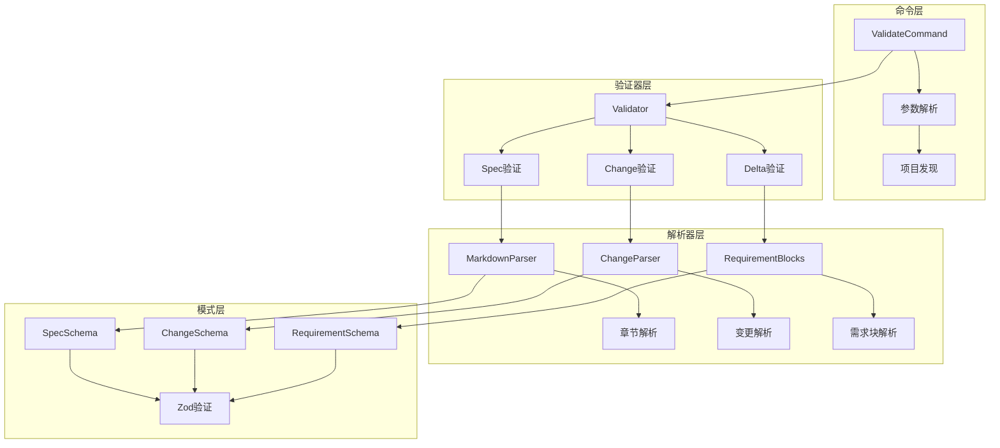
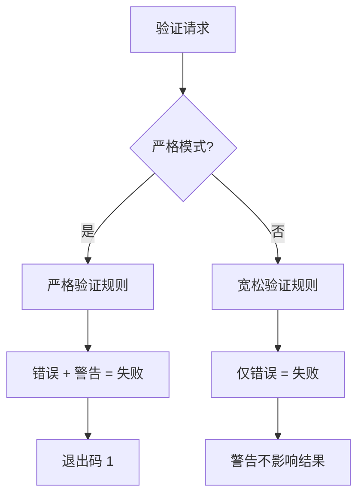
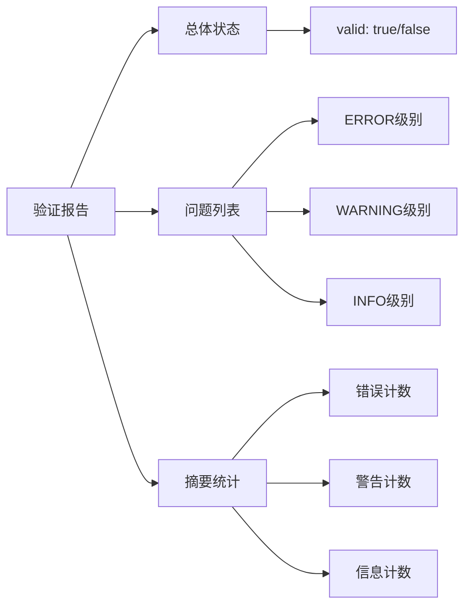

# 验证错误故障排除指南

<cite>
**本文档中引用的文件**
- [validation.test.ts](file://test/core/validation.test.ts)
- [validate.ts](file://src/commands/validate.ts)
- [validator.ts](file://src/core/validation/validator.ts)
- [types.ts](file://src/core/validation/types.ts)
- [constants.ts](file://src/core/validation/constants.ts)
- [markdown-parser.ts](file://src/core/parsers/markdown-parser.ts)
- [change-parser.ts](file://src/core/parsers/change-parser.ts)
- [cli-validate/spec.md](file://openspec/specs/cli-validate/spec.md)
- [openspec-conventions/spec.md](file://openspec/specs/openspec-conventions/spec.md)
</cite>

## 目录
1. [简介](#简介)
2. [验证系统架构概览](#验证系统架构概览)
3. [常见验证错误类型](#常见验证错误类型)
4. [严格模式与警告处理](#严格模式与警告处理)
5. [验证报告解读](#验证报告解读)
6. [调试技巧与工具](#调试技巧与工具)
7. [分步解决方案](#分步解决方案)
8. [最佳实践建议](#最佳实践建议)

## 简介

OpenSpec验证系统是一个全面的规范验证框架，用于确保变更提案和规格文档符合OpenSpec约定格式。当执行`openspec validate`命令时，系统会对指定的变更或规格进行多层次的验证检查，包括语法正确性、结构完整性、内容规范性和一致性要求。

本指南将帮助您诊断和解决验证过程中遇到的各种错误，提供详细的症状描述、根本原因分析和分步解决方法。

## 验证系统架构概览

OpenSpec验证系统采用分层架构设计，包含多个验证组件协同工作：



**图表来源**
- [validate.ts](file://src/commands/validate.ts#L30-L147)
- [validator.ts](file://src/core/validation/validator.ts#L15-L449)

**节来源**
- [validate.ts](file://src/commands/validate.ts#L1-L306)
- [validator.ts](file://src/core/validation/validator.ts#L1-L449)

## 常见验证错误类型

### 规范文件错误

#### 缺少概述部分
**症状**: 验证失败，提示"Spec必须有Purpose部分"

**根本原因**: 规范文件缺少必需的`## Purpose`章节

**解决方法**:
1. 打开规范文件（`openspec/specs/[capability]/spec.md`）
2. 添加`## Purpose`章节
3. 输入至少50字符的项目概述

**示例修复**:
```markdown
## Purpose
用户认证系统提供安全的登录和会话管理功能，确保只有授权用户可以访问受保护的资源。
```

#### 缺少需求部分
**症状**: 验证失败，提示"Spec必须有Requirements部分"

**根本原因**: 规范文件缺少`## Requirements`章节

**解决方法**:
1. 确保规范包含`## Requirements`标题
2. 在该章节下添加至少一个需求
3. 每个需求必须包含`### Requirement:`标题和至少一个场景

#### 需求文本缺少SHALL/MUST关键字
**症状**: 验证失败，提示"Requirement必须包含SHALL或MUST关键字"

**根本原因**: 需求描述中缺少强制性关键字

**解决方法**:
1. 检查所有需求描述
2. 确保每个需求包含"SHALL"或"MUST"关键字
3. 关键字应位于需求描述的开始位置

**示例修复**:
```markdown
### Requirement: 用户认证
系统 SHALL 提供基于JWT的安全认证机制。
```

#### 需求缺少场景
**症状**: 验证失败，提示"Requirement必须至少有一个场景"

**根本原因**: 需求定义不完整，缺少行为描述

**解决方法**:
1. 为每个需求添加至少一个`#### Scenario:`块
2. 使用标准的WHEN/THEN格式描述行为
3. 包含必要的前置条件和预期结果

**示例修复**:
```markdown
#### Scenario: 成功登录
- **WHEN** 用户提交有效凭据
- **THEN** 系统返回JWT令牌
- **AND** 用户被重定向到仪表板
```

### 变更提案错误

#### 缺少Why部分
**症状**: 验证失败，提示"Change必须有Why部分"

**根本原因**: 变更提案缺少变更动机说明

**解决方法**:
1. 打开变更提案文件（`openspec/changes/[change-id]/proposal.md`）
2. 添加`## Why`章节
3. 输入至少50字符的变更理由

**示例修复**:
```markdown
## Why
当前系统缺乏用户角色管理功能，导致无法根据用户权限控制访问。实施角色管理将提高系统的安全性和可管理性。
```

#### Why部分过短
**症状**: 验证失败，提示"Why部分必须至少50个字符"

**根本原因**: Why部分内容过于简短，无法充分说明变更动机

**解决方法**:
1. 扩展Why部分的内容
2. 说明变更的具体原因和业务价值
3. 描述现有问题和改进目标

#### 缺少What Changes部分
**症状**: 验证失败，提示"Change必须有What Changes部分"

**根本原因**: 变更提案缺少具体变更描述

**解决方法**:
1. 添加`## What Changes`章节
2. 明确列出所有变更内容
3. 使用清晰的项目符号格式

### Delta文件错误

#### Delta文件中需求文本缺少SHALL/MUST
**症状**: 验证失败，提示"ADDED/MODIFIED需求必须包含SHALL或MUST"

**根本原因**: Delta文件中的需求描述不符合规范要求

**解决方法**:
1. 检查`## ADDED Requirements`和`## MODIFIED Requirements`部分
2. 确保每个需求包含强制性关键字
3. 验证需求描述的完整性

#### Delta文件缺少必要章节
**症状**: 验证失败，提示"No delta sections found"

**根本原因**: Delta文件缺少操作类型章节

**解决方法**:
1. 确保Delta文件包含以下章节之一：
   - `## ADDED Requirements`
   - `## MODIFIED Requirements`
   - `## REMOVED Requirements`
   - `## RENAMED Requirements`
2. 每个章节必须包含至少一个需求块

**节来源**
- [validation.test.ts](file://test/core/validation.test.ts#L1-L490)
- [validator.ts](file://src/core/validation/validator.ts#L113-L271)

## 严格模式与警告处理

### 严格模式概述

OpenSpec验证系统支持严格模式（strict mode），在严格模式下，警告会被提升为错误，影响验证结果。



**图表来源**
- [validator.ts](file://src/core/validation/validator.ts#L385-L387)

### 严格模式下的警告升级

在严格模式下，以下类型的警告会被视为错误：

#### 概述部分过短
**症状**: "Purpose section is too brief (less than 50 characters)"

**严格模式处理**: 自动升级为错误

**解决方法**:
1. 扩展概述部分内容
2. 提供更详细的项目描述
3. 包含项目的目标和范围信息

#### 需求文本过长
**症状**: "Requirement text is very long (>500 characters)"

**严格模式处理**: 升级为错误

**解决方法**:
1. 将长需求拆分为多个独立的需求
2. 保持每个需求的专注性
3. 确保每个需求都有明确的边界

#### 场景数量不足
**症状**: "Requirement must have at least one scenario"

**严格模式处理**: 升级为错误

**解决方法**:
1. 为每个需求添加至少一个场景
2. 使用标准格式描述行为
3. 包含完整的WHEN/THEN序列

### 启用严格模式

使用`--strict`标志启用严格模式：

```bash
# 严格模式验证
openspec validate --all --strict

# 严格模式验证特定变更
openspec validate my-change --strict
```

**节来源**
- [validator.ts](file://src/core/validation/validator.ts#L291-L316)
- [validate.ts](file://src/commands/validate.ts#L291-L339)

## 验证报告解读

### 报告结构

OpenSpec验证输出包含以下层次的信息：



**图表来源**
- [types.ts](file://src/core/validation/types.ts#L11-L19)

### 错误级别说明

#### ERROR级别
**特点**: 导致验证失败，必须修复的问题

**常见类型**:
- 缺少必需的章节
- 内容格式不正确
- 关键字缺失
- 结构完整性问题

**示例**:
```
✗ [ERROR] openspec/specs/cli-validate/spec.md: Spec must have a Purpose section
```

#### WARNING级别
**特点**: 潜在问题，可能影响质量但不影响验证通过

**常见类型**:
- 内容长度限制
- 格式优化建议
- 最佳实践提醒

**示例**:
```
⚠ [WARNING] openspec/specs/cli-validate/spec.md: Purpose section is too brief (less than 50 characters)
```

#### INFO级别
**特点**: 信息性消息，提供额外上下文

**常见类型**:
- 性能提示
- 兼容性信息
- 统计数据

**示例**:
```
ℹ [INFO] openspec/specs/cli-validate/spec.md: Requirement text is very long (>500 characters)
```

### 解读验证输出

#### 单个项目验证
```
Change 'add-user-auth' has issues
✗ [ERROR] openspec/changes/add-user-auth/proposal.md: Change must have a Why section
✗ [ERROR] openspec/changes/add-user-auth/proposal.md: Change must have a What Changes section
Next steps:
- Ensure change has deltas in specs/: use headers ## ADDED/MODIFIED/REMOVED/RENAMED Requirements
- Each requirement MUST include at least one #### Scenario: block
- Debug parsed deltas: openspec change show <id> --json --deltas-only
```

#### 批量验证
```
✓ change/add-user-auth
✗ change/improve-validate-error-messages
✓ spec/cli-validate
✓ spec/openspec-conventions
Totals: 3 passed, 1 failed (4 items)
```

**节来源**
- [types.ts](file://src/core/validation/types.ts#L1-L19)
- [validate.ts](file://src/commands/validate.ts#L149-L180)

## 调试技巧与工具

### 详细日志模式

使用`--json`标志获取结构化输出，便于调试：

```bash
# 获取JSON格式的验证报告
openspec validate my-change --json

# 批量验证并获取JSON输出
openspec validate --all --json
```

**JSON输出示例**:
```json
{
  "items": [
    {
      "id": "my-change",
      "type": "change",
      "valid": false,
      "issues": [
        {
          "level": "ERROR",
          "path": "why",
          "message": "Change must have a Why section"
        }
      ],
      "durationMs": 123
    }
  ],
  "summary": {
    "totals": { "items": 1, "passed": 0, "failed": 1 },
    "byType": { "change": { "items": 1, "passed": 0, "failed": 1 } }
  },
  "version": "1.0"
}
```

### 调试特定功能

#### 查看解析的Delta
```bash
# 查看变更的解析结果
openspec change show my-change --json --deltas-only
```

#### 验证特定部分
```bash
# 验证单个规格
openspec validate spec-name

# 验证单个变更
openspec validate change-name
```

#### 交互式验证
```bash
# 交互式选择要验证的内容
openspec validate
```

### 常用调试命令

```bash
# 验证所有内容
openspec validate --all

# 仅验证变更
openspec validate --changes

# 仅验证规格
openspec validate --specs

# 严格模式验证
openspec validate --all --strict

# JSON格式输出
openspec validate --all --json
```

### 日志分析技巧

#### 过滤特定级别的问题
```bash
# 只显示错误
openspec validate --all --json | jq '.items[].issues[] | select(.level == "ERROR")'

# 只显示警告
openspec validate --all --json | jq '.items[].issues[] | select(.level == "WARNING")'
```

#### 按类型过滤
```bash
# 只显示变更问题
openspec validate --all --json | jq '.items[] | select(.type == "change")'

# 只显示规格问题
openspec validate --all --json | jq '.items[] | select(.type == "spec")'
```

**节来源**
- [validate.ts](file://src/commands/validate.ts#L149-L180)
- [validate.ts](file://src/commands/validate.ts#L283-L305)

## 分步解决方案

### 步骤1：识别问题类型

#### 第一步：检查验证输出
```
Change 'add-user-auth' has issues
✗ [ERROR] openspec/changes/add-user-auth/proposal.md: Change must have a Why section
✗ [ERROR] openspec/changes/add-user-auth/proposal.md: Change must have a What Changes section
```

#### 第二步：确定问题严重程度
- **ERROR**: 必须立即修复
- **WARNING**: 建议修复
- **INFO**: 可选优化

### 步骤2：定位具体问题

#### 使用路径信息
```
[ERROR] openspec/changes/add-user-auth/proposal.md: Change must have a Why section
```
- 文件路径：`openspec/changes/add-user-auth/proposal.md`
- 问题描述：缺少Why部分

#### 使用JSON输出精确定位
```bash
openspec validate add-user-auth --json | jq '.items[].issues[]'
```

### 步骤3：应用具体解决方案

#### 解决缺少章节的问题
1. **打开文件**：`nano openspec/changes/add-user-auth/proposal.md`
2. **添加缺失章节**：
   ```markdown
   ## Why
   我们需要实现用户认证功能来保护应用程序的安全性和用户数据。
   
   ## What Changes
   - **user-auth**: 添加新的用户认证规范
   - **api-endpoints**: 修改以包含认证端点
   ```

#### 解决格式问题
1. **检查需求格式**：
   ```markdown
   ### Requirement: Secure Authentication
   系统 SHALL 提供基于JWT的安全认证机制。
   ```
2. **添加场景**：
   ```markdown
   #### Scenario: Successful Login
   - **WHEN** 用户提交有效凭据
   - **THEN** 系统返回JWT令牌
   ```

### 步骤4：验证修复效果

#### 重新运行验证
```bash
openspec validate add-user-auth
```

#### 检查输出
```
Change 'add-user-auth' is valid
```

#### 验证所有内容
```bash
openspec validate --all
```

### 步骤5：预防重复问题

#### 使用模板
参考正确的格式模板：
- [cli-validate/spec.md](file://openspec/specs/cli-validate/spec.md)
- [openspec-conventions/spec.md](file://openspec/specs/openspec-conventions/spec.md)

#### 实施自动化检查
```bash
# 创建验证脚本
#!/bin/bash
echo "Running OpenSpec validation..."
openspec validate --all --strict
if [ $? -eq 0 ]; then
    echo "✅ All validations passed!"
else
    echo "❌ Some validations failed!"
    exit 1
fi
```

**节来源**
- [validate.ts](file://src/commands/validate.ts#L104-L146)
- [validator.ts](file://src/core/validation/validator.ts#L22-L49)

## 最佳实践建议

### 开发阶段最佳实践

#### 规范编写
1. **使用结构化格式**
   - 始终包含`## Purpose`和`## Requirements`章节
   - 使用标准的`### Requirement:`和`#### Scenario:`格式
   - 确保每个需求包含SHALL或MUST关键字

2. **内容质量**
   - 概述部分至少50字符
   - 需求描述清晰准确
   - 场景描述完整具体

3. **格式规范**
   - 使用一致的标题层级
   - 遵循WHEN/THEN格式
   - 保持适当的缩进和空白

#### 变更提案
1. **Why部分**
   - 说明变更动机和业务价值
   - 描述现有问题和改进目标
   - 至少50字符

2. **What Changes部分**
   - 明确列出所有变更内容
   - 使用清晰的项目符号
   - 包含技术细节

3. **Delta格式**
   - 使用正确的操作类型章节
   - 确保每个需求都有场景
   - 避免重复的头部名称

### 团队协作最佳实践

#### 定期验证
```bash
# CI/CD集成
openspec validate --all --strict

# 预提交钩子
#!/bin/sh
openspec validate --changes --strict
```

#### 文档维护
1. **版本控制**
   - 将规范文件纳入版本控制
   - 记录变更历史
   - 维护更新日志

2. **知识共享**
   - 分享成功案例
   - 讨论常见问题
   - 更新团队指南

#### 质量保证
1. **同行评审**
   - 定期审查规范质量
   - 检查格式一致性
   - 验证内容准确性

2. **自动化测试**
   - 集成验证到构建流程
   - 设置质量门禁
   - 监控验证结果趋势

### 工具链集成

#### IDE配置
1. **语法高亮**
   - 配置Markdown语法高亮
   - 设置自定义语言模式

2. **实时验证**
   - 安装验证插件
   - 配置自动检查

#### CI/CD集成
```yaml
# GitHub Actions示例
name: OpenSpec Validation
on: [push, pull_request]
jobs:
  validate:
    runs-on: ubuntu-latest
    steps:
      - uses: actions/checkout@v2
      - name: Install OpenSpec
        run: npm install -g @fission-ai/openspec
      - name: Validate specs
        run: openspec validate --all --strict
```

#### 自动化脚本
```bash
#!/bin/bash
# 批量验证脚本
echo "🔍 正在验证所有OpenSpec规范..."

# 验证规格
echo "📋 验证规格..."
openspec validate --specs --strict

# 验证变更
echo "🔄 验证变更..."
openspec validate --changes --strict

# 检查结果
if [ $? -eq 0 ]; then
    echo "✅ 所有验证通过！"
else
    echo "❌ 发现验证问题，请检查输出。"
    exit 1
fi
```

通过遵循这些最佳实践，您可以显著提高OpenSpec规范的质量，减少验证错误，并建立可持续的文档维护流程。

**节来源**
- [cli-validate/spec.md](file://openspec/specs/cli-validate/spec.md#L1-L219)
- [openspec-conventions/spec.md](file://openspec/specs/openspec-conventions/spec.md#L1-L474)