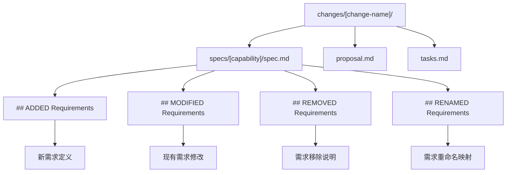
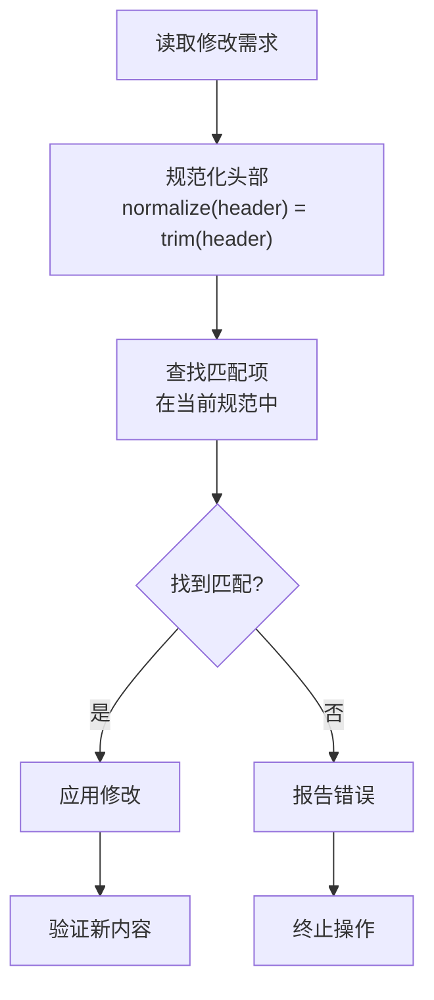
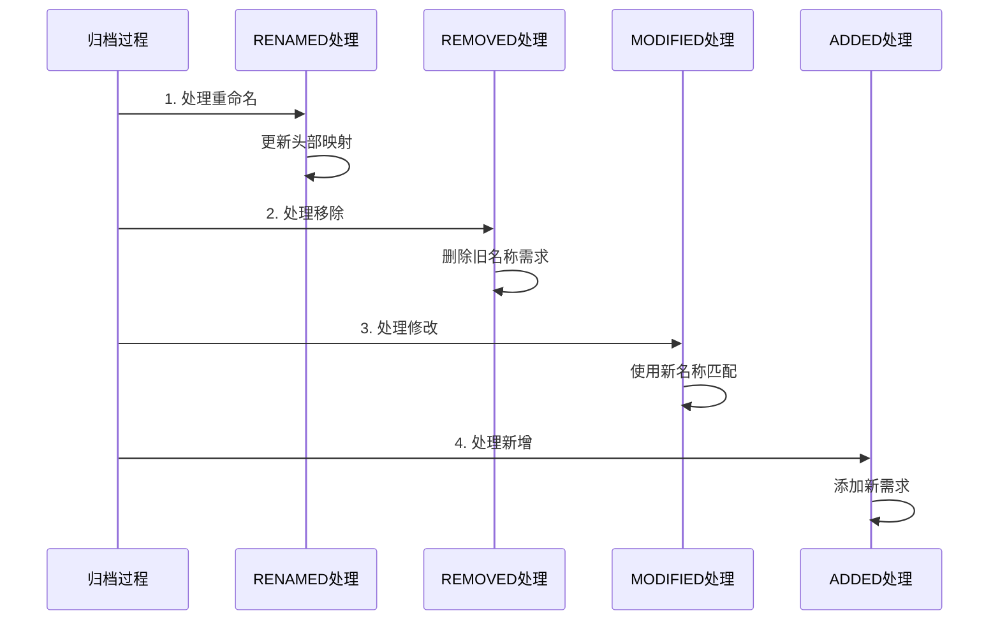
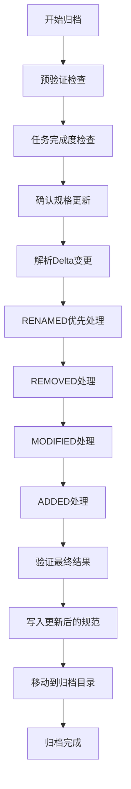
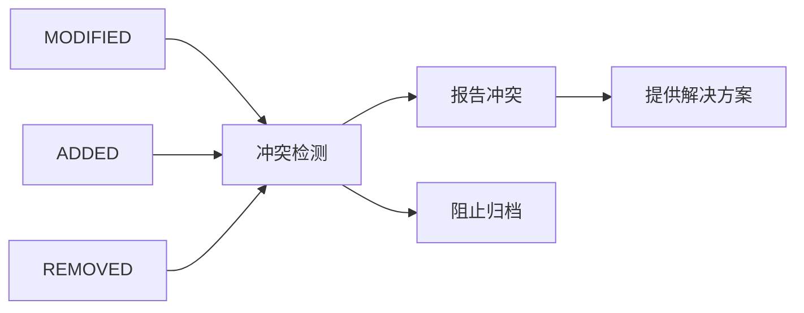
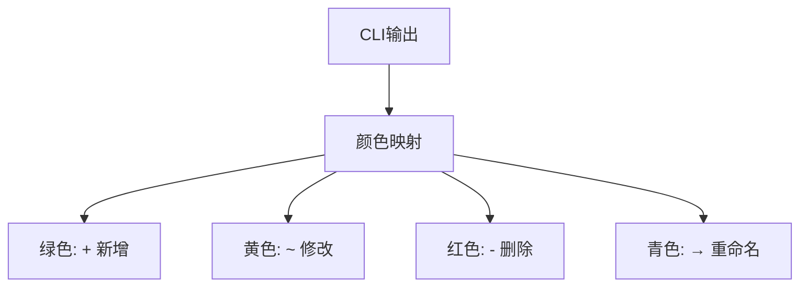
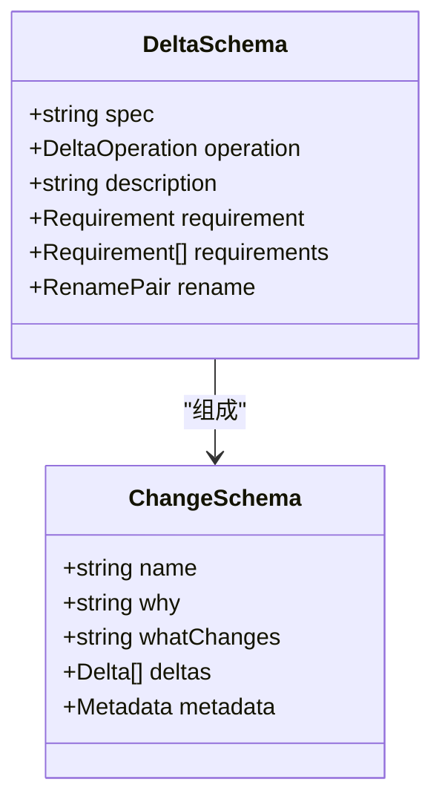
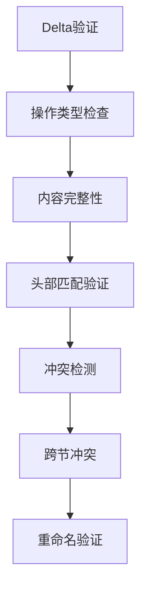
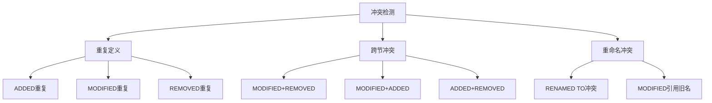

# Delta变更格式

<cite>
**本文档引用的文件**
- [IMPLEMENTATION_ORDER.md](file://openspec/changes/IMPLEMENTATION_ORDER.md)
- [openspec-conventions/spec.md](file://openspec/changes/archive/2025-08-19-adopt-delta-based-changes/specs/openspec-conventions/spec.md)
- [cli-archive/spec.md](file://openspec/changes/archive/2025-08-19-adopt-delta-based-changes/specs/cli-archive/spec.md)
- [cli-diff/spec.md](file://openspec/changes/archive/2025-08-19-adopt-delta-based-changes/specs/cli-diff/spec.md)
- [cli-change/spec.md](file://openspec/specs/cli-change/spec.md)
- [cli-archive/spec.md](file://openspec/specs/cli-archive/spec.md)
- [change.schema.ts](file://src/core/schemas/change.schema.ts)
- [change-parser.ts](file://src/core/parsers/change-parser.ts)
- [requirement-blocks.ts](file://src/core/parsers/requirement-blocks.ts)
- [archive.ts](file://src/core/archive.ts)
- [validator.ts](file://src/core/validation/validator.ts)
</cite>

## 目录
1. [概述](#概述)
2. [Delta变更格式结构](#delta变更格式结构)
3. [核心变更类型详解](#核心变更类型详解)
4. [归档过程与应用顺序](#归档过程与应用顺序)
5. [CLI输出格式](#cli输出格式)
6. [验证规则与约束](#验证规则与约束)
7. [冲突检测与处理](#冲突检测与处理)
8. [最佳实践指南](#最佳实践指南)

## 概述

OpenSpec采用基于Delta的变更格式，通过`changes/[name]/specs/[capability]/spec.md`文件中的四个核心部分来描述规范的增量变更：`## ADDED Requirements`、`## MODIFIED Requirements`、`## REMOVED Requirements`和`## RENAMED Requirements`。这种格式确保了变更的可追溯性、可验证性和可自动化应用。

Delta格式的核心优势：
- **增量存储**：只存储变更内容而非完整规范
- **程序化处理**：支持自动化归档和验证
- **语义清晰**：明确标识变更类型和影响范围
- **冲突预防**：内置验证机制防止重复和冲突

## Delta变更格式结构

### 文件组织架构



**图表来源**
- [openspec-conventions/spec.md](file://openspec/changes/archive/2025-08-19-adopt-delta-based-changes/specs/openspec-conventions/spec.md#L34-L67)

### 标准格式要求

每个Delta文件必须包含以下标准元素：

| 元素 | 必需性 | 描述 | 示例格式 |
|------|--------|------|----------|
| `## ADDED Requirements` | 可选 | 新增的需求定义 | `### Requirement: 系统功能` |
| `## MODIFIED Requirements` | 可选 | 修改的需求定义 | 使用现有头部匹配 |
| `## REMOVED Requirements` | 可选 | 移除的需求列表 | `### Requirement: 已废弃功能` |
| `## RENAMED Requirements` | 可选 | 重命名映射关系 | FROM/TO格式对 |
| 要求内容 | 必需 | 完整的结构化要求 | 包含场景和规范 |

**章节来源**
- [openspec-conventions/spec.md](file://openspec/changes/archive/2025-08-19-adopt-delta-based-changes/specs/openspec-conventions/spec.md#L34-L67)

## 核心变更类型详解

### ADDED Requirements - 新增需求

新增需求部分用于描述完全新的功能或能力。

#### 编写规则

1. **完整性要求**：必须包含完整的结构化要求
2. **标准化格式**：使用标准的`### Requirement:`头部
3. **场景丰富**：至少包含一个测试场景
4. **关键词规范**：使用SHALL/MUST等规范性词汇

#### 示例格式

```markdown
## ADDED Requirements

### Requirement: 用户认证功能
系统 SHALL提供用户认证服务。

#### Scenario: 成功登录
- **WHEN** 用户提供有效凭据
- **THEN** 系统返回JWT令牌
- **AND** 设置会话状态

#### Scenario: 登录失败
- **WHEN** 用户提供无效凭据
- **THEN** 系统返回错误响应
- **AND** 记录安全事件
```

#### 验证要求

- 头部必须唯一且符合规范
- 内容必须满足要求模式验证
- 场景必须包含条件和结果

**章节来源**
- [openspec-conventions/spec.md](file://openspec/changes/archive/2025-08-19-adopt-delta-based-changes/specs/openspec-conventions/spec.md#L39-L44)

### MODIFIED Requirements - 修改需求

修改需求部分用于描述现有需求的变更，必须使用标准化的标题进行精确匹配。

#### 编写规则

1. **精确匹配**：必须使用当前规范中的确切头部文本
2. **标准化对比**：头部匹配通过`trim()`规范化处理
3. **完整内容**：包含修改后完整的完整要求
4. **变更标注**：建议使用注释标明变更内容

#### 标准化匹配机制



**图表来源**
- [openspec-conventions/spec.md](file://openspec/changes/archive/2025-08-19-adopt-delta-based-changes/specs/openspec-conventions/spec.md#L49-L51)

#### 示例格式

```markdown
## MODIFIED Requirements

### Requirement: 用户认证功能
系统 SHALL提供用户认证服务。

#### 原有场景 (已更新)
- **WHEN** 用户提供有效凭据
- **THEN** 系统返回JWT令牌
- **AND** 设置会话状态
← (原: 返回基础令牌)

#### 新增场景
- **WHEN** 用户提供过期令牌
- **THEN** 系统刷新令牌
- **AND** 返回新令牌
```

#### 验证要求

- 修改的头部必须存在于当前规范中
- 新内容必须通过完整验证
- 不允许同时修改和删除同一需求

**章节来源**
- [openspec-conventions/spec.md](file://openspec/changes/archive/2025-08-19-adopt-delta-based-changes/specs/openspec-conventions/spec.md#L45-L51)

### REMOVED Requirements - 移除需求

移除需求部分用于描述被废弃的功能，必须说明移除原因。

#### 编写规则

1. **头部匹配**：使用标准化的头部文本
2. **移除原因**：必须说明移除的原因
3. **迁移路径**：如有必要，提供替代方案
4. **影响评估**：说明对现有系统的潜在影响

#### 示例格式

```markdown
## REMOVED Requirements

### Requirement: 旧版API接口
系统 SHALL提供旧版API接口以支持向后兼容。

#### 移除原因
- 该接口已被新版REST API取代
- 性能优化需要统一接口标准
- 开发团队决定弃用遗留代码

#### 迁移路径
- 所有客户端应迁移到 `/api/v2/users` 接口
- 提供迁移指南和工具
- 迁移期限为6个月

#### 影响评估
- 影响约20个现有客户端
- 预计迁移成本为2人天
```

#### 验证要求

- 移除的头部必须存在于当前规范中
- 必须包含移除原因说明
- 不允许同时添加和删除同一需求

**章节来源**
- [openspec-conventions/spec.md](file://openspec/changes/archive/2025-08-19-adopt-delta-based-changes/specs/openspec-conventions/spec.md#L53-L60)

### RENAMED Requirements - 重命名需求

重命名需求具有特殊的格式要求，使用FROM/TO结构来指定名称变更。

#### 特殊格式要求

```markdown
## RENAMED Requirements

- FROM: `### Requirement: 旧功能名称`
- TO: `### Requirement: 新功能名称`
```

#### 处理优先级

重命名操作在归档过程中具有最高优先级，必须在其他变更之前执行：



**图表来源**
- [archive.ts](file://src/core/archive.ts#L466-L492)

#### 示例格式

```markdown
## RENAMED Requirements

- FROM: `### Requirement: 用户管理模块`
- TO: `### Requirement: 用户服务组件`

- FROM: `### Requirement: 权限控制`
- TO: `### Requirement: 访问控制`
```

#### 验证规则

1. **唯一性检查**：FROM和TO不能重复
2. **存在性验证**：FROM必须存在于当前规范中
3. **冲突检测**：TO不能与现有需求冲突
4. **链式重命名**：支持连续重命名操作

**章节来源**
- [openspec-conventions/spec.md](file://openspec/changes/archive/2025-08-19-adopt-delta-based-changes/specs/openspec-conventions/spec.md#L16-L26)

## 归档过程与应用顺序

### 归档命令工作流程

归档命令按照严格的顺序处理Delta变更，确保数据一致性：



**图表来源**
- [archive.ts](file://src/core/archive.ts#L21-L231)

### 应用顺序详解

#### 1. RENAMED处理（最高优先级）

重命名操作首先执行，建立新的头部映射关系：

- **处理逻辑**：从FROM到TO的直接替换
- **验证要求**：FROM必须存在，TO必须不存在
- **影响范围**：后续MODIFIED操作使用新名称匹配

#### 2. REMOVED处理

移除操作在重命名之后执行：

- **处理逻辑**：根据标准化头部删除对应需求
- **验证要求**：头部必须存在于当前规范中
- **不可逆性**：移除后无法恢复

#### 3. MODIFIED处理

修改操作使用最新的头部映射：

- **匹配方式**：使用MODIFIED部分的头部（可能是重命名后的名称）
- **验证要求**：目标需求必须存在且内容有效
- **完整性**：必须提供完整的修改后内容

#### 4. ADDED处理（最后执行）

新增操作在所有其他变更完成后执行：

- **处理逻辑**：直接追加到规范末尾
- **验证要求**：新头部不能与现有任何需求冲突
- **顺序保持**：保持原始添加顺序

**章节来源**
- [archive.ts](file://src/core/archive.ts#L466-L532)

### 冲突处理机制

当多个变更尝试修改同一需求时，系统会检测并报告冲突：



**图表来源**
- [archive.ts](file://src/core/archive.ts#L406-L436)

## CLI输出格式

### 标准输出符号

OpenSpec CLI使用标准化的颜色和符号来表示不同类型的变更：

| 符号 | 颜色 | 含义 | 用途 |
|------|------|------|------|
| `+` | 绿色 | ADDED（新增） | 表示新添加的需求 |
| `~` | 黄色 | MODIFIED（修改） | 表示修改的需求 |
| `-` | 红色 | REMOVED（移除） | 表示删除的需求 |
| `→` | 青色 | RENAMED（重命名） | 表示重命名的操作 |

### 输出格式示例

```bash
Applying changes to specs/user-auth/spec.md:
  + 2 added
  ~ 3 modified
  - 1 removed
  → 1 renamed
```

### 颜色配置

CLI输出使用chalk库提供彩色输出，增强可读性：



**图表来源**
- [openspec-conventions/spec.md](file://openspec/changes/archive/2025-08-19-adopt-delta-based-changes/specs/openspec-conventions/spec.md#L69-L76)

**章节来源**
- [cli-archive/spec.md](file://openspec/changes/archive/2025-08-19-adopt-delta-based-changes/specs/cli-archive/spec.md#L30-L47)

## 验证规则与约束

### Schema验证

Delta变更通过Zod Schema进行严格验证：



**图表来源**
- [change.schema.ts](file://src/core/schemas/change.schema.ts#L1-L42)

### 验证规则详解

#### 1. 基础验证规则

| 规则类型 | 验证内容 | 错误级别 | 示例 |
|----------|----------|----------|------|
| 必填字段 | spec、operation、description | ERROR | 字段缺失 |
| 长度限制 | description最小长度10字符 | WARNING | 描述过短 |
| 内容格式 | requirements数组不能为空 | WARNING | 空数组 |

#### 2. Delta特定验证



**图表来源**
- [validator.ts](file://src/core/validation/validator.ts#L320-L345)

#### 3. 头部匹配验证

- **规范化处理**：使用`trim()`去除首尾空白
- **大小写敏感**：匹配时区分大小写
- **精确匹配**：必须完全一致才能匹配

#### 4. 跨节冲突检测

系统会检测同一需求在不同节中的冲突：

- MODIFIED + REMOVED：不允许同时修改和删除
- MODIFIED + ADDED：不允许同时修改和新增
- ADDED + REMOVED：不允许同时新增和删除

**章节来源**
- [openspec-conventions/spec.md](file://openspec/changes/archive/2025-08-19-adopt-delta-based-changes/specs/openspec-conventions/spec.md#L80-L100)

## 冲突检测与处理

### 冲突类型识别

系统能够识别多种类型的冲突情况：



### 冲突处理策略

#### 1. 自动检测机制

系统在归档前自动检测所有可能的冲突：

```typescript
// 冲突检测伪代码
const conflicts = detectConflicts(plan.added, plan.modified, plan.removed, plan.renamed);
if (conflicts.length > 0) {
  throw new Error(`Conflict detected: ${conflicts[0].message}`);
}
```

#### 2. 错误报告格式

冲突信息包含详细上下文：

```
Validation failed: Requirement present in multiple sections (MODIFIED and REMOVED) for header "### Requirement: 用户认证"
```

#### 3. 解决方案指导

系统提供具体的解决建议：

- **重复定义**：检查是否需要合并或删除冗余条目
- **跨节冲突**：重新设计变更计划避免冲突
- **重命名问题**：调整重命名映射或修改目标名称

**章节来源**
- [archive.ts](file://src/core/archive.ts#L406-L436)

## 最佳实践指南

### Delta文件编写最佳实践

#### 1. 结构化组织

```markdown
# 功能模块规格 - 变更说明

## ADDED Requirements
<!-- 新增需求 -->

## MODIFIED Requirements
<!-- 修改需求 -->

## REMOVED Requirements
<!-- 移除需求 -->

## RENAMED Requirements
<!-- 重命名映射 -->
```

#### 2. 头部命名规范

- 使用清晰、准确的功能描述
- 避免歧义和过于宽泛的术语
- 保持命名风格一致性

#### 3. 内容完整性要求

- 每个需求都必须包含完整的场景
- 修改时提供充分的变更说明
- 移除时说明具体原因和替代方案

### 归档操作最佳实践

#### 1. 预归档检查清单

- [ ] 所有任务已完成标记
- [ ] Delta变更语法正确
- [ ] 头部匹配无冲突
- [ ] 内容格式完整

#### 2. 分阶段归档策略

1. **开发阶段**：频繁小批量归档
2. **集成阶段**：合并相关变更
3. **发布阶段**：批量归档准备发布

#### 3. 回滚机制

- 归档前备份当前规范
- 使用dry-run模式验证
- 准备回滚脚本应对意外情况

### 维护和监控

#### 1. 定期审查

- 检查Delta文件的完整性和准确性
- 验证归档过程的正确性
- 更新维护文档和流程

#### 2. 性能优化

- 对大型变更使用分批处理
- 实施增量验证机制
- 优化归档过程的并发处理

通过遵循这些最佳实践，可以确保OpenSpec Delta变更格式的有效实施，提高规范管理的效率和可靠性。