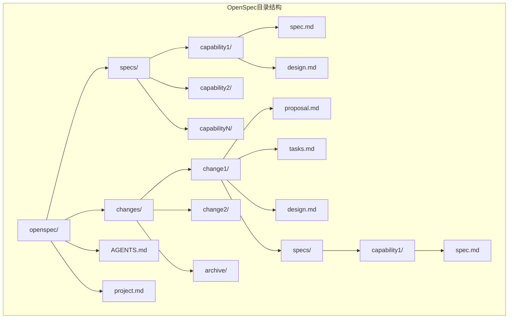
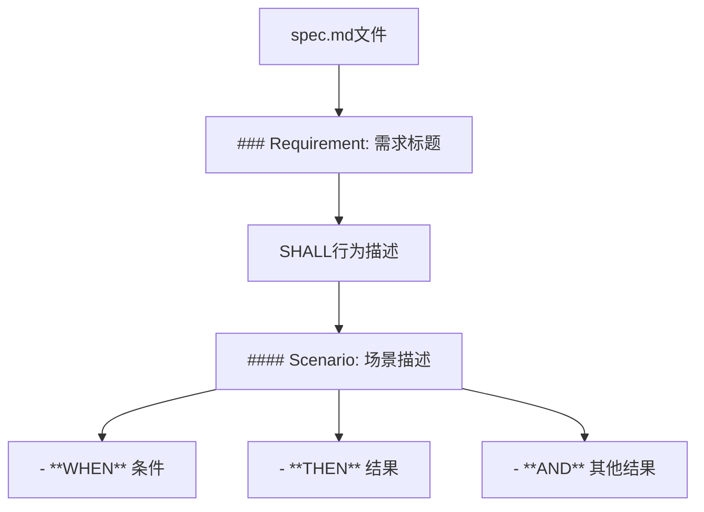
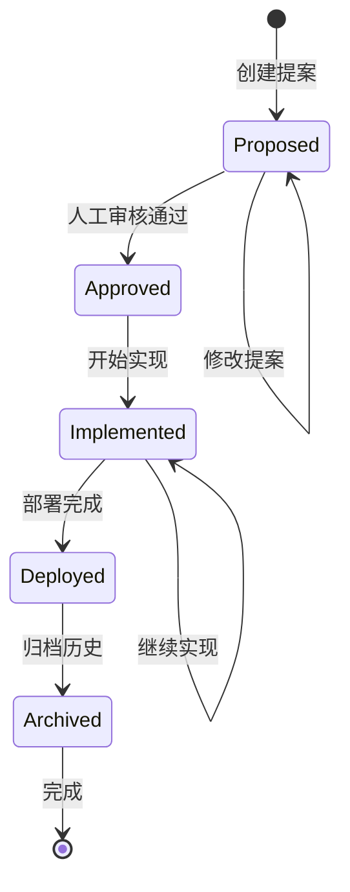
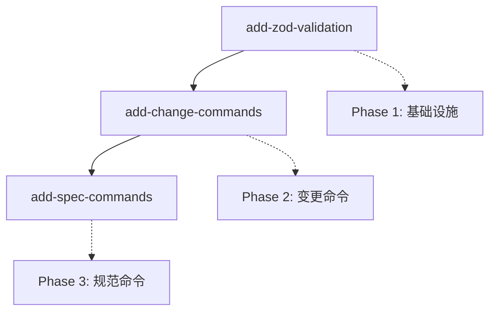
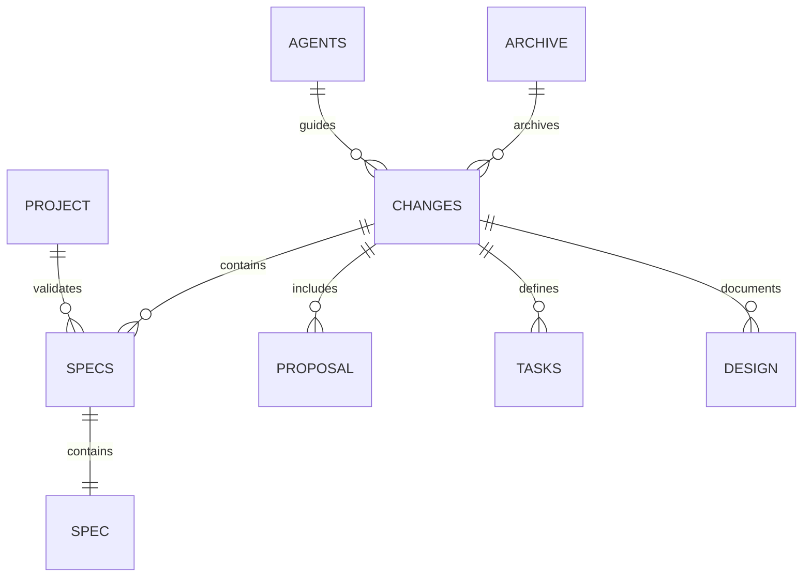

# OpenSpec核心目录结构权威文档

<cite>
**本文档引用的文件**
- [project.md](file://openspec/project.md)
- [AGENTS.md](file://openspec/AGENTS.md)
- [openspec-conventions/spec.md](file://openspec/specs/openspec-conventions/spec.md)
- [proposal.md](file://openspec/changes/add-scaffold-command/proposal.md)
- [proposal.md](file://openspec/changes/archive/2025-01-11-add-update-command/proposal.md)
- [IMPLEMENTATION_ORDER.md](file://openspec/changes/IMPLEMENTATION_ORDER.md)
- [cli-init/spec.md](file://openspec/specs/cli-init/spec.md)
- [cli-update/spec.md](file://openspec/specs/cli-update/spec.md)
- [cli-list/spec.md](file://openspec/specs/cli-list/spec.md)
- [cli-change/spec.md](file://openspec/specs/cli-change/spec.md)
- [cli-validate/spec.md](file://openspec/specs/cli-validate/spec.md)
</cite>

## 目录
1. [概述](#概述)
2. [目录结构设计理念](#目录结构设计理念)
3. [核心目录详解](#核心目录详解)
4. [文件类型与职责](#文件类型与职责)
5. [变更生命周期管理](#变更生命周期管理)
6. [目录结构可视化](#目录结构可视化)
7. [最佳实践指南](#最佳实践指南)
8. [故障排除](#故障排除)

## 概述

OpenSpec采用独特的双态架构设计，通过`specs/`（当前状态）和`changes/`（变更提案）两个平行目录实现规范驱动的变更管理。这种设计确保了系统的真实性和可追溯性，同时为AI辅助开发提供了清晰的工作流程。

### 核心原则

- **Specs反映现状**：`specs/`目录存储当前已部署的功能规范，是系统的"真相源"
- **Changes记录提案**：`changes/`目录保存未来状态的变更提案，体现系统的"演进轨迹"
- **Archive归档历史**：`changes/archive/`目录永久保存已完成变更的历史记录
- **AI友好设计**：所有内容使用标准Markdown格式，便于AI工具解析和处理

## 目录结构设计理念

OpenSpec的目录结构基于以下核心理念构建：

### 双态架构原理



**图表来源**
- [project.md](file://openspec/project.md#L13-L20)
- [AGENTS.md](file://openspec/AGENTS.md#L123-L141)

### 设计哲学

1. **分离关注点**：当前状态与未来提案严格分离，避免混淆
2. **版本控制友好**：每个变更都是独立的目录，便于Git管理
3. **可审计性**：完整的变更历史记录，支持回溯和审查
4. **工具兼容性**：标准化的文件格式，支持各种开发工具

## 核心目录详解

### specs/ 目录 - 当前状态存储

`specs/`目录是OpenSpec系统的核心，存储所有已部署功能的能力规范。

#### 目录结构

```
specs/
├── capability-name/
│   ├── spec.md          # 核心规范文档
│   └── design.md        # 技术设计文档（可选）
```

#### 文件职责

- **spec.md**：定义能力的行为规范，包含需求和场景
- **design.md**：技术实现细节，仅在需要时创建

#### 示例规范格式

```markdown
## ADDED Requirements
### Requirement: 用户认证
系统必须提供基于JWT的用户认证机制。

#### Scenario: 成功登录
- **WHEN** 用户提供有效凭据
- **THEN** 系统返回JWT令牌
- **AND** 设置适当的过期时间
```

**节来源**
- [openspec-conventions/spec.md](file://openspec/specs/openspec-conventions/spec.md#L1-L474)
- [cli-init/spec.md](file://openspec/specs/cli-init/spec.md#L1-L277)

### changes/ 目录 - 变更提案管理

`changes/`目录保存所有待实施的变更提案，每个提案都有独立的目录结构。

#### 目录层次

```
changes/
├── change-id/
│   ├── proposal.md      # 变更提案文档
│   ├── tasks.md         # 实现任务清单
│   ├── design.md        # 技术设计（可选）
│   └── specs/
│       └── capability/
│           └── spec.md  # 规范变更增量
```

#### 文件类型说明

- **proposal.md**：阐述变更原因、具体内容和影响范围
- **tasks.md**：详细的实现步骤清单
- **design.md**：技术决策文档（仅在必要时创建）
- **spec.md**：针对特定能力的规范变更增量

#### 变更提案结构

```markdown
## Why
简要说明变更的原因和业务价值

## What Changes
- 列出具体变更内容
- 标记破坏性变更（**BREAKING**）

## Impact
- 影响的规范：[相关能力列表]
- 影响的代码：[关键文件/系统]
```

**节来源**
- [proposal.md](file://openspec/changes/add-scaffold-command/proposal.md#L1-L12)
- [proposal.md](file://openspec/changes/archive/2025-01-11-add-update-command/proposal.md#L1-L29)

### archive/ 目录 - 历史归档

`archive/`目录采用时间戳命名规范，永久保存已完成的变更历史。

#### 命名规范

```
archive/
├── 2025-01-11-add-update-command/
│   ├── specs/
│   ├── design.md
│   ├── proposal.md
│   └── tasks.md
├── 2025-08-06-adopt-future-state-storage/
│   └── ...
```

#### 时间戳格式

- **YYYY-MM-DD**：变更完成的具体日期
- **[name]**：与原始变更ID保持一致

**节来源**
- [IMPLEMENTATION_ORDER.md](file://openspec/changes/IMPLEMENTATION_ORDER.md#L1-L68)

## 文件类型与职责

### 核心规范文件

#### spec.md - 行为规范定义



**图表来源**
- [openspec-conventions/spec.md](file://openspec/specs/openspec-conventions/spec.md#L42-L70)

#### proposal.md - 变更提案

变更提案文档遵循明确的结构模式：

1. **Why部分**：阐述变更动机和业务价值
2. **What Changes部分**：列出具体变更内容
3. **Impact部分**：说明影响范围和技术影响

#### tasks.md - 实现清单

任务清单采用TODO格式，按顺序列出实现步骤：

```markdown
## 1. 实现阶段
- [ ] 1.1 创建数据库模式
- [ ] 1.2 实现API端点
- [ ] 1.3 添加前端组件
- [ ] 1.4 编写测试用例
```

#### design.md - 技术设计

技术设计文档仅在复杂变更时创建，包含：

- 背景和约束条件
- 目标和非目标
- 技术决策和权衡
- 风险和缓解措施
- 迁移计划
- 开放问题

**节来源**
- [AGENTS.md](file://openspec/AGENTS.md#L143-L233)

### 辅助配置文件

#### AGENTS.md - AI助手指导

`AGENTS.md`文件为AI编码助手提供完整的OpenSpec工作流程指导：

- 快速检查清单
- 三阶段工作流程
- CLI命令参考
- 规范格式要求
- 最佳实践指南

#### project.md - 项目约定

项目约定文档定义：

- 技术栈和运行时要求
- 项目结构规范
- 编码约定
- 错误处理策略
- 日志记录规范
- 测试策略

**节来源**
- [project.md](file://openspec/project.md#L1-L53)
- [AGENTS.md](file://openspec/AGENTS.md#L1-L455)

## 变更生命周期管理

OpenSpec实现了完整的变更生命周期管理，从提案到归档的全过程追踪。

### 变更状态流转



### 生命周期阶段详解

#### 1. 提案阶段（Proposed）

- 创建变更目录：`changes/[change-id]/`
- 编写提案文档
- 创建任务清单
- 添加规范增量

#### 2. 审核阶段（Approved）

- 人工审查提案内容
- 确认变更合理性
- 批准实施计划

#### 3. 实现阶段（Implemented）

- 按照任务清单逐步实现
- 更新任务完成状态
- 保持与提案的一致性

#### 4. 部署阶段（Deployed）

- 将变更应用到生产环境
- 更新specs目录
- 验证部署结果

#### 5. 归档阶段（Archived）

- 移动到archive目录
- 使用时间戳命名
- 保留完整历史记录

**节来源**
- [openspec-conventions/spec.md](file://openspec/specs/openspec-conventions/spec.md#L410-L420)

### 变更依赖管理

对于复杂的变更序列，OpenSpec提供了依赖管理机制：



**图表来源**
- [IMPLEMENTATION_ORDER.md](file://openspec/changes/IMPLEMENTATION_ORDER.md#L31-L38)

## 目录结构可视化

### 初始化后的完整结构

```
openspec/
├── project.md                    # 项目约定
├── AGENTS.md                     # AI助手指导
├── specs/                        # 当前状态
│   ├── cli-init/                 # 初始化命令
│   │   ├── spec.md               # 规范
│   │   └── design.md             # 设计（可选）
│   ├── cli-update/               # 更新命令
│   │   ├── spec.md               # 规范
│   │   └── design.md             # 设计（可选）
│   └── openspec-conventions/     # 约定规范
│       └── spec.md               # 约定规范
└── changes/                      # 变更提案
    ├── add-scaffold-command/     # 新增脚手架命令
    │   ├── proposal.md           # 变更提案
    │   ├── tasks.md              # 实现任务
    │   ├── design.md             # 技术设计
    │   └── specs/                # 规范增量
    │       └── cli-scaffold/     # 脚手架规范
    │           └── spec.md       # 增量规范
    ├── archive/                  # 已完成变更
    │   ├── 2025-01-11-add-update-command/
    │   │   ├── specs/
    │   │   │   └── cli-update/
    │   │   │       └── spec.md
    │   │   ├── design.md
    │   │   ├── proposal.md
    │   │   └── tasks.md
    │   └── 2025-08-06-adopt-future-state-storage/
    │       └── ...
    └── IMPLEMENTATION_ORDER.md   # 实现顺序
```

### 文件关系图



**图表来源**
- [openspec-conventions/spec.md](file://openspec/specs/openspec-conventions/spec.md#L17-L40)

## 最佳实践指南

### 目录命名规范

#### 变更ID命名

- 使用kebab-case格式
- 动词优先：`add-`, `update-`, `remove-`, `refactor-`
- 描述性强且简洁
- 确保唯一性，必要时添加后缀

#### 能力名称规范

- verb-noun模式：`user-auth`, `payment-capture`
- 单一职责原则
- 10分钟理解规则
- 避免嵌套结构

### 内容编写指南

#### 规范文档

1. **结构一致性**：始终使用标准的`### Requirement:`和`#### Scenario:`格式
2. **场景完整性**：每个需求至少包含一个场景
3. **行为明确性**：使用SHALL/MUST等规范性语言
4. **格式正确性**：严格遵守Markdown语法要求

#### 变更提案

1. **充分说明**：详细阐述变更动机和预期收益
2. **影响评估**：全面分析技术影响和风险
3. **实现规划**：提供清晰的任务分解
4. **验证方法**：说明如何验证变更效果

### 工作流程建议

#### 创建新变更

1. 检查现有工作：`openspec list` 和 `openspec list --specs`
2. 选择唯一的变更ID
3. 创建提案文档
4. 编写规范增量
5. 运行验证：`openspec validate [change-id] --strict`

#### 实现变更

1. 阅读提案文档
2. 按顺序完成任务
3. 保持与提案一致
4. 更新任务状态
5. 获取批准后再开始实现

#### 归档变更

1. 确保所有实现完成
2. 验证变更效果
3. 执行归档命令
4. 更新相关文档

**节来源**
- [AGENTS.md](file://openspec/AGENTS.md#L374-L402)

## 故障排除

### 常见问题及解决方案

#### 验证失败

**问题**：`openspec validate`报告错误
**解决方案**：
1. 使用`--strict`标志进行完整验证
2. 查看JSON输出获取详细信息
3. 检查场景格式是否正确
4. 验证头部唯一性

#### 头部冲突

**问题**：规范头部重复或不匹配
**解决方案**：
1. 使用标准化的头部格式
2. 确保规范化匹配
3. 检查重命名操作的正确性

#### 变更冲突

**问题**：多个变更影响同一规范
**解决方案**：
1. 运行`openspec list`查看活跃变更
2. 协调变更所有者
3. 考虑合并提案

#### 归档失败

**问题**：归档过程中出现冲突
**解决方案**：
1. 手动解决规范冲突
2. 确保所有依赖变更已完成
3. 验证变更的完整性

### 调试技巧

#### 使用调试命令

```bash
# 查看变更详情
openspec show [change-id] --json --deltas-only

# 验证特定规范
openspec validate [spec-id] --strict

# 检查项目状态
openspec list --long
```

#### 格式验证

确保所有Markdown文件符合规范要求：
- 正确的标题层级
- 标准的场景格式
- 完整的需求描述
- 有效的任务清单

**节来源**
- [cli-validate/spec.md](file://openspec/specs/cli-validate/spec.md#L1-L219)

## 总结

OpenSpec的目录结构设计体现了现代软件工程的最佳实践，通过清晰的分离和严格的规范确保了系统的可维护性和可扩展性。这种双态架构不仅支持AI辅助开发，还为团队协作提供了强大的工具支持。

关键优势包括：

- **清晰的职责分离**：当前状态与未来提案完全隔离
- **完整的变更追踪**：从提案到归档的完整生命周期管理
- **AI友好的格式**：标准化的Markdown格式便于自动化处理
- **灵活的工作流程**：支持多种协作模式和工具集成

通过遵循本文档的指导原则和最佳实践，开发团队可以高效地利用OpenSpec进行规范驱动的开发，确保代码质量和系统演进的可控性。