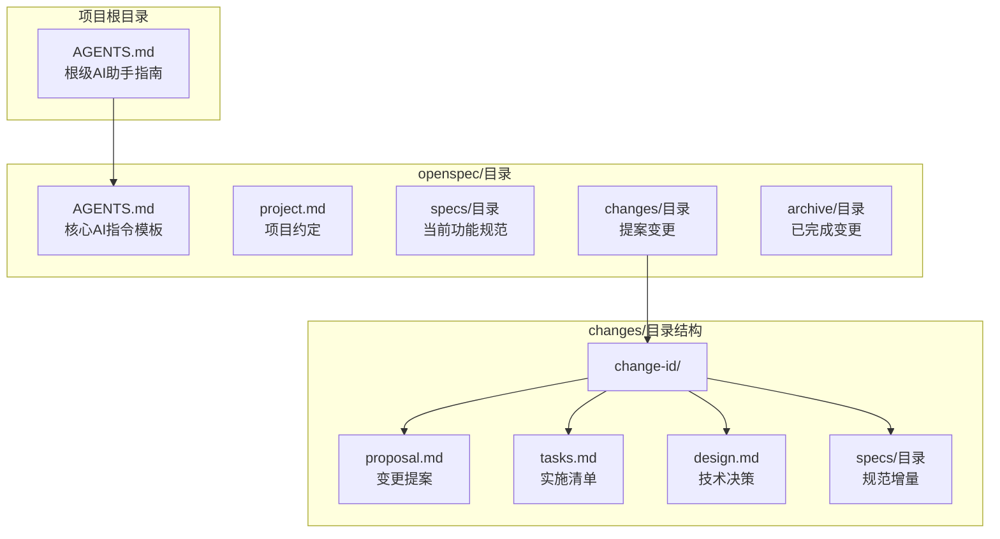
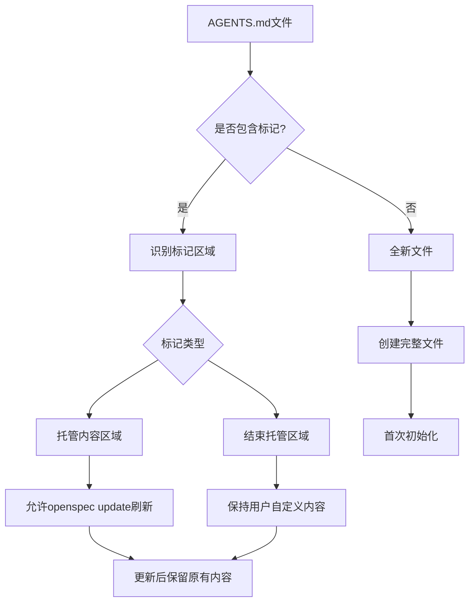
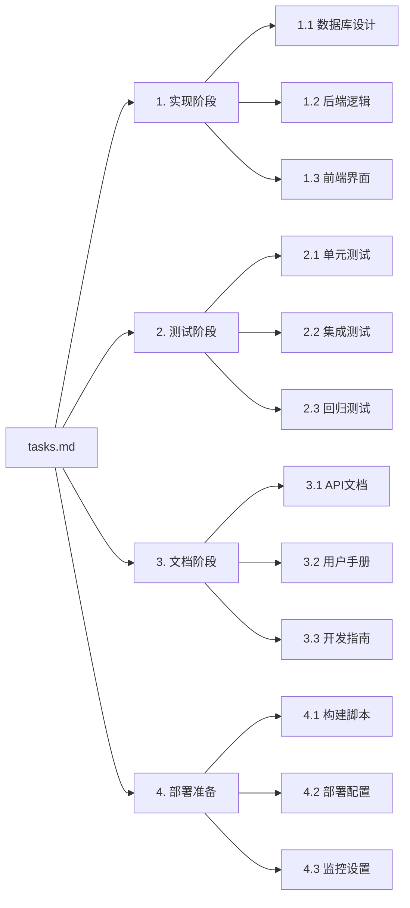
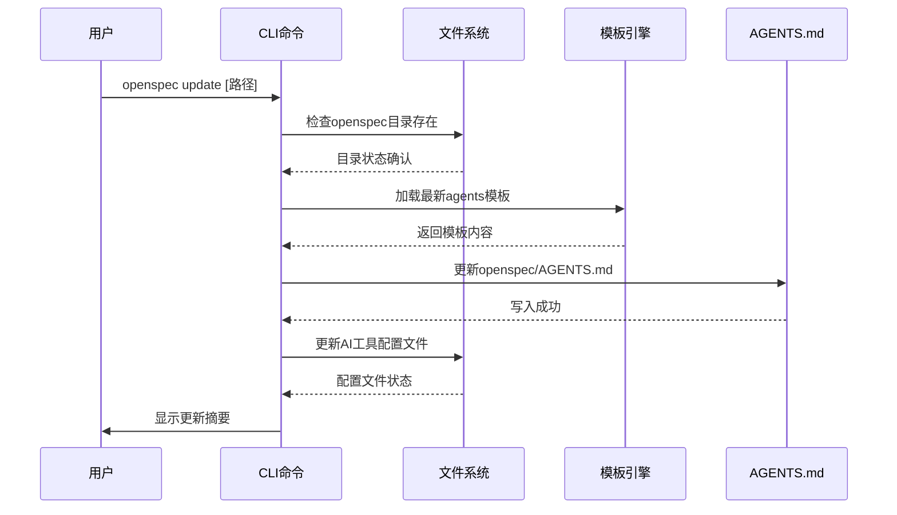
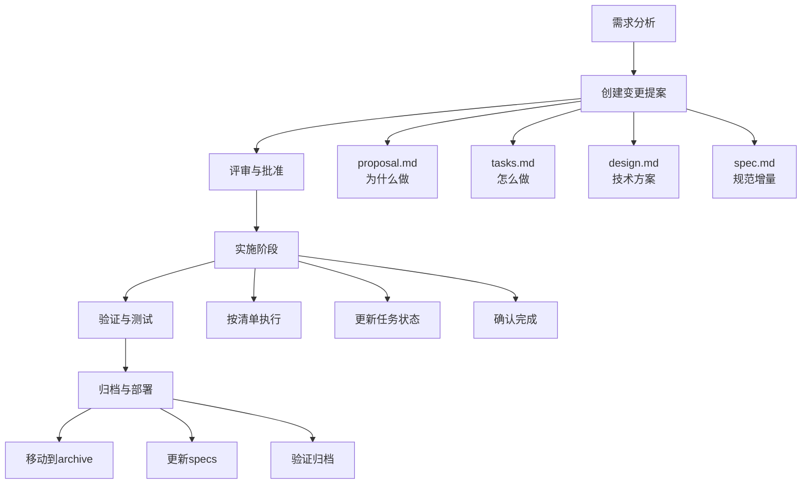

# 任务清单(tasks.md与AGENTS.md)

<cite>
**本文档中引用的文件**
- [AGENTS.md](file://openspec/AGENTS.md)
- [tasks.md](file://openspec/changes/add-scaffold-command/tasks.md)
- [tasks.md](file://openspec/changes/archive/2025-08-05-initialize-typescript-project/tasks.md)
- [README.md](file://README.md)
- [update.ts](file://src/core/update.ts)
- [agents-template.ts](file://src/core/templates/agents-template.ts)
- [agents-root-stub.ts](file://src/core/templates/agents-root-stub.ts)
- [config.ts](file://src/core/config.ts)
- [file-system.ts](file://src/utils/file-system.ts)
- [spec.md](file://openspec/specs/cli-init/spec.md)
- [spec.md](file://openspec/changes/add-scaffold-command/specs/cli-scaffold/spec.md)
</cite>

## 目录
1. [简介](#简介)
2. [项目结构概述](#项目结构概述)
3. [AGENTS.md文件详解](#agentsmd文件详解)
4. [tasks.md文件详解](#tasksmd文件详解)
5. [openspec update命令](#openspec-update命令)
6. [工作流程与最佳实践](#工作流程与最佳实践)
7. [示例分析](#示例分析)
8. [故障排除指南](#故障排除指南)
9. [总结](#总结)

## 简介

OpenSpec是一个为AI编码助手设计的规范驱动开发框架，通过两个核心文件`AGENTS.md`和`tasks.md`实现开发流程的自动化与一致性管理。这两个文件分别承担着AI助手操作指南和实施检查清单的重要角色，确保团队协作的透明性和可追溯性。

## 项目结构概述

OpenSpec采用清晰的目录结构来组织项目文件，其中`AGENTS.md`和`tasks.md`在不同的层级发挥着各自的作用：



**图表来源**
- [AGENTS.md](file://openspec/AGENTS.md#L1-L50)
- [config.ts](file://src/core/config.ts#L1-L10)

**章节来源**
- [AGENTS.md](file://openspec/AGENTS.md#L1-L140)
- [README.md](file://README.md#L120-L180)

## AGENTS.md文件详解

### 核心作用与特殊结构

`AGENTS.md`是OpenSpec系统的核心AI助手操作指南，具有以下关键特性：

#### 1. 特殊标记保留规则

AGENTS.md文件使用特殊的HTML注释标记来维护可刷新的内容区域：

```markdown
<!-- OPENSPEC:START -->
# OpenSpec Instructions

这些指令适用于在此项目中工作的AI助手。

始终打开 `@/openspec/AGENTS.md` 当请求：
- 涉及规划或提案（如proposal、spec、change、plan等词汇）
- 引入新功能、破坏性变更、架构调整或重大性能/安全工作
- 需要权威规范才能编码的模糊请求

使用 `@/openspec/AGENTS.md` 学习：
- 如何创建和应用变更提案
- 规范格式和约定
- 项目结构和指导原则

保持这个托管块，以便 'openspec update' 可以刷新指令。

<!-- OPENSPEC:END -->
```

#### 2. 文件位置与作用

**根级AGENTS.md**：位于项目根目录，作为所有团队成员的统一入口点，指向核心的openspec/AGENTS.md文件。

**核心AGENTS.md**：位于`openspec/`目录下，包含完整的OpenSpec工作流程指导。

#### 3. 内容管理机制

AGENTS.md文件采用标记系统来区分可管理内容和用户自定义内容：



**图表来源**
- [file-system.ts](file://src/utils/file-system.ts#L145-L187)
- [agents-root-stub.ts](file://src/core/templates/agents-root-stub.ts#L1-L16)

**章节来源**
- [AGENTS.md](file://openspec/AGENTS.md#L1-L19)
- [agents-template.ts](file://src/core/templates/agents-template.ts#L1-L50)

## tasks.md文件详解

### 实施检查清单功能

`tasks.md`文件作为实施检查清单，包含可验证的完成步骤，确保开发过程的完整性和质量控制。

#### 1. 文件格式与结构

tasks.md采用标准的Markdown格式，使用复选框列表来跟踪任务进度：

```markdown
## 1. 实现阶段
- [ ] 1.1 创建数据库模式
- [ ] 1.2 实现API端点
- [ ] 1.3 添加前端组件
- [ ] 1.4 编写测试用例

## 2. 测试验证
- [ ] 2.1 单元测试覆盖率达到80%
- [ ] 2.2 集成测试通过
- [ ] 2.3 性能测试达标
```

#### 2. 任务分类与层次结构

任务按照实施阶段进行分类，每个阶段包含多个子任务：



**图表来源**
- [tasks.md](file://openspec/changes/add-scaffold-command/tasks.md#L1-L12)
- [tasks.md](file://openspec/changes/archive/2025-08-05-initialize-typescript-project/tasks.md#L1-L25)

#### 3. 任务状态管理

tasks.md支持两种任务状态：

- **未完成状态**：`- [ ] 任务描述` - 表示需要开始的工作
- **完成状态**：`- [x] 任务描述` - 表示已完成的工作

**章节来源**
- [tasks.md](file://openspec/changes/add-scaffold-command/tasks.md#L1-L12)
- [tasks.md](file://openspec/changes/archive/2025-08-05-initialize-typescript-project/tasks.md#L1-L25)

## openspec update命令

### 刷新AGENTS.md内容

`openspec update`命令负责刷新AGENTS.md文件内容，确保AI助手获得最新的工作流程指导。

#### 1. 命令执行流程



**图表来源**
- [update.ts](file://src/core/update.ts#L8-L30)

#### 2. 更新策略

`openspec update`命令采用以下更新策略：

1. **核心文件全量替换**：`openspec/AGENTS.md`使用完全替换策略
2. **AI工具配置增量更新**：仅更新托管内容区域
3. **根级AGENTS.md同步**：保持与核心文件的一致性

#### 3. 标记系统支持

更新命令利用OPENSPEC标记系统精确更新内容：

```typescript
// 标记常量定义
export const OPENSPEC_MARKERS = {
  start: '<!-- OPENSPEC:START -->',
  end: '<!-- OPENSPEC:END -->'
};
```

**章节来源**
- [update.ts](file://src/core/update.ts#L1-L130)
- [config.ts](file://src/core/config.ts#L3-L6)

## 工作流程与最佳实践

### 完整的OpenSpec工作流程

OpenSpec采用三阶段工作流程，确保变更的规范性和可追溯性：



**图表来源**
- [AGENTS.md](file://openspec/AGENTS.md#L15-L80)

### 最佳实践指南

#### 1. tasks.md编写最佳实践

- **明确的任务描述**：每个任务应该有清晰、具体的目标
- **合理的任务粒度**：避免过于粗略或过于细碎的任务划分
- **时间估算**：为每个任务提供合理的时间估算
- **依赖关系**：明确任务间的依赖关系

#### 2. AGENTS.md维护最佳实践

- **定期更新**：使用`openspec update`保持内容最新
- **标记保护**：不要修改托管标记区域内的内容
- **版本控制**：将AGENTS.md纳入版本控制系统
- **团队同步**：确保所有团队成员使用相同的指令版本

**章节来源**
- [AGENTS.md](file://openspec/AGENTS.md#L400-L455)

## 示例分析

### tasks.md示例分析

#### 示例1：新功能开发任务清单

基于添加CLI脚手架命令的变更，tasks.md展示了完整的实施步骤：

```markdown
## 1. CLI脚手架命令
- [ ] 1.1 在CLI入口点注册 `openspec scaffold` 命令，验证 `change-id` 参数
- [ ] 1.2 实现生成器逻辑，创建变更目录结构及默认的 `proposal.md`、`tasks.md` 和增量规范骨架
- [ ] 1.3 确保不覆盖已填充的现有文件

## 2. 模板与文档
- [ ] 2.1 在 `openspec/AGENTS.md` 的顶级快速参考中展示复制粘贴模板和脚手架用法
- [ ] 2.2 刷新其他CLI文档（`docs/`、README）以提及脚手架工作流程并链接到说明

## 3. 测试覆盖
- [ ] 3.1 添加单元测试，覆盖名称验证、文件生成和幂等重运行
- [ ] 3.2 添加集成测试，确保生成的文件通过 `openspec validate --strict` 而无需手动编辑
```

#### 示例2：项目初始化任务清单

基于TypeScript项目初始化的变更，展示了项目基础建设的完整流程：

```markdown
## 1. 项目配置
- [x] 1.1 创建package.json，包含项目元数据、脚本和ESM配置
- [x] 1.2 配置TypeScript，使用tsconfig.json进行ESM输出
- [x] 1.3 添加Node.js/TypeScript项目的.gitignore
- [x] 1.4 设置Node.js引擎要求>=20.19.0

## 2. 目录结构
- [x] 2.1 创建src/目录用于源代码
- [x] 2.2 创建src/cli/用于CLI命令
- [x] 2.3 创建src/core/用于核心OpenSpec逻辑
- [x] 2.4 创建src/utils/用于共享工具

## 3. 构建配置
- [x] 3.1 创建build.js用于原生TypeScript编译
- [x] 3.2 配置开发脚本（构建、开发）
- [x] 3.3 设置包入口点，使用ESM导出
- [x] 3.4 配置ESM文件扩展名处理
```

**章节来源**
- [tasks.md](file://openspec/changes/add-scaffold-command/tasks.md#L1-L12)
- [tasks.md](file://openspec/changes/archive/2025-08-05-initialize-typescript-project/tasks.md#L1-L25)

### AGENTS.md示例分析

#### 核心AGENTS.md结构

核心AGENTS.md文件包含了完整的OpenSpec工作流程指导：

```markdown
# OpenSpec Instructions

Instructions for AI coding assistants using OpenSpec for spec-driven development.

## TL;DR 快速清单

- 搜索现有工作：`openspec spec list --long`，`openspec list`（仅使用`rg`进行全文搜索）
- 决定范围：新功能vs修改现有功能
- 选择唯一`change-id`：kebab-case，动词开头（`add-`，`update-`，`remove-`，`refactor-`）
- 脚手架：`proposal.md`，`tasks.md`，`design.md`（仅在需要时），以及受影响能力的增量规范
- 编写增量：使用`## ADDED|MODIFIED|REMOVED|RENAMED Requirements`；每项要求至少包含一个`#### Scenario:`
- 验证：`openspec validate [change-id] --strict`并修复问题
- 请求批准：在提案获得批准前不要开始实施
```

#### 标记系统示例

根级AGENTS.md文件展示了标记系统的正确使用：

```markdown
<!-- OPENSPEC:START -->
# OpenSpec Instructions

这些指令适用于在此项目中工作的AI助手。

始终打开 `@/openspec/AGENTS.md` 当请求：
- 涉及规划或提案（如proposal、spec、change、plan等词汇）
- 引入新功能、破坏性变更、架构调整或重大性能/安全工作
- 需要权威规范才能编码的模糊请求

使用 `@/openspec/AGENTS.md` 学习：
- 如何创建和应用变更提案
- 规范格式和约定
- 项目结构和指导原则

保持这个托管块，以便 'openspec update' 可以刷新指令。

<!-- OPENSPEC:END -->
```

**章节来源**
- [AGENTS.md](file://openspec/AGENTS.md#L1-L50)
- [agents-template.ts](file://src/core/templates/agents-template.ts#L1-L50)

## 故障排除指南

### 常见问题与解决方案

#### 1. AGENTS.md相关问题

**问题**：AGENTS.md内容过时
- **解决方案**：运行`openspec update`命令刷新内容
- **预防措施**：定期检查并更新AGENTS.md文件

**问题**：标记区域损坏
- **解决方案**：删除损坏的标记，让`openspec update`重新生成
- **预防措施**：不要手动修改托管标记区域

#### 2. tasks.md相关问题

**问题**：任务清单不完整
- **解决方案**：根据实际实施步骤补充缺失的任务
- **预防措施**：在开始实施前详细规划所有必要步骤

**问题**：任务状态不准确
- **解决方案**：及时更新任务状态，确保反映真实进展
- **预防措施**：建立定期检查和更新任务状态的流程

#### 3. 文件格式问题

**问题**：tasks.md格式错误
- **解决方案**：确保使用正确的Markdown语法和复选框格式
- **预防措施**：遵循OpenSpec推荐的格式规范

**问题**：AGENTS.md格式错误
- **解决方案**：检查标记语法，确保开始和结束标记正确配对
- **预防措施**：使用模板文件而非手动创建

**章节来源**
- [AGENTS.md](file://openspec/AGENTS.md#L288-L350)

## 总结

OpenSpec的`tasks.md`和`AGENTS.md`文件构成了一个完整的开发流程管理体系：

### 主要优势

1. **自动化程度高**：通过标准化的文件格式和CLI命令实现流程自动化
2. **可追溯性强**：每个步骤都有明确的记录和状态跟踪
3. **团队协作友好**：统一的格式和工作流程确保团队成员的一致性
4. **易于维护**：标记系统和模板机制简化了内容管理

### 关键要点

- `tasks.md`作为实施检查清单，确保开发过程的完整性和质量
- `AGENTS.md`作为AI助手操作指南，提供标准化的工作流程指导
- `openspec update`命令保证内容的及时更新和一致性
- 标记系统保护可管理内容的同时允许用户自定义

### 推荐实践

1. **定期维护**：使用`openspec update`保持AGENTS.md内容最新
2. **详细规划**：在开始实施前制定完整且详细的tasks.md
3. **及时更新**：实时更新任务状态，反映真实的项目进展
4. **团队培训**：确保所有团队成员熟悉OpenSpec工作流程

通过正确使用和维护这两个核心文件，OpenSpec能够显著提升AI辅助开发的效率和质量，实现真正的规范驱动开发。