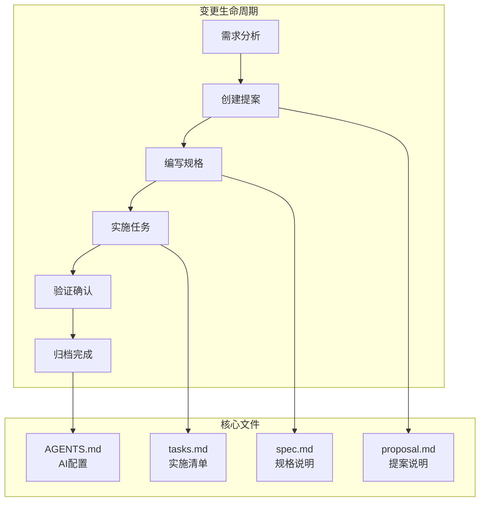
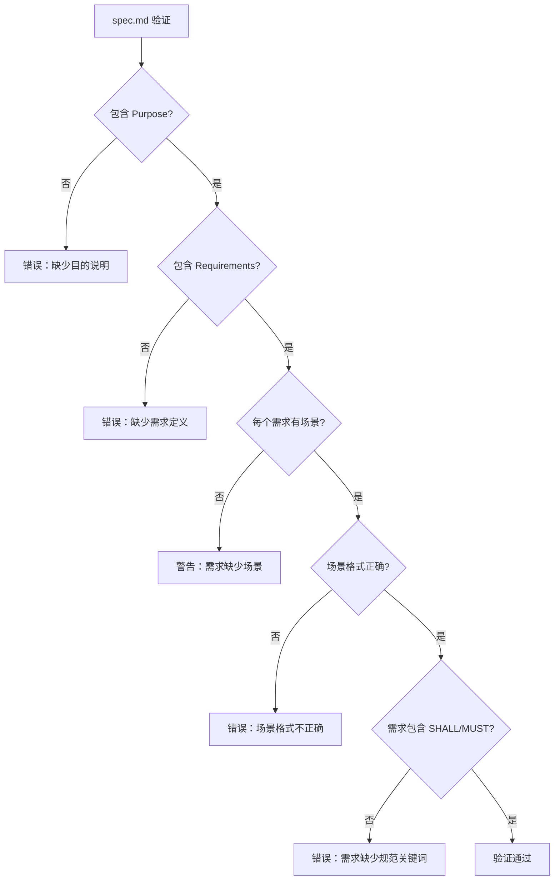
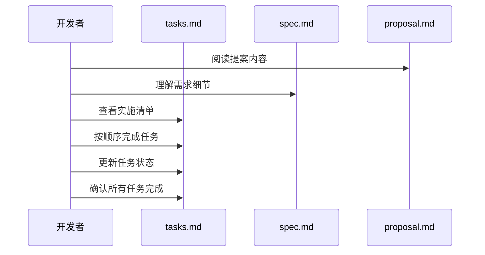
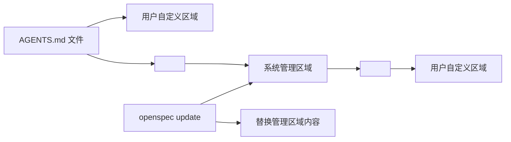
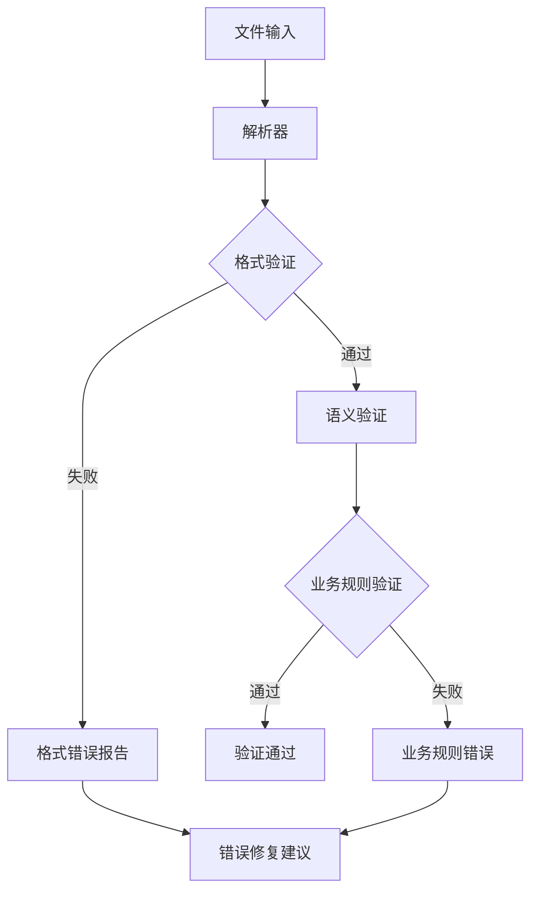
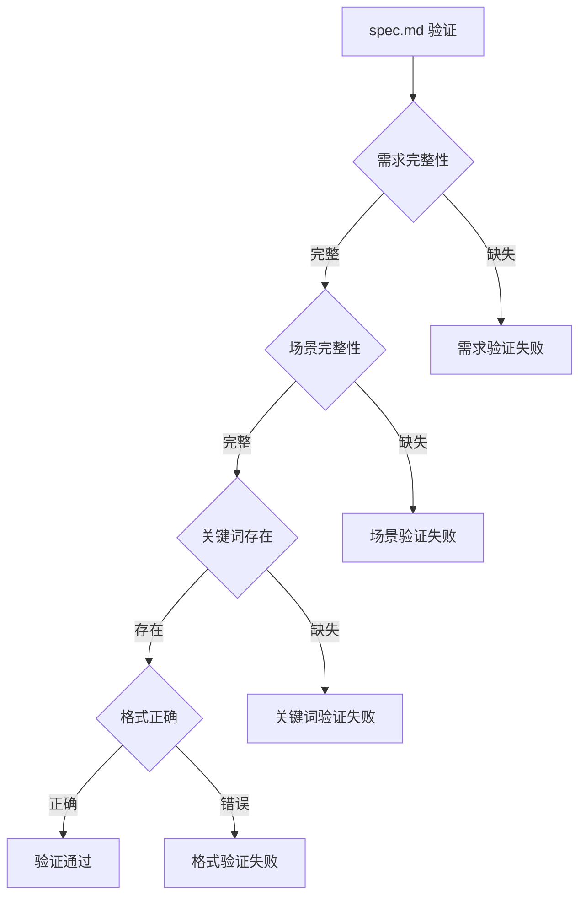
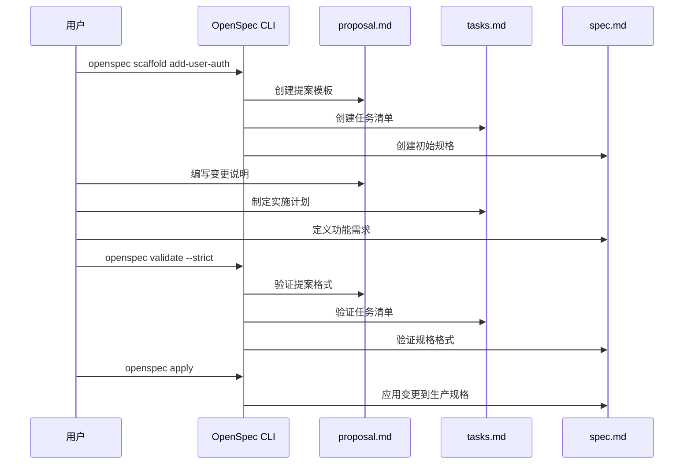

# 规范与提案文件

<cite>
**本文档中引用的文件**
- [spec.md](file://openspec/specs/cli-init/spec.md)
- [proposal.md](file://openspec/changes/add-scaffold-command/proposal.md)
- [tasks.md](file://openspec/changes/add-scaffold-command/tasks.md)
- [AGENTS.md](file://openspec/AGENTS.md)
- [agents-template.ts](file://src/core/templates/agents-template.ts)
- [agents-root-stub.ts](file://src/core/templates/agents-root-stub.ts)
- [base.schema.ts](file://src/core/schemas/base.schema.ts)
- [spec.schema.ts](file://src/core/schemas/spec.schema.ts)
- [validator.ts](file://src/core/validation/validator.ts)
- [project.md](file://openspec/project.md)
</cite>

## 目录
1. [简介](#简介)
2. [核心文件类型概述](#核心文件类型概述)
3. [spec.md 格式规范](#specmd-格式规范)
4. [proposal.md 结构要求](#proposalmd-结构要求)
5. [tasks.md 实施检查清单](#tasksmd-实施检查清单)
6. [AGENTS.md 特殊标记系统](#agentsmd-特殊标记系统)
7. [文件验证机制](#文件验证机制)
8. [最佳实践与示例](#最佳实践与示例)
9. [总结](#总结)

## 简介

OpenSpec 是一个专为 AI 助手设计的规范驱动开发框架，通过标准化的文件格式和工作流程来管理软件变更。该系统的核心在于三种主要文件类型的严格格式规范：`spec.md`（规格说明）、`proposal.md`（提案）和`tasks.md`（任务清单），以及特殊的`AGENTS.md`配置文件。

这些文件共同构成了 OpenSpec 的核心基础设施，确保 AI 助手能够准确理解项目上下文、规划变更并执行实现任务。每种文件都有其特定的用途和严格的格式要求，以保证系统的可预测性和一致性。

## 核心文件类型概述

OpenSpec 系统围绕三个核心文件类型构建，每个文件在变更生命周期的不同阶段发挥重要作用：



**图表来源**
- [AGENTS.md](file://openspec/AGENTS.md#L1-L50)
- [proposal.md](file://openspec/changes/add-scaffold-command/proposal.md#L1-L12)
- [tasks.md](file://openspec/changes/add-scaffold-command/tasks.md#L1-L12)

### 文件职责分配

| 文件类型 | 主要职责 | 创建时机 | 关键特征 |
|---------|---------|---------|---------|
| `spec.md` | 定义功能需求和行为场景 | 规划阶段或修改现有规格时 | 必须包含 `### Requirement:` 和 `#### Scenario:` 结构 |
| `proposal.md` | 说明变更原因、内容和影响 | 新增功能或重大变更时 | 必须包含 `## Why`、`## What Changes`、`## Impact` 部分 |
| `tasks.md` | 提供实施步骤检查清单 | 开始编码前 | 使用 `- [ ]` 语法标记待办事项 |
| `AGENTS.md` | AI 助手操作指南 | 项目初始化时 | 包含 `<!-- OPENSPEC:START -->` 和 `<!-- OPENSPEC:END -->` 标记 |

## spec.md 格式规范

`spec.md` 文件是 OpenSpec 系统的核心规格说明文件，采用严格的结构化格式来描述功能需求和行为场景。

### 基本结构要求

```mermaid
flowchart TD
A[spec.md 文件] --> B[## Purpose<br/>目的说明]
A --> C[## Requirements<br/>需求定义]
C --> D[### Requirement: [名称]<br/>需求标题]
D --> E[需求描述文本<br/>必须包含 SHALL 或 MUST]
D --> F[#### Scenario: [描述]<br/>行为场景]
F --> G[**WHEN** 条件触发]
F --> H[**THEN** 预期结果]
F --> I[**AND** 其他条件]
```

**图表来源**
- [spec.md](file://openspec/specs/cli-init/spec.md#L1-L120)
- [base.schema.ts](file://src/core/schemas/base.schema.ts#L1-L20)

### Requirement 结构规范

每个 `spec.md` 文件必须遵循以下核心结构：

#### 1. 需求标题格式
- 使用 `### Requirement: [功能名称]` 格式
- 功能名称应简洁明了，描述具体的功能特性
- 支持子需求，使用层级格式如 `### Requirement: 主功能 > 子功能`

#### 2. 需求文本要求
- 必须包含 `SHALL` 或 `MUST` 关键词
- 描述功能的行为规范而非实现细节
- 避免使用模糊词汇如 `should`、`may`，除非有意表示非强制性要求

#### 3. Scenario 行为描述模式

OpenSpec 采用标准的 `GIVEN`/`WHEN`/`THEN` 行为描述模式：

```markdown
#### Scenario: 用户登录成功
- **WHEN** 提供有效凭据
- **THEN** 返回 JWT 令牌
- **AND** 设置用户会话
```

**关键要点：**
- 使用 `#### Scenario:` 四级标题格式
- 每个需求必须至少包含一个场景
- 场景描述必须使用 `- **WHEN**`、`- **THEN**`、`- **AND**` 格式
- 不得使用项目符号列表或粗体格式替代场景标题

### Delta 操作类型

在变更提案中，`spec.md` 可以使用特殊的 Delta 操作类型来描述变更：

| 操作类型 | 用途 | 示例 |
|---------|------|------|
| `## ADDED Requirements` | 添加新功能 | 新增用户认证功能 |
| `## MODIFIED Requirements` | 修改现有功能 | 更新 API 接口行为 |
| `## REMOVED Requirements` | 移除旧功能 | 删除过时的 API 端点 |
| `## RENAMED Requirements` | 重命名功能 | 将 "登录" 改为 "用户认证" |

### 验证规则

系统对 `spec.md` 文件实施严格的验证规则：



**图表来源**
- [validator.ts](file://src/core/validation/validator.ts#L288-L318)
- [base.schema.ts](file://src/core/schemas/base.schema.ts#L1-L20)

**节来源**
- [spec.md](file://openspec/specs/cli-init/spec.md#L1-L277)
- [base.schema.ts](file://src/core/schemas/base.schema.ts#L1-L20)
- [validator.ts](file://src/core/validation/validator.ts#L288-L318)

## proposal.md 结构要求

`proposal.md` 文件作为变更提案的核心文档，必须包含明确的 `From/To/Reason/Impact` 显式变更描述，为 AI 助手提供清晰的变更指导。

### 标准结构模板

```markdown
## Why
[1-2 句话说明问题或机会]

## What Changes
- [变更列表，标记破坏性变更用 **BREAKING**]
- [具体的代码变更或架构调整]

## Impact
- Affected specs: [受影响的功能模块]
- Affected code: [关键文件或系统]
```

### Why 部分要求

**Why** 部分必须：
- 清晰说明变更的动机和背景
- 解释为什么需要这个变更
- 描述预期解决的问题或带来的价值
- 字数限制：1-2 句话，避免冗长解释

### What Changes 部分要求

**What Changes** 部分必须：
- 列出所有具体的变更内容
- 使用项目符号格式
- 标记破坏性变更（如 API 更改、架构调整）
- 避免过于技术性的实现细节
- 保持简洁明了

### Impact 部分要求

**Impact** 部分必须：
- 明确列出受影响的功能模块
- 指出关键的代码文件或系统
- 评估变更的影响范围
- 考虑向后兼容性问题

### 示例内容结构

```markdown
## Why
当前的用户认证系统缺乏多因素认证支持，无法满足安全合规要求。

## What Changes
- 在用户认证流程中添加 TOTP 两步验证
- 更新现有的登录 API 以支持新的认证方式
- 创建新的通知服务用于发送验证码
- 更新前端界面以支持两步验证流程

## Impact
- Affected specs: auth, notifications
- Affected code: src/auth/, src/notifications/, web/frontend/
```

**节来源**
- [proposal.md](file://openspec/changes/add-scaffold-command/proposal.md#L1-L12)
- [AGENTS.md](file://openspec/AGENTS.md#L158-L175)

## tasks.md 实施检查清单

`tasks.md` 文件作为实施检查清单，为开发者提供结构化的任务管理框架，确保变更的完整性和质量。

### 清单格式规范

```markdown
## 1. 实现阶段
- [ ] 1.1 创建数据库架构
- [ ] 1.2 实现 API 端点
- [ ] 1.3 添加前端组件
- [ ] 1.4 编写单元测试
- [ ] 1.5 编写集成测试

## 2. 文档更新
- [ ] 2.1 更新 API 文档
- [ ] 2.2 更新用户手册
- [ ] 2.3 更新变更日志

## 3. 测试验证
- [ ] 3.1 执行功能测试
- [ ] 3.2 执行性能测试
- [ ] 3.3 执行安全测试
```

### 任务组织原则

1. **逻辑分组**：按实现阶段或功能模块组织任务
2. **编号系统**：使用层次编号（1.1, 1.2, 2.1 等）保持清晰结构
3. **状态跟踪**：使用 `- [ ]` 表示未完成，`- [x]` 表示已完成
4. **具体描述**：每个任务应有明确的完成标准

### 实施流程



**图表来源**
- [tasks.md](file://openspec/changes/add-scaffold-command/tasks.md#L1-L12)
- [AGENTS.md](file://openspec/AGENTS.md#L49-L65)

**节来源**
- [tasks.md](file://openspec/changes/add-scaffold-command/tasks.md#L1-L12)
- [AGENTS.md](file://openspec/AGENTS.md#L49-L65)

## AGENTS.md 特殊标记系统

`AGENTS.md` 文件是 OpenSpec 系统中用于配置 AI 助手的关键文件，采用特殊的标记系统来区分可管理内容和用户自定义内容。

### 标记系统原理

OpenSpec 使用 `<!-- OPENSPEC:START -->` 和 `<!-- OPENSPEC:END -->` 标记来定义可管理的内容区域：

```markdown
<!-- OPENSPEC:START -->
# OpenSpec Instructions

这是 OpenSpec 的核心指令，由系统自动维护。

- 始终打开 `@/openspec/AGENTS.md` 获取权威指导
- 这个管理块允许 `openspec update` 刷新指令
<!-- OPENSPEC:END -->

自定义的个人或团队指令可以放在这里
```

### 标记区域管理



**图表来源**
- [agents-template.ts](file://src/core/templates/agents-template.ts#L1-L50)
- [agents-root-stub.ts](file://src/core/templates/agents-root-stub.ts#L1-L16)

### 标记使用规则

1. **保留规则**：标记之间的内容由系统完全控制
2. **不可删除**：标记本身不能被删除或修改
3. **内容替换**：系统更新时只替换标记内的内容
4. **位置固定**：标记必须位于文件的固定位置

### 模板系统

OpenSpec 提供了专门的模板管理系统来处理 AGENTS.md 文件：

```typescript
// 模板管理器示例
const content = TemplateManager.getAgentsStandardTemplate();
await FileSystemUtils.updateFileWithMarkers(
  filePath,
  content,
  OPENSPEC_MARKERS.start,
  OPENSPEC_MARKERS.end
);
```

这种设计确保：
- 系统更新时不会破坏用户的个性化配置
- 所有团队成员获得一致的指导信息
- 自动化的更新流程保持高效

**节来源**
- [AGENTS.md](file://openspec/AGENTS.md#L1-L455)
- [agents-template.ts](file://src/core/templates/agents-template.ts#L1-L458)
- [agents-root-stub.ts](file://src/core/templates/agents-root-stub.ts#L1-L16)

## 文件验证机制

OpenSpec 系统实现了全面的文件验证机制，确保所有规范文件都符合既定的格式要求和语义规则。

### 验证架构



**图表来源**
- [validator.ts](file://src/core/validation/validator.ts#L288-L318)
- [base.schema.ts](file://src/core/schemas/base.schema.ts#L1-L20)

### 核心验证规则

#### 1. 基础结构验证

| 验证项 | 规则 | 错误级别 |
|-------|------|---------|
| Purpose 存在性 | 必须包含 `## Purpose` 标题 | 错误 |
| Requirements 存在性 | 必须包含 `## Requirements` 标题 | 错误 |
| 需求数量 | 至少包含一个需求 | 错误 |
| 场景数量 | 每个需求至少一个场景 | 警告 |

#### 2. 内容格式验证

| 验证项 | 规则 | 示例 |
|-------|------|------|
| 需求关键词 | 必须包含 `SHALL` 或 `MUST` | ✅ `The system SHALL...` |
| 场景格式 | 必须使用 `#### Scenario:` 格式 | ✅ `#### Scenario: 登录成功` |
| 标题层级 | 正确的 Markdown 层级结构 | ✅ `###` 和 `####` 的正确使用 |

#### 3. 语义完整性验证



**图表来源**
- [spec.schema.ts](file://src/core/schemas/spec.schema.ts#L1-L17)
- [validator.ts](file://src/core/validation/validator.ts#L288-L318)

### 验证工具

OpenSpec 提供了专门的验证命令：

```bash
# 基本验证
openspec validate [change-id]

# 严格验证（推荐）
openspec validate [change-id] --strict

# JSON 输出用于调试
openspec validate [change-id] --json
```

### 常见验证错误

| 错误类型 | 原因 | 解决方案 |
|---------|------|---------|
| "Change must have at least one delta" | 缺少规格变更 | 检查 `specs/` 目录是否存在且包含 `.md` 文件 |
| "Requirement must have at least one scenario" | 需求缺少场景 | 确保使用 `#### Scenario:` 格式 |
| "Requirement must contain SHALL or MUST" | 需求缺少规范关键词 | 在需求描述中添加 `SHALL` 或 `MUST` |

**节来源**
- [validator.ts](file://src/core/validation/validator.ts#L288-L318)
- [base.schema.ts](file://src/core/schemas/base.schema.ts#L1-L20)
- [spec.schema.ts](file://src/core/schemas/spec.schema.ts#L1-L17)

## 最佳实践与示例

### 完整的变更工作流程示例

以下是一个完整的变更工作流程示例，展示了三种核心文件的协作关系：



**图表来源**
- [AGENTS.md](file://openspec/AGENTS.md#L158-L205)
- [spec.md](file://openspec/specs/cli-init/spec.md#L1-L120)

### 文件内容示例

#### proposal.md 示例

```markdown
## Why
当前的用户管理系统缺乏密码强度验证，存在安全风险。需要添加密码复杂度要求以提高账户安全性。

## What Changes
- 添加密码强度验证规则
- 更新用户注册流程
- 创建密码策略文档
- 更新相关 API 接口

## Impact
- Affected specs: user-management, auth
- Affected code: src/auth/, web/api/users/
```

#### tasks.md 示例

```markdown
## 1. 密码验证实现
- [ ] 1.1 创建密码强度验证函数
- [ ] 1.2 实现复杂度检查逻辑
- [ ] 1.3 添加正则表达式验证规则
- [ ] 1.4 编写边界情况测试

## 2. API 更新
- [ ] 2.1 修改用户注册接口
- [ ] 2.2 更新密码验证端点
- [ ] 2.3 添加错误响应格式

## 3. 文档更新
- [ ] 3.1 更新密码策略文档
- [ ] 3.2 更新 API 文档
- [ ] 3.3 更新用户手册
```

#### spec.md 示例

```markdown
## Purpose
为用户提供强密码保护，防止弱密码攻击。

## Requirements
### Requirement: 密码强度验证
用户注册时提供的密码必须满足以下强度要求：
- 至少 8 个字符长度
- 包含大写字母、小写字母、数字和特殊字符
- 不得包含连续重复字符

#### Scenario: 强密码注册
- **WHEN** 用户提交符合要求的密码
- **THEN** 密码验证通过
- **AND** 用户账户创建成功

#### Scenario: 弱密码注册
- **WHEN** 用户提交弱密码
- **THEN** 显示具体验证错误
- **AND** 用户账户创建失败

#### Scenario: 边界情况处理
- **WHEN** 用户提交空密码
- **THEN** 显示必填字段错误
- **AND** 不进行强度验证
```

### 工作流程指导

#### 1. 变更规划阶段
- 使用 `openspec list` 查看当前变更
- 检查 `openspec/list --specs` 确认现有功能
- 选择合适的 `change-id`（kebab-case，动词开头）

#### 2. 文件创建阶段
- 运行 `openspec scaffold [change-id]` 自动生成基础文件
- 编辑 `proposal.md` 说明变更意图
- 编辑 `tasks.md` 制定实施计划
- 编辑 `spec.md` 定义功能需求

#### 3. 验证阶段
- 使用 `openspec validate [change-id] --strict` 进行严格验证
- 修复所有验证错误
- 确保每个需求都有至少一个场景

#### 4. 实施阶段
- 按照 `tasks.md` 中的顺序完成任务
- 每完成一项任务，在清单中标记为已执行
- 确保所有任务完成后才开始下一流程

#### 5. 归档阶段
- 使用 `openspec archive [change-id]` 归档完成的变更
- 系统会自动更新 `specs/` 目录中的生产规格

**节来源**
- [AGENTS.md](file://openspec/AGENTS.md#L158-L205)
- [proposal.md](file://openspec/changes/add-scaffold-command/proposal.md#L1-L12)
- [tasks.md](file://openspec/changes/add-scaffold-command/tasks.md#L1-L12)
- [spec.md](file://openspec/specs/cli-init/spec.md#L1-L277)

## 总结

OpenSpec 的三种核心文件格式规范构成了一个完整的规范驱动开发生态系统：

1. **spec.md** 提供了严格的需求描述格式，确保功能定义的准确性和可测试性
2. **proposal.md** 建立了清晰的变更沟通机制，促进团队协作和决策过程
3. **tasks.md** 提供了结构化的任务管理框架，确保变更的完整实施
4. **AGENTS.md** 通过标记系统实现了 AI 助手的自动化配置和更新

这些文件格式不仅规范了开发流程，更重要的是为 AI 助手提供了精确的操作指导，使得复杂的软件变更管理变得简单、可预测和可自动化。通过遵循这些规范，开发团队可以显著提高开发效率，减少沟通成本，并确保软件质量的一致性。

系统的验证机制进一步保证了文件质量，而标记系统的设计则确保了向后兼容性和可维护性。这种设计哲学体现了 OpenSpec 对于规范化、自动化和可扩展性的追求，为现代软件开发提供了一个创新的解决方案。