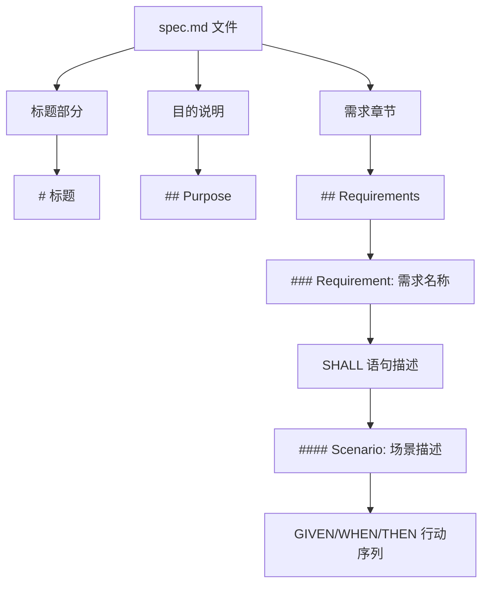
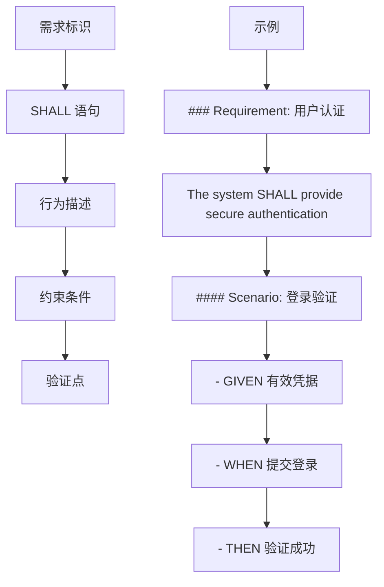
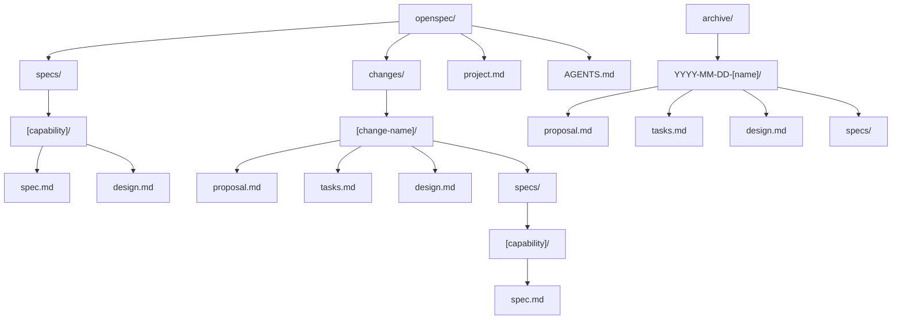
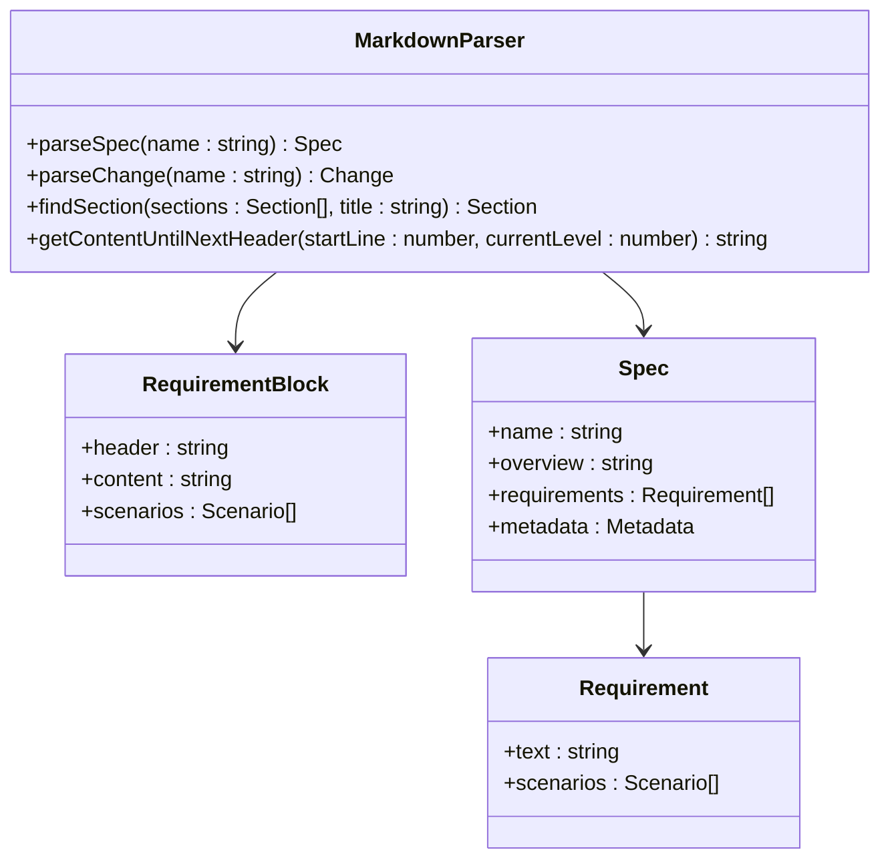
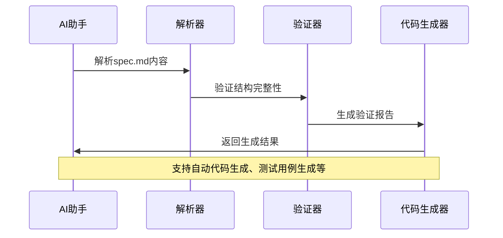
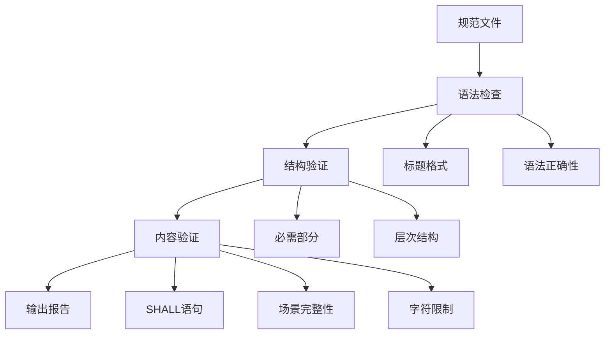
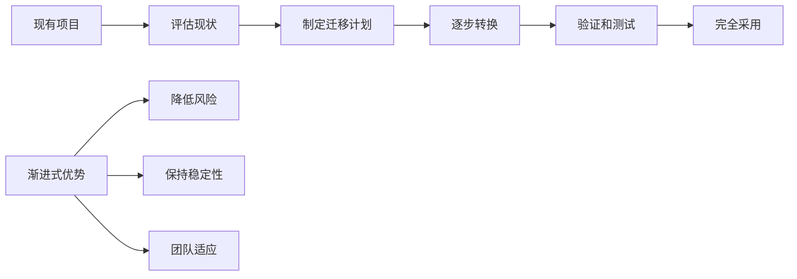

# 规范文件(spec.md)结构化格式规范

<cite>
**本文档引用的文件**
- [openspec-conventions/spec.md](file://openspec/specs/openspec-conventions/spec.md)
- [cli-init/spec.md](file://openspec/specs/cli-init/spec.md)
- [cli-validate/spec.md](file://openspec/specs/cli-validate/spec.md)
- [cli-change/spec.md](file://openspec/specs/cli-change/spec.md)
- [cli-show/spec.md](file://openspec/specs/cli-show/spec.md)
- [cli-spec/spec.md](file://openspec/specs/cli-spec/spec.md)
- [cli-update/spec.md](file://openspec/specs/cli-update/spec.md)
- [cli-list/spec.md](file://openspec/specs/cli-list/spec.md)
- [markdown-parser.ts](file://src/core/parsers/markdown-parser.ts)
- [requirement-blocks.ts](file://src/core/parsers/requirement-blocks.ts)
- [base.schema.ts](file://src/core/schemas/base.schema.ts)
- [spec.schema.ts](file://src/core/schemas/spec.schema.ts)
- [validator.ts](file://src/core/validation/validator.ts)
</cite>

## 目录
1. [概述](#概述)
2. [核心结构要求](#核心结构要求)
3. [需求标识规范](#需求标识规范)
4. [场景描述模式](#场景描述模式)
5. [行为描述语法](#行为描述语法)
6. [文件组织结构](#文件组织结构)
7. [工具解析支持](#工具解析支持)
8. [AI驱动开发应用](#ai驱动开发应用)
9. [验证规则与约束](#验证规则与约束)
10. [最佳实践指南](#最佳实践指南)

## 概述

OpenSpec的`spec.md`文件采用严格的结构化格式规范，确保系统能力的文档化、变更提案的跟踪以及规范演化的可追溯性。该规范的核心目标是为AI驱动的开发流程提供标准化的输入格式，同时支持工具解析和自动化处理。

### 设计原则

OpenSpec规范遵循以下核心设计原则：
- **一致性**：统一的标题层次和语法结构
- **可解析性**：支持程序化解析和自动化处理
- **可读性**：清晰的视觉层次和语义表达
- **灵活性**：渐进式采用和向后兼容
- **AI友好**：标准Markdown格式便于AI理解和处理

## 核心结构要求

### 基本文件结构

每个`spec.md`文件必须包含以下基本结构：



**图表来源**
- [openspec-conventions/spec.md](file://openspec/specs/openspec-conventions/spec.md#L1-L50)

### 必需部分

1. **标题部分**：使用`#`作为一级标题
2. **目的说明**：使用`## Purpose`作为二级标题
3. **需求章节**：使用`## Requirements`作为二级标题

**节来源**
- [openspec-conventions/spec.md](file://openspec/specs/openspec-conventions/spec.md#L1-L100)

## 需求标识规范

### 要求标识格式

所有需求必须使用`### Requirement: [Name]`作为标识，其中：
- **Name**：需求名称，应简洁明了
- **长度限制**：名称必须在50个字符以内
- **唯一性**：在同一文件中不能重复

```markdown
### Requirement: 用户认证安全机制
用户认证系统必须提供强加密的登录保护。

#### Scenario: 安全登录流程
- **GIVEN** 用户具有有效凭据
- **WHEN** 提交登录表单
- **THEN** 系统验证凭据安全性
- **AND** 记录登录尝试日志
```

### SHALL语句规范

每个需求必须包含明确的SHALL语句，描述核心行为：



**图表来源**
- [base.schema.ts](file://src/core/schemas/base.schema.ts#L8-L16)

**节来源**
- [openspec-conventions/spec.md](file://openspec/specs/openspec-conventions/spec.md#L263-L295)

## 场景描述模式

### 场景标题格式

使用`#### Scenario: [Description]`格式描述具体场景，其中：
- **Description**：场景描述，应简洁且具有行动导向
- **层级关系**：必须紧跟在需求标识之后

### 行动描述语法

场景描述采用GIVEN/WHEN/THEN模式：

```markdown
#### Scenario: 复杂用户注册流程
- **GIVEN** 用户访问注册页面
- **WHEN** 填写完整注册信息
- **THEN** 系统验证数据完整性
- **AND** 发送验证邮件
- **AND** 显示注册确认消息
```

### 可选元素

1. **GIVEN**：初始状态（可选）
2. **WHEN**：触发条件或动作
3. **THEN**：预期结果
4. **AND**：附加结果或条件

**节来源**
- [openspec-conventions/spec.md](file://openspec/specs/openspec-conventions/spec.md#L276-L295)

## 行为描述语法

### 标题层次结构

OpenSpec规范严格使用Markdown标题层次：

| 层级 | 标题格式 | 用途 | 示例 |
|------|----------|------|------|
| 1 | `# 标题` | 文件标题 | `# CLI Init Specification` |
| 2 | `## 标题` | 主要章节 | `## Purpose`, `## Requirements` |
| 3 | `### Requirement: 名称` | 需求标识 | `### Requirement: 用户认证` |
| 4 | `#### Scenario: 描述` | 场景描述 | `#### Scenario: 登录验证` |

### 语法约定

1. **粗体关键词**：GIVEN、WHEN、THEN、AND必须加粗
2. **连字符**：使用`-`作为列表前缀
3. **缩进**：子项保持一致的缩进
4. **换行**：复杂描述可以多行书写


**图表来源**
- [markdown-parser.ts](file://src/core/parsers/markdown-parser.ts#L1-L50)

**节来源**
- [openspec-conventions/spec.md](file://openspec/specs/openspec-conventions/spec.md#L53-L80)

## 文件组织结构

### 项目目录结构

OpenSpec项目采用标准化的目录结构：



**图表来源**
- [openspec-conventions/spec.md](file://openspec/specs/openspec-conventions/spec.md#L16-L40)

### 文件命名规范

1. **能力命名**：使用动词-名词模式（如`user-auth`、`payment-capture`）
2. **文件扩展名**：统一使用`.md`扩展名
3. **目录结构**：扁平结构，避免嵌套

**节来源**
- [openspec-conventions/spec.md](file://openspec/specs/openspec-conventions/spec.md#L438-L445)

## 工具解析支持

### 解析器架构

OpenSpec提供了完整的解析器支持，能够准确识别和提取规范内容：



**图表来源**
- [markdown-parser.ts](file://src/core/parsers/markdown-parser.ts#L1-L49)
- [requirement-blocks.ts](file://src/core/parsers/requirement-blocks.ts#L42-L64)

### 验证机制

系统提供多层次的验证机制：

1. **语法验证**：检查标题格式和结构完整性
2. **语义验证**：确保SHALL语句存在且格式正确
3. **内容验证**：验证场景描述的完整性

**节来源**
- [validator.ts](file://src/core/validation/validator.ts#L380-L430)

## AI驱动开发应用

### 自动化生成

OpenSpec规范为AI驱动的开发流程提供了理想的输入格式：



**图表来源**
- [cli-validate/spec.md](file://openspec/specs/cli-validate/spec.md#L1-L50)

### 开发工作流

1. **需求文档化**：通过规范格式记录需求
2. **AI辅助编写**：利用AI生成代码和测试
3. **自动化验证**：系统自动验证规范正确性
4. **持续集成**：规范与代码同步更新

**节来源**
- [openspec-conventions/spec.md](file://openspec/specs/openspec-conventions/spec.md#L230-L232)

## 验证规则与约束

### 结构验证

系统对`spec.md`文件实施严格的验证规则：

| 验证类型 | 规则描述 | 错误级别 |
|----------|----------|----------|
| 标题格式 | 必须使用标准Markdown标题 | ERROR |
| 必需部分 | 必须包含Purpose和Requirements | ERROR |
| 需求格式 | 每个需求必须有SHALL语句 | ERROR |
| 场景完整性 | 场景必须包含GIVEN/WHEN/THEN | WARNING |
| 字符限制 | 需求名称不超过50字符 | WARNING |

### 内容验证



**图表来源**
- [base.schema.ts](file://src/core/schemas/base.schema.ts#L1-L20)
- [spec.schema.ts](file://src/core/schemas/spec.schema.ts#L1-L17)

**节来源**
- [cli-validate/spec.md](file://openspec/specs/cli-validate/spec.md#L1-L100)

## 最佳实践指南

### 文档编写建议

1. **清晰性优先**：需求描述应简洁明了
2. **具体性要求**：避免模糊的表述
3. **一致性维护**：保持术语和格式的一致性
4. **完整性保证**：确保每个需求都有对应的场景

### 团队协作规范

1. **版本控制**：所有规范变更都通过变更提案流程
2. **审查机制**：变更需要经过同行评审
3. **同步更新**：规范与实际代码保持同步
4. **知识传承**：通过规范文档传递团队知识

### 迁移策略

对于现有项目，建议采用渐进式迁移策略：



**图表来源**
- [openspec-conventions/spec.md](file://openspec/specs/openspec-conventions/spec.md#L470-L474)

**节来源**
- [openspec-conventions/spec.md](file://openspec/specs/openspec-conventions/spec.md#L462-L474)

## 总结

OpenSpec的`spec.md`文件规范为现代软件开发提供了一套完整的解决方案。通过严格的结构化格式、强大的工具支持和AI驱动的应用，这套规范不仅提高了开发效率，还确保了系统的可维护性和可扩展性。随着AI技术的发展，这种规范化的文档方式将成为软件工程领域的重要趋势。