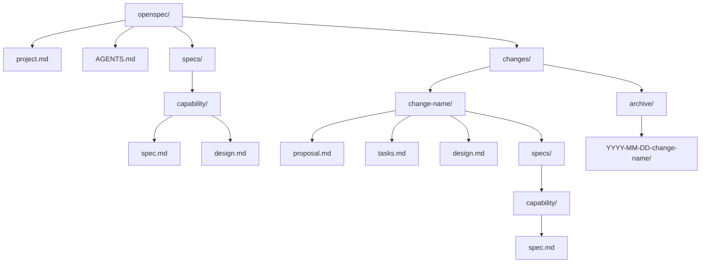

# 规范文件格式

<cite>
**本文档中引用的文件**  
- [spec.md](file://openspec/specs/openspec-conventions/spec.md)
- [proposal.md](file://openspec/changes/add-scaffold-command/proposal.md)
- [tasks.md](file://openspec/changes/add-scaffold-command/tasks.md)
- [AGENTS.md](file://openspec/AGENTS.md)
- [cli-init/spec.md](file://openspec/specs/cli-init/spec.md)
- [cli-update/spec.md](file://openspec/specs/cli-update/spec.md)
</cite>

## 目录
1. [项目结构](#项目结构)
2. [核心文件格式](#核心文件格式)
3. [Delta格式语义](#delta格式语义)
4. [AGENTS.md兼容性设计](#agentsmd兼容性设计)
5. [验证与错误处理](#验证与错误处理)

## 项目结构

OpenSpec项目采用标准化的目录结构，确保规范和变更提案的组织一致性。项目根目录下包含`openspec/`文件夹，其内部结构遵循严格的约定。



**Diagram sources**
- [spec.md](file://openspec/specs/openspec-conventions/spec.md#L17-L40)

**Section sources**
- [spec.md](file://openspec/specs/openspec-conventions/spec.md#L17-L40)

## 核心文件格式

### spec.md（规范文件）

`spec.md`文件用于定义系统当前已部署的能力，采用结构化格式以确保可读性和可解析性。

**结构要求**：
- 使用`### Requirement: [名称]`作为需求标题
- 每个需求必须至少包含一个`#### Scenario: [描述]`场景
- 场景步骤使用`**GIVEN**`、`**WHEN**`、`**THEN**`、`**AND**`等关键词
- 需求名称应描述性强且不超过50个字符

**编写指南**：
- 需求描述使用`SHALL`或`MUST`等规范性词汇
- 在步骤需要额外细节时，使用子项目符号进行说明
- 保持缩进一致，子项目符号提供示例或具体信息

**Section sources**
- [spec.md](file://openspec/specs/openspec-conventions/spec.md#L46-L70)

### proposal.md（变更提案）

`proposal.md`文件用于提出对系统能力的变更，明确变更的原因、内容和影响。

**结构要求**：
```markdown
## Why
[1-2句话说明问题或机会]

## What Changes
- [变更内容的项目符号列表]
- [用**BREAKING**标记破坏性变更]

## Impact
- Affected specs: [受影响的能力列表]
- Affected code: [关键文件/系统]
```

**编写指南**：
- `Why`部分应简洁明了地说明变更的动机
- `What Changes`部分应列出所有变更，包括新增、修改和删除的功能
- `Impact`部分应明确指出受影响的规范和代码

**Section sources**
- [proposal.md](file://openspec/changes/add-scaffold-command/proposal.md#L1-L12)

### tasks.md（任务清单）

`tasks.md`文件用于跟踪变更提案的实施进度，采用待办事项列表格式。

**结构要求**：
```markdown
## 1. Implementation
- [ ] 1.1 创建数据库模式
- [ ] 1.2 实现API端点
- [ ] 1.3 添加前端组件
- [ ] 1.4 编写测试
```

**编写指南**：
- 使用`- [ ]`表示待办事项，`- [x]`表示已完成
- 任务应按实施顺序编号
- 每个任务应具体明确，便于跟踪进度

**Section sources**
- [tasks.md](file://openspec/changes/add-scaffold-command/tasks.md#L1-L12)

## Delta格式语义

Delta格式用于在变更提案中表示对规范的增删改操作，包括`ADDED`、`MODIFIED`、`REMOVED`和`RENAMED`四种操作。

### ADDED Requirements（新增需求）

用于引入新的能力或子能力。

**使用场景**：
- 当变更引入一个可以独立存在的新需求时
- 当变更是正交的，不改变现有需求的语义时

**示例**：
```markdown
## ADDED Requirements
### Requirement: OAuth Support
Users SHALL authenticate via OAuth providers including Google and GitHub.
```

### MODIFIED Requirements（修改需求）

用于更改现有需求的行为、范围或验收标准。

**使用场景**：
- 当变更改变了现有需求的行为时
- 必须包含完整的修改后需求内容，而不是差异

**编写指南**：
1. 在当前规范中找到现有需求
2. 复制整个需求块（从`### Requirement:`到其所有场景）
3. 在`## MODIFIED Requirements`下粘贴并编辑以反映新行为
4. 确保标题文本完全匹配（忽略空白）

**Section sources**
- [spec.md](file://openspec/specs/openspec-conventions/spec.md#L337-L342)

### REMOVED Requirements（移除需求）

用于弃用不再需要的功能。

**使用场景**：
- 当功能被完全移除时
- 必须包含移除原因和迁移路径

**示例**：
```markdown
## REMOVED Requirements
### Requirement: Legacy Authentication
**Reason**: Replaced by OAuth support
**Migration**: Update all clients to use OAuth flow
```

### RENAMED Requirements（重命名需求）

用于仅更改需求名称的情况。

**使用场景**：
- 当仅名称改变而行为不变时
- 如果同时改变行为，应使用`RENAMED`（名称）加上`MODIFIED`（内容）

**示例**：
```markdown
## RENAMED Requirements
- FROM: `### Requirement: Login`
- TO: `### Requirement: User Authentication`
```

**Section sources**
- [spec.md](file://openspec/specs/openspec-conventions/spec.md#L82-L91)

## AGENTS.md兼容性设计

`AGENTS.md`文件是AI助手的配置中心，设计为与多种AI工具兼容，确保团队可以使用不同的AI编码助手。

### 兼容性设计

**核心原则**：
- 始终在项目根目录生成`AGENTS.md`存根文件
- 使用`<!-- OPENSPEC:START -->`和`<!-- OPENSPEC:END -->`标记管理块
- 保留标记外的用户自定义内容

**Section sources**
- [cli-init/spec.md](file://openspec/specs/cli-init/spec.md#L61-L92)

### AI工具配置

`openspec init`命令支持为多种AI工具生成配置文件：

**支持的工具**：
- Claude Code：生成`CLAUDE.md`
- CodeBuddy Code：生成`CODEBUDDY.md`
- Cline：生成`CLINE.md`
- Cursor：生成`.cursor/commands/`
- Factory Droid：生成`.factory/commands/`
- GitHub Copilot：生成`.github/prompts/`

**配置流程**：
1. 交互式多选向导，分为"原生支持提供商"和"其他工具"
2. 为选中的工具生成配置文件，包含指向`@/openspec/AGENTS.md`的存根
3. 保留已配置工具的"(already configured)"标记

**Section sources**
- [cli-init/spec.md](file://openspec/specs/cli-init/spec.md#L47-L103)

### Slash命令支持

`init`命令为支持的编辑器生成Slash命令文件，使用共享模板确保文本一致性。

**生成规则**：
- Claude Code：`.claude/commands/openspec/`
- CodeBuddy Code：`.codebuddy/commands/openspec/`
- Cline：`.clinerules/openspec-*.md`
- Cursor：`.cursor/commands/openspec-*.md`
- Factory Droid：`.factory/commands/openspec-*.md`

**Section sources**
- [cli-init/spec.md](file://openspec/specs/cli-init/spec.md#L163-L232)

## 验证与错误处理

### 常见验证错误

**"Change must have at least one delta"**
- 检查`changes/[name]/specs/`是否存在且包含.md文件
- 验证文件是否有操作前缀（如`## ADDED Requirements`）

**"Requirement must have at least one scenario"**
- 检查场景是否使用`#### Scenario:`格式（4个井号）
- 不要使用项目符号或粗体作为场景标题

**静默场景解析失败**
- 确保格式为`#### Scenario: Name`
- 使用`openspec show [change] --json --deltas-only`进行调试

### 验证最佳实践

```bash
# 始终使用严格模式进行完整检查
openspec validate [change] --strict

# 调试delta解析
openspec show [change] --json | jq '.deltas'

# 检查特定需求
openspec show [spec] --json -r 1
```

**Section sources**
- [AGENTS.md](file://openspec/AGENTS.md#L289-L314)