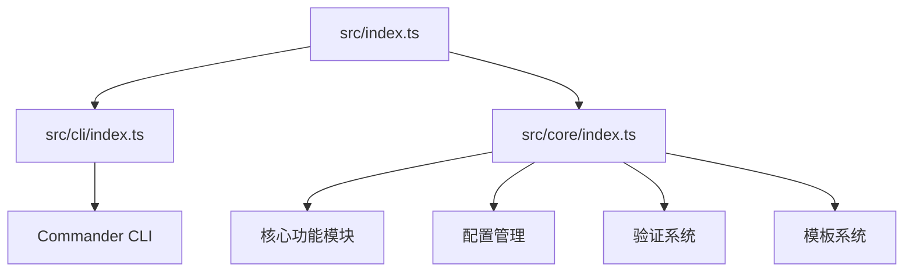
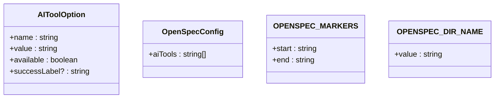
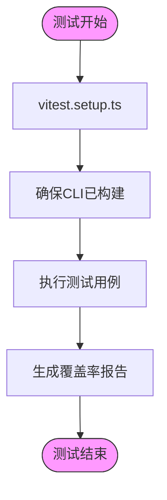
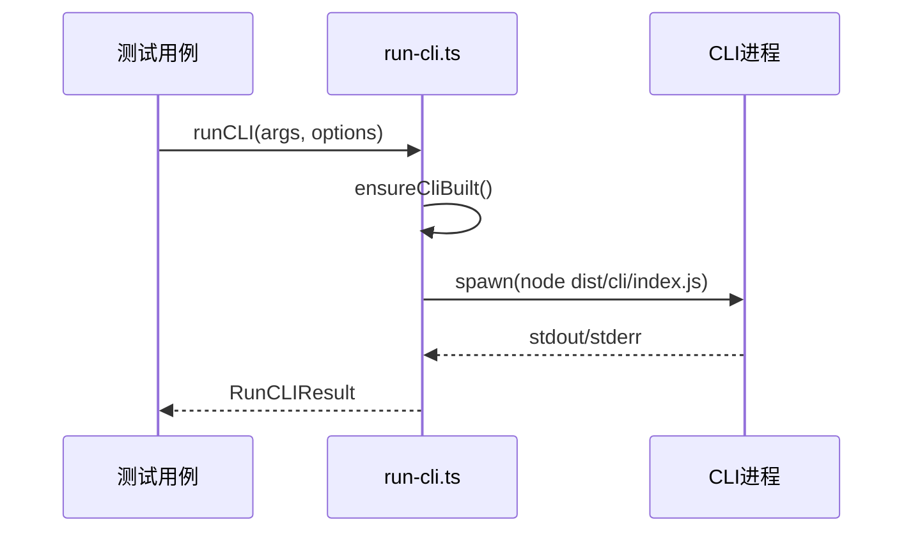
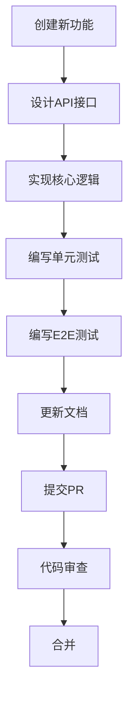

# 贡献指南

<cite>
**本文档中引用的文件**   
- [package.json](file://package.json)
- [README.md](file://README.md)
- [build.js](file://build.js)
- [vitest.config.ts](file://vitest.config.ts)
- [src/index.ts](file://src/index.ts)
- [src/cli/index.ts](file://src/cli/index.ts)
- [src/core/index.ts](file://src/core/index.ts)
- [src/core/config.ts](file://src/core/config.ts)
- [src/utils/index.ts](file://src/utils/index.ts)
- [tsconfig.json](file://tsconfig.json)
- [test/helpers/run-cli.ts](file://test/helpers/run-cli.ts)
- [src/core/schemas/spec.schema.ts](file://src/core/schemas/spec.schema.ts)
- [src/core/validation/validator.ts](file://src/core/validation/validator.ts)
- [src/core/configurators/slash/registry.ts](file://src/core/configurators/slash/registry.ts)
- [src/core/init.ts](file://src/core/init.ts)
</cite>

## 目录
1. [简介](#简介)
2. [开发环境搭建](#开发环境搭建)
3. [代码库架构](#代码库架构)
4. [测试策略](#测试策略)
5. [编码规范与提交](#编码规范与提交)
6. [功能开发与错误修复](#功能开发与错误修复)
7. [向后兼容性](#向后兼容性)

## 简介

本贡献指南为希望改进OpenSpec的开发者提供全面的指引。OpenSpec是一个为AI编码助手设计的规范驱动开发系统，通过在编写代码前明确规范来对齐人类和AI的开发意图。本指南将详细介绍开发环境的搭建、测试策略、代码库架构、编码规范以及如何添加新功能或修复bug。

**Section sources**
- [README.md](file://README.md#L1-L371)

## 开发环境搭建

### 依赖安装

OpenSpec使用pnpm作为包管理器。要搭建开发环境，请按照以下步骤操作：

1. 确保已安装Node.js（版本 >= 20.19.0）
2. 安装pnpm：`npm install -g pnpm`
3. 在项目根目录运行：`pnpm install`

项目依赖在`package.json`中定义，主要包含：
- **开发依赖**：TypeScript、Vitest测试框架、Changesets版本管理
- **生产依赖**：Commander（CLI框架）、Inquirer（交互式提示）、Chalk（彩色输出）、Zod（数据验证）

### 构建流程

项目的构建流程由`build.js`脚本控制，该脚本使用本地安装的TypeScript编译器将源代码编译到`dist`目录。

构建命令：
```bash
pnpm run build
```

开发模式下，可以使用以下命令进行实时编译：
```bash
pnpm run dev
```

构建流程的主要步骤：
1. 清理`dist`目录
2. 运行TypeScript编译器
3. 生成类型声明文件和源码映射

**Section sources**
- [package.json](file://package.json#L39-L53)
- [build.js](file://build.js#L1-L32)
- [tsconfig.json](file://tsconfig.json#L1-L21)

## 代码库架构

### 模块化架构

OpenSpec采用模块化架构，主要分为两个核心模块：



**Diagram sources**
- [src/index.ts](file://src/index.ts#L1-L2)
- [src/cli/index.ts](file://src/cli/index.ts#L1-L254)
- [src/core/index.ts](file://src/core/index.ts#L1-L2)

### 主要组件与依赖关系

#### CLI接口层

`src/cli/index.ts`是CLI的入口点，使用Commander库定义所有命令和选项。它负责：
- 解析命令行参数
- 初始化命令执行
- 处理错误和退出码

#### 核心逻辑层

`src/core/`目录包含所有核心功能实现：
- **init.ts**：初始化命令，创建OpenSpec目录结构
- **update.ts**：更新命令，刷新AI助手配置
- **archive.ts**：归档命令，将变更合并到主规范
- **validation/**：规范验证系统
- **schemas/**：Zod数据模式定义
- **configurators/**：AI工具配置器

### 配置管理

系统通过`src/core/config.ts`管理AI工具配置，定义了支持的所有AI工具及其配置状态。



**Diagram sources**
- [src/core/config.ts](file://src/core/config.ts#L1-L38)
- [src/core/init.ts](file://src/core/init.ts#L624-L667)

**Section sources**
- [src/cli/index.ts](file://src/cli/index.ts#L6-L15)
- [src/core/config.ts](file://src/core/config.ts#L1-L38)

## 测试策略

### 单元测试与E2E测试

OpenSpec使用Vitest作为测试框架，测试策略分为单元测试和端到端测试（E2E）。

#### 测试配置

`vitest.config.ts`定义了测试环境配置：
- 测试环境：Node.js
- 全局设置：`vitest.setup.ts`
- 测试文件模式：`test/**/*.test.ts`
- 覆盖率报告：文本、JSON、HTML格式
- 超时设置：测试超时10秒，钩子超时10秒



**Diagram sources**
- [vitest.config.ts](file://vitest.config.ts#L1-L26)
- [vitest.setup.ts](file://vitest.setup.ts#L1-L7)

#### 测试运行

运行测试的命令：
```bash
# 运行所有测试
pnpm test

# 监视模式运行测试
pnpm run test:watch

# 运行覆盖率测试
pnpm run test:coverage

# 启动测试UI
pnpm run test:ui
```

### 测试工具

`test/helpers/run-cli.ts`提供了运行CLI命令的辅助函数，用于E2E测试。

关键功能：
- `ensureCliBuilt()`：确保CLI已构建
- `runCLI()`：运行CLI命令并捕获输出
- 支持自定义工作目录、环境变量和输入



**Diagram sources**
- [test/helpers/run-cli.ts](file://test/helpers/run-cli.ts#L1-L140)

**Section sources**
- [vitest.config.ts](file://vitest.config.ts#L1-L26)
- [test/helpers/run-cli.ts](file://test/helpers/run-cli.ts#L1-L140)

## 编码规范与提交

### 编码规范

#### TypeScript规范
- 使用ES2022语法
- 严格模式（strict: true）
- 模块解析：NodeNext
- 强制一致的文件名大小写

#### 代码风格
- 使用Prettier进行代码格式化（配置未显示）
- 函数和类的单一职责原则
- 错误处理使用try-catch和Promise.catch
- 异步操作使用async/await

### 提交信息格式

遵循[Conventional Commits](https://www.conventionalcommits.org/)规范：
```
<type>(<scope>): <subject>
```

支持的类型：
- `feat`：新功能
- `fix`：bug修复
- `docs`：文档更新
- `style`：代码格式调整
- `refactor`：代码重构
- `test`：测试相关
- `chore`：构建过程或辅助工具的变动

### PR审查流程

1. **分支创建**：从main分支创建功能分支
2. **代码实现**：实现功能或修复bug
3. **测试覆盖**：确保有相应的测试用例
4. **提交PR**：创建Pull Request
5. **CI检查**：自动运行测试和构建
6. **代码审查**：至少一名核心成员审查
7. **合并**：审查通过后合并到main分支

**Section sources**
- [README.md](file://README.md#L366-L367)
- [package.json](file://package.json#L59-L64)

## 功能开发与错误修复

### 添加新功能

以支持新的AI工具为例：

1. **创建配置器**：在`src/core/configurators/slash/`目录下创建新的配置器类
2. **注册配置器**：在`registry.ts`中注册新的配置器
3. **更新AI工具列表**：在`config.ts`的`AI_TOOLS`数组中添加新工具
4. **编写测试**：为新功能编写单元测试和E2E测试
5. **更新文档**：修改README.md中的支持工具列表



### 修复bug

1. **复现问题**：编写测试用例复现bug
2. **定位原因**：分析代码找出问题根源
3. **修复代码**：修改代码解决问题
4. **验证修复**：确保测试通过且无回归
5. **提交修复**：按标准流程提交PR

**Section sources**
- [src/core/configurators/slash/registry.ts](file://src/core/configurators/slash/registry.ts#L1-L69)
- [src/core/config.ts](file://src/core/config.ts#L19-L37)

## 向后兼容性

### 重要性

向后兼容性对于OpenSpec至关重要，因为：
- 用户的项目依赖于稳定的CLI接口
- AI助手的配置可能基于特定版本
- 现有项目的规范格式需要保持一致

### 维护策略

1. **语义化版本控制**：遵循SemVer规范
2. **弃用警告**：对即将移除的功能添加警告
3. **迁移路径**：提供清晰的版本升级指南
4. **测试覆盖**：确保现有功能在新版本中正常工作

当需要破坏性变更时：
1. 在次要版本中添加弃用警告
2. 在下一个主版本中移除旧功能
3. 在CHANGELOG.md中详细记录变更

**Section sources**
- [package.json](file://package.json#L3-L4)
- [CHANGELOG.md](file://CHANGELOG.md#L1-L10)