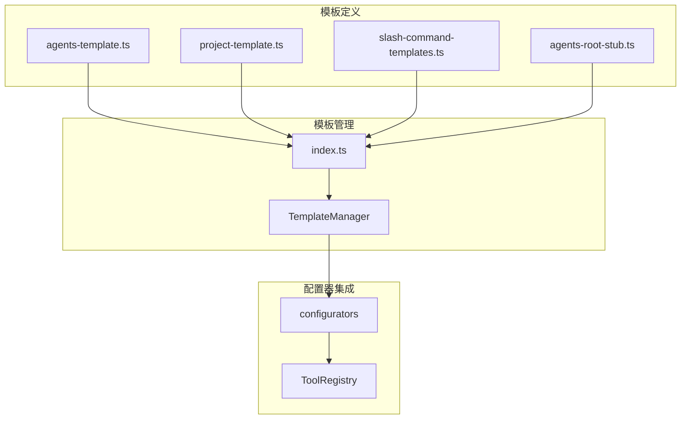
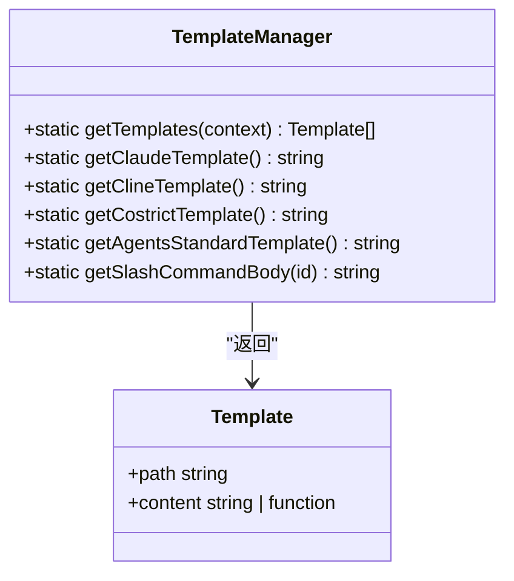
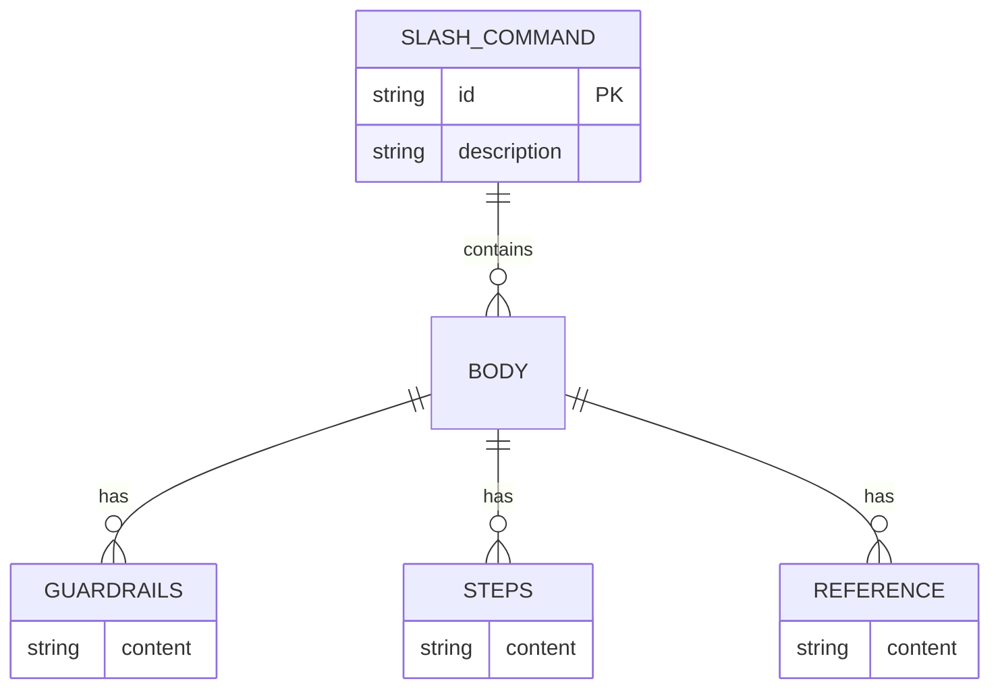
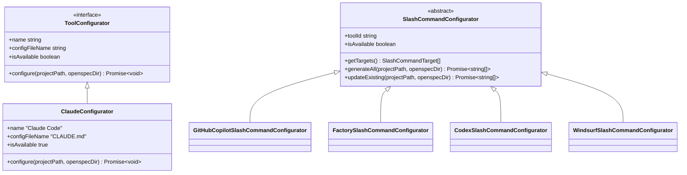

# 模板自定义

<cite>
**本文档中引用的文件**  
- [agents-template.ts](file://src/core/templates/agents-template.ts)
- [project-template.ts](file://src/core/templates/project-template.ts)
- [index.ts](file://src/core/templates/index.ts)
- [slash-command-templates.ts](file://src/core/templates/slash-command-templates.ts)
- [agents-root-stub.ts](file://src/core/templates/agents-root-stub.ts)
- [claude-template.ts](file://src/core/templates/claude-template.ts)
- [cline-template.ts](file://src/core/templates/cline-template.ts)
- [costrict-template.ts](file://src/core/templates/costrict-template.ts)
- [base.ts](file://src/core/configurators/base.ts)
- [registry.ts](file://src/core/configurators/registry.ts)
- [claude.ts](file://src/core/configurators/claude.ts)
- [github-copilot.ts](file://src/core/configurators/slash/github-copilot.ts)
- [factory.ts](file://src/core/configurators/slash/factory.ts)
- [codex.ts](file://src/core/configurators/slash/codex.ts)
- [windsurf.ts](file://src/core/configurators/slash/windsurf.ts)
- [base.ts](file://src/core/configurators/slash/base.ts)
</cite>

## 目录
1. [简介](#简介)
2. [模板系统架构](#模板系统架构)
3. [核心模板文件详解](#核心模板文件详解)
4. [模板注册与调用机制](#模板注册与调用机制)
5. [斜杠命令模板系统](#斜杠命令模板系统)
6. [配置器模块集成](#配置器模块集成)
7. [自定义模板扩展指南](#自定义模板扩展指南)
8. [最佳实践与兼容性建议](#最佳实践与兼容性建议)

## 简介
OpenSpec的模板系统为AI助手配置文件的生成提供了灵活且类型安全的架构。本指南全面介绍模板系统的架构设计、扩展机制以及如何通过自定义模板来定制不同AI工具的配置格式。系统通过`templates/`目录下的模板文件和`configurators`模块的协同工作，实现了对多种AI助手（如Claude、GitHub Copilot等）的标准化配置管理。

## 模板系统架构



**图示来源**  
- [agents-template.ts](file://src/core/templates/agents-template.ts)
- [project-template.ts](file://src/core/templates/project-template.ts)
- [index.ts](file://src/core/templates/index.ts)
- [registry.ts](file://src/core/configurators/registry.ts)

**本节来源**  
- [index.ts](file://src/core/templates/index.ts)
- [registry.ts](file://src/core/configurators/registry.ts)

## 核心模板文件详解

### agents-template.ts
该模板文件定义了`AGENTS.md`的完整内容，包含OpenSpec的指令体系、工作流程、目录结构、创建变更提案的决策树等核心指导原则。它是AI助手理解项目规范的主要入口点。

**本节来源**  
- [agents-template.ts](file://src/core/templates/agents-template.ts)

### project-template.ts
该模板用于生成`project.md`文件，接受`ProjectContext`类型的上下文参数，支持动态注入项目名称、描述、技术栈等信息。模板采用函数形式，返回格式化的Markdown字符串。

**本节来源**  
- [project-template.ts](file://src/core/templates/project-template.ts)

### agents-root-stub.ts
该模板定义了AI助手根目录指令文件的精简版本，包含打开`AGENTS.md`的触发条件和使用说明。多个AI工具（如Claude、Cline、Costrict）共享此模板内容。

**本节来源**  
- [agents-root-stub.ts](file://src/core/templates/agents-root-stub.ts)

### 模板继承关系

```mermaid
classDiagram
class agentsTemplate {
+string content
}
class projectTemplate {
+function(context) string
}
class agentsRootStubTemplate {
+string content
}
class claudeTemplate {
+string content
}
class clineTemplate {
+string content
}
class costrictTemplate {
+string content
}
claudeTemplate --> agentsRootStubTemplate : "export as"
clineTemplate --> agentsRootStubTemplate : "export as"
costrictTemplate --> agentsRootStubTemplate : "export as"
agentsTemplate --> "AGENTS.md"
projectTemplate --> "project.md"
```

**图示来源**  
- [agents-root-stub.ts](file://src/core/templates/agents-root-stub.ts)
- [claude-template.ts](file://src/core/templates/claude-template.ts)
- [cline-template.ts](file://src/core/templates/cline-template.ts)
- [costrict-template.ts](file://src/core/templates/costrict-template.ts)

**本节来源**  
- [agents-root-stub.ts](file://src/core/templates/agents-root-stub.ts)
- [claude-template.ts](file://src/core/templates/claude-template.ts)
- [cline-template.ts](file://src/core/templates/cline-template.ts)
- [costrict-template.ts](file://src/core/templates/costrict-template.ts)

## 模板注册与调用机制

### TemplateManager类
`TemplateManager`是模板系统的核心管理类，通过静态方法提供对所有模板的访问接口。它定义了`getTemplates`方法用于获取项目级模板，以及各种`getXXXTemplate`方法用于获取特定工具的模板。



**图示来源**  
- [index.ts](file://src/core/templates/index.ts)

**本节来源**  
- [index.ts](file://src/core/templates/index.ts)

## 斜杠命令模板系统

### slash-command-templates.ts
该文件定义了斜杠命令的模板体系，包含`proposal`、`apply`、`archive`三种命令类型的完整指令内容。通过`slashCommandBodies`对象和`getSlashCommandBody`函数提供访问接口。

**本节来源**  
- [slash-command-templates.ts](file://src/core/templates/slash-command-templates.ts)

### 斜杠命令模板结构



**图示来源**  
- [slash-command-templates.ts](file://src/core/templates/slash-command-templates.ts)

## 配置器模块集成

### ToolConfigurator接口
`configurators`模块中的配置器实现了`ToolConfigurator`接口，该接口定义了配置器的基本属性和行为，包括名称、配置文件名、可用性状态和配置方法。



**图示来源**  
- [base.ts](file://src/core/configurators/base.ts)
- [claude.ts](file://src/core/configurators/claude.ts)
- [base.ts](file://src/core/configurators/slash/base.ts)

**本节来源**  
- [base.ts](file://src/core/configurators/base.ts)
- [claude.ts](file://src/core/configurators/claude.ts)
- [base.ts](file://src/core/configurators/slash/base.ts)

### ToolRegistry注册中心
`ToolRegistry`类负责管理所有可用的配置器实例，通过静态代码块预注册了Claude、Cline、CodeBuddy等多种工具的配置器，并提供`get`、`getAll`、`getAvailable`等方法进行访问。

**本节来源**  
- [registry.ts](file://src/core/configurators/registry.ts)

## 自定义模板扩展指南

### 自定义Claude模板
要自定义Claude的模板，可以创建新的模板文件并修改`claude-template.ts`中的导出内容。当前实现通过重导出`agentsRootStubTemplate`来保持与其他工具的一致性。

### 自定义GitHub Copilot斜杠命令
GitHub Copilot的斜杠命令模板位于`.github/prompts/`目录下，通过`GitHubCopilotSlashCommandConfigurator`类进行管理。可以修改`FILE_PATHS`和`FRONTMATTER`常量来自定义文件路径和前置元数据。

### 新增模板的步骤
1. 在`templates/`目录下创建新的模板文件
2. 在`index.ts`中导入新模板并添加到`TemplateManager`的访问接口
3. 创建对应的配置器类，实现`ToolConfigurator`或`SlashCommandConfigurator`接口
4. 在`registry.ts`中注册新的配置器实例

**本节来源**  
- [index.ts](file://src/core/templates/index.ts)
- [registry.ts](file://src/core/configurators/registry.ts)
- [github-copilot.ts](file://src/core/configurators/slash/github-copilot.ts)

## 最佳实践与兼容性建议
- 保持模板内容的类型安全，使用TypeScript接口定义上下文参数
- 遵循OpenSpec的标记约定（OPENSPEC_MARKERS），确保配置文件可被正确更新
- 在扩展新模板时，尽量复用现有模板内容以保持一致性
- 确保配置器的`isAvailable`属性正确反映工具的可用状态
- 使用`generateAll`和`updateExisting`方法来处理配置文件的创建和更新