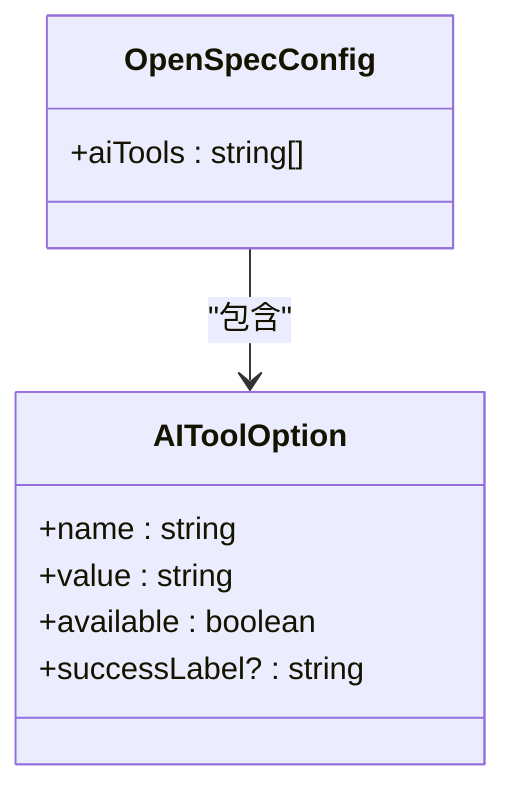
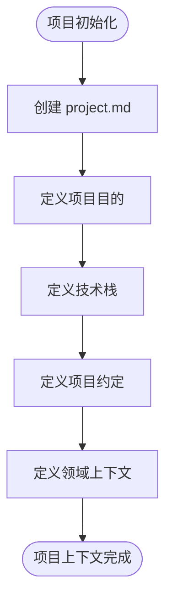
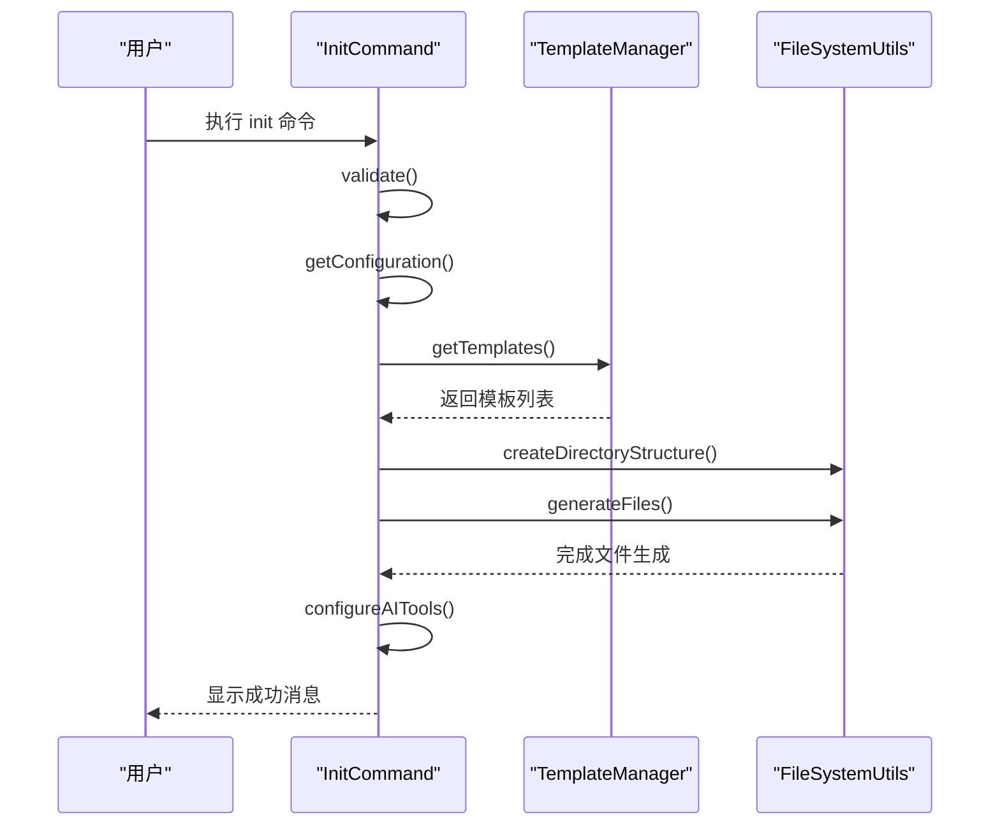

# 项目配置

<cite>
**本文档中引用的文件**  
- [config.ts](file://src/core/config.ts)
- [project.md](file://openspec/project.md)
- [init.ts](file://src/core/init.ts)
- [agents.ts](file://src/core/configurators/agents.ts)
- [registry.ts](file://src/core/configurators/registry.ts)
- [project-template.ts](file://src/core/templates/project-template.ts)
- [validator.ts](file://src/core/validation/validator.ts)
- [types.ts](file://src/core/validation/types.ts)
</cite>

## 目录
1. [简介](#简介)
2. [配置结构与加载机制](#配置结构与加载机制)
3. [project.md 文件的作用](#projectmd-文件的作用)
4. [配置解析流程](#配置解析流程)
5. [配置验证与错误处理](#配置验证与错误处理)
6. [调试技巧](#调试技巧)
7. [总结](#总结)

## 简介
OpenSpec 是一个帮助开发者设置文件结构并保持 AI 指令更新的最小化 CLI 工具。本指南详细说明了 OpenSpec 的配置加载机制，包括 `config.ts` 中定义的配置结构、默认值及其覆盖方式，以及 `project.md` 文件如何定义项目上下文信息并影响其他功能。

## 配置结构与加载机制
OpenSpec 的配置结构在 `src/core/config.ts` 中定义，主要包括 AI 工具的配置选项和默认值。配置项通过项目根目录的配置文件或环境变量进行覆盖。



**Diagram sources**
- [config.ts](file://src/core/config.ts#L8-L37)

**Section sources**
- [config.ts](file://src/core/config.ts#L1-L38)

## project.md 文件的作用
`project.md` 文件定义了项目上下文信息，如项目名称、描述、技术栈、约定等。这些信息不仅为团队成员提供了清晰的项目概览，还被 AI 助手用来理解项目背景和约束。



**Diagram sources**
- [project.md](file://openspec/project.md#L1-L53)

**Section sources**
- [project.md](file://openspec/project.md#L1-L53)

## 配置解析流程
配置解析流程主要在 `src/core/init.ts` 中实现。初始化命令会创建目录结构、生成模板文件，并配置选定的 AI 工具。



**Diagram sources**
- [init.ts](file://src/core/init.ts#L376-L818)

**Section sources**
- [init.ts](file://src/core/init.ts#L1-L971)

## 配置验证与错误处理
配置验证和错误处理在 `src/core/validation/validator.ts` 中实现。验证器会对 spec 和 change 文件进行校验，确保其符合预定义的规则。

```mermaid
classDiagram
class Validator {
+strictMode : boolean
+validateSpec(filePath : string) : Promise<ValidationReport>
+validateChange(filePath : string) : Promise<ValidationReport>
+validateChangeDeltaSpecs(changeDir : string) : Promise<ValidationReport>
}
class ValidationReport {
+valid : boolean
+issues : ValidationIssue[]
+summary : { errors : number, warnings : number, info : number }
}
class ValidationIssue {
+level : ValidationLevel
+path : string
+message : string
+line? : number
+column? : number
}
Validator --> ValidationReport : "返回"
ValidationReport --> ValidationIssue : "包含"
```

**Diagram sources**
- [validator.ts](file://src/core/validation/validator.ts#L15-L449)
- [types.ts](file://src/core/validation/types.ts#L1-L19)

**Section sources**
- [validator.ts](file://src/core/validation/validator.ts#L1-L449)
- [types.ts](file://src/core/validation/types.ts#L1-L19)

## 调试技巧
为了正确设置项目环境，可以使用以下调试技巧：
- 使用 `--tools none` 跳过 AI 工具配置，仅创建 OpenSpec 目录结构和模板文件。
- 使用 `--tools all` 选择所有可用的 AI 工具。
- 使用 `--tools` 后跟逗号分隔的工具 ID 列表来指定特定工具。
- 检查生成的文件是否包含 OpenSpec 标记（`<!-- OPENSPEC:START -->` 和 `<!-- OPENSPEC:END -->`）。

**Section sources**
- [init.ts](file://src/core/init.ts#L496-L557)

## 总结
OpenSpec 的配置机制通过 `config.ts` 和 `project.md` 文件实现了灵活且可扩展的配置管理。通过理解配置结构、加载机制、验证和错误处理，用户可以更有效地使用 OpenSpec 来管理项目配置和 AI 助手集成。