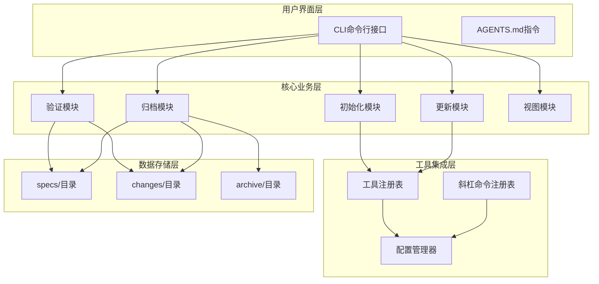
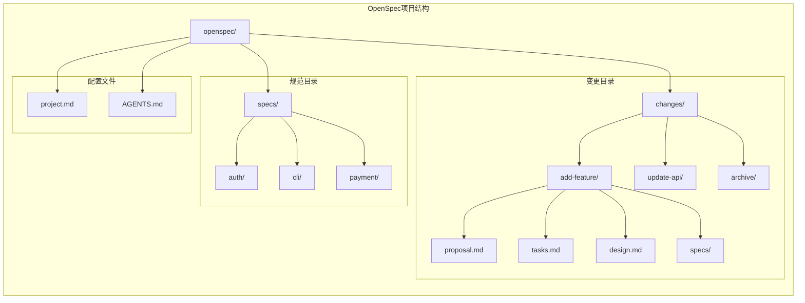
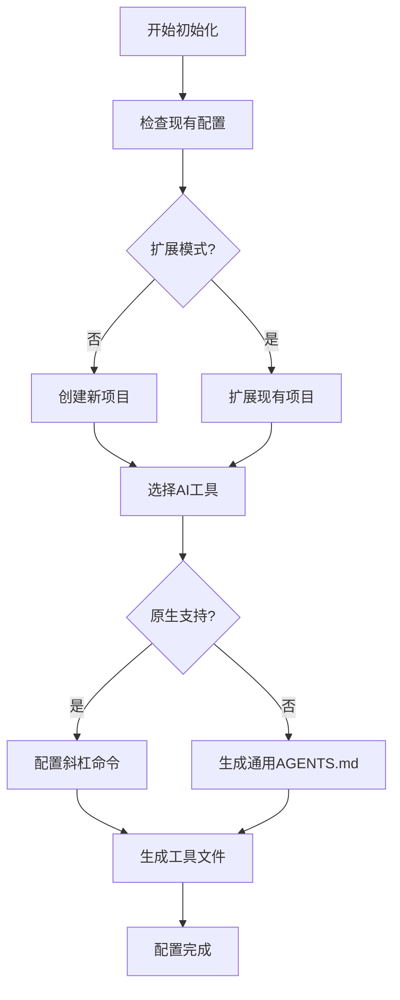
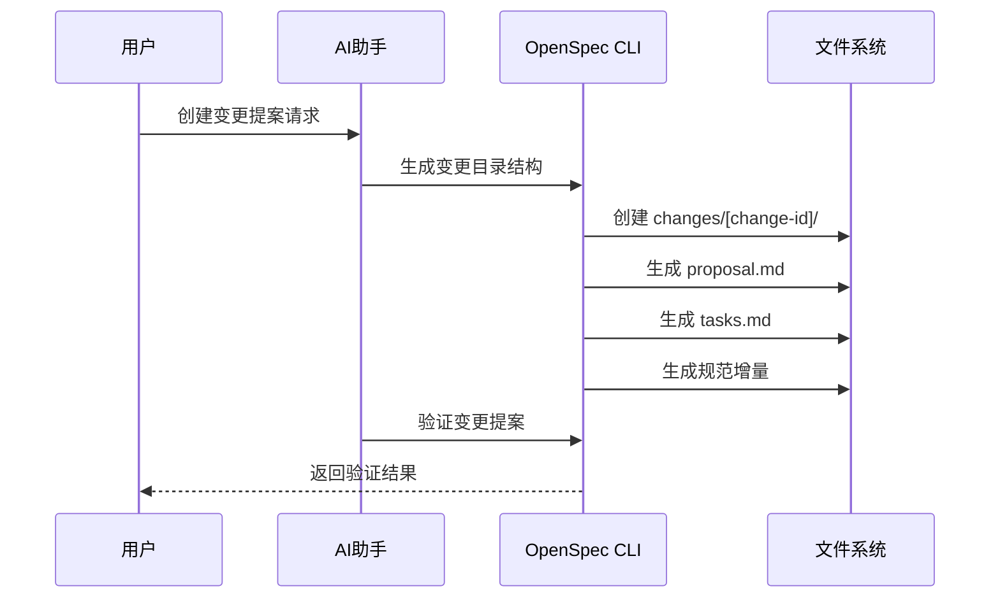
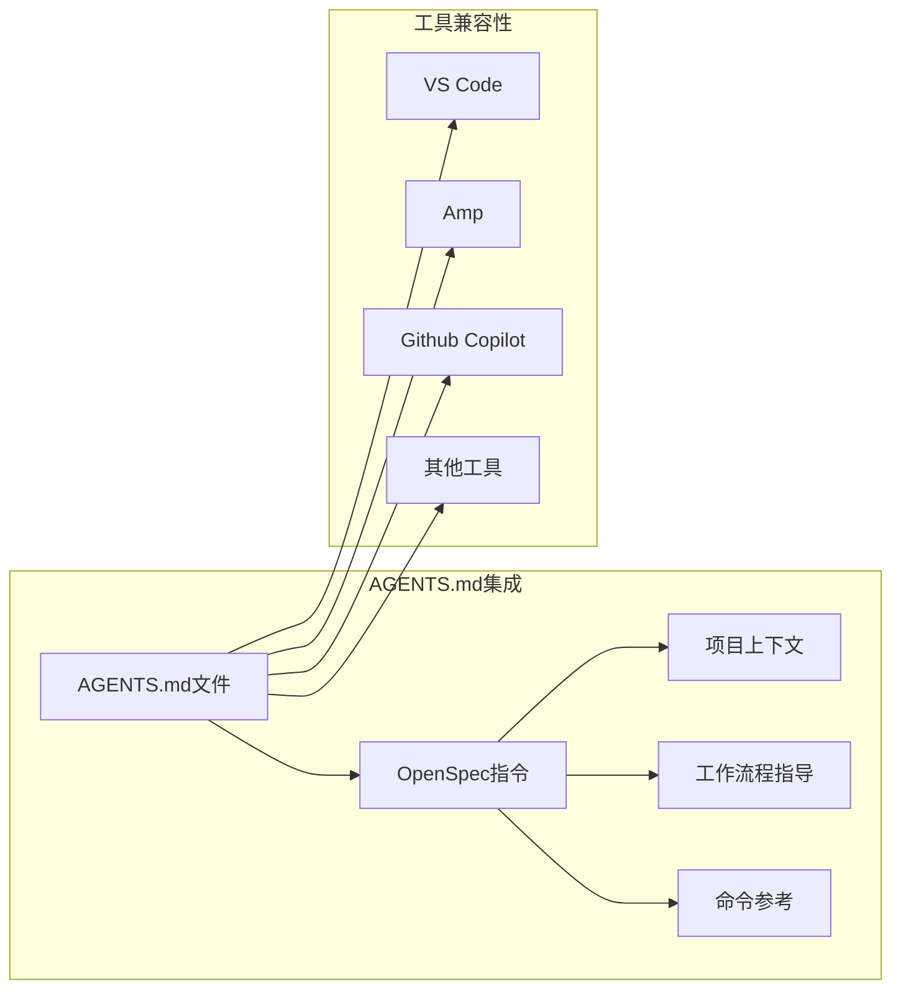
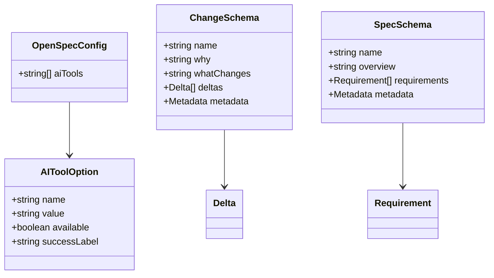

# OpenSpec项目概述

<cite>
**本文档中引用的文件**
- [README.md](file://README.md)
- [package.json](file://package.json)
- [CHANGELOG.md](file://CHANGELOG.md)
- [bin/openspec.js](file://bin/openspec.js)
- [openspec/project.md](file://openspec/project.md)
- [openspec/AGENTS.md](file://openspec/AGENTS.md)
- [src/cli/index.ts](file://src/cli/index.ts)
- [src/core/config.ts](file://src/core/config.ts)
- [src/core/schemas/change.schema.ts](file://src/core/schemas/change.schema.ts)
- [src/core/schemas/spec.schema.ts](file://src/core/schemas/spec.schema.ts)
- [src/core/init.ts](file://src/core/init.ts)
- [src/core/update.ts](file://src/core/update.ts)
- [openspec/changes/add-scaffold-command/proposal.md](file://openspec/changes/add-scaffold-command/proposal.md)
- [openspec/changes/add-scaffold-command/tasks.md](file://openspec/changes/add-scaffold-command/tasks.md)
- [openspec/changes/add-scaffold-command/specs/cli-scaffold/spec.md](file://openspec/changes/add-scaffold-command/specs/cli-scaffold/spec.md)
- [openspec/specs/openspec-conventions/spec.md](file://openspec/specs/openspec-conventions/spec.md)
</cite>

## 目录
1. [项目简介](#项目简介)
2. [核心价值主张](#核心价值主张)
3. [目标受众](#目标受众)
4. [项目架构](#项目架构)
5. [核心功能特性](#核心功能特性)
6. [工作流程详解](#工作流程详解)
7. [技术栈与设计原则](#技术栈与设计原则)
8. [AI工具集成](#ai工具集成)
9. [版本演进与路线图](#版本演进与路线图)
10. [学习路径指南](#学习路径指南)
11. [总结](#总结)

## 项目简介

OpenSpec是一个专为AI编码助手设计的规范驱动开发工具，旨在解决AI在处理需求时的不可预测性问题。该项目通过结构化的变更提案和规范文件管理系统，确保人类和AI编码助手在任何代码编写之前就对要构建的内容达成一致。

**项目定位**：OpenSpec是AI原生的规范驱动开发系统，无需API密钥，提供轻量级但强大的工作流程支持。

**核心理念**：通过明确的规范约定和结构化的工作流程，让AI编码助手能够以可预测、可审查的方式进行开发。

**Section sources**
- [README.md](file://README.md#L31-L32)
- [package.json](file://package.json#L1-L4)

## 核心价值主张

OpenSpec提供了三个关键价值主张，解决了现代软件开发中的核心痛点：

### 1. 确定性输出
**问题**：AI编码助手在聊天历史中处理需求时行为不可预测。
**解决方案**：OpenSpec添加了轻量级规范工作流程，在实现之前锁定意图，提供确定性、可审查的输出。

### 2. 结构化变更管理
**特点**：
- 规划阶段明确的结构化变更文件（提案、任务和规范更新）
- 明确的作用域和可审计性
- 共享的可见性，了解当前提出的、活跃的或归档的变更

### 3. 工具兼容性
**优势**：
- 与现有的AI工具无缝配合
- 支持自定义斜杠命令（在支持的环境中）
- 统一的上下文规则适用于所有工具

**Section sources**
- [README.md](file://README.md#L33-L41)

## 目标受众

OpenSpec主要面向以下几类用户群体：

### AI辅助开发团队
- **开发团队**：需要与AI协作进行代码生成和重构
- **技术负责人**：希望确保AI输出质量和一致性
- **架构师**：需要规范化的系统设计和演进流程

### 特殊场景
- **企业团队**：需要标准化的开发流程和质量保证
- **开源项目**：需要社区贡献者的规范协作
- **初创公司**：快速迭代但需要保持代码质量

**Section sources**
- [README.md](file://README.md#L86-L118)

## 项目架构

OpenSpec采用模块化架构设计，核心组件包括CLI界面、核心逻辑层和工具配置器：

**图表来源**
- [src/cli/index.ts](file://src/cli/index.ts#L1-L254)
- [src/core/init.ts](file://src/core/init.ts#L1-L971)
- [src/core/update.ts](file://src/core/update.ts#L1-L130)

### 核心目录结构

OpenSpec项目遵循严格的目录结构约定：

**图表来源**
- [openspec/project.md](file://openspec/project.md#L14-L21)
- [openspec/AGENTS.md](file://openspec/AGENTS.md#L123-L141)

**Section sources**
- [openspec/project.md](file://openspec/project.md#L14-L21)
- [openspec/AGENTS.md](file://openspec/AGENTS.md#L123-L141)

## 核心功能特性

### 1. 变更提案系统

OpenSpec的核心是其变更提案系统，每个变更都包含完整的上下文信息：

#### 提案结构
- **为什么**：变更的原因和背景
- **什么变更**：具体的修改内容列表
- **影响**：受影响的规范和代码范围

#### 任务清单
- 结构化的实现检查清单
- 带有进度跟踪的TODO列表
- 支持多步骤的复杂变更

#### 规范增量
- 使用标准化的ADDED/MODIFIED/REMOVED格式
- 完整的规范要求和场景描述
- 支持跨多个能力的复杂变更

### 2. 自动化工具配置

OpenSpec提供了智能的AI工具配置系统：

**图表来源**
- [src/core/init.ts](file://src/core/init.ts#L376-L460)
- [src/core/config.ts](file://src/core/config.ts#L19-L37)

### 3. 验证与质量保证

OpenSpec内置了强大的验证系统：

#### 规范验证
- 要求格式验证（必须有至少一个场景）
- 头部唯一性检查
- 结构完整性验证

#### 变更验证
- 增量内容验证
- 依赖关系检查
- 冲突检测

**Section sources**
- [src/core/schemas/change.schema.ts](file://src/core/schemas/change.schema.ts#L1-L42)
- [src/core/schemas/spec.schema.ts](file://src/core/schemas/spec.schema.ts#L1-L17)

## 工作流程详解

OpenSpec遵循三阶段工作流程，确保变更的可控性和可追溯性：

### 第一阶段：创建变更

**图表来源**
- [openspec/changes/add-scaffold-command/proposal.md](file://openspec/changes/add-scaffold-command/proposal.md#L1-L12)
- [openspec/changes/add-scaffold-command/tasks.md](file://openspec/changes/add-scaffold-command/tasks.md#L1-L12)

### 第二阶段：实施变更

变更提案经过审查和批准后进入实施阶段：

#### 实施流程
1. **阅读提案**：理解要构建的内容
2. **审查设计**：查看技术决策（如果存在）
3. **执行任务**：按照任务清单顺序完成
4. **确认完成**：确保每个任务都已完成
5. **更新状态**：标记所有任务为完成状态

### 第三阶段：归档变更

部署完成后，变更被归档到历史记录中：

**图表来源**
- [openspec/changes/add-scaffold-command/specs/cli-scaffold/spec.md](file://openspec/changes/add-scaffold-command/specs/cli-scaffold/spec.md#L1-L45)

**Section sources**
- [openspec/AGENTS.md](file://openspec/AGENTS.md#L17-L65)

## 技术栈与设计原则

### 技术架构

OpenSpec采用现代化的技术栈，确保高性能和可维护性：

#### 核心技术
- **语言**：TypeScript（严格模式）
- **运行时**：Node.js ≥20.19.0（ESM模块）
- **包管理**：pnpm
- **CLI框架**：Commander.js
- **用户交互**：@inquirer/prompts
- **分发方式**：npm包

#### 设计原则
1. **最小依赖原则**：减少外部依赖，提高安全性
2. **清晰分离**：CLI、核心逻辑和工具之间的明确分离
3. **AI友好**：使用描述性的命名和结构
4. **异步优先**：所有异步操作都使用async/await模式

### 数据模型

OpenSpec使用Zod进行数据验证，确保数据的一致性和完整性：

#### 规范模式
- 名称验证（非空）
- 概述验证（非空）
- 要求数组验证（至少一个要求）

#### 变更模式
- 名称验证（非空）
- "为什么"部分长度验证
- 增量数量限制（最多10个增量）
- 操作类型枚举（ADDED、MODIFIED、REMOVED、RENAMED）

**Section sources**
- [openspec/project.md](file://openspec/project.md#L5-L12)
- [src/core/schemas/spec.schema.ts](file://src/core/schemas/spec.schema.ts#L1-L17)
- [src/core/schemas/change.schema.ts](file://src/core/schemas/change.schema.ts#L1-L42)

## AI工具集成

OpenSpec支持广泛的AI编码助手，通过两种主要方式集成：

### 原生斜杠命令支持

以下AI工具提供原生OpenSpec集成：

| 工具 | 斜杠命令 | 配置位置 |
|------|----------|----------|
| **Claude Code** | `/openspec:proposal`, `/openspec:apply`, `/openspec:archive` | 内置支持 |
| **CodeBuddy Code** | `/openspec:proposal`, `/openspec:apply`, `/openspec:archive` | `.codebuddy/commands/` |
| **CoStrict** | `/openspec-proposal`, `/openspec-apply`, `/openspec-archive` | `.cospec/openspec/commands/` |
| **Cursor** | `/openspec-proposal`, `/openspec-apply`, `/openspec-archive` | 内置支持 |
| **Cline** | `.clinerules/openspec-*.md` | `.clinerules/`目录 |
| **Crush** | `/openspec-proposal`, `/openspec-apply`, `/openspec-archive` | `.crush/commands/openspec/` |
| **Factory Droid** | `/openspec-proposal`, `/openspec-apply`, `/openspec-archive` | `.factory/commands/` |
| **OpenCode** | `/openspec-proposal`, `/openspec-apply`, `/openspec-archive` | 内置支持 |
| **Kilo Code** | `/openspec-proposal.md`, `/openspec-apply.md`, `/openspec-archive.md` | `.kilocode/workflows/` |
| **Qoder** | `/openspec:proposal`, `/openspec:apply`, `/openspec:archive` | `.qoder/commands/openspec/` |
| **Windsurf** | `/openspec-proposal`, `/openspec-apply`, `/openspec-archive` | `.windsurf/workflows/` |
| **Codex** | `/openspec-proposal`, `/openspec-apply`, `/openspec-archive` | 全局目录 |
| **GitHub Copilot** | `/openspec-proposal`, `/openspec-apply`, `/openspec-archive` | `.github/prompts/` |
| **Amazon Q Developer** | `@openspec-proposal`, `@openspec-apply`, `@openspec-archive` | `.amazonq/prompts/` |
| **Auggie** | `/openspec-proposal`, `/openspec-apply`, `/openspec-archive` | `.augment/commands/` |
| **Qwen Code** | `/openspec-proposal`, `/openspec-apply`, `/openspec-archive` | `.qwen/commands/` |

### 通用AGENTS.md支持

对于不支持原生斜杠命令的工具，OpenSpec提供通用的AGENTS.md约定：

**图表来源**
- [openspec/AGENTS.md](file://openspec/AGENTS.md#L113-L141)
- [src/core/config.ts](file://src/core/config.ts#L35-L37)

**Section sources**
- [README.md](file://README.md#L88-L118)
- [openspec/AGENTS.md](file://openspec/AGENTS.md#L113-L141)

## 版本演进与路线图

OpenSpec经历了持续的演进，从0.1.0初始版本发展到当前的0.14.0稳定版本：

### 主要里程碑

#### 0.14.0 (最新)
- 新增Qwen Code支持
- 改进斜杠命令参数传递
- 增强Qoder CLI支持
- 添加CoStrict AI助手支持

#### 0.13.0
- 支持多种新的AI编码助手
- 改进验证系统
- 增加工厂函数支持

#### 0.12.0
- 添加工厂函数支持
- 非交互式初始化选项
- 改进跨平台路径处理

#### 0.11.0
- Amazon Q Developer CLI集成
- 改进初始化向导体验

#### 0.10.0
- 改进Enter键行为
- 跨平台兼容性修复

### 发展趋势

1. **工具生态扩展**：持续增加AI工具支持
2. **用户体验优化**：改进CLI交互和错误提示
3. **性能提升**：优化大型项目的处理能力
4. **功能完善**：添加更多自动化和集成功能

**Section sources**
- [CHANGELOG.md](file://CHANGELOG.md#L1-L176)
- [package.json](file://package.json#L2-L4)

## 学习路径指南

### 初学者路径

#### 第一步：环境准备
1. **安装Node.js**：确保版本≥20.19.0
2. **全局安装OpenSpec**：`npm install -g @fission-ai/openspec@latest`
3. **验证安装**：`openspec --version`

#### 第二步：项目初始化
1. **导航到项目目录**：`cd my-project`
2. **初始化OpenSpec**：`openspec init`
3. **选择AI工具**：根据团队使用的工具进行配置

#### 第三步：创建第一个变更
1. **询问AI创建提案**：`Create an OpenSpec change proposal for adding profile search filters`
2. **验证提案**：`openspec validate add-profile-filters`
3. **审查和修改**：根据反馈调整规范
4. **实施变更**：`openspec apply add-profile-filters`
5. **归档完成**：`openspec archive add-profile-filters`

### 经验丰富开发者路径

#### 架构决策背景

OpenSpec的设计决策体现了几个重要的架构原则：

1. **未来状态存储模式**
   - **设计思想**：将完整的新状态存储而非差异
   - **优势**：避免差异语法污染，AI工具更容易理解
   - **实现**：`changes/[name]/specs/`目录中的完整规范

2. **双目录模型**
   - **specs/**：当前已部署的能力（WHAT IS）
   - **changes/**：提议的变更（WHAT SHOULD BE）
   - **archive/**：已完成的变更历史

3. **结构化规范格式**
   - **要求**：使用`### Requirement: [名称]`格式
   - **场景**：每个要求必须有至少一个`#### Scenario: [描述]`
   - **关键词**：使用SHALL/MUST表示规范性要求

#### 核心设计模式

**图表来源**
- [src/core/config.ts](file://src/core/config.ts#L8-L37)
- [src/core/schemas/change.schema.ts](file://src/core/schemas/change.schema.ts#L25-L42)
- [src/core/schemas/spec.schema.ts](file://src/core/schemas/spec.schema.ts#L5-L17)

**Section sources**
- [openspec/project.md](file://openspec/project.md#L1-L53)
- [openspec/specs/openspec-conventions/spec.md](file://openspec/specs/openspec-conventions/spec.md#L1-L474)

## 总结

OpenSpec代表了AI辅助开发的新范式，通过规范驱动的方法解决了AI编码助手的核心挑战。其核心优势在于：

### 核心价值
- **可预测性**：确保AI输出符合预期
- **可审查性**：提供清晰的变更轨迹
- **可扩展性**：支持各种AI工具和工作流程

### 技术创新
- **未来状态存储**：避免差异语法污染
- **结构化规范**：统一的格式和验证
- **智能工具集成**：原生和通用两种集成方式

### 应用前景
OpenSpec不仅是一个工具，更是一种开发方法论，它重新定义了人类与AI协作开发的方式，为未来的AI驱动软件开发奠定了坚实的基础。

通过OpenSpec，团队可以：
- 建立一致的开发标准
- 提高代码质量和可维护性
- 加速AI辅助开发流程
- 保持完整的变更历史

这种规范驱动的方法将成为AI时代软件开发的标准实践，为构建高质量、可维护的软件系统提供强有力的支持。