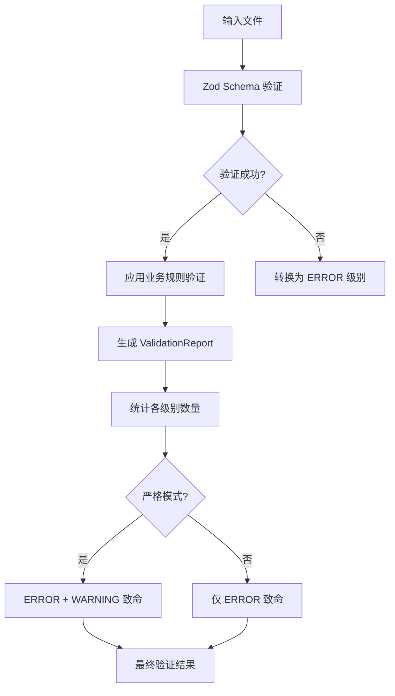
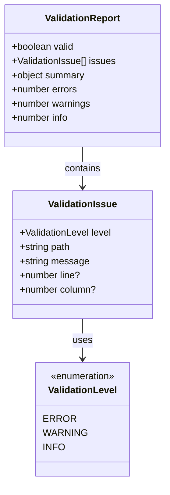
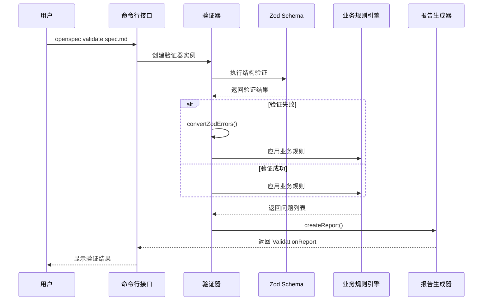
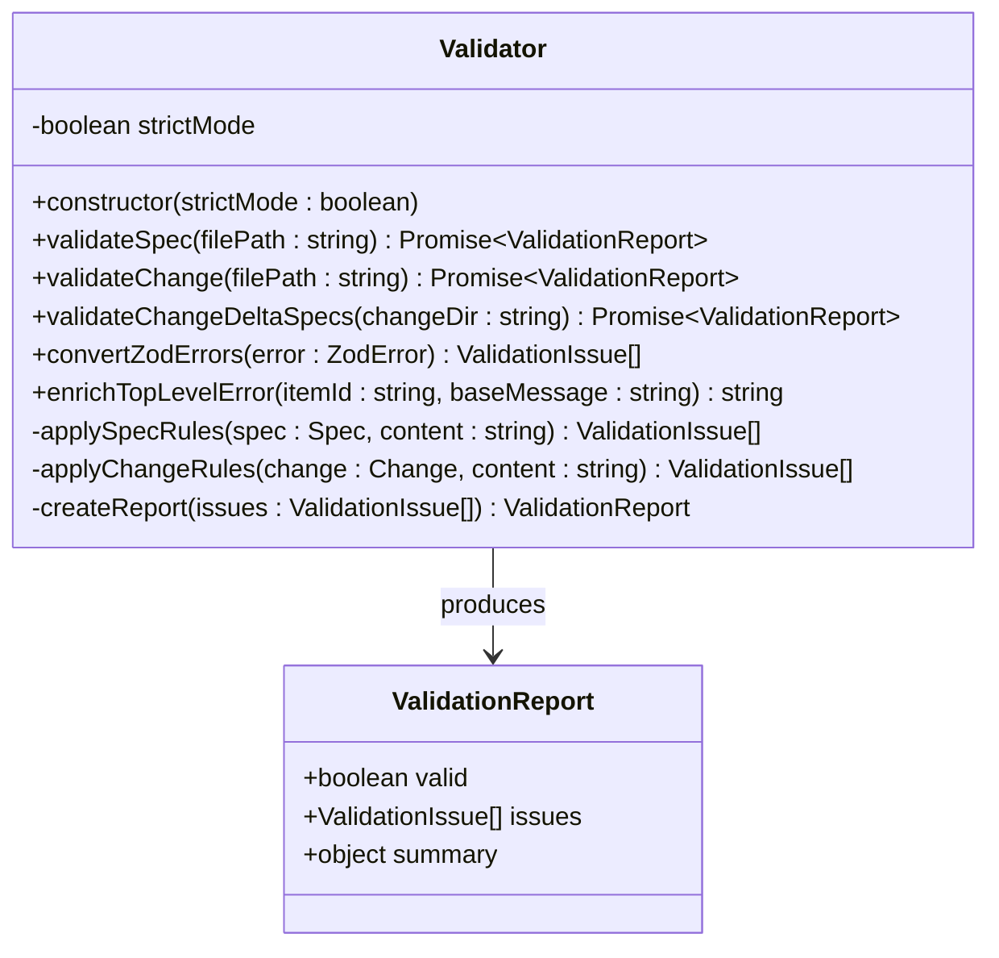
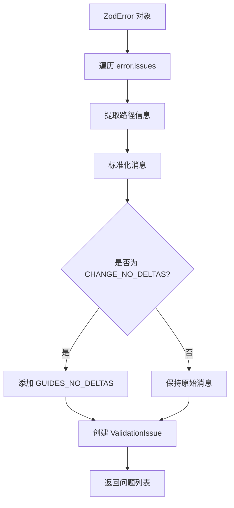
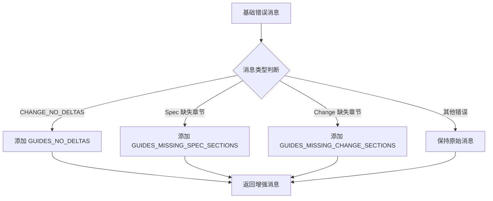
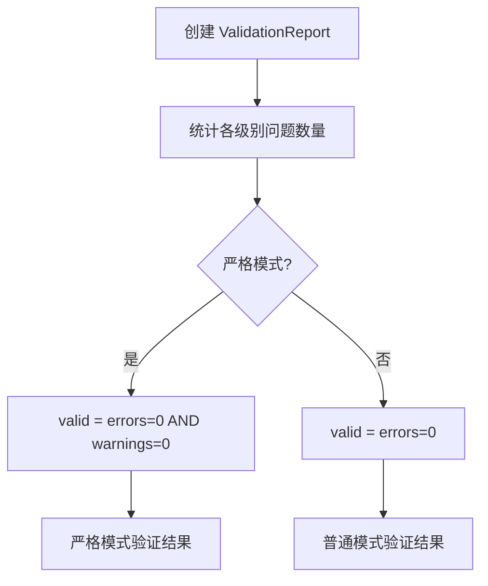
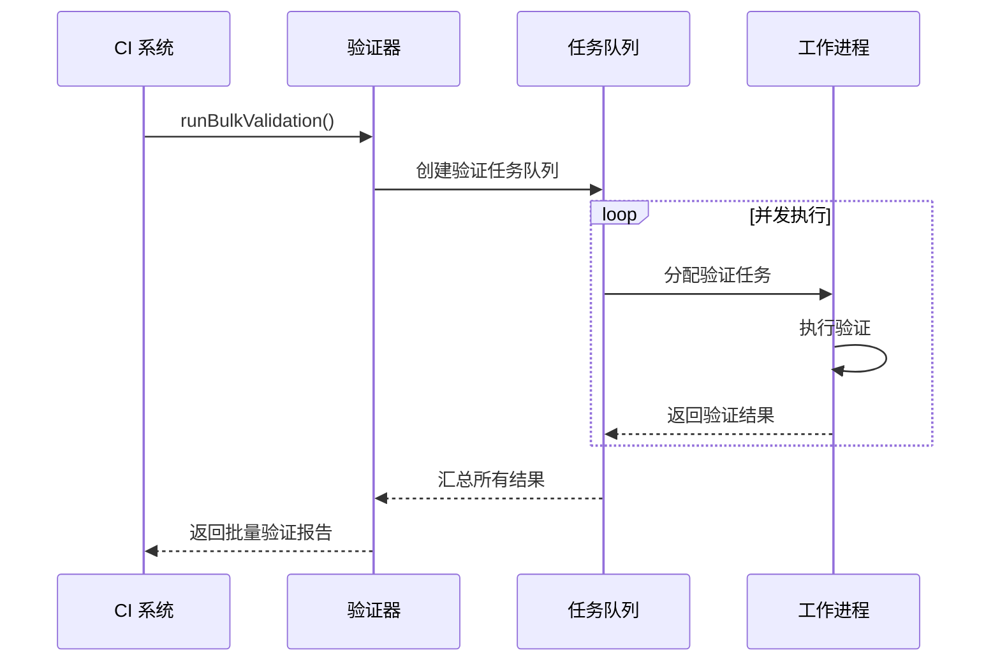

# 错误处理

<cite>
**本文档中引用的文件**
- [src/core/validation/types.ts](file://src/core/validation/types.ts)
- [src/core/validation/constants.ts](file://src/core/validation/constants.ts)
- [src/core/validation/validator.ts](file://src/core/validation/validator.ts)
- [src/core/schemas/base.schema.ts](file://src/core/schemas/base.schema.ts)
- [src/core/schemas/spec.schema.ts](file://src/core/schemas/spec.schema.ts)
- [src/core/schemas/change.schema.ts](file://src/core/schemas/change.schema.ts)
- [src/commands/validate.ts](file://src/commands/validate.ts)
- [test/core/validation.test.ts](file://test/core/validation.test.ts)
- [test/core/validation.enriched-messages.test.ts](file://test/core/validation.enriched-messages.test.ts)
</cite>

## 目录
1. [简介](#简介)
2. [ValidationLevel 分级体系](#validationlevel-分级体系)
3. [ValidationIssue 和 ValidationReport 数据结构](#validationissue-和-validationreport-数据结构)
4. [错误处理架构](#错误处理架构)
5. [Zod 验证错误转换](#zod-验证错误转换)
6. [上下文增强机制](#上下文增强机制)
7. [严格模式行为](#严格模式行为)
8. [CI/CD 集成策略](#cicd-集成策略)
9. [实际应用场景](#实际应用场景)
10. [最佳实践建议](#最佳实践建议)

## 简介

OpenSpec 实现了一套完整的错误处理和报告系统，采用分层验证策略确保规范和变更提案的质量。该系统通过三个级别的验证层次（ERROR、WARNING、INFO）提供渐进式的质量控制，并支持严格模式以适应不同的开发环境需求。

## ValidationLevel 分级体系

OpenSpec 定义了三种验证级别，每种级别在 CI/CD 流水线中具有不同的处理策略：

### ERROR 级别
- **定义**: 结构性问题，阻止解析或导致功能失效的问题
- **CI/CD 影响**: 必须修复，否则构建失败
- **典型场景**: 缺少必需的章节、无效的标题层次、格式错误等

### WARNING 级别  
- **定义**: 质量问题，建议改进但不影响基本功能
- **CI/CD 影响**: 可选择性修复，在非严格模式下允许通过
- **典型场景**: 缺少场景描述、缺少 SHALL 关键字、内容过于简短等

### INFO 级别
- **定义**: 改进建议，提供优化指导
- **CI/CD 影响**: 不影响构建结果，仅提供参考信息
- **典型场景**: 内容过长、重复要求、格式建议等



**图表来源**
- [src/core/validation/validator.ts](file://src/core/validation/validator.ts#L22-L49)
- [src/core/validation/validator.ts](file://src/core/validation/validator.ts#L380-L397)

**节来源**
- [src/core/validation/types.ts](file://src/core/validation/types.ts#L1-L19)

## ValidationIssue 和 ValidationReport 数据结构

### ValidationIssue 接口

每个验证问题都包含以下核心属性：

| 属性 | 类型 | 描述 | 示例值 |
|------|------|------|--------|
| level | ValidationLevel | 验证级别 | 'ERROR', 'WARNING', 'INFO' |
| path | string | 问题定位路径 | 'requirements[0].text' |
| message | string | 人类可读的错误消息 | 'Requirement must contain SHALL or MUST keyword' |
| line | number | 文件中的行号（可选） | 42 |
| column | number | 文件中的列号（可选） | 15 |

### ValidationReport 接口

验证报告包含完整的验证结果信息：

| 属性 | 类型 | 描述 | 统计意义 |
|------|------|------|----------|
| valid | boolean | 整体验证是否通过 | 严格模式下：errors=0且warnings=0；普通模式：errors=0 |
| issues | ValidationIssue[] | 所有问题列表 | 包含所有 ERROR、WARNING 和 INFO 级别问题 |
| summary | object | 统计摘要 | 各级别问题的数量统计 |



**图表来源**
- [src/core/validation/types.ts](file://src/core/validation/types.ts#L3-L19)

**节来源**
- [src/core/validation/types.ts](file://src/core/validation/types.ts#L1-L19)

## 错误处理架构

OpenSpec 的验证系统采用多层架构设计，确保不同类型的问题得到恰当处理：

### 核心验证流程



**图表来源**
- [src/core/validation/validator.ts](file://src/core/validation/validator.ts#L22-L49)
- [src/commands/validate.ts](file://src/commands/validate.ts#L130-L146)

### 验证器类设计

验证器类负责协调整个验证过程，支持严格模式配置：



**图表来源**
- [src/core/validation/validator.ts](file://src/core/validation/validator.ts#L15-L449)

**节来源**
- [src/core/validation/validator.ts](file://src/core/validation/validator.ts#L15-L449)

## Zod 验证错误转换

### convertZodErrors 方法

Zod 提供的原生错误信息通常不够用户友好，因此 Validator 类实现了 `convertZodErrors` 方法进行转换：

#### 转换逻辑特点：
1. **级别标准化**: 将所有 Zod 错误统一标记为 ERROR 级别
2. **路径映射**: 将嵌套路径转换为点分隔符格式
3. **上下文增强**: 为特定错误添加指导信息

#### 特殊处理规则：
- 当错误消息匹配 `CHANGE_NO_DELTAS` 时，自动附加 `GUIDE_NO_DELTAS` 指导
- 其他 Zod 错误保持原始消息不变



**图表来源**
- [src/core/validation/validator.ts](file://src/core/validation/validator.ts#L274-L286)

**节来源**
- [src/core/validation/validator.ts](file://src/core/validation/validator.ts#L274-L286)

## 上下文增强机制

### enrichTopLevelError 方法

`enrichTopLevelError` 方法为顶级错误提供上下文相关的修复指南：

#### 消息增强策略：
1. **变更文件验证**: 为 `CHANGE_NO_DELTAS` 添加详细的 delta 指导
2. **规范文件验证**: 为缺失必要章节的消息添加格式模板
3. **通用错误处理**: 为其他错误提供标准的修复建议

#### 增强后的消息结构：
```
基础错误消息 + ". " + 相关的指导信息
```

例如：
```
"Change must have at least one delta. Ensure your change has a specs/ directory with capability folders containing .md files that use delta headers..."
```



**图表来源**
- [src/core/validation/validator.ts](file://src/core/validation/validator.ts#L347-L358)

**节来源**
- [src/core/validation/validator.ts](file://src/core/validation/validator.ts#L347-L358)
- [src/core/validation/constants.ts](file://src/core/validation/constants.ts#L39-L48)

## 严格模式行为

### 严格模式定义

严格模式通过 `strictMode` 参数控制验证的严格程度：

#### 非严格模式（默认）
- **致命问题**: 仅 ERROR 级别问题
- **允许通过**: 包含 WARNING 和 INFO 级别的问题
- **适用场景**: 开发阶段、快速迭代

#### 严格模式
- **致命问题**: ERROR 和 WARNING 级别问题
- **不允许通过**: 即使有 INFO 级别问题也会失败
- **适用场景**: 生产环境、发布前检查

### 严格模式实现



**图表来源**
- [src/core/validation/validator.ts](file://src/core/validation/validator.ts#L380-L397)

#### 严格模式配置示例：

| 场景 | 验证器配置 | 结果 |
|------|------------|------|
| 开发调试 | `new Validator(false)` | ERROR 致命，WARNING 允许 |
| 发布检查 | `new Validator(true)` | ERROR 和 WARNING 致命 |
| CI/CD 测试 | `new Validator(process.env.CI_MODE === 'strict')` | 动态严格模式 |

**节来源**
- [src/core/validation/validator.ts](file://src/core/validation/validator.ts#L380-L397)

## CI/CD 集成策略

### 验证命令设计

OpenSpec 的验证命令支持多种执行模式，适应不同的 CI/CD 需求：

#### 命令行选项

| 选项 | 类型 | 描述 | CI/CD 应用场景 |
|------|------|------|----------------|
| `--all` | boolean | 验证所有规格和变更 | 完整项目检查 |
| `--changes` | boolean | 验证所有变更提案 | 变更审查流水线 |
| `--specs` | boolean | 验证所有规格文件 | 规格质量检查 |
| `--strict` | boolean | 启用严格模式 | 生产发布前验证 |
| `--json` | boolean | 输出 JSON 格式报告 | 自动化工具集成 |

#### 并发控制



**图表来源**
- [src/commands/validate.ts](file://src/commands/validate.ts#L183-L272)

### CI/CD 集成最佳实践

#### 1. 分阶段验证策略
- **预提交检查**: 使用非严格模式进行快速验证
- **代码审查**: 启用严格模式确保质量
- **生产部署**: 严格模式 + JSON 输出便于自动化

#### 2. 错误处理策略
- **失败退出码**: 验证失败时返回非零退出码
- **详细报告**: 使用 JSON 格式提供完整错误信息
- **进度指示**: 在长时间运行时显示进度

#### 3. 性能优化
- **并发控制**: 默认并发数为 6，可通过环境变量调整
- **增量验证**: 支持只验证特定文件或目录
- **缓存机制**: 利用文件系统缓存避免重复验证

**节来源**
- [src/commands/validate.ts](file://src/commands/validate.ts#L1-L306)

## 实际应用场景

### 规范验证场景

#### 正常规范文件
```markdown
# 用户认证规范

## Purpose
定义用户认证系统的安全要求

## Requirements

### 系统必须提供安全的用户认证
系统 SHALL 提供安全的用户认证机制。

#### 场景：成功登录
- **WHEN** 用户使用有效凭据
- **THEN** 系统验证用户身份并重定向到仪表板
```

#### 验证结果
- **级别**: INFO
- **路径**: requirements[0].text
- **消息**: "Requirement text is very long (>500 characters). Consider breaking it down."

### 变更提案验证场景

#### 完整变更提案
```markdown
# 添加用户认证

## Why
我们需要实现用户认证来保护应用程序的安全性和用户数据。

## What Changes
- **user-auth**: 添加新的用户认证规范
- **api-endpoints**: 修改以包含认证端点
```

#### 验证结果
- **级别**: WARNING
- **路径**: deltas[0].description
- **消息**: "Delta description is too brief"

### 错误修复示例

#### 修复前
```markdown
### Requirement: 认证
系统提供认证功能
```

#### 修复后
```markdown
### Requirement: 用户认证必须安全
系统 SHALL 提供安全的用户认证机制。

#### 场景：成功认证
- **WHEN** 用户提交登录表单
- **THEN** 系统验证凭据并建立会话
```

**节来源**
- [test/core/validation.test.ts](file://test/core/validation.test.ts#L193-L290)

## 最佳实践建议

### 开发阶段
1. **使用非严格模式**: 允许 WARNING 和 INFO 级别问题的存在
2. **关注 ERROR 级别**: 优先修复阻止解析的问题
3. **利用上下文增强**: 参考增强后的错误消息获取修复指导

### 团队协作
1. **制定团队规范**: 明确 WARNING 和 INFO 级别的处理策略
2. **定期代码审查**: 在严格模式下进行变更提案审查
3. **知识共享**: 利用 VALIDATION_MESSAGES 中的指导信息

### CI/CD 集成
1. **分层验证**: 在不同阶段使用不同的严格级别
2. **并行处理**: 利用并发验证提高 CI/CD 速度
3. **报告分析**: 解析 JSON 报告进行自动化分析

### 错误预防
1. **模板使用**: 利用 VALIDATION_MESSAGES 中的格式模板
2. **渐进式改进**: 从 INFO 级别开始逐步优化
3. **持续监控**: 监控验证报告的趋势变化

通过这套完整的错误处理和报告策略，OpenSpec 能够在保证质量的同时提供灵活的开发体验，支持从个人开发到企业级 CI/CD 的各种场景需求。