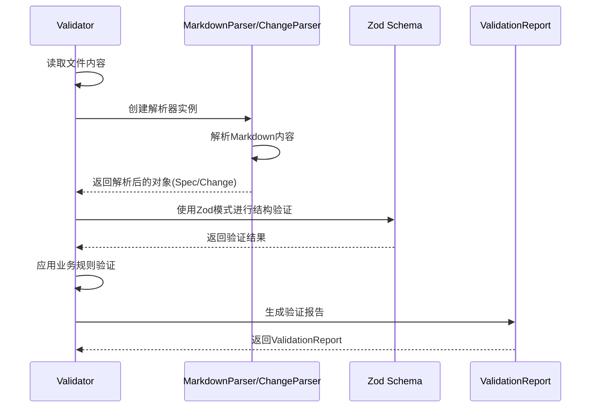
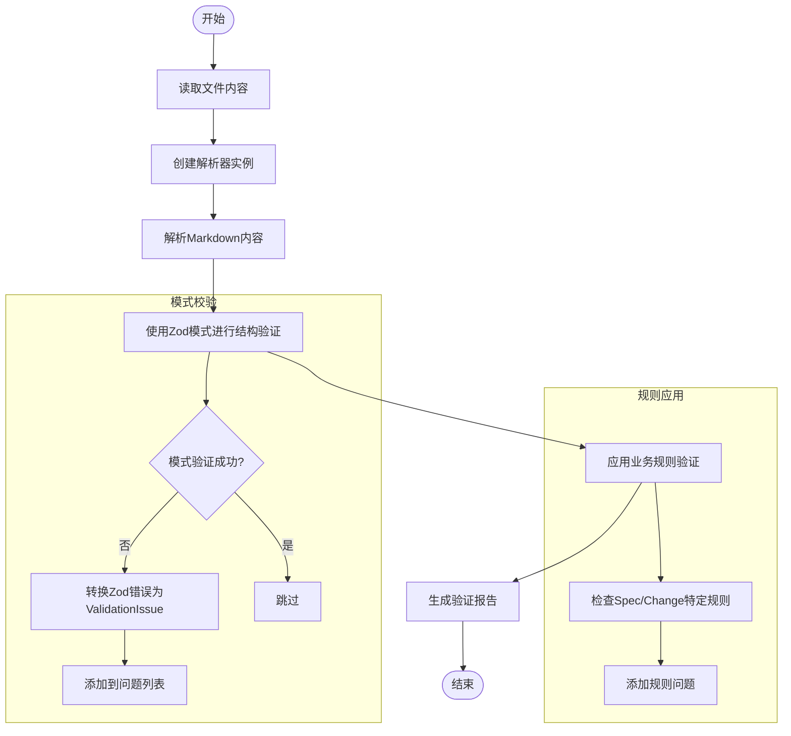
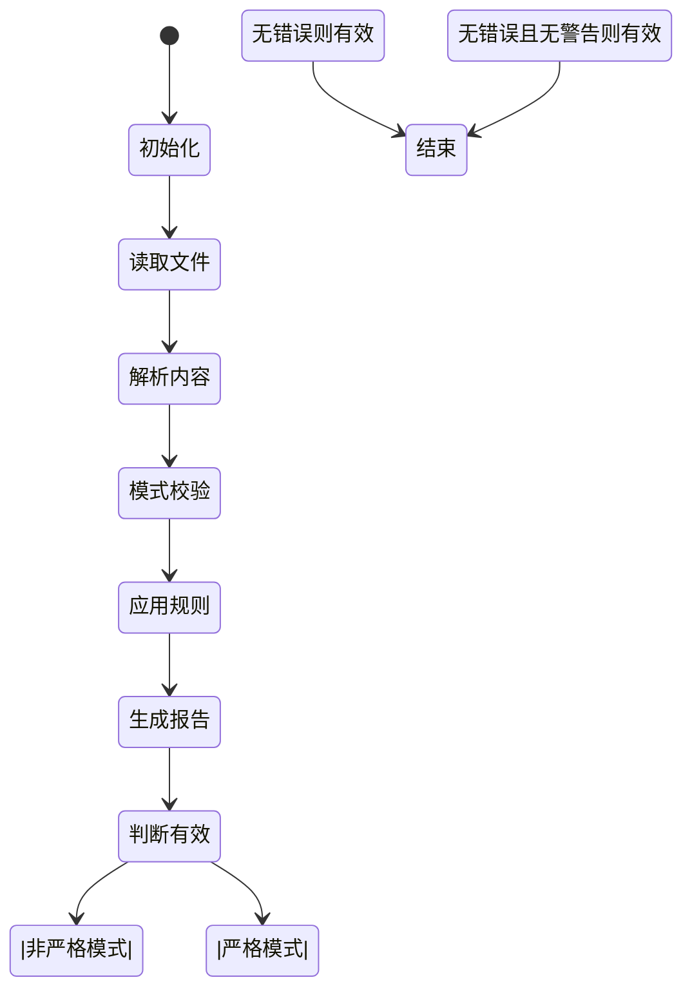

# 验证机制

<cite>
**本文档引用的文件**
- [validator.ts](file://src/core/validation/validator.ts)
- [spec.schema.ts](file://src/core/schemas/spec.schema.ts)
- [change.schema.ts](file://src/core/schemas/change.schema.ts)
- [markdown-parser.ts](file://src/core/parsers/markdown-parser.ts)
- [change-parser.ts](file://src/core/parsers/change-parser.ts)
- [requirement-blocks.ts](file://src/core/parsers/requirement-blocks.ts)
- [types.ts](file://src/core/validation/types.ts)
- [constants.ts](file://src/core/validation/constants.ts)
- [validation.test.ts](file://test/core/validation.test.ts)
- [cli-validate/spec.md](file://openspec/specs/cli-validate/spec.md)
</cite>

## 目录
1. [引言](#引言)
2. [核心验证组件](#核心验证组件)
3. [Validator类与解析器的协作](#validator类与解析器的协作)
4. [Zod模式验证](#zod模式验证)
5. [validateSpec与validateChange方法执行流程](#validatespec与validatechange方法执行流程)
6. [ValidationReport生成与strictMode影响](#validationreport生成与strictmode影响)
7. [extractNameFromPath在上下文识别中的作用](#extractnamefrompath在上下文识别中的作用)
8. [从原始内容到验证报告的数据流](#从原始内容到验证报告的数据流)
9. [结论](#结论)

## 引言
OpenSpec验证系统是确保规范（Spec）和变更（Change）文档符合预定义结构和语义规则的核心机制。该系统通过`Validator`类协调`MarkdownParser`进行内容解析，并利用Zod模式执行结构验证。本文件将深入阐述验证系统的核心机制，详细解释`Validator`类如何工作，包括文件读取、解析、模式校验和规则应用的完整流程。同时，将说明`ValidationReport`的生成过程，特别是`strictMode`对验证结果的影响，并结合代码示例展示从原始Markdown内容到最终验证报告的完整数据流。

## 核心验证组件

OpenSpec验证系统由多个核心组件构成，它们协同工作以确保文档的完整性和正确性。这些组件包括`Validator`、`MarkdownParser`、`ChangeParser`、Zod模式（`SpecSchema`和`ChangeSchema`）、`ValidationReport`以及`extractNameFromPath`函数。

**Section sources**
- [validator.ts](file://src/core/validation/validator.ts#L1-L449)
- [spec.schema.ts](file://src/core/schemas/spec.schema.ts#L1-L17)
- [change.schema.ts](file://src/core/schemas/change.schema.ts#L1-L42)
- [markdown-parser.ts](file://src/core/parsers/markdown-parser.ts#L1-L237)
- [change-parser.ts](file://src/core/parsers/change-parser.ts#L1-L234)
- [requirement-blocks.ts](file://src/core/parsers/requirement-blocks.ts#L1-L235)
- [types.ts](file://src/core/validation/types.ts#L1-L19)
- [constants.ts](file://src/core/validation/constants.ts#L1-L49)

## Validator类与解析器的协作

`Validator`类是验证系统的协调中心，它负责协调`MarkdownParser`和`ChangeParser`进行内容解析。当调用`validateSpec`或`validateChange`方法时，`Validator`首先读取指定文件路径的文件内容，然后根据验证类型创建相应的解析器实例。

对于规范（Spec）验证，`Validator`创建一个`MarkdownParser`实例，并调用其`parseSpec`方法。该方法将Markdown内容解析为一个结构化的`Spec`对象。对于变更（Change）验证，`Validator`创建一个`ChangeParser`实例，并调用其`parseChangeWithDeltas`方法。`ChangeParser`继承自`MarkdownParser`，并扩展了对变更特定结构（如`## Why`和`## What Changes`部分）的解析能力，同时能够从变更目录下的`specs/`子目录中解析增量（delta）规范。



**Diagram sources**
- [validator.ts](file://src/core/validation/validator.ts#L22-L102)
- [markdown-parser.ts](file://src/core/parsers/markdown-parser.ts#L24-L76)
- [change-parser.ts](file://src/core/parsers/change-parser.ts#L20-L53)

**Section sources**
- [validator.ts](file://src/core/validation/validator.ts#L22-L102)
- [markdown-parser.ts](file://src/core/parsers/markdown-parser.ts#L24-L76)
- [change-parser.ts](file://src/core/parsers/change-parser.ts#L20-L53)

## Zod模式验证

OpenSpec系统使用Zod库来定义和执行结构验证。Zod模式（Schema）为`Spec`和`Change`对象定义了严格的类型和约束。`SpecSchema`要求规范必须包含名称、概述（overview）和至少一个需求（requirement）。`ChangeSchema`则要求变更必须包含名称、`Why`部分、`What Changes`部分以及至少一个增量（delta）。

这些模式不仅定义了数据结构，还包含了验证消息。例如，`SpecSchema`中的`overview`字段使用`.min(1, VALIDATION_MESSAGES.SPEC_PURPOSE_EMPTY)`来确保概述不为空，并在验证失败时返回预定义的错误消息。`RequirementSchema`使用`.refine()`方法来确保需求文本中包含"SHALL"或"MUST"关键词，这是规范文档的关键语义要求。

```mermaid
classDiagram
class SpecSchema {
+name : string (min : 1)
+overview : string (min : 1)
+requirements : RequirementSchema[] (min : 1)
+metadata : object (optional)
}
class ChangeSchema {
+name : string (min : 1)
+why : string (min : 50, max : 1000)
+whatChanges : string (min : 1)
+deltas : DeltaSchema[] (min : 1, max : 10)
+metadata : object (optional)
}
class DeltaSchema {
+spec : string (min : 1)
+operation : enum[ADDED, MODIFIED, REMOVED, RENAMED]
+description : string (min : 1)
+requirement : RequirementSchema (optional)
+requirements : RequirementSchema[] (optional)
+rename : {from : string, to : string} (optional)
}
class RequirementSchema {
+text : string (min : 1, must contain SHALL/MUST)
+scenarios : ScenarioSchema[] (min : 1)
}
class ScenarioSchema {
+rawText : string (min : 1)
}
SpecSchema --> RequirementSchema : "包含"
ChangeSchema --> DeltaSchema : "包含"
DeltaSchema --> RequirementSchema : "可选包含"
RequirementSchema --> ScenarioSchema : "包含"
```

**Diagram sources**
- [spec.schema.ts](file://src/core/schemas/spec.schema.ts#L5-L17)
- [change.schema.ts](file://src/core/schemas/change.schema.ts#L10-L42)
- [base.schema.ts](file://src/core/schemas/base.schema.ts#L8-L20)

**Section sources**
- [spec.schema.ts](file://src/core/schemas/spec.schema.ts#L5-L17)
- [change.schema.ts](file://src/core/schemas/change.schema.ts#L10-L42)
- [base.schema.ts](file://src/core/schemas/base.schema.ts#L8-L20)

## validateSpec与validateChange方法执行流程

`validateSpec`和`validateChange`是`Validator`类的两个核心方法，它们的执行流程相似但针对不同的文档类型。

`validateSpec`方法的执行流程如下：
1.  **文件读取**：使用`readFileSync`同步读取指定路径的文件内容。
2.  **内容解析**：创建`MarkdownParser`实例，并调用`parseSpec`方法将Markdown内容解析为`Spec`对象。
3.  **模式校验**：使用`SpecSchema.safeParse()`对解析出的`Spec`对象进行Zod模式验证。如果验证失败，将Zod错误转换为`ValidationIssue`并添加到问题列表中。
4.  **规则应用**：调用`applySpecRules`方法，执行业务规则验证，例如检查概述长度是否过短或需求文本是否过长。
5.  **报告生成**：调用`createReport`方法，根据收集到的问题生成`ValidationReport`。

`validateChange`方法的流程与之类似，但使用`ChangeParser`和`ChangeSchema`。此外，它还支持通过`validateChangeDeltaSpecs`方法验证变更目录下`specs/`子目录中的增量规范文件，确保每个增量操作（ADDED, MODIFIED, REMOVED, RENAMED）都符合特定的格式和语义规则。



**Diagram sources**
- [validator.ts](file://src/core/validation/validator.ts#L22-L113)
- [validator.ts](file://src/core/validation/validator.ts#L113-L272)

**Section sources**
- [validator.ts](file://src/core/validation/validator.ts#L22-L272)

## ValidationReport生成与strictMode影响

`ValidationReport`是验证过程的最终输出，它封装了验证结果。报告包含一个布尔值`valid`，表示文档是否通过验证，一个`issues`数组，包含所有发现的问题（错误、警告、信息），以及一个`summary`对象，提供问题的统计摘要。

`strictMode`是`Validator`的一个关键配置，它直接影响`valid`标志的计算方式。在非严格模式下（`strictMode = false`），只要没有错误（ERROR），报告就认为是有效的。在严格模式下（`strictMode = true`），任何警告（WARNING）或错误都会导致报告无效。这使得`strictMode`成为在不同场景（如开发阶段的宽松验证与生产阶段的严格检查）下控制验证严格程度的有效工具。



**Diagram sources**
- [validator.ts](file://src/core/validation/validator.ts#L380-L398)
- [validator.ts](file://src/core/validation/validator.ts#L385-L387)

**Section sources**
- [validator.ts](file://src/core/validation/validator.ts#L380-L398)

## extractNameFromPath在上下文识别中的作用

`extractNameFromPath`是一个辅助方法，用于从文件路径中提取有意义的名称，这对于上下文识别和错误报告至关重要。该方法通过解析文件路径，查找`specs`或`changes`目录后的下一级目录名作为名称。例如，对于路径`openspec/changes/add-scaffold-command/proposal.md`，它会提取出`add-scaffold-command`作为变更名称。

这种方法确保了即使文件名相同，也能根据其在项目结构中的位置正确识别其上下文。当验证过程中发生错误时，`extractNameFromPath`提供的名称可以用于生成更具可读性和上下文相关性的错误消息，帮助用户快速定位问题。

**Section sources**
- [validator.ts](file://src/core/validation/validator.ts#L361-L378)

## 从原始内容到验证报告的数据流

从原始Markdown内容到最终`ValidationReport`的完整数据流是一个多阶段的处理过程。首先，原始内容被读取并传递给相应的解析器。解析器将非结构化的Markdown文本解析为结构化的JavaScript对象（如`Spec`或`Change`）。然后，Zod模式对该对象进行结构验证，确保其符合预定义的模式。接着，`Validator`应用更深层次的业务规则，例如检查文本长度或关键词存在性。所有发现的问题被收集到一个列表中，最后由`createReport`方法整合成一个包含有效性状态、问题列表和摘要的`ValidationReport`。

这个数据流确保了验证过程的模块化和可扩展性，每个阶段都专注于特定的任务，共同保证了OpenSpec文档的质量和一致性。

**Section sources**
- [validator.ts](file://src/core/validation/validator.ts#L22-L102)
- [markdown-parser.ts](file://src/core/parsers/markdown-parser.ts#L24-L76)

## 结论
OpenSpec验证系统通过`Validator`、`MarkdownParser`、Zod模式和`ValidationReport`等核心组件的紧密协作，构建了一个强大而灵活的文档验证机制。`Validator`作为协调者，利用解析器将Markdown内容转换为结构化对象，并通过Zod模式进行严格的结构校验。`applySpecRules`和`applyChangeRules`方法则在此基础上执行业务逻辑层面的验证。`strictMode`的引入为用户提供了控制验证严格程度的开关。`extractNameFromPath`等辅助方法增强了系统的上下文感知能力。整个系统从原始内容到最终报告的数据流清晰、高效，确保了OpenSpec文档的高质量和一致性。