# OpenSpec验证系统深度技术文档

<cite>
**本文档引用的文件**
- [validator.ts](file://src/core/validation/validator.ts)
- [types.ts](file://src/core/validation/types.ts)
- [constants.ts](file://src/core/validation/constants.ts)
- [markdown-parser.ts](file://src/core/parsers/markdown-parser.ts)
- [change-parser.ts](file://src/core/parsers/change-parser.ts)
- [requirement-blocks.ts](file://src/core/parsers/requirement-blocks.ts)
- [spec.schema.ts](file://src/core/schemas/spec.schema.ts)
- [change.schema.ts](file://src/core/schemas/change.schema.ts)
- [base.schema.ts](file://src/core/schemas/base.schema.ts)
- [validate.ts](file://src/commands/validate.ts)
- [cli-validate/spec.md](file://openspec/specs/cli-validate/spec.md)
- [cli-change/spec.md](file://openspec/specs/cli-change/spec.md)
- [make-validation-scope-aware/spec.md](file://openspec/changes/make-validation-scope-aware/specs/cli-validate/spec.md)
</cite>

## 目录
1. [简介](#简介)
2. [系统架构概览](#系统架构概览)
3. [核心组件分析](#核心组件分析)
4. [验证报告系统](#验证报告系统)
5. [解析器架构](#解析器架构)
6. [模式验证系统](#模式验证系统)
7. [验证级别与处理策略](#验证级别与处理策略)
8. [严格模式与CI/CD集成](#严格模式与cicd集成)
9. [常见验证错误与解决方案](#常见验证错误与解决方案)
10. [最佳实践指南](#最佳实践指南)

## 简介

OpenSpec验证系统是一个全面的规范验证框架，专门用于确保OpenSpec格式的规范（Spec）和变更提案（Change）符合预定义的质量标准。该系统采用多层次验证策略，结合模式验证、语义检查和格式规范，为开发者提供精确的错误诊断和修复指导。

验证系统的核心价值在于：
- **自动化质量保证**：通过程序化验证减少人工审查负担
- **即时反馈机制**：在开发过程中提供实时错误检测
- **标准化流程**：确保所有规范遵循统一的结构和格式要求
- **可扩展架构**：支持自定义验证规则和扩展点

## 系统架构概览

OpenSpec验证系统采用分层架构设计，各组件职责明确，协作高效：

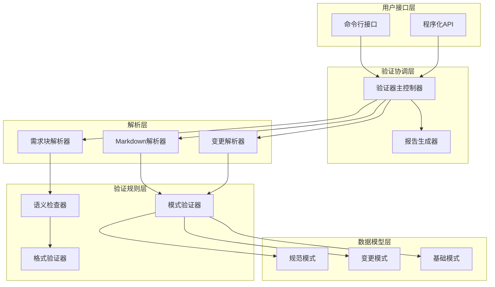

**图表来源**
- [validator.ts](file://src/core/validation/validator.ts#L15-L449)
- [markdown-parser.ts](file://src/core/parsers/markdown-parser.ts#L10-L237)
- [change-parser.ts](file://src/core/parsers/change-parser.ts#L12-L234)

**章节来源**
- [validator.ts](file://src/core/validation/validator.ts#L1-L50)
- [types.ts](file://src/core/validation/types.ts#L1-L19)

## 核心组件分析

### 验证器类（Validator）

验证器是整个验证系统的核心控制器，负责协调各个解析器和验证规则：

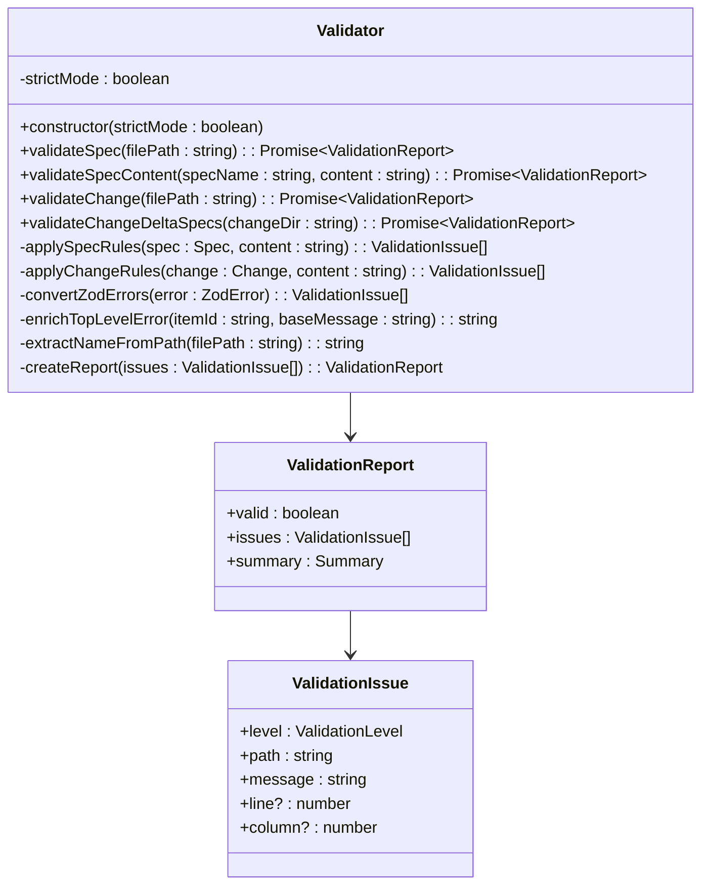

**图表来源**
- [validator.ts](file://src/core/validation/validator.ts#L15-L449)
- [types.ts](file://src/core/validation/types.ts#L3-L19)

验证器的主要功能包括：

1. **多格式验证支持**：同时支持规范文件和变更文件的验证
2. **严格模式控制**：通过构造函数参数控制验证严格程度
3. **错误增强机制**：为原始错误消息添加上下文和修复建议
4. **路径提取功能**：从文件路径中智能提取项目名称

**章节来源**
- [validator.ts](file://src/core/validation/validator.ts#L15-L449)

### 解析器层次结构

系统采用继承和组合的设计模式，构建了灵活的解析器体系：

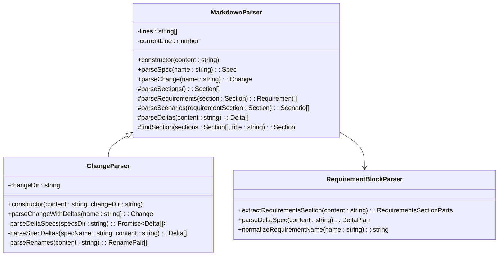

**图表来源**
- [markdown-parser.ts](file://src/core/parsers/markdown-parser.ts#L10-L237)
- [change-parser.ts](file://src/core/parsers/change-parser.ts#L12-L234)
- [requirement-blocks.ts](file://src/core/parsers/requirement-blocks.ts#L1-L235)

**章节来源**
- [markdown-parser.ts](file://src/core/parsers/markdown-parser.ts#L10-L237)
- [change-parser.ts](file://src/core/parsers/change-parser.ts#L12-L234)

## 验证报告系统

### 数据结构设计

验证报告系统采用统一的数据结构来表示验证结果，确保信息的完整性和一致性：

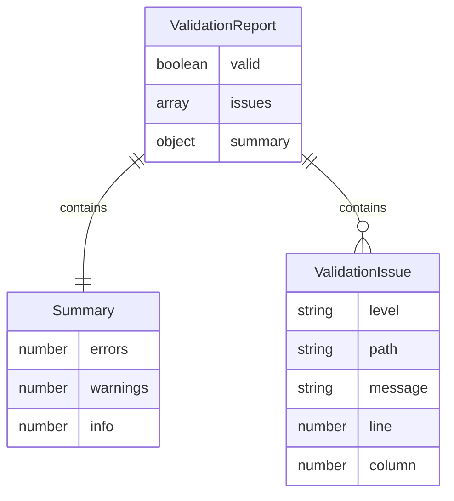

**图表来源**
- [types.ts](file://src/core/validation/types.ts#L11-L19)

### 报告生成流程

验证报告的生成遵循严格的流程，确保每个验证步骤的结果都被正确记录：

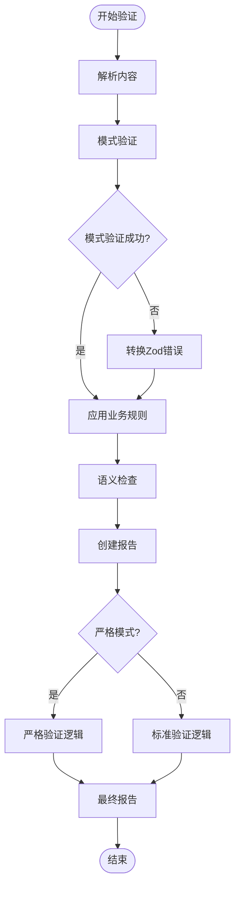

**图表来源**
- [validator.ts](file://src/core/validation/validator.ts#L22-L49)
- [validator.ts](file://src/core/validation/validator.ts#L380-L398)

**章节来源**
- [types.ts](file://src/core/validation/types.ts#L11-L19)
- [validator.ts](file://src/core/validation/validator.ts#L380-L398)

## 解析器架构

### Markdown解析器

Markdown解析器是验证系统的基础组件，负责将原始Markdown内容转换为结构化的数据模型：

#### 核心功能特性

1. **跨平台兼容性**：自动处理不同操作系统下的换行符
2. **递归结构解析**：支持嵌套的标题层次结构
3. **智能内容提取**：准确提取标题内容和子段落
4. **错误容错机制**：在遇到格式问题时提供有意义的错误信息

#### 解析算法实现

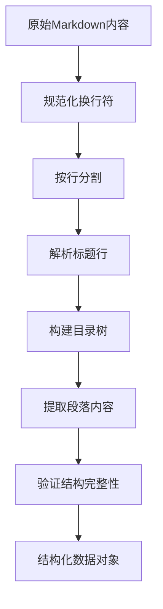

**图表来源**
- [markdown-parser.ts](file://src/core/parsers/markdown-parser.ts#L15-L113)

**章节来源**
- [markdown-parser.ts](file://src/core/parsers/markdown-parser.ts#L15-L113)

### 变更解析器

变更解析器专门处理变更提案文件，支持两种解析模式：

1. **简单格式解析**：基于标记列表的快速解析
2. **增量格式解析**：基于delta头部的详细解析

#### 增量解析流程

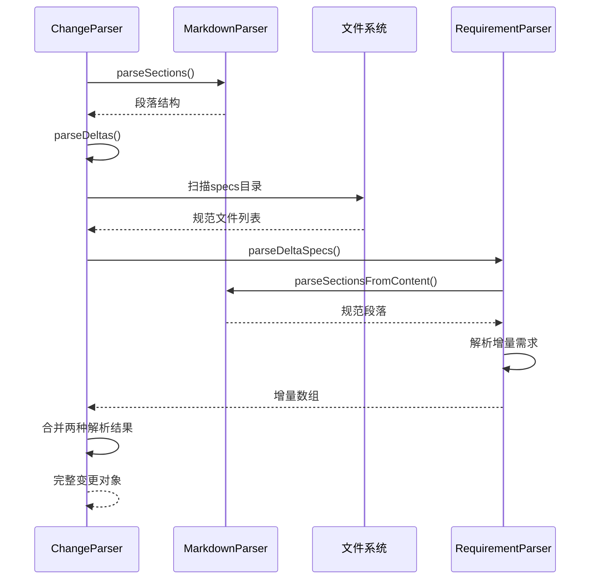

**图表来源**
- [change-parser.ts](file://src/core/parsers/change-parser.ts#L20-L82)

**章节来源**
- [change-parser.ts](file://src/core/parsers/change-parser.ts#L20-L82)

### 需求块解析器

需求块解析器负责处理增量格式中的需求定义，提供精确的需求识别和分类：

#### 增量计划结构

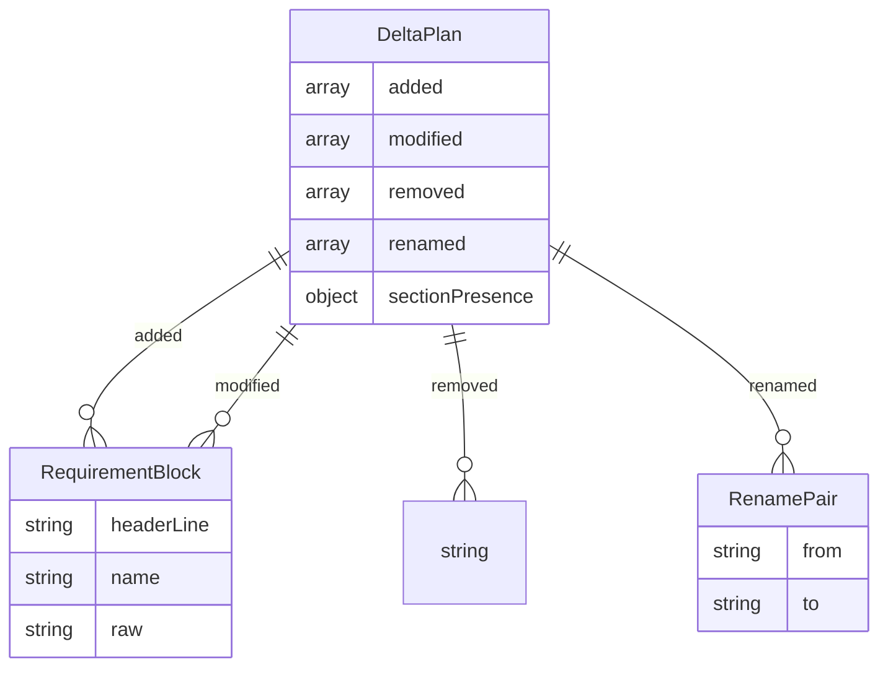

**图表来源**
- [requirement-blocks.ts](file://src/core/parsers/requirement-blocks.ts#L99-L110)

**章节来源**
- [requirement-blocks.ts](file://src/core/parsers/requirement-blocks.ts#L99-L110)

## 模式验证系统

### Zod模式定义

OpenSpec验证系统使用Zod作为主要的模式验证工具，提供了强类型的验证规则：

#### 规范模式（SpecSchema）

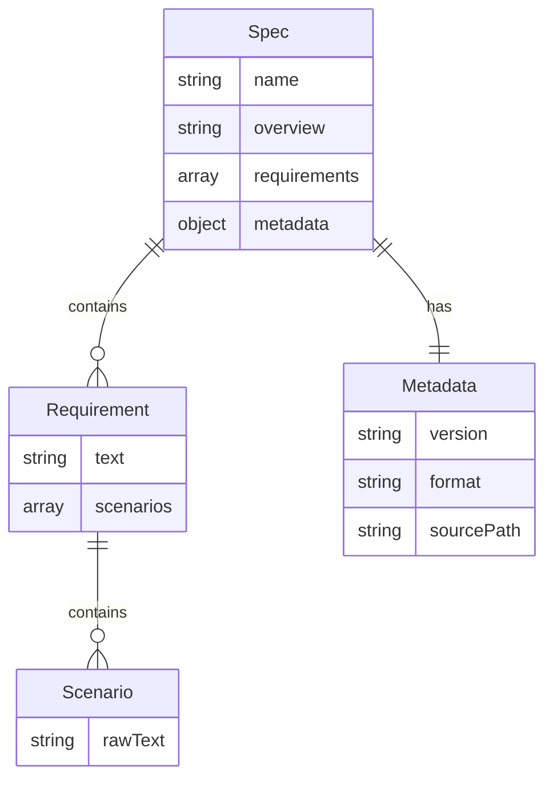

**图表来源**
- [spec.schema.ts](file://src/core/schemas/spec.schema.ts#L5-L17)
- [base.schema.ts](file://src/core/schemas/base.schema.ts#L8-L17)

#### 变更模式（ChangeSchema）

变更模式包含了对变更提案的完整验证规则：

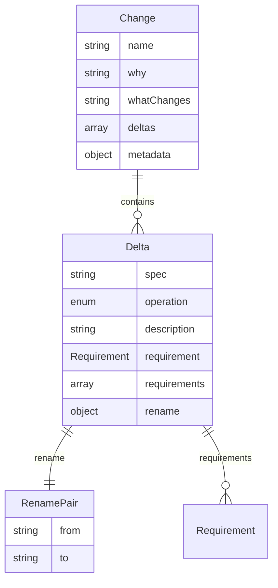

**图表来源**
- [change.schema.ts](file://src/core/schemas/change.schema.ts#L12-L42)

### 验证常量配置

系统定义了详细的验证常量，确保内容质量和格式一致性：

| 验证项 | 常量值 | 描述 |
|--------|--------|------|
| 最小目的长度 | 50字符 | 规范目的部分最小长度要求 |
| 最大需求文本长度 | 500字符 | 单个需求的最大文本长度 |
| 最大变更增量数 | 10个 | 单次变更允许的最大增量数量 |
| 最小原因部分长度 | 50字符 | 变更原因部分最小长度 |
| 最大原因部分长度 | 1000字符 | 变更原因部分最大长度 |

**章节来源**
- [spec.schema.ts](file://src/core/schemas/spec.schema.ts#L5-L17)
- [change.schema.ts](file://src/core/schemas/change.schema.ts#L12-L42)
- [base.schema.ts](file://src/core/schemas/base.schema.ts#L8-L17)
- [constants.ts](file://src/core/validation/constants.ts#L1-L49)

## 验证级别与处理策略

### 验证级别定义

OpenSpec验证系统定义了三个级别的验证信息：

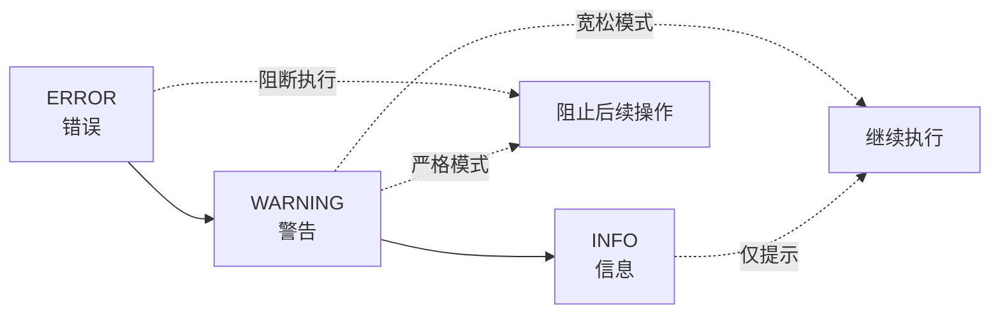

**图表来源**
- [types.ts](file://src/core/validation/types.ts#L1-L2)

### 错误级别处理策略

#### ERROR（错误）
- **特点**：阻止验证通过，必须修复
- **触发条件**：违反基本结构要求或安全关键规则
- **处理方式**：立即停止验证流程，返回失败状态

#### WARNING（警告）
- **特点**：影响验证通过性，但可选择忽略
- **触发条件**：不符合最佳实践或存在潜在问题
- **处理方式**：在非严格模式下允许通过，在严格模式下阻止

#### INFO（信息）
- **特点**：提供优化建议，不影响验证结果
- **触发条件**：内容长度超出推荐范围或格式建议
- **处理方式**：记录但不阻止验证通过

### 严格模式行为

严格模式是验证系统的重要特性，它改变了警告的处理策略：

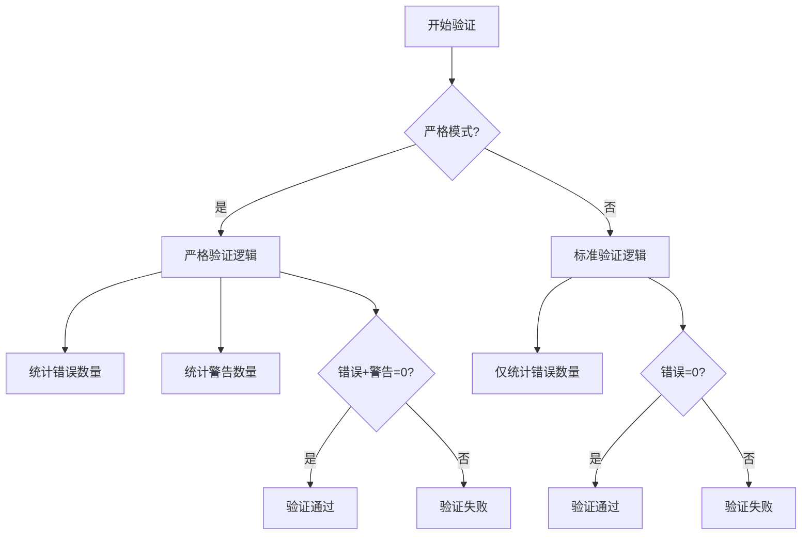

**图表来源**
- [validator.ts](file://src/core/validation/validator.ts#L385-L387)

**章节来源**
- [types.ts](file://src/core/validation/types.ts#L1-L2)
- [validator.ts](file://src/core/validation/validator.ts#L385-L387)

## 严格模式与CI/CD集成

### CI/CD流水线集成策略

严格模式在CI/CD流水线中发挥关键作用，确保代码质量的一致性：

#### 流水线配置示例

```yaml
# GitHub Actions 示例
name: OpenSpec Validation
on: [push, pull_request]
jobs:
  validate:
    runs-on: ubuntu-latest
    steps:
      - uses: actions/checkout@v2
      - name: Install dependencies
        run: npm install
      - name: Run strict validation
        run: npx openspec validate --all --strict
```

#### 集成最佳实践

1. **强制性验证**：在合并前强制执行严格验证
2. **并行验证**：与其他质量检查并行执行
3. **失败处理**：验证失败时阻止合并操作
4. **报告集成**：将验证报告集成到CI/CD仪表板

### 严格模式的影响范围

严格模式不仅影响验证结果，还改变以下方面：

| 影响维度 | 严格模式 | 标准模式 |
|----------|----------|----------|
| 错误容忍度 | 0个错误 | 允许警告 |
| 验证速度 | 较慢 | 较快 |
| 质量保证 | 最高 | 中等 |
| 开发体验 | 更严格 | 更友好 |
| 生产部署 | 必须通过 | 可选择 |

**章节来源**
- [validate.ts](file://src/commands/validate.ts#L31-L41)
- [validator.ts](file://src/core/validation/validator.ts#L18-L20)

## 常见验证错误与解决方案

### 规范验证错误

#### 1. 缺失必需部分

**错误信息**：`Spec must have a Purpose section` 或 `Spec must have a Requirements section`

**根本原因**：规范文件缺少必要的结构部分

**解决方案**：
```markdown
# 用户认证规范

## Purpose
本规范定义了系统中用户认证的要求。

## Requirements

### 系统 SHALL 提供安全的用户认证
系统必须提供安全的用户认证机制。

#### 场景：成功登录
- **当** 用户输入有效凭据
- **则** 系统验证凭据并重定向到仪表板
```

#### 2. 需求缺乏SHALL/MUST关键字

**错误信息**：`Requirement must contain SHALL or MUST keyword`

**根本原因**：需求陈述未包含强制性关键词

**解决方案**：
```markdown
# 错误示例
### 用户界面 SHALL 显示登录表单
用户界面应该显示登录表单。

# 正确示例
### 系统 SHALL 提供用户认证
系统必须提供安全的用户认证机制。
```

#### 3. 缺少场景描述

**错误信息**：`Requirement must have at least one scenario`

**根本原因**：需求没有具体的测试场景

**解决方案**：
```markdown
# 错误示例
### 系统 SHALL 处理无效登录尝试
系统应该优雅地处理错误凭据。

# 正确示例
### 系统 SHALL 处理无效登录尝试
系统必须优雅地处理错误凭据。

#### 场景：无效凭据
- **当** 用户使用无效凭据登录
- **则** 系统显示错误消息
```

### 变更验证错误

#### 1. 缺少增量定义

**错误信息**：`Change must have at least one delta`

**根本原因**：变更提案中没有定义任何变更

**解决方案**：
```markdown
# 错误示例
## What Changes
添加用户认证功能。

# 正确示例
## What Changes
- **user-auth:** 添加新的用户认证规范
- **api-endpoints:** 修改以包含认证端点
```

#### 2. 增量格式错误

**错误信息**：`ADDED "Requirement Name" must contain SHALL or MUST`

**根本原因**：增量格式的需求缺少强制性关键词

**解决方案**：
```markdown
# 增量格式示例
## ADDED Requirements

### Requirement: 认证状态管理 SHALL 实现
系统必须实现具有三种状态的断路器。

#### 场景：正常操作
- **当** 断路器处于CLOSED状态
- **则** 请求被正常执行
```

### 增量验证错误

#### 1. 重复需求

**错误信息**：`Duplicate requirement in ADDED: "Requirement Name"`

**根本原因**：同一增量中定义了重复的需求

**解决方案**：检查需求名称的唯一性，避免重复定义

#### 2. 跨节冲突

**错误信息**：`Requirement present in both MODIFIED and REMOVED`

**根本原因**：同一个需求在同一变更中被多个操作修改

**解决方案**：确保每个需求只在一个操作中出现

**章节来源**
- [constants.ts](file://src/core/validation/constants.ts#L15-L49)
- [validator.ts](file://src/core/validation/validator.ts#L288-L345)

## 最佳实践指南

### 开发阶段最佳实践

#### 1. 验证时机策略

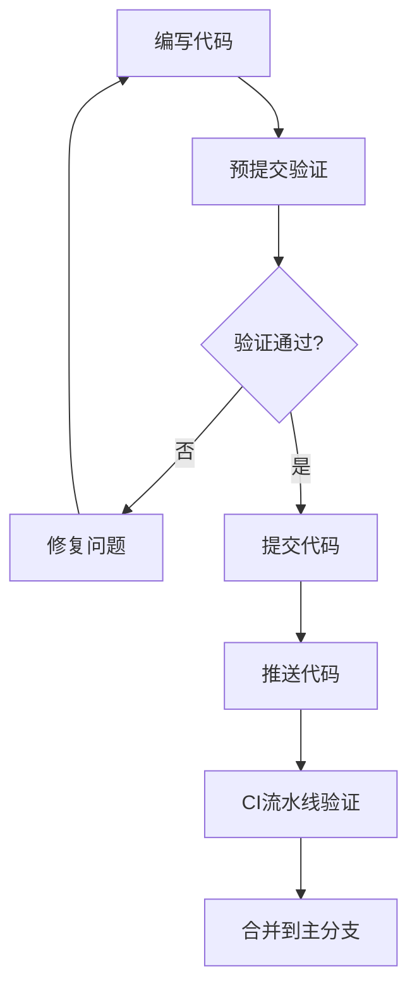

#### 2. 交互式验证使用

验证系统提供了丰富的交互式功能：

- **批量验证**：一次性验证所有规范和变更
- **选择性验证**：针对特定项目进行验证
- **进度监控**：实时显示验证进度和状态

#### 3. 错误修复流程

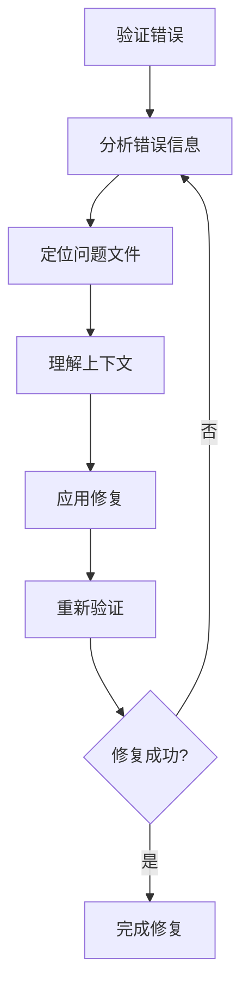

### 团队协作最佳实践

#### 1. 规范模板标准化

建立团队内部的规范模板，确保一致性：

```markdown
# [功能名称] 规范

## Purpose
[详细的目的描述，至少50字符]

## Requirements

### [需求标题]
[需求描述，必须包含SHALL或MUST]
[可选的元数据字段]

#### 场景：[场景名称]
- **当** [前置条件]
- **则** [预期结果]
- **且** [其他条件]
```

#### 2. 验证工具集成

将验证工具集成到开发工作流中：

- **IDE插件**：在编辑器中提供实时验证
- **Git钩子**：在提交前自动验证
- **CI/CD管道**：持续集成中的质量门禁

#### 3. 文档维护策略

定期更新验证规则和最佳实践文档：

- **规则变更通知**：及时通知团队规则变更
- **案例收集**：积累常见问题和解决方案
- **培训材料**：为新成员提供验证系统培训

### 性能优化建议

#### 1. 并发验证配置

对于大型项目，合理配置并发验证参数：

```bash
# 设置并发数为8
openspec validate --all --concurrency 8

# 使用环境变量设置并发数
export OPENSPEC_CONCURRENCY=8
openspec validate --all
```

#### 2. 缓存策略

利用验证结果缓存减少重复计算：

- **文件级缓存**：缓存已验证文件的状态
- **增量验证**：只验证发生变化的部分
- **智能跳过**：跳过不需要验证的项目

#### 3. 资源管理

合理分配系统资源：

- **内存使用**：避免同时加载过多文件
- **CPU占用**：平衡验证精度和性能
- **I/O优化**：批量处理文件读取操作

**章节来源**
- [validate.ts](file://src/commands/validate.ts#L183-L306)
- [constants.ts](file://src/core/validation/constants.ts#L1-L49)

## 结论

OpenSpec验证系统通过其精心设计的架构和全面的功能，为OpenSpec生态系统提供了坚实的质量保障基础。系统的核心优势包括：

1. **全面覆盖**：从语法到语义的全方位验证
2. **智能诊断**：提供精确的错误定位和修复建议
3. **灵活配置**：支持不同严格程度的验证策略
4. **易于集成**：无缝集成到现有开发工作流
5. **持续演进**：支持规则扩展和定制

随着OpenSpec生态系统的不断发展，验证系统将继续演进，为高质量的规范编写提供更加智能和高效的工具支持。开发者应当充分利用系统的各项功能，遵循最佳实践，共同维护OpenSpec规范的质量标准。