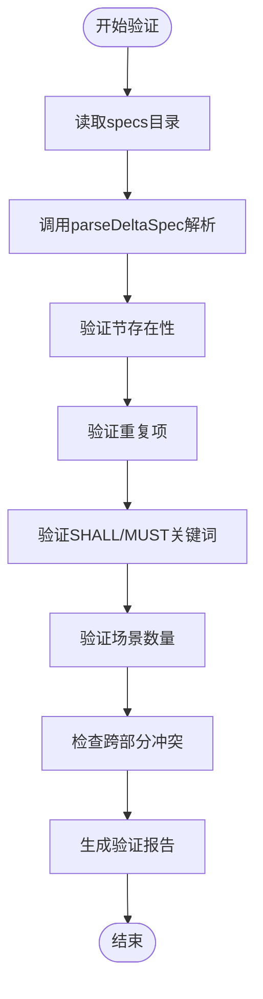
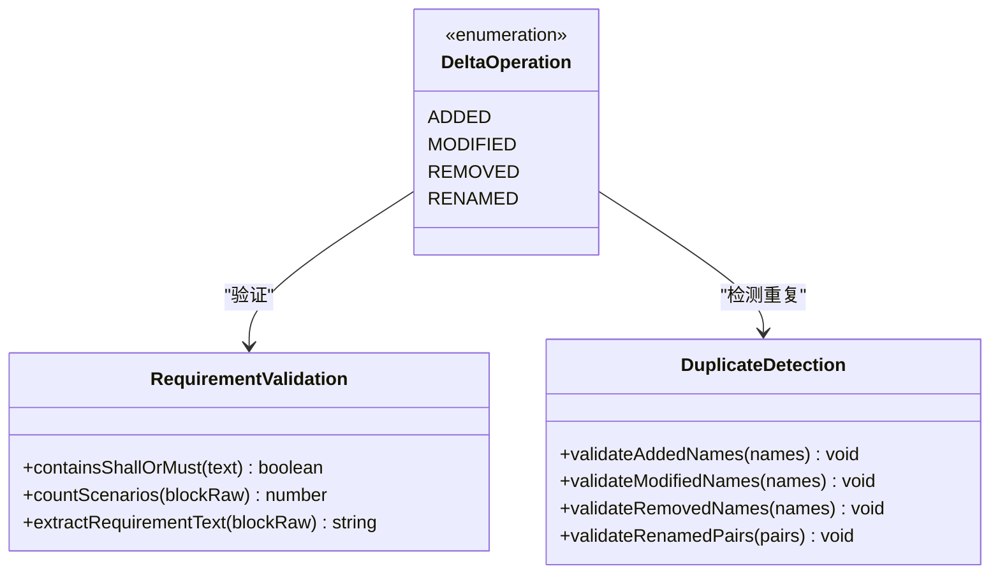
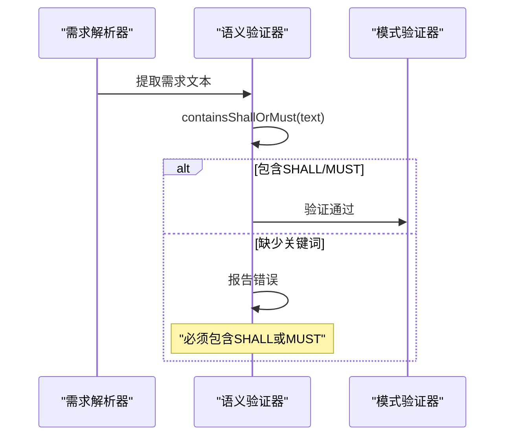
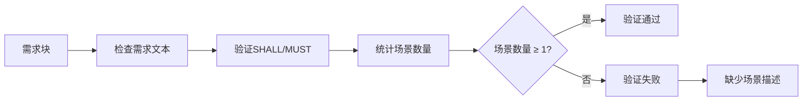
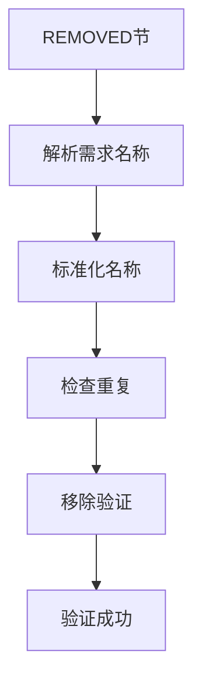
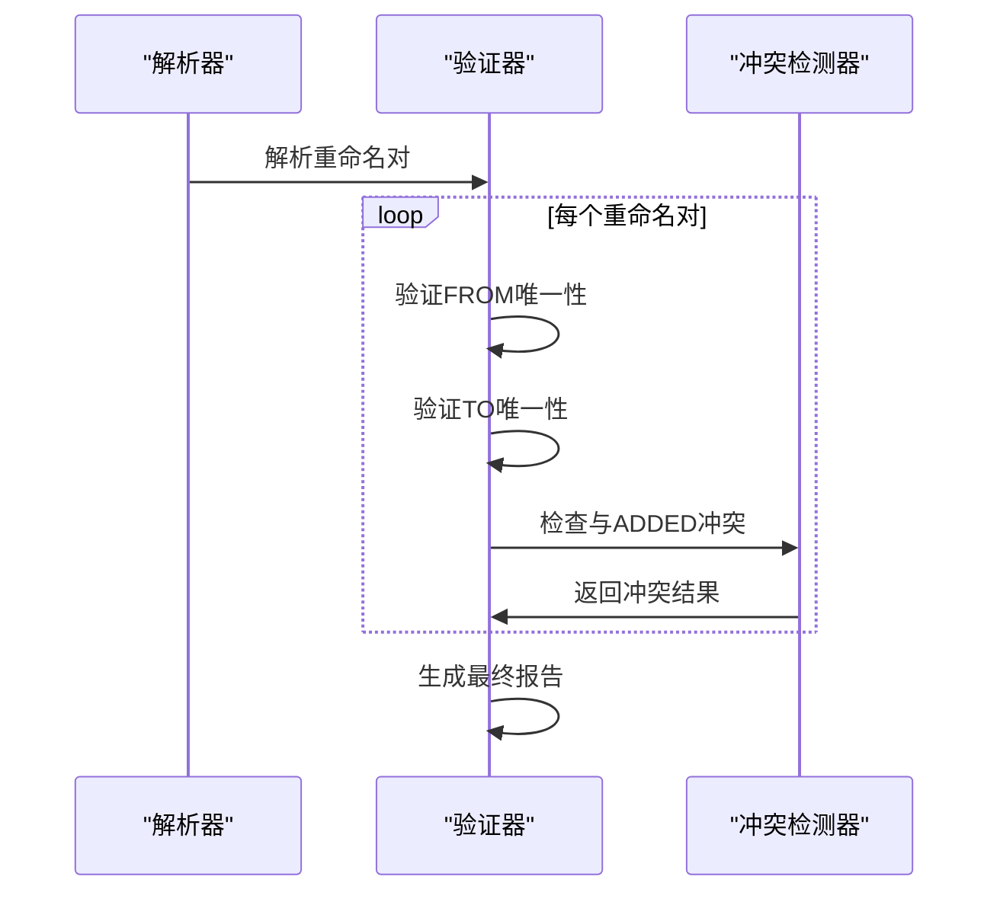
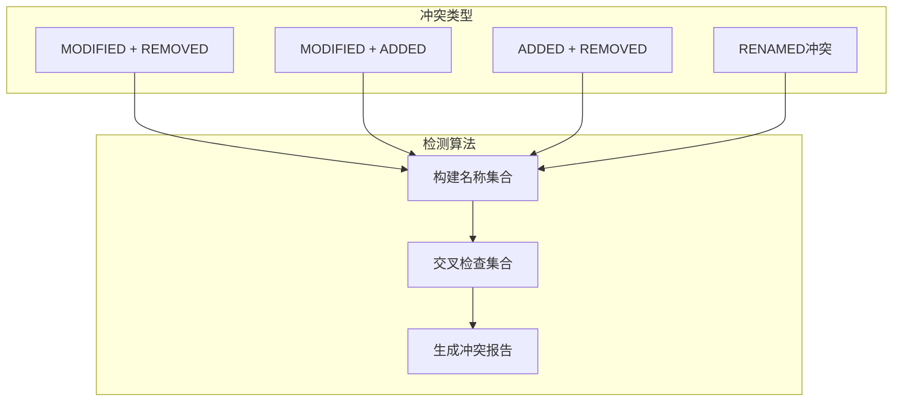
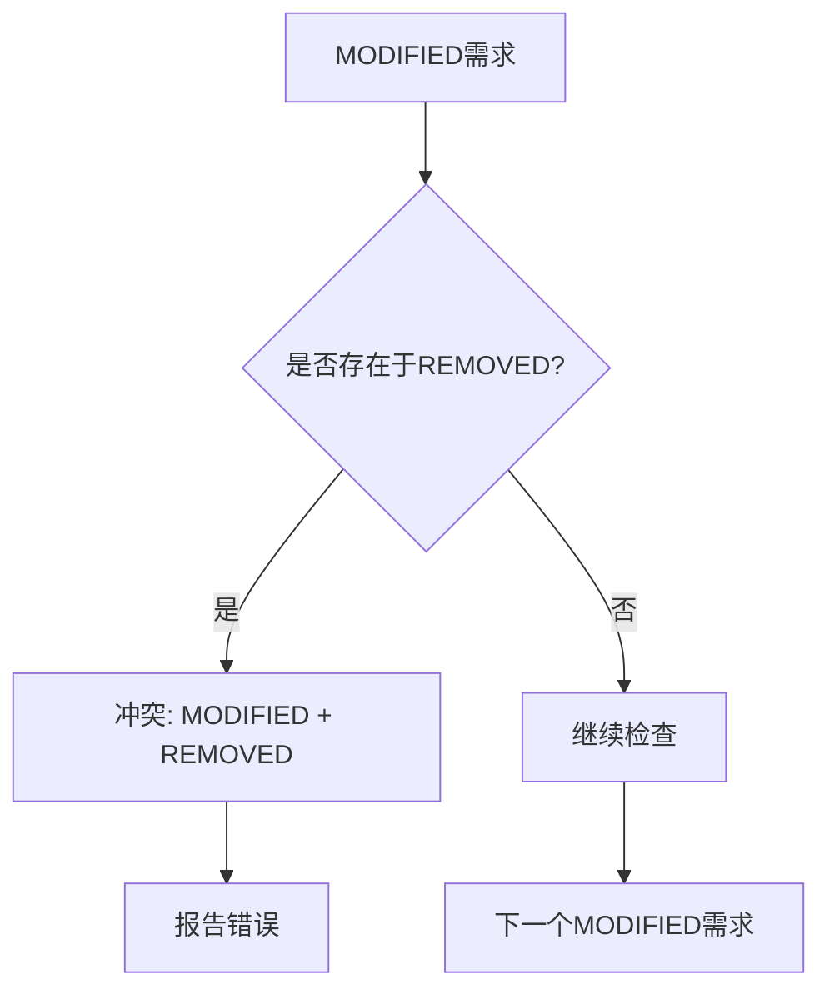
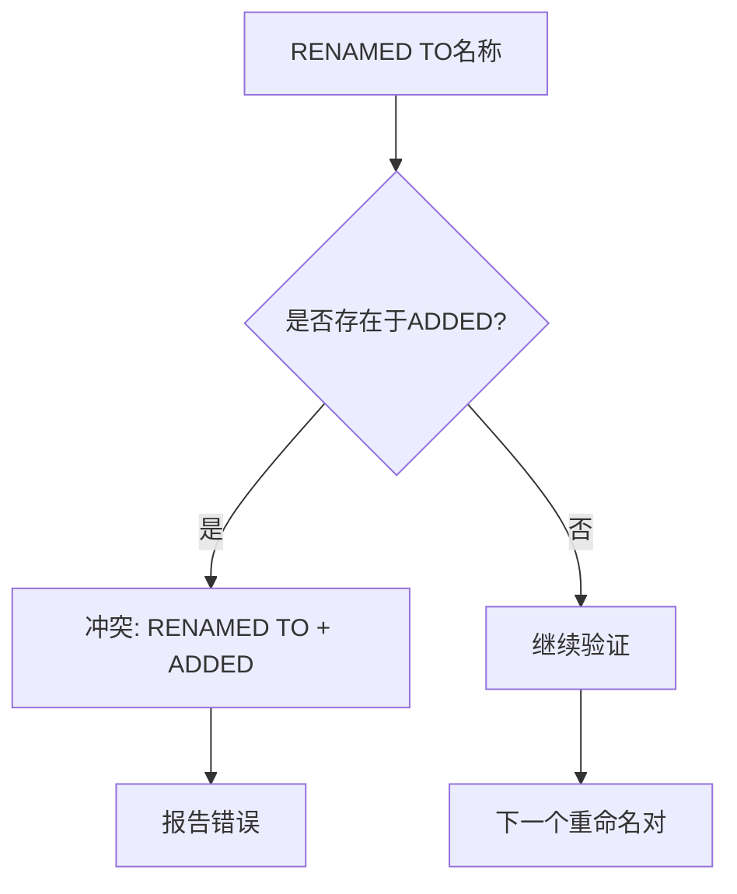
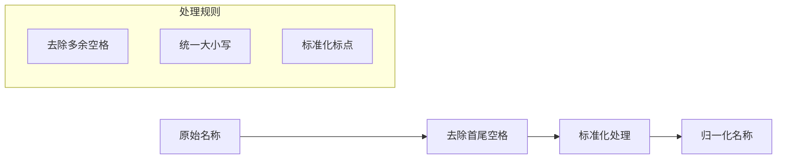

# Delta语义规则

<cite>
**本文档引用的文件**
- [validator.ts](file://src/core/validation/validator.ts)
- [requirement-blocks.ts](file://src/core/parsers/requirement-blocks.ts)
- [base.schema.ts](file://src/core/schemas/base.schema.ts)
- [change.schema.ts](file://src/core/schemas/change.schema.ts)
- [constants.ts](file://src/core/validation/constants.ts)
- [archive.ts](file://src/core/archive.ts)
- [change-parser.ts](file://src/core/parsers/change-parser.ts)
- [validation.test.ts](file://test/core/validation.test.ts)
</cite>

## 目录
1. [简介](#简介)
2. [核心验证方法](#核心验证方法)
3. [Delta操作类型验证](#delta操作类型验证)
4. [语义规则详解](#语义规则详解)
5. [跨部分冲突检测](#跨部分冲突检测)
6. [解析和归一化机制](#解析和归一化机制)
7. [错误示例与修正指南](#错误示例与修正指南)
8. [最佳实践建议](#最佳实践建议)

## 简介

OpenSpec的Delta格式规范文件采用严格的语义验证规则，确保变更描述的一致性和完整性。`validateChangeDeltaSpecs`方法是核心验证器，负责检查Delta格式文件中的所有语义约束，包括操作类型、关键词要求、场景必需性以及跨部分冲突检测。

## 核心验证方法

### validateChangeDeltaSpecs方法架构



**图表来源**
- [validator.ts](file://src/core/validation/validator.ts#L113-L271)

该方法遍历指定变更目录下的所有规格文件，对每个文件执行以下验证步骤：

1. **节存在性检查**：确保至少存在一个有效的Delta操作节
2. **重复项检测**：防止同一需求在同一系列别中重复定义
3. **关键词验证**：强制要求ADDED和MODIFIED操作包含SHALL或MUST关键词
4. **场景验证**：确保每个需求至少包含一个场景描述
5. **跨部分冲突检测**：防止同一需求同时出现在多个操作系列中

**章节来源**
- [validator.ts](file://src/core/validation/validator.ts#L113-L271)

## Delta操作类型验证

### 操作类型分类与要求

OpenSpec支持四种Delta操作类型，每种都有特定的验证要求：

| 操作类型 | 验证要求 | 特殊规则 |
|---------|---------|---------|
| ADDED | 必须包含SHALL/MUST关键词，至少一个场景 | 支持元数据字段 |
| MODIFIED | 必须包含SHALL/MUST关键词，至少一个场景 | 支持元数据字段 |
| REMOVED | 仅需提供需求名称 | 不需要场景或描述 |
| RENAMED | 必须成对出现，不能有重复 | 新旧名称不能冲突 |



**图表来源**
- [validator.ts](file://src/core/validation/validator.ts#L153-L246)
- [base.schema.ts](file://src/core/schemas/base.schema.ts#L8-L16)

**章节来源**
- [validator.ts](file://src/core/validation/validator.ts#L153-L246)
- [change.schema.ts](file://src/core/schemas/change.schema.ts#L10-L22)

## 语义规则详解

### ADDED和MODIFIED操作的强制要求

对于ADDED和MODIFIED操作，系统实施严格的语义验证：

#### 关键词验证机制



**图表来源**
- [validator.ts](file://src/core/validation/validator.ts#L432-L434)
- [base.schema.ts](file://src/core/schemas/base.schema.ts#L11-L14)

#### 场景验证规则

每个需求必须包含至少一个场景描述，场景必须使用四级标题格式：



**图表来源**
- [validator.ts](file://src/core/validation/validator.ts#L436-L439)

**章节来源**
- [validator.ts](file://src/core/validation/validator.ts#L153-L172)
- [base.schema.ts](file://src/core/schemas/base.schema.ts#L15-L16)

### REMOVED操作简化规则

REMOVED操作仅需提供需求名称，不需要额外的语义验证：

#### 移除操作验证流程



**图表来源**
- [validator.ts](file://src/core/validation/validator.ts#L195-L204)

**章节来源**
- [validator.ts](file://src/core/validation/validator.ts#L195-L204)

### RENAMED操作成对验证

RENAMED操作要求严格的成对验证机制：

#### 重命名验证逻辑



**图表来源**
- [validator.ts](file://src/core/validation/validator.ts#L206-L221)

**章节来源**
- [validator.ts](file://src/core/validation/validator.ts#L206-L221)

## 跨部分冲突检测

### 冲突检测机制

OpenSpec实现了复杂的跨部分冲突检测机制，防止同一需求在不同操作系列中重复出现：



**图表来源**
- [validator.ts](file://src/core/validation/validator.ts#L223-L246)
- [archive.ts](file://src/core/archive.ts#L406-L443)

### 具体冲突场景

#### MODIFIED与REMOVED冲突

当同一需求同时出现在MODIFIED和REMOVED系列时，系统会报告冲突：



**图表来源**
- [validator.ts](file://src/core/validation/validator.ts#L224-L226)

#### RENAMED与ADDED冲突

重命名操作的目标名称不能与ADDED操作的名称冲突：



**图表来源**
- [validator.ts](file://src/core/validation/validator.ts#L243-L245)

**章节来源**
- [validator.ts](file://src/core/validation/validator.ts#L223-L246)
- [archive.ts](file://src/core/archive.ts#L406-L443)

## 解析和归一化机制

### parseDeltaSpec函数

`parseDeltaSpec`函数是Delta格式解析的核心，负责将Markdown内容转换为结构化的Delta计划：

```mermaid
classDiagram
class DeltaPlan {
+RequirementBlock[] added
+RequirementBlock[] modified
+string[] removed
+{from : string, to : string}[] renamed
+SectionPresence sectionPresence
}
class SectionParser {
+parseDeltaSpec(content) DeltaPlan
+parseRequirementBlocksFromSection(body) RequirementBlock[]
+parseRemovedNames(body) string[]
+parseRenamedPairs(body) {from : string, to : string}[]
}
class NameNormalizer {
+normalizeRequirementName(name) string
+normalizeLineEndings(content) string
}
DeltaPlan <-- SectionParser
SectionParser --> NameNormalizer : "使用"
```

**图表来源**
- [requirement-blocks.ts](file://src/core/parsers/requirement-blocks.ts#L99-L141)
- [requirement-blocks.ts](file://src/core/parsers/requirement-blocks.ts#L119-L141)

### normalizeRequirementName函数

名称归一化确保跨不同格式的名称一致性：

#### 归一化处理流程



**图表来源**
- [requirement-blocks.ts](file://src/core/parsers/requirement-blocks.ts#L15-L17)

**章节来源**
- [requirement-blocks.ts](file://src/core/parsers/requirement-blocks.ts#L119-L141)
- [requirement-blocks.ts](file://src/core/parsers/requirement-blocks.ts#L15-L17)

## 错误示例与修正指南

### 常见违规模式

#### 缺少SHALL/MUST关键词

**错误示例：**
```markdown
### Requirement: 用户认证功能
用户可以登录系统并访问受保护的资源。
```

**修正方法：**
```markdown
### Requirement: 用户认证功能 SHALL be implemented
The system SHALL provide secure user authentication mechanisms.
```

#### 缺少场景描述

**错误示例：**
```markdown
### Requirement: 数据验证
The system MUST validate all incoming data.
```

**修正方法：**
```markdown
### Requirement: 数据验证 MUST be performed
The system MUST validate all incoming data.

#### Scenario: 有效数据输入
**Given** valid data
**When** submitted to the system
**Then** the data is accepted
```

#### 跨部分冲突

**错误示例：**
```markdown
## MODIFIED Requirements
### Requirement: 登录功能
The system MUST authenticate users.

## REMOVED Requirements
### Requirement: 登录功能
```

**修正方法：**
```markdown
## MODIFIED Requirements
### Requirement: 登录功能
The system MUST authenticate users with enhanced security.

## REMOVED Requirements
### Requirement: 过期的认证模块
```

### 验证消息参考

| 错误类型 | 验证消息 | 修正建议 |
|---------|---------|---------|
| 缺少关键词 | "必须包含SHALL或MUST" | 在需求文本中添加SHALL或MUST |
| 缺少场景 | "必须包含至少一个场景" | 添加#### Scenario:描述 |
| 重复定义 | "ADDED中存在重复需求" | 移除重复项或合并需求 |
| 跨部分冲突 | "需求同时出现在多个系列" | 合理分配到单一系列 |

**章节来源**
- [validation.test.ts](file://test/core/validation.test.ts#L408-L454)
- [constants.ts](file://src/core/validation/constants.ts#L15-L48)

## 最佳实践建议

### Delta文件编写指南

1. **保持简洁明了**：每个需求应该清晰表达单一功能
2. **使用标准格式**：严格遵循SHALL/MUST关键词约定
3. **提供充分场景**：每个需求至少包含两个相关场景
4. **避免重复**：确保同一需求不会出现在多个操作系列中
5. **及时验证**：使用`openspec validate`命令进行实时验证

### 团队协作建议

1. **版本控制**：所有Delta变更都应该经过代码审查
2. **文档同步**：确保变更文档与实际代码实现一致
3. **定期验证**：建立自动化验证流程
4. **知识共享**：团队成员应该熟悉语义验证规则

### 工具使用建议

1. **IDE插件**：使用支持Markdown语法高亮的编辑器
2. **预览工具**：利用Markdown预览功能检查格式
3. **自动化脚本**：编写脚本自动验证Delta文件格式
4. **CI/CD集成**：将验证过程集成到持续集成流水线中

通过遵循这些语义验证规则和最佳实践，团队可以确保OpenSpec Delta格式文件的质量和一致性，从而提高整个系统的可维护性和可靠性。