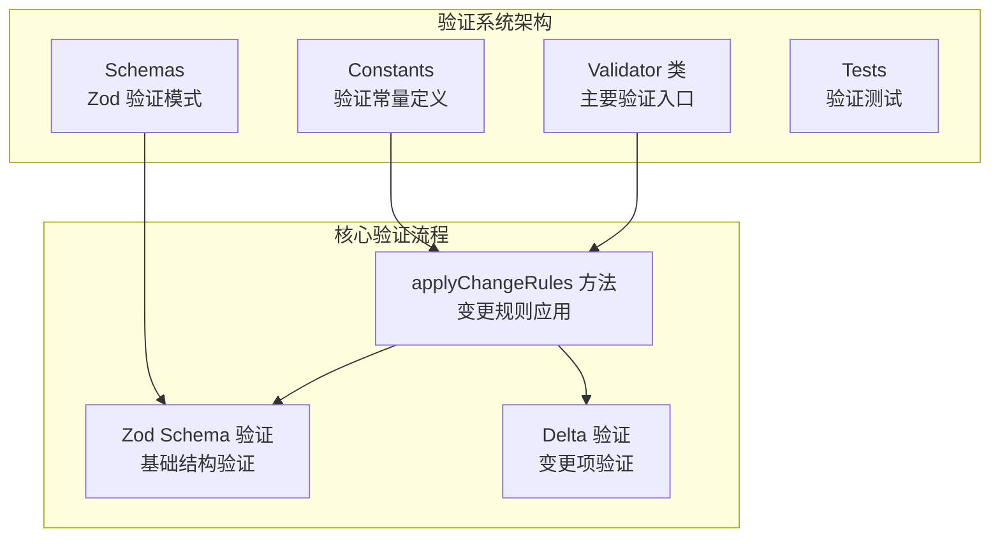
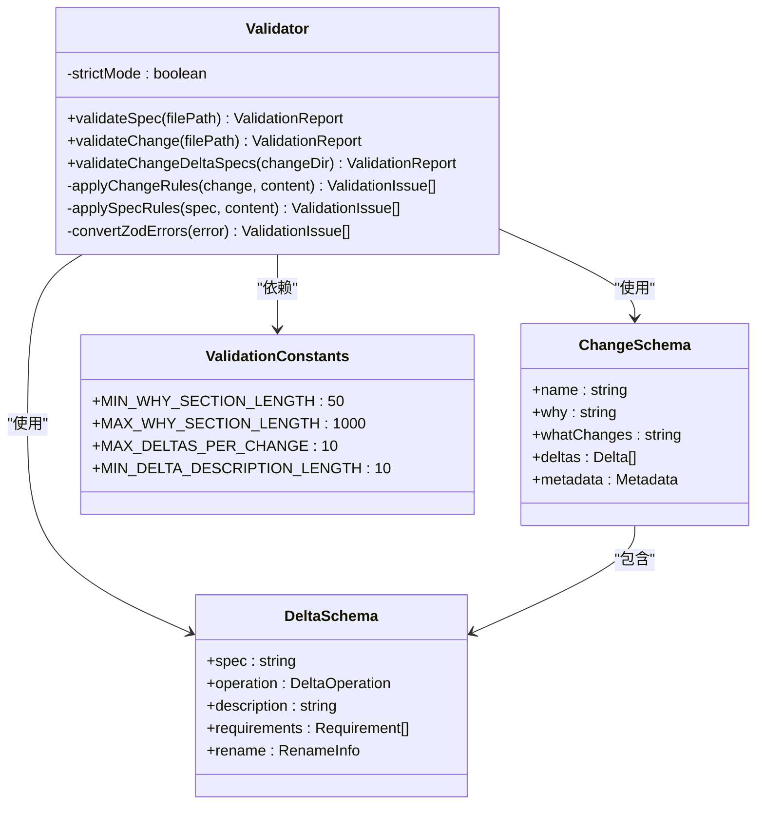
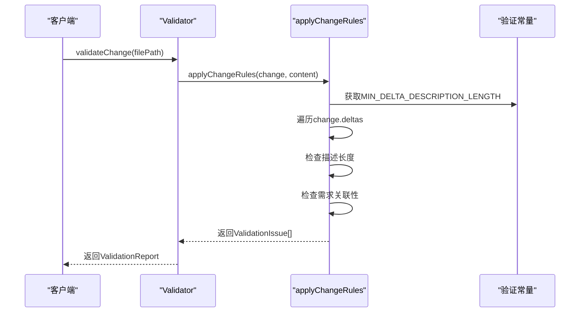
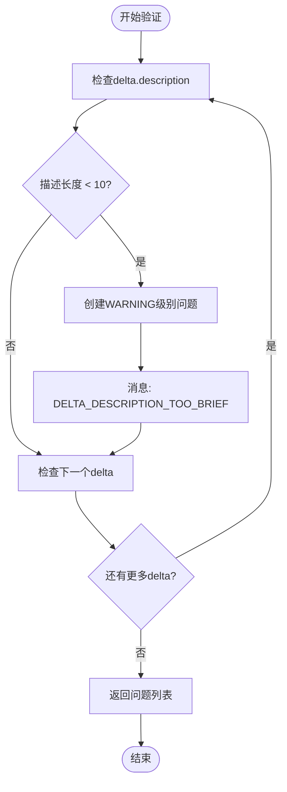
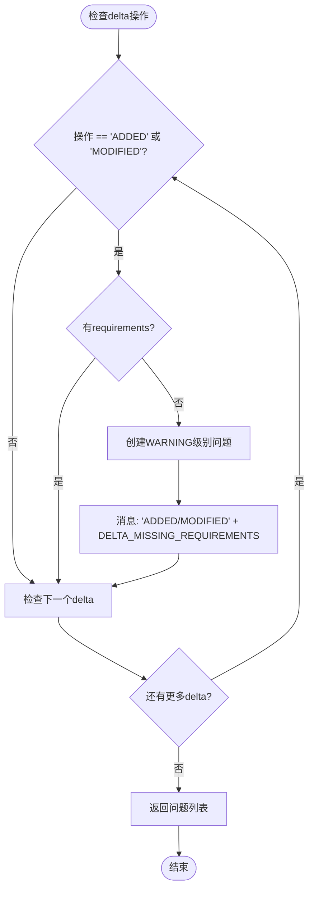
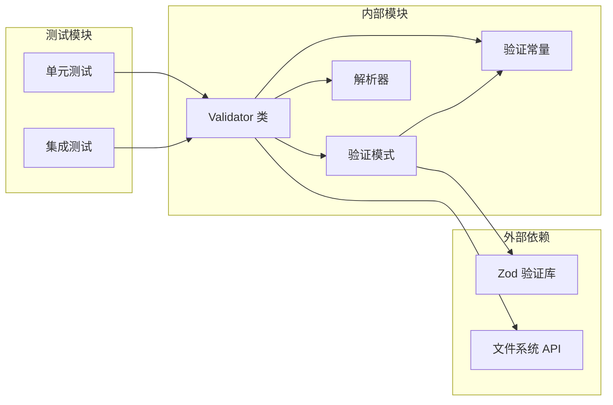

# 变更验证规则

<cite>
**本文档中引用的文件**
- [validator.ts](file://src/core/validation/validator.ts)
- [constants.ts](file://src/core/validation/constants.ts)
- [change.schema.ts](file://src/core/schemas/change.schema.ts)
- [proposal.md](file://openspec/changes/make-validation-scope-aware/proposal.md)
- [proposal.md](file://openspec/changes/add-scaffold-command/proposal.md)
- [proposal.md](file://openspec/changes/archive/2025-01-11-add-update-command/proposal.md)
- [spec.md](file://openspec/changes/add-scaffold-command/specs/cli-scaffold/spec.md)
- [spec.md](file://openspec/changes/archive/2025-01-11-add-update-command/specs/cli-update/spec.md)
- [validation.test.ts](file://test/core/validation.test.ts)
- [validation.enriched-messages.test.ts](file://test/core/validation.enriched-messages.test.ts)
</cite>

## 目录
1. [简介](#简介)
2. [项目结构概览](#项目结构概览)
3. [核心验证组件](#核心验证组件)
4. [架构概览](#架构概览)
5. [详细组件分析](#详细组件分析)
6. [依赖关系分析](#依赖关系分析)
7. [性能考虑](#性能考虑)
8. [故障排除指南](#故障排除指南)
9. [结论](#结论)

## 简介

OpenSpec是一个基于变更提案（proposal.md）的验证系统，专门用于确保变更提案符合预定义的结构和内容标准。该系统通过`applyChangeRules`方法实现了对变更提案的深度验证，包括对变更描述长度、操作类型与需求关联性等多维度的检查。

本文档深入分析了OpenSpec中针对变更提案验证的核心机制，重点阐述`applyChangeRules`方法的逻辑实现，详细说明各种验证规则的应用场景，并提供实际的变更提案示例来展示这些规则的具体应用。

## 项目结构概览

OpenSpec项目采用模块化架构设计，将验证功能分布在多个专门的目录中：

**图表来源**
- [validator.ts](file://src/core/validation/validator.ts#L15-L449)
- [constants.ts](file://src/core/validation/constants.ts#L1-L49)
- [change.schema.ts](file://src/core/schemas/change.schema.ts#L1-L42)

**章节来源**
- [validator.ts](file://src/core/validation/validator.ts#L1-L50)
- [constants.ts](file://src/core/validation/constants.ts#L1-L49)

## 核心验证组件

OpenSpec的验证系统由三个核心组件构成：验证器类、常量定义和Zod验证模式。这些组件协同工作，为变更提案提供全面的验证保障。

### 验证器类（Validator）

验证器类是整个验证系统的核心入口点，负责协调不同类型的验证任务。它提供了多种验证方法，包括规范验证、变更验证和delta规范验证。

### 常量定义（Constants）

验证常量定义了所有验证规则的阈值和消息模板，确保验证行为的一致性和可配置性。

### Zod验证模式（Schemas）

Zod验证模式定义了变更提案的数据结构和基本约束条件，为后续的详细规则验证提供基础框架。

**章节来源**
- [validator.ts](file://src/core/validation/validator.ts#L15-L449)
- [constants.ts](file://src/core/validation/constants.ts#L1-L49)
- [change.schema.ts](file://src/core/schemas/change.schema.ts#L1-L42)

## 架构概览

OpenSpec的验证架构采用分层设计，从底层的数据结构定义到顶层的验证接口，形成了一个完整的验证生态系统：

**图表来源**
- [validator.ts](file://src/core/validation/validator.ts#L15-L449)
- [change.schema.ts](file://src/core/schemas/change.schema.ts#L1-L42)
- [constants.ts](file://src/core/validation/constants.ts#L1-L49)

## 详细组件分析

### applyChangeRules方法深度解析

`applyChangeRules`方法是变更提案验证的核心逻辑所在，它在`validateChange`方法中被调用，专门处理变更提案的特定验证规则。

#### 方法签名和参数

**图表来源**
- [validator.ts](file://src/core/validation/validator.ts#L320-L345)

#### 最小描述长度验证

方法中的第一个验证规则检查每个变更项的描述长度是否满足最低要求：

**图表来源**
- [validator.ts](file://src/core/validation/validator.ts#L320-L345)

#### 操作类型与需求关联性验证

第二个验证规则针对ADDED和MODIFIED操作，检查是否缺少关联的需求：

**图表来源**
- [validator.ts](file://src/core/validation/validator.ts#L320-L345)

**章节来源**
- [validator.ts](file://src/core/validation/validator.ts#L320-L345)

### ChangeSchema Zod验证

ChangeSchema定义了变更提案的完整数据结构和验证规则，确保所有必需字段都存在且符合预期格式。

#### 基本结构要求

| 字段名 | 类型 | 验证规则 | 描述 |
|--------|------|----------|------|
| name | string | min(1) | 变更名称，不能为空 |
| why | string | min(50), max(1000) | 为什么部分，至少50字符，最多1000字符 |
| whatChanges | string | min(1) | 变更内容部分，不能为空 |
| deltas | array | min(1), max(10) | 变更项数组，至少1个，最多10个 |
| metadata | object | 可选 | 元数据信息 |

#### DeltaSchema验证规则

| 字段名 | 类型 | 验证规则 | 描述 |
|--------|------|----------|------|
| spec | string | min(1) | 规范名称，不能为空 |
| operation | enum | 必须是ADDED/MODIFIED/REMOVED/RENAMED之一 | 操作类型 |
| description | string | min(1) | 描述文本，不能为空 |
| requirements | array | 可选 | 关联的需求列表 |
| rename | object | 可选 | 重命名信息（from, to） |

**章节来源**
- [change.schema.ts](file://src/core/schemas/change.schema.ts#L1-L42)

### 验证常量和消息定义

验证系统使用一组精心设计的常量来控制验证行为和提供清晰的错误消息：

#### 长度限制常量

| 常量名 | 值 | 用途 |
|--------|-----|------|
| MIN_WHY_SECTION_LENGTH | 50 | Why部分最小长度 |
| MAX_WHY_SECTION_LENGTH | 1000 | Why部分最大长度 |
| MAX_DELTAS_PER_CHANGE | 10 | 变更项最大数量 |
| MIN_DELTA_DESCRIPTION_LENGTH | 10 | Delta描述最小长度 |

#### 验证消息模板

验证系统提供了丰富的消息模板，帮助用户理解验证失败的原因并提供修复指导：

| 消息类型 | 模板内容 | 应用场景 |
|----------|----------|----------|
| CHANGE_WHY_TOO_SHORT | Why section must be at least {MIN_WHY_SECTION_LENGTH} characters | Why部分过短 |
| CHANGE_TOO_MANY_DELTAS | Consider splitting changes with more than {MAX_DELTAS_PER_CHANGE} deltas | 变更项过多 |
| DELTA_DESCRIPTION_TOO_BRIEF | Delta description is too brief | Delta描述过短 |
| DELTA_MISSING_REQUIREMENTS | Delta should include requirements | 缺少关联需求 |

**章节来源**
- [constants.ts](file://src/core/validation/constants.ts#L1-L49)

## 依赖关系分析

OpenSpec验证系统的依赖关系体现了良好的模块化设计原则：

**图表来源**
- [validator.ts](file://src/core/validation/validator.ts#L1-L15)
- [change.schema.ts](file://src/core/schemas/change.schema.ts#L1-L10)

**章节来源**
- [validator.ts](file://src/core/validation/validator.ts#L1-L15)
- [change.schema.ts](file://src/core/schemas/change.schema.ts#L1-L10)

## 性能考虑

OpenSpec验证系统在设计时充分考虑了性能优化，采用了多种策略来确保验证过程的高效执行：

### 延迟验证策略

验证系统采用延迟加载和按需验证的策略，只在必要时才进行复杂的验证操作。例如，只有在检测到变更提案文件时才会启动变更验证流程。

### 批量验证优化

对于大量变更项的验证，系统支持批量处理，减少了重复的验证开销。单次验证可以同时处理多个delta项，提高了整体效率。

### 内存使用优化

验证过程中尽量减少内存占用，特别是在处理大型变更提案时。系统采用流式处理和增量验证的方式，避免一次性加载所有数据。

## 故障排除指南

### 常见验证错误及解决方案

#### Why部分验证失败

**错误症状**：变更验证报告Why部分长度不足的错误

**原因分析**：Why部分文本长度小于50字符

**解决方案**：
1. 增加Why部分的内容，提供更多背景信息
2. 解释变更的动机和重要性
3. 包含具体的业务价值或技术改进

#### Delta描述过短警告

**错误症状**：收到DELTA_DESCRIPTION_TOO_BRIEF警告

**原因分析**：delta描述文本长度小于10字符

**解决方案**：
1. 提供更详细的变更描述
2. 说明变更的具体内容和影响
3. 包含足够的技术细节

#### 缺少关联需求警告

**错误症状**：收到DELTA_MISSING_REQUIREMENTS警告

**原因分析**：ADDED或MODIFIED操作缺少关联的需求

**解决方案**：
1. 为变更添加相应的需求定义
2. 在delta规范中包含相关的需求块
3. 确保需求符合SHALL/MUST格式要求

**章节来源**
- [validation.test.ts](file://test/core/validation.test.ts#L119-L203)
- [validation.enriched-messages.test.ts](file://test/core/validation.enriched-messages.test.ts#L1-L75)

## 结论

OpenSpec的变更验证规则系统展现了现代软件工程中质量保证的最佳实践。通过`applyChangeRules`方法的深度验证，系统不仅确保了变更提案的结构完整性，还促进了高质量文档的产生。

该验证系统的主要优势包括：

1. **多层次验证**：从基础的数据结构验证到高级的语义验证
2. **灵活的配置**：通过常量系统支持验证规则的灵活调整
3. **清晰的错误消息**：提供详细的错误信息和修复建议
4. **良好的扩展性**：模块化设计便于添加新的验证规则

通过深入理解和正确应用这些验证规则，开发团队可以显著提高变更提案的质量，确保OpenSpec项目的持续健康发展。