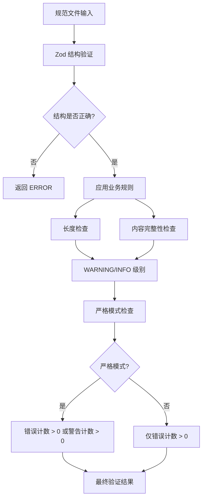
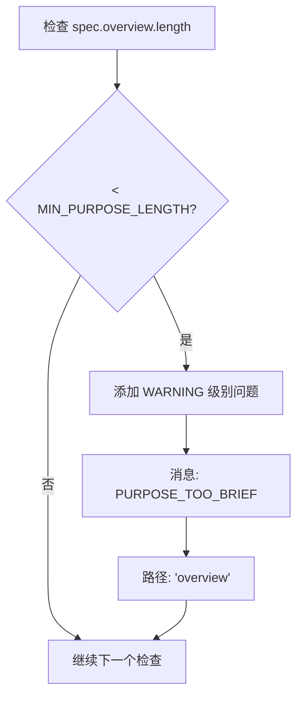
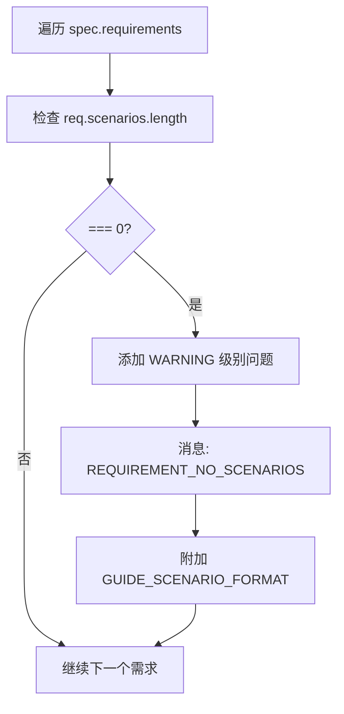
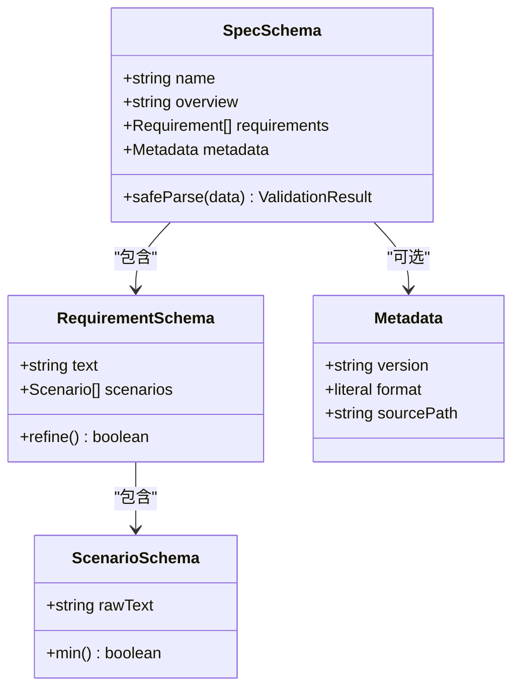
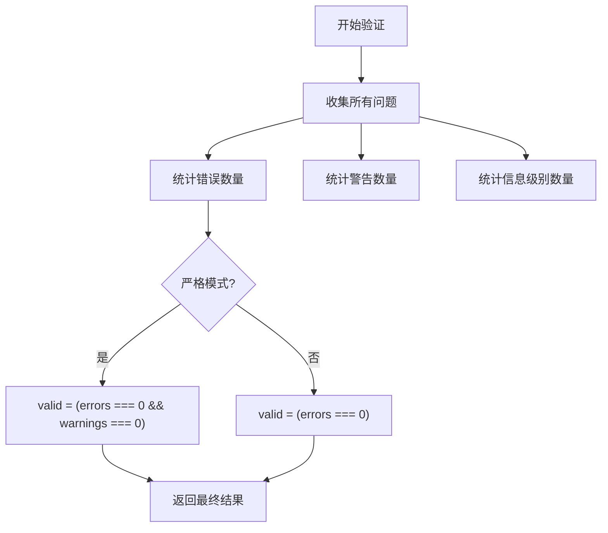
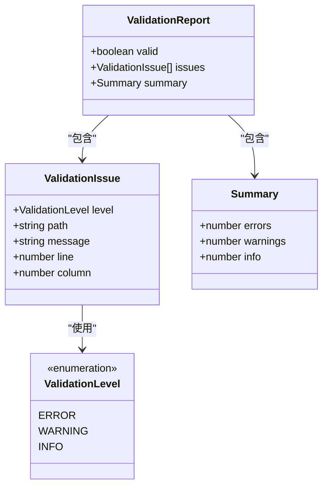

# 规范验证规则

<cite>
**本文档引用的文件**
- [src/core/validation/validator.ts](file://src/core/validation/validator.ts)
- [src/core/validation/constants.ts](file://src/core/validation/constants.ts)
- [src/core/validation/types.ts](file://src/core/validation/types.ts)
- [src/core/schemas/spec.schema.ts](file://src/core/schemas/spec.schema.ts)
- [src/core/schemas/base.schema.ts](file://src/core/schemas/base.schema.ts)
- [test/core/validation.test.ts](file://test/core/validation.test.ts)
- [openspec/specs/cli-validate/spec.md](file://openspec/specs/cli-validate/spec.md)
- [openspec/specs/cli-init/spec.md](file://openspec/specs/cli-init/spec.md)
</cite>

## 目录
1. [简介](#简介)
2. [核心验证规则](#核心验证规则)
3. [applySpecRules 方法详解](#applyspecrules-方法详解)
4. [Zod 验证架构](#zod-验证架构)
5. [严格模式验证](#严格模式验证)
6. [验证级别和消息系统](#验证级别和消息系统)
7. [实际应用示例](#实际应用示例)
8. [故障排除指南](#故障排除指南)
9. [最佳实践建议](#最佳实践建议)

## 简介

OpenSpec 的规范验证系统通过多层次的验证规则确保规范文件的质量和一致性。该系统主要包含两个核心组件：基于 Zod 的结构验证和自定义的业务规则验证。本文档详细说明了针对规范文件（spec.md）的验证规则，特别是 `applySpecRules` 方法中的关键业务规则。

## 核心验证规则

OpenSpec 的验证系统建立在三个层次上：

### 1. 结构验证层
使用 Zod 模式验证规范文件的基本结构，确保包含必需的部分和字段。

### 2. 业务规则验证层
通过 `applySpecRules` 方法执行特定的业务规则检查，包括长度限制和内容完整性要求。

### 3. 内容质量验证层
验证需求文本的质量标准，如关键词存在性和场景完整性。



**图表来源**
- [src/core/validation/validator.ts](file://src/core/validation/validator.ts#L288-L318)

## applySpecRules 方法详解

`applySpecRules` 方法是 OpenSpec 规范验证的核心业务规则处理器，负责执行以下关键检查：

### 最小概述长度验证



**图表来源**
- [src/core/validation/validator.ts](file://src/core/validation/validator.ts#L288-L300)

### 需求文本长度验证

对于每个需求项，系统会检查：
- 如果需求文本超过 `MAX_REQUIREMENT_TEXT_LENGTH`（500字符），则发出 INFO 级别提示
- 提示用户考虑将长需求拆分为多个较短的需求

### 场景完整性验证



**图表来源**
- [src/core/validation/validator.ts](file://src/core/validation/validator.ts#L307-L315)

**节来源**
- [src/core/validation/validator.ts](file://src/core/validation/validator.ts#L288-L318)

## Zod 验证架构

OpenSpec 使用 Zod 模式进行严格的结构验证，确保规范文件的基本格式正确性。

### SpecSchema 定义



**图表来源**
- [src/core/schemas/spec.schema.ts](file://src/core/schemas/spec.schema.ts#L5-L14)
- [src/core/schemas/base.schema.ts](file://src/core/schemas/base.schema.ts#L8-L16)

### 关键验证规则

| 字段 | 验证规则 | 错误消息 |
|------|----------|----------|
| `name` | 非空字符串 | `SPEC_NAME_EMPTY` |
| `overview` | 非空字符串 | `SPEC_PURPOSE_EMPTY` |
| `requirements` | 至少一个元素 | `SPEC_NO_REQUIREMENTS` |
| `text` | 非空且包含 SHALL/MUST | `REQUIREMENT_EMPTY` 和 `REQUIREMENT_NO_SHALL` |
| `scenarios` | 至少一个元素 | `REQUIREMENT_NO_SCENARIOS` |
| `rawText` | 非空字符串 | `SCENARIO_EMPTY` |

**节来源**
- [src/core/schemas/spec.schema.ts](file://src/core/schemas/spec.schema.ts#L1-L17)
- [src/core/schemas/base.schema.ts](file://src/core/schemas/base.schema.ts#L1-L20)

## 严格模式验证

严格模式是 OpenSpec 验证系统中的一个重要概念，它决定了验证失败的标准。

### 严格模式行为



**图表来源**
- [src/core/validation/validator.ts](file://src/core/validation/validator.ts#L385-L387)

### 严格模式的影响

在严格模式下：
- 只有当没有错误且没有警告时，验证才通过
- 警告也会阻止验证通过
- 适用于生产环境或需要最高质量保证的场景

在非严格模式下：
- 只有错误会阻止验证通过
- 警告和信息级别消息不会影响最终结果

**节来源**
- [src/core/validation/validator.ts](file://src/core/validation/validator.ts#L385-L387)

## 验证级别和消息系统

OpenSpec 使用分层的验证级别系统来区分不同类型的问题：

### 验证级别类型



**图表来源**
- [src/core/validation/types.ts](file://src/core/validation/types.ts#L1-L19)

### 常量定义

| 常量名称 | 值 | 描述 |
|----------|-----|------|
| `MIN_PURPOSE_LENGTH` | 50 | 概述部分最小字符长度 |
| `MAX_REQUIREMENT_TEXT_LENGTH` | 500 | 需求文本最大字符长度 |
| `MIN_WHY_SECTION_LENGTH` | 50 | Why 部分最小字符长度 |
| `MAX_WHY_SECTION_LENGTH` | 1000 | Why 部分最大字符长度 |
| `MAX_DELTAS_PER_CHANGE` | 10 | Change 中最大增量数量 |

**节来源**
- [src/core/validation/constants.ts](file://src/core/validation/constants.ts#L1-L49)

## 实际应用示例

### 符合规则的规范示例

以下是一个符合所有验证规则的规范文件结构：

**有效规范示例路径**: [openspec/specs/cli-validate/spec.md](file://openspec/specs/cli-validate/spec.md#L1-L219)

### 违反规则的示例

#### 1. 概述过短
```markdown
# 用户认证规范

## Purpose
简短描述

## Requirements
### Requirement: 系统应提供用户认证
用户应能够登录系统
```

**违反的规则**: `PURPOSE_TOO_BRIEF` 警告

#### 2. 需求文本过长
```markdown
## Requirements
### Requirement: 系统应提供复杂的用户认证功能
这个需求包含了太多内容，应该拆分为多个更具体的需求...
```

**违反的规则**: `REQUIREMENT_TOO_LONG` 信息提示

#### 3. 缺少场景
```markdown
## Requirements
### Requirement: 系统应提供用户认证
用户应能够登录系统
```

**违反的规则**: `REQUIREMENT_NO_SCENARIOS` 警告

**节来源**
- [openspec/specs/cli-validate/spec.md](file://openspec/specs/cli-validate/spec.md#L1-L219)
- [openspec/specs/cli-init/spec.md](file://openspec/specs/cli-init/spec.md#L1-L277)

## 故障排除指南

### 常见验证问题及解决方案

#### 1. PURPOSE_TOO_BRIEF 警告
**症状**: 概述部分太短
**解决方案**: 
- 扩展概述部分到至少 50 个字符
- 包含项目的背景、目标和重要性

#### 2. REQUIREMENT_TOO_LONG 信息
**症状**: 需求文本过长
**解决方案**:
- 将长需求拆分为多个较短的独立需求
- 确保每个需求只描述单一功能点

#### 3. REQUIREMENT_NO_SCENARIOS 警告
**症状**: 需求缺少场景
**解决方案**:
- 添加至少一个场景描述
- 使用正确的格式：`#### Scenario: 场景名称`
- 包含 WHEN-THEN 结构

### 验证命令使用

```bash
# 基本验证
openspec validate spec-name

# 严格模式验证
openspec validate spec-name --strict

# JSON 输出
openspec validate spec-name --json

# 批量验证
openspec validate --all
```

## 最佳实践建议

### 规范编写最佳实践

1. **概述部分**
   - 至少 50 字符
   - 清晰描述项目目标
   - 包含背景信息和价值主张

2. **需求编写**
   - 每个需求不超过 500 字符
   - 使用明确的语言描述功能
   - 包含必要的 SHALL/MUST 关键词

3. **场景设计**
   - 每个需求至少一个场景
   - 使用标准的 WHEN-THEN 格式
   - 描述清晰的前置条件和预期结果

### 开发工作流程

1. **预写入验证**
   - 在保存前使用 `validateSpecContent()` 验证内容
   - 确保符合所有规则后再提交

2. **持续集成**
   - 在 CI/CD 流水线中包含验证步骤
   - 使用严格模式确保质量

3. **迭代改进**
   - 利用验证报告识别改进点
   - 定期审查和优化现有规范

### 团队协作

1. **标准化模板**
   - 使用统一的规范模板
   - 维护一致的格式约定

2. **知识共享**
   - 分享验证规则和最佳实践
   - 建立规范质量评估机制

3. **工具支持**
   - 集成编辑器插件提供实时验证
   - 自动化修复常见格式问题

通过遵循这些最佳实践，团队可以创建高质量、一致性的规范文档，提高开发效率和产品质量。