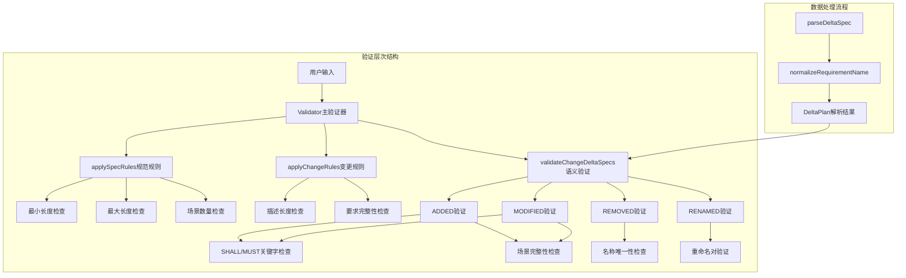
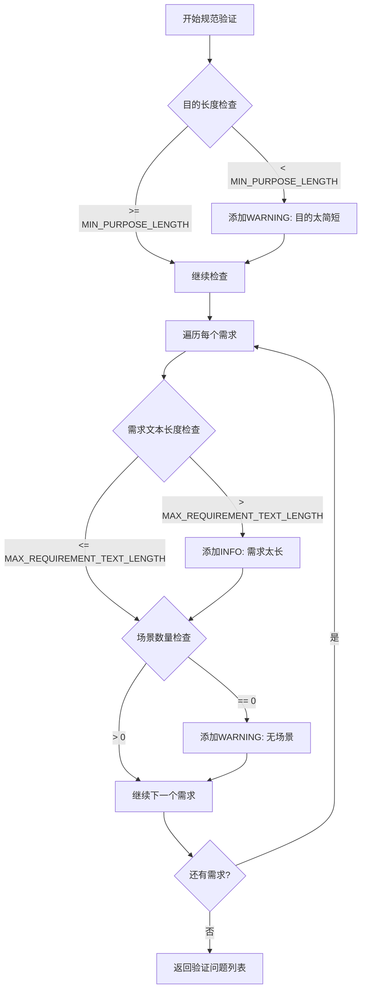
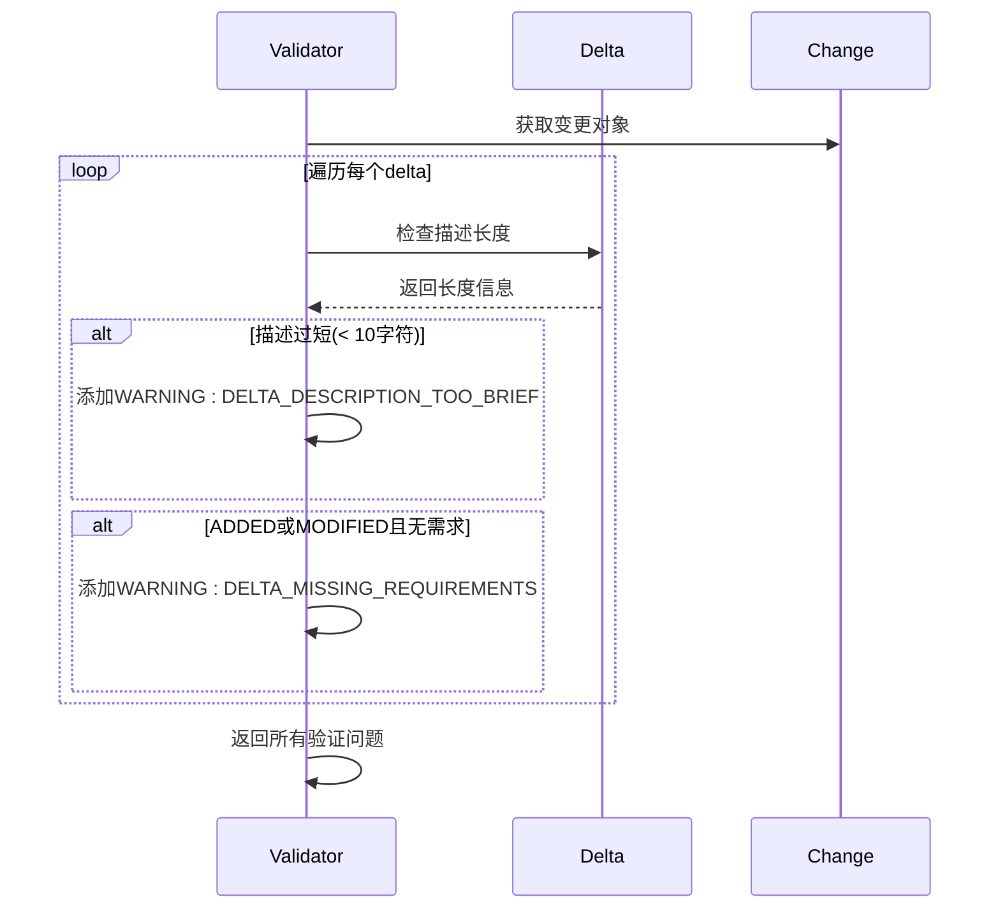
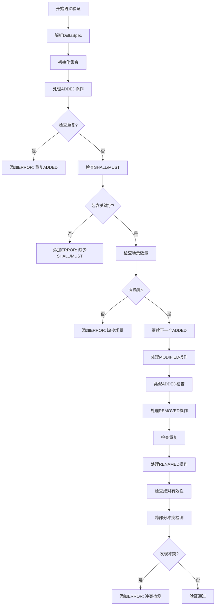
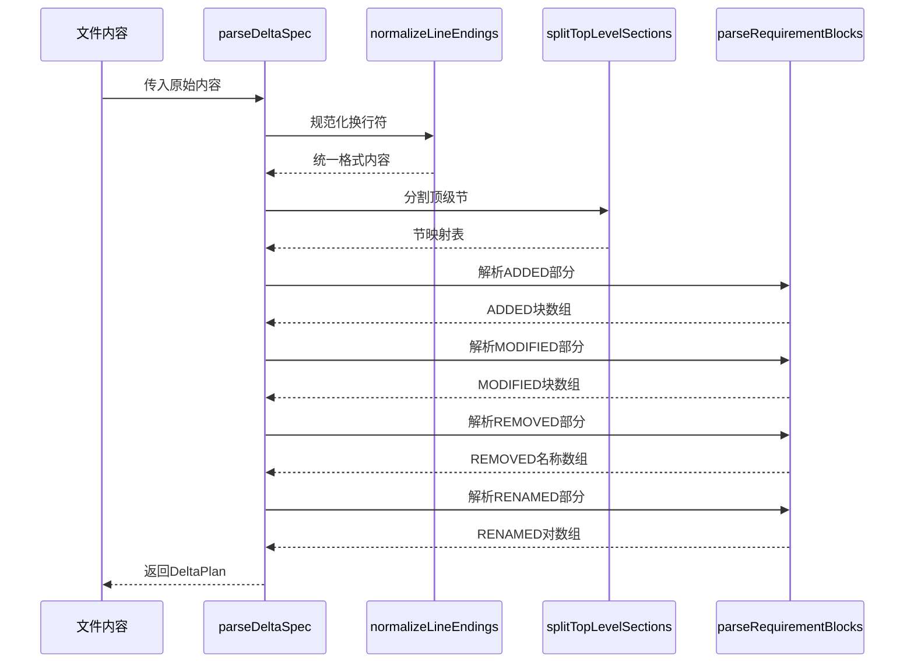
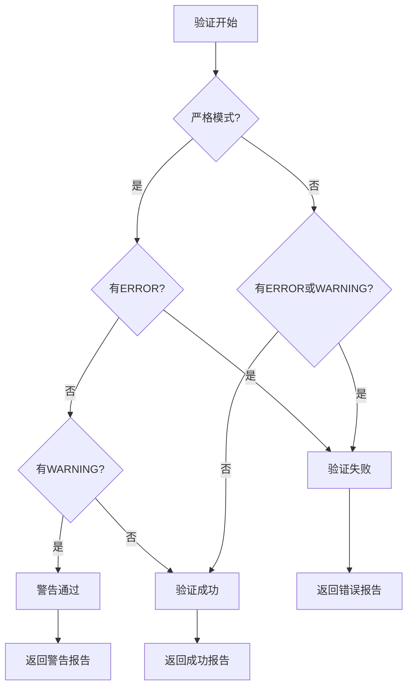

# 验证规则

<cite>
**本文档中引用的文件**
- [src/core/validation/validator.ts](file://src/core/validation/validator.ts)
- [src/core/validation/constants.ts](file://src/core/validation/constants.ts)
- [src/core/validation/types.ts](file://src/core/validation/types.ts)
- [src/core/parsers/requirement-blocks.ts](file://src/core/parsers/requirement-blocks.ts)
- [src/core/schemas/base.schema.ts](file://src/core/schemas/base.schema.ts)
- [src/core/schemas/change.schema.ts](file://src/core/schemas/change.schema.ts)
- [test/core/validation.test.ts](file://test/core/validation.test.ts)
- [openspec/specs/openspec-conventions/spec.md](file://openspec/specs/openspec-conventions/spec.md)
- [src/core/archive.ts](file://src/core/archive.ts)
</cite>

## 目录
1. [简介](#简介)
2. [验证架构概述](#验证架构概述)
3. [核心验证规则](#核心验证规则)
4. [applySpecRules业务规则](#applyspecrules业务规则)
5. [applyChangeRules业务规则](#applychangerules业务规则)
6. [validateChangeDeltaSpecs严格语义检查](#validatechangedeltaspecs严格语义检查)
7. [parseDeltaSpec和normalizeRequirementName数据一致性](#parsedeltaspec和normalizerequirementname数据一致性)
8. [验证级别和错误处理](#验证级别和错误处理)
9. [典型违规示例及修复方法](#典型违规示例及修复方法)
10. [总结](#总结)

## 简介

OpenSpec实施了一套全面的验证规则系统，确保规范和变更提案的质量、一致性和可维护性。该验证系统包含三个核心组件：`applySpecRules`用于规范验证、`applyChangeRules`用于变更验证、`validateChangeDeltaSpecs`用于严格的语义检查。这些规则涵盖了从基本格式要求到复杂的跨部分冲突检测等多个层面。

## 验证架构概述

OpenSpec的验证系统采用分层架构设计，通过多个验证器协同工作来确保数据质量：



**图表来源**
- [src/core/validation/validator.ts](file://src/core/validation/validator.ts#L15-L449)
- [src/core/parsers/requirement-blocks.ts](file://src/core/parsers/requirement-blocks.ts#L112-L142)

**章节来源**
- [src/core/validation/validator.ts](file://src/core/validation/validator.ts#L15-L449)
- [src/core/validation/constants.ts](file://src/core/validation/constants.ts#L1-L49)

## 核心验证规则

OpenSpec定义了以下核心验证常量和消息：

### 字符长度限制

| 规则类型 | 常量名 | 默认值 | 描述 |
|---------|--------|--------|------|
| 最小目的长度 | `MIN_PURPOSE_LENGTH` | 50字符 | 规范目的段落的最小长度 |
| 最小原因长度 | `MIN_WHY_SECTION_LENGTH` | 50字符 | 变更原因段落的最小长度 |
| 最大原因长度 | `MAX_WHY_SECTION_LENGTH` | 1000字符 | 变更原因段落的最大长度 |
| 最大需求文本长度 | `MAX_REQUIREMENT_TEXT_LENGTH` | 500字符 | 单个需求文本的最大长度 |
| 最大变更增量数 | `MAX_DELTAS_PER_CHANGE` | 10个 | 单个变更允许的最大增量数量 |

### 验证消息分类

验证系统使用三种级别的消息来指导用户：

- **ERROR**: 严重错误，阻止验证通过
- **WARNING**: 警告信息，影响报告但不阻止验证
- **INFO**: 信息提示，提供优化建议

**章节来源**
- [src/core/validation/constants.ts](file://src/core/validation/constants.ts#L5-L12)
- [src/core/validation/types.ts](file://src/core/validation/types.ts#L1-L19)

## applySpecRules业务规则

`applySpecRules`方法实现了规范级别的业务规则验证，确保规范内容的质量和完整性。

### 主要验证逻辑



**图表来源**
- [src/core/validation/validator.ts](file://src/core/validation/validator.ts#L288-L318)

### 具体验证规则

1. **目的段落长度验证**
   - 检查`spec.overview`长度是否小于`MIN_PURPOSE_LENGTH`(50字符)
   - 如果不足，返回WARNING级别的`PURPOSE_TOO_BRIEF`消息

2. **需求文本长度验证**
   - 检查每个需求的`req.text`长度是否超过`MAX_REQUIREMENT_TEXT_LENGTH`(500字符)
   - 如果超出，返回INFO级别的`REQUIREMENT_TOO_LONG`消息

3. **场景完整性验证**
   - 检查每个需求是否至少包含一个场景
   - 如果没有场景，返回WARNING级别的`REQUIREMENT_NO_SCENARIOS`消息

**章节来源**
- [src/core/validation/validator.ts](file://src/core/validation/validator.ts#L288-L318)

## applyChangeRules业务规则

`applyChangeRules`方法专门验证变更提案的内容完整性，确保变更描述的质量。

### 验证重点



**图表来源**
- [src/core/validation/validator.ts](file://src/core/validation/validator.ts#L320-L345)

### 关键验证点

1. **增量描述长度**
   - 检查`delta.description`长度是否小于10字符
   - 如果过短，返回WARNING级别的`DELTA_DESCRIPTION_TOO_BRIEF`消息

2. **需求完整性**
   - 对于ADDED和MODIFIED操作，检查是否包含有效的需求
   - 如果缺少需求，返回WARNING级别的`DELTA_MISSING_REQUIREMENTS`消息

**章节来源**
- [src/core/validation/validator.ts](file://src/core/validation/validator.ts#L320-L345)

## validateChangeDeltaSpecs严格语义检查

`validateChangeDeltaSpecs`方法实现了最严格的验证规则，确保变更提案的语义正确性和数据一致性。

### 验证范围

该方法检查以下方面：

1. **增量存在性验证**
   - 确保至少有一个增量操作(ADDED/MODIFIED/REMOVED/RENAMED)
   - 检查是否有有效的delta头部

2. **操作内验证**
   - ADDED: 必须包含SHALL/MUST关键字和至少一个场景
   - MODIFIED: 同ADDED要求
   - REMOVED: 名称唯一性检查
   - RENAMED: 成对有效性检查

3. **跨部分冲突检测**
   - 同一需求不能同时出现在多个操作中
   - RENAMED与ADDED/REMOVED的冲突检测

### 严格语义检查流程



**图表来源**
- [src/core/validation/validator.ts](file://src/core/validation/validator.ts#L113-L271)

### ADDED/MODIFIED操作严格检查

对于ADDED和MODIFIED操作，验证器执行以下严格检查：

1. **SHALL/MUST关键字要求**
   - 使用正则表达式`\b(SHALL|MUST)\b`检查需求文本
   - 确保关键字为独立单词，避免误匹配

2. **场景完整性要求**
   - 检查以`#### `开头的行数
   - 确保每个需求至少包含一个场景

3. **元数据字段处理**
   - 支持ID、Priority等元数据字段
   - 正确提取实际的需求文本内容

### 场景数量检查

验证器通过以下方式计算场景数量：

```typescript
// 计算场景数量的逻辑
private countScenarios(blockRaw: string): number {
  const matches = blockRaw.match(/^####\s+/gm);
  return matches ? matches.length : 0;
}
```

### 跨部分冲突检测

系统检测以下类型的冲突：

1. **同一需求多处出现**
   - MODIFIED和REMOVED同时存在
   - MODIFIED和ADDED同时存在
   - ADDED和REMOVED同时存在

2. **RENAMED交互冲突**
   - MODIFIED引用RENAMED的旧名称
   - RENAMED的TO与ADDED冲突

**章节来源**
- [src/core/validation/validator.ts](file://src/core/validation/validator.ts#L113-L271)
- [src/core/archive.ts](file://src/core/archive.ts#L406-L443)

## parseDeltaSpec和normalizeRequirementName数据一致性

这两个函数在确保数据一致性方面发挥关键作用，为验证系统提供可靠的数据基础。

### parseDeltaSpec函数

`parseDeltaSpec`负责解析delta格式的规范文件，将其转换为结构化的`DeltaPlan`对象。

#### 解析流程



**图表来源**
- [src/core/parsers/requirement-blocks.ts](file://src/core/parsers/requirement-blocks.ts#L118-L142)

#### 关键功能

1. **大小写不敏感的节查找**
   - 使用`getSectionCaseInsensitive`支持各种大小写组合
   - 确保`## ADDED Requirements`、`## Added Requirements`等都能被识别

2. **要求块解析**
   - 提取`### Requirement:`格式的标题
   - 收集后续内容直到下一个标题或节结束

3. **特殊语法支持**
   - REMOVED部分支持标头格式和项目符号格式
   - RENAMED部分支持FROM/TO配对格式

### normalizeRequirementName函数

`normalizeRequirementName`提供标准化的名称比较机制。

#### 标准化规则

```typescript
// 当前实现
export function normalizeRequirementName(name: string): string {
  return name.trim();
}
```

#### 用途和重要性

1. **跨版本兼容性**
   - 确保不同格式的相同需求能够正确匹配
   - 处理空格、换行等格式差异

2. **冲突检测基础**
   - 为跨部分冲突检测提供统一的比较基准
   - 支持精确的重复检测

3. **归档过程支持**
   - 在应用delta时进行准确的头部匹配
   - 确保修改、删除、重命名操作的正确性

**章节来源**
- [src/core/parsers/requirement-blocks.ts](file://src/core/parsers/requirement-blocks.ts#L112-L142)
- [src/core/parsers/requirement-blocks.ts](file://src/core/parsers/requirement-blocks.ts#L15-L17)

## 验证级别和错误处理

OpenSpec的验证系统采用分级的消息处理机制，为用户提供清晰的反馈和指导。

### 验证级别定义

| 级别 | 用途 | 示例场景 |
|------|------|----------|
| ERROR | 严重错误，阻止验证通过 | 缺少必要内容、格式错误 |
| WARNING | 警告信息，影响报告但不阻止验证 | 内容过短、格式建议 |
| INFO | 信息提示，提供优化建议 | 性能优化、最佳实践 |

### 错误处理策略



**图表来源**
- [src/core/validation/validator.ts](file://src/core/validation/validator.ts#L380-L397)

### 消息增强机制

验证器提供了消息增强功能，为常见错误提供具体指导：

1. **GUIDE_NO_DELTAS**: 为缺乏增量的变更提供详细指导
2. **GUIDE_MISSING_SPEC_SECTIONS**: 为缺失规范节提供模板
3. **GUIDE_MISSING_CHANGE_SECTIONS**: 为缺失变更节提供格式
4. **GUIDE_SCENARIO_FORMAT**: 为场景格式问题提供修正建议

**章节来源**
- [src/core/validation/validator.ts](file://src/core/validation/validator.ts#L347-L358)
- [src/core/validation/constants.ts](file://src/core/validation/constants.ts#L39-L48)

## 典型违规示例及修复方法

以下是常见的验证违规情况及其修复方法：

### 规范验证违规

#### 违规示例1：目的段落过短
```markdown
# 用户认证规范

## Purpose
简短描述

## Requirements
### Requirement: 用户认证
系统必须提供用户认证功能。
```

**违规原因**: 目的段落只有10个字符，远低于50字符的最小要求。

**修复方法**:
```markdown
# 用户认证规范

## Purpose
本规范定义了系统中用户认证功能的完整需求。用户认证是系统安全性的核心组成部分，确保只有授权用户才能访问受保护的资源。该规范涵盖登录、注销、密码管理和会话管理等关键功能。

## Requirements
### Requirement: 用户认证
系统必须提供用户认证功能。
```

#### 违规示例2：需求文本过长
```markdown
### Requirement: 复杂的用户认证系统
系统必须提供一个复杂的用户认证系统，包括用户名密码认证、双因素认证、社交账号登录、单点登录(SSO)、OAuth 2.0集成、JWT令牌管理、会话超时控制、密码强度验证、账户锁定机制、登录失败处理、审计日志记录、安全事件监控、多设备管理、密码历史记录、临时密码生成、密码重置流程、账户激活、邮箱验证、手机号验证、短信验证码、图形验证码、生物特征识别、硬件令牌、时间同步、密钥轮换、证书管理、网络安全、防火墙配置、入侵检测、DDoS防护、备份恢复、灾难恢复、合规性要求、GDPR、ISO 27001、SOC 2、审计跟踪、风险评估、安全培训、事件响应、渗透测试、漏洞扫描、安全监控、威胁情报、安全态势感知、安全运营中心、安全自动化、零信任架构、微服务安全、容器安全、云安全、DevSecOps、安全开发生命周期、威胁建模、攻击面分析、安全度量、KPI、SLA、安全治理、合规审计、法规遵循、行业标准、最佳实践、技术选型、架构设计、性能优化、可用性保证、可扩展性设计、高可用架构、负载均衡、故障转移、容灾备份、监控告警、运维管理、技术支持、客户服务、培训教育、知识分享、经验总结、持续改进、创新探索、技术研究、产品规划、市场分析、竞争分析、商业价值、投资回报、成本控制、预算管理、风险管理、决策支持、战略规划、组织变革、文化塑造、团队建设、人才培养、绩效考核、激励机制、薪酬福利、职业发展、员工关怀、企业社会责任、可持续发展、环境保护、社会贡献、公益事业、品牌建设、市场营销、客户关系、用户体验、服务质量、满意度调查、反馈收集、持续改进、创新突破、技术领先、竞争优势、市场地位、行业影响力、领导地位、标杆企业、最佳实践、典范案例、成功故事、经验分享、知识传播、技能传承、人才培养、团队建设、组织发展、文化建设、价值观塑造、使命愿景、核心理念、行为准则、道德规范、职业操守、诚信经营、公平竞争、尊重知识产权、保护隐私权、维护数据安全、保障用户权益、提供优质服务、创造客户价值、提升品牌价值、增加股东回报、促进社会进步、推动行业发展、引领技术创新、树立行业标杆、成为全球领先的企业、实现可持续发展、创造长期价值、赢得持久成功。
```

**违规原因**: 需求文本超过500字符，难以阅读和理解。

**修复方法**:
```markdown
### Requirement: 用户认证系统
系统必须提供用户认证功能，包括用户名密码认证和双因素认证。

### Requirement: 会话管理
系统必须管理用户会话，包括会话超时和自动登出功能。

### Requirement: 安全审计
系统必须记录所有认证相关事件，支持安全审计需求。
```

#### 违规示例3：缺少场景
```markdown
### Requirement: 用户认证
系统必须提供用户认证功能。
```

**违规原因**: 缺少具体的使用场景描述。

**修复方法**:
```markdown
### Requirement: 用户认证
系统必须提供用户认证功能。

#### Scenario: 用户登录
- **Given** 用户已注册并拥有有效凭据
- **When** 用户在登录页面输入凭据
- **Then** 系统验证凭据并建立认证会话
```

### 变更验证违规

#### 违规示例1：增量描述过短
```markdown
## ADDED Requirements
### Requirement: 新功能
系统必须添加新功能。

#### Scenario: 功能使用
- **When** 用户触发新功能
- **Then** 系统响应并显示结果
```

**违规原因**: 增量描述只有10个字符，无法清楚说明变更内容。

**修复方法**:
```markdown
## ADDED Requirements
### Requirement: 文件上传功能
系统必须添加文件上传功能，支持多种文件格式和大小限制。

#### Scenario: 文件上传
- **Given** 用户已登录系统
- **When** 用户选择文件并点击上传按钮
- **Then** 系统验证文件类型和大小
- **And** 显示上传进度条
- **And** 上传完成后显示成功消息
```

#### 违规示例2：缺少SHALL/MUST关键字
```markdown
### Requirement: 错误处理
系统应该优雅地处理所有错误。
```

**违规原因**: 缺少强制性关键字SHALL或MUST。

**修复方法**:
```markdown
### Requirement: 错误处理
系统必须优雅地处理所有错误，向用户显示友好的错误消息。
```

### Delta验证违规

#### 违规示例1：跨部分冲突
```markdown
## ADDED Requirements
### Requirement: 新功能
系统必须添加新功能。

## MODIFIED Requirements
### Requirement: 新功能
更新功能描述以包含新特性。
```

**违规原因**: 同一需求同时出现在ADDED和MODIFIED部分。

**修复方法**:
```markdown
## ADDED Requirements
### Requirement: 新功能
系统必须添加新功能。

## MODIFIED Requirements
### Requirement: 现有功能
更新现有功能以提高性能。
```

#### 违规示例2：RENAMED冲突
```markdown
## RENAMED Requirements
- FROM: `### Requirement: 旧功能`
- TO: `### Requirement: 新功能`

## ADDED Requirements
### Requirement: 新功能
新功能的完整描述。
```

**违规原因**: RENAMED的TO与ADDED的名称冲突。

**修复方法**:
```markdown
## RENAMED Requirements
- FROM: `### Requirement: 旧功能`
- TO: `### Requirement: 已弃用功能`

## ADDED Requirements
### Requirement: 新功能
新功能的完整描述。
```

**章节来源**
- [test/core/validation.test.ts](file://test/core/validation.test.ts#L37-L490)
- [src/core/validation/constants.ts](file://src/core/validation/constants.ts#L15-L48)

## 总结

OpenSpec的验证规则系统通过多层次的检查机制，确保了规范和变更提案的质量。主要特点包括：

1. **分层验证架构**: 从基本格式到语义完整性，逐层递进的验证体系
2. **严格语义检查**: 特别针对ADDED/MODIFIED/REMOVED/RENAMED操作的严格验证
3. **数据一致性保障**: 通过parseDeltaSpec和normalizeRequirementName确保数据准确性
4. **智能错误指导**: 提供详细的错误消息和修复建议
5. **灵活的验证级别**: 支持严格模式和宽松模式，适应不同使用场景

这套验证系统不仅提高了OpenSpec项目的质量，也为其他类似项目提供了优秀的参考实现。通过遵循这些验证规则，开发者可以创建更加清晰、一致和可维护的规范文档。